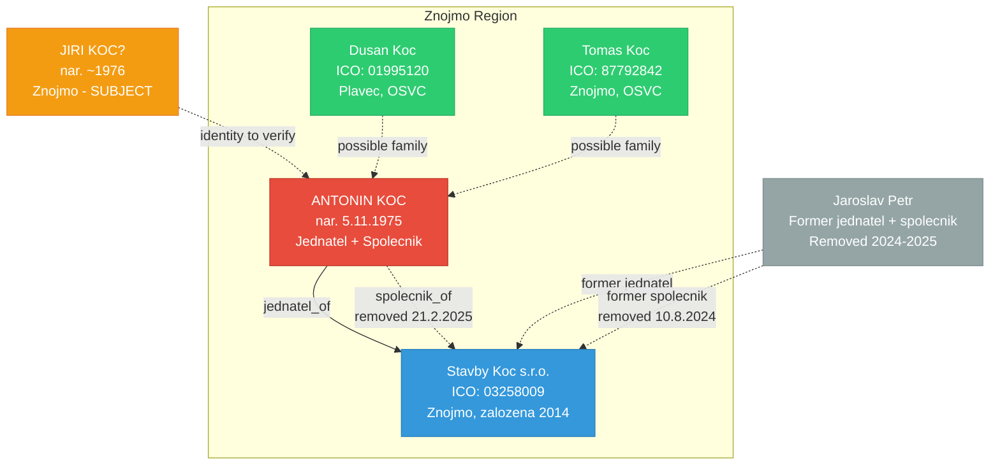

# Due Diligence: Jiri Koc - Background Investigation

**Subject**: Jiri Koc, narozen 1976, Znojmo a okoli
**Type**: person
**Status**: ACTIVE - IN PROGRESS
**Risk Level**: LOW-MEDIUM (preliminary)
**Created**: 2026-03-07
**Last Updated**: 2026-03-07 (OSINT Phase 1 complete)

---

## Executive Summary

Background investigation for individual Jiri Koc, born approximately 1976, associated with the Znojmo region. ARES search returned **51 entities** matching "Koc", with **3 directly in Znojmo district**. Key finding: **ANTONIN KOC (nar. 5.11.1975)** is the sole director and shareholder of **Stavby Koc s.r.o.** (ICO 03258009), a construction company in Znojmo. Birth year 1975 is very close to the specified 1976.

**ACTION REQUIRED**: Verify with client whether the subject is actually "Antonin Koc" rather than "Jiri Koc", or whether these are different individuals.

## Subject Profile

| Field | Value |
|-------|-------|
| Full Name | Jiri Koc (to be verified) |
| Birth Year | 1976 (approx.) |
| Location | Znojmo a okoli |
| Region | Jihomoravsky kraj |
| Country | Czech Republic |
| Subject Type | Natural Person |

## Key Findings

### Risk Assessment

| Category | Level | Notes |
|----------|-------|-------|
| Financial | LOW | Stavby Koc s.r.o. active, low capital (1 CZK vklad) |
| Legal | CLEAN | No insolvency (ISIR clear), active in VR |
| Reputation | TBD | Pending media/news analysis |
| Operational | MEDIUM | Recent ownership restructuring (2024-2025) |
| Sanctions | TBD | Pending EU/OFAC/UN screening |
| PEP Status | TBD | Pending PEP database check |

### Critical Flags

1. **Identity discrepancy**: Subject specified as "Jiri Koc, 1976" but strongest match is "Antonin Koc, 1975" - requires client verification
2. **Recent restructuring**: Stavby Koc s.r.o. underwent ownership changes in 2024-2025 (Jaroslav Petr removed, address changed from Vyrovice to Znojmo)
3. **Minimal capital**: Company vklady at 1,- CZK (common for small s.r.o. but worth noting)

### ARES Registry Results (COMPLETED)

**51 total entities** matching "Koc" found in ARES:

#### Znojmo Region (3 hits):
| ICO | Name | Address | Founded | Status |
|-----|------|---------|---------|--------|
| **03258009** | **Stavby Koc s.r.o.** | Cinova hora A 6186, Znojmo | 2014-07-25 | AKTIVNI |
| 01995120 | Dusan Koc (OSVC) | Ruzova 10, Plavec | 2013-08-13 | AKTIVNI |
| 87792842 | Tomas Koc (OSVC) | Uprkova 2908/38, Znojmo | 2011-04-20 | AKTIVNI |

#### "Jiri Koc" exact matches (2, outside Znojmo):
| ICO | Name | Address | Founded |
|-----|------|---------|---------|
| 61160466 | Jiri Koc | Strasice (Rokycany) | 1995-06-14 |
| 87046580 | Jiri Koc | Bojanovice (Praha-zapad) | 2008-10-22 |

### Justice.cz / Obchodni Rejstrik (COMPLETED)

**Stavby Koc s.r.o.** (C 84071, KS Brno):

| Role | Person | DOB | Status |
|------|--------|-----|--------|
| **Jednatel (sole)** | **ANTONIN KOC** | **5.11.1975** | Current (from 21.2.2025) |
| Jednatel (former) | JAROSLAV PETR | - | Removed |
| Spolecnik (former) | ANTONIN KOC | 5.11.1975 | Removed 21.2.2025 |
| Spolecnik (former) | JAROSLAV PETR | - | Removed 10.8.2024 |

**Key events**:
- 25.7.2014: Company founded (address: Vyrovice 13)
- 10.8.2024: Jaroslav Petr removed as spolecnik
- 21.2.2025: Address changed to Znojmo, Antonin Koc sole jednatel
- 25.3.2025: Zakladni kapital updated

### Insolvency Registry - ISIR (COMPLETED)

**CLEAN** - No insolvency records found for "Jiri Koc" or "Koc" in Znojmo.

### Sanctions Screening

_Pending - EU Sanctions, OFAC SDN, UN Sanctions lists_

## Network Diagram

## Recommendations

1. **URGENT**: Verify with client the exact identity - is the subject "Jiri Koc" or "Antonin Koc"?
2. **Stavby Koc s.r.o.** - Request ucetni zaverky (financial statements) from Sbirka listin
3. **Network expansion** - Search for other companies of Antonin Koc and Jaroslav Petr
4. **Family connections** - Investigate relationship between Antonin, Dusan, and Tomas Koc
5. **Complete sanctions screening** - Run EU/OFAC/UN checks
6. **Hlidac Statu** - Check state contracts for Stavby Koc s.r.o.

---

## Investigation Log

### 2026-03-07 - Case Creation
- Case created via Prismatic DD platform
- Subject: Jiri Koc, born 1976, Znojmo region

### 2026-03-07 - OSINT Phase 1 (ARES + Justice.cz + ISIR)
- ARES: 51 results for "Koc", 3 in Znojmo district
- Justice.cz: Stavby Koc s.r.o. - Antonin Koc (1975) is sole director
- ISIR: CLEAN - no insolvency records
- KEY FINDING: Antonin Koc (1975) strongest match, identity verification needed

### Next Steps
- [ ] Client verification: Jiri vs Antonin Koc
- [ ] EU/OFAC/UN sanctions screening
- [ ] Hlidac Statu state contracts check
- [ ] Sbirka listin - financial statements
- [ ] Network expansion (Jaroslav Petr, family members)
- [ ] Media/news search

---

## Data Sources Status

| Source | Query | Status | Result |
|--------|-------|--------|--------|
| ARES | "Koc" | DONE | 51 results, 3 Znojmo |
| Justice.cz (VR) | Stavby Koc s.r.o. | DONE | Antonin Koc (1975) = jednatel |
| ISIR | "Jiri Koc" + Znojmo | DONE | CLEAN |
| EU Sanctions | "Koc" | PENDING | |
| OFAC SDN | "Koc" | PENDING | |
| UN Sanctions | "Koc" | PENDING | |
| Hlidac Statu | ICO 03258009 | PENDING | |
| Katastr | Znojmo | PENDING | |
| Media/News | "Koc" + Znojmo | PENDING | |

---

_Last updated: 2026-03-07 (OSINT Phase 1 complete)_
_Case ID: 2026-03-07-jiri-koc-background-investigation_
