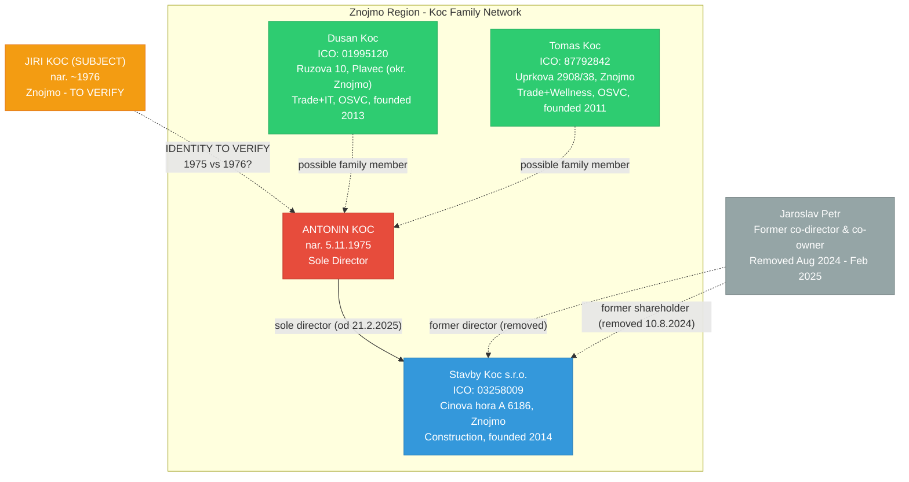

# Network Relationships - Jiri Koc Investigation

## Relationship Graph

## Entity Registry

| # | Type | Name | ICO | Location | Relationship | Source | Confidence |
|---|------|------|-----|----------|-------------|--------|------------|
| 1 | Person | Jiri Koc | N/A | Znojmo | SUBJECT | Client | - |
| 2 | Person | Antonin Koc | N/A | Znojmo | Potential subject match (nar. 5.11.1975) | Justice.cz | HIGH |
| 3 | Company | Stavby Koc s.r.o. | 03258009 | Znojmo | Company of Antonin Koc (director) | ARES + VR | CONFIRMED |
| 4 | Person | Jaroslav Petr | N/A | ? | Former co-director/co-owner Stavby Koc | Justice.cz | CONFIRMED |
| 5 | Person | Dusan Koc | 01995120 | Plavec (Znojmo) | Possible family, OSVC | ARES | MEDIUM |
| 6 | Person | Tomas Koc | 87792842 | Znojmo | Possible family, OSVC | ARES | MEDIUM |
| 7 | Person | Oliver Koc | 22199837 | Ivancice (JMK) | Possible family, OSVC | ARES | LOW |
| 8 | Person | Jiri Koc (Strasice) | 61160466 | Strasice (Rokycany) | Different person, same name | ARES | LOW |
| 9 | Person | Jiri Koc (Bojanovice) | 87046580 | Bojanovice (Praha-zapad) | Different person, same name | ARES | LOW |

## Relationship Types

| Type | Count | Details |
|------|-------|---------|
| director_of | 1 | Antonin Koc -> Stavby Koc s.r.o. (sole, current) |
| former_director_of | 1 | Jaroslav Petr -> Stavby Koc s.r.o. |
| former_shareholder_of | 2 | Jaroslav Petr, Antonin Koc (both removed 2024-2025) |
| possible_family | 3 | Dusan Koc, Tomas Koc, Oliver Koc |
| identity_match | 1 | Subject "Jiri Koc 1976" ~ "Antonin Koc 1975" |

## Timeline of Key Events

| Date | Event | Entity |
|------|-------|--------|
| 2011-04-20 | Tomas Koc OSVC founded | Tomas Koc |
| 2013-08-13 | Dusan Koc OSVC founded | Dusan Koc |
| 2014-07-25 | Stavby Koc s.r.o. founded (Vyrovice) | Stavby Koc s.r.o. |
| 2015-01-28 | Jednani rules changed | Stavby Koc s.r.o. |
| 2017-07-16 | Antonin Koc removed as spolecnik (1st time) | Antonin Koc |
| 2024-08-10 | Jaroslav Petr removed as spolecnik | Jaroslav Petr |
| 2024-10-23 | Oliver Koc OSVC founded | Oliver Koc |
| 2025-02-21 | Major restructuring: address -> Znojmo, Antonin Koc sole director | Stavby Koc s.r.o. |
| 2025-03-25 | Zakladni kapital updated | Stavby Koc s.r.o. |

---

_Last updated: 2026-03-07 (OSINT Phase 1)_
