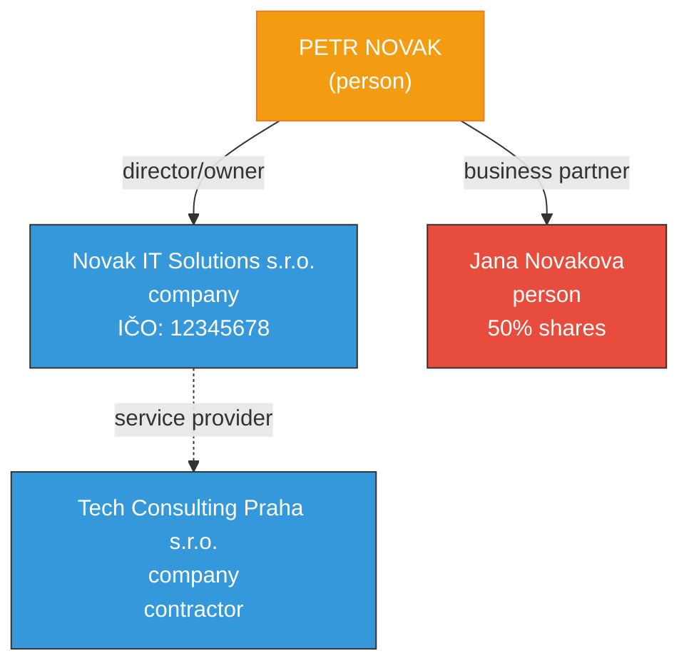

# Network Relationships - Petr Novak

## Relationship Graph

## Entity Registry

| # | Type | Name | Relationship | Confidence |
|---|------|------|-------------|------------|
| 0 | person | Petr Novak | SUBJECT | - |
| 1 | company | Novak IT Solutions s.r.o. | director | HIGH |
| 2 | person | Jana Novakova | co-owner | MEDIUM |
| 3 | company | Tech Consulting Praha s.r.o. | client | LOW |

---

_Generated: 2026-04-13_
