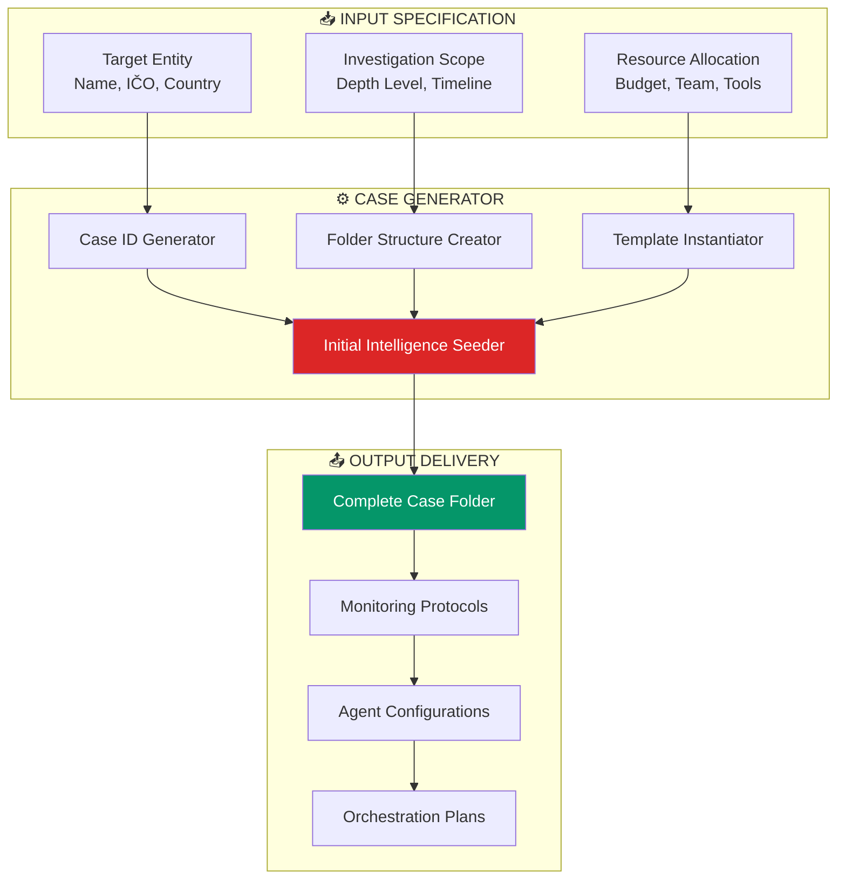
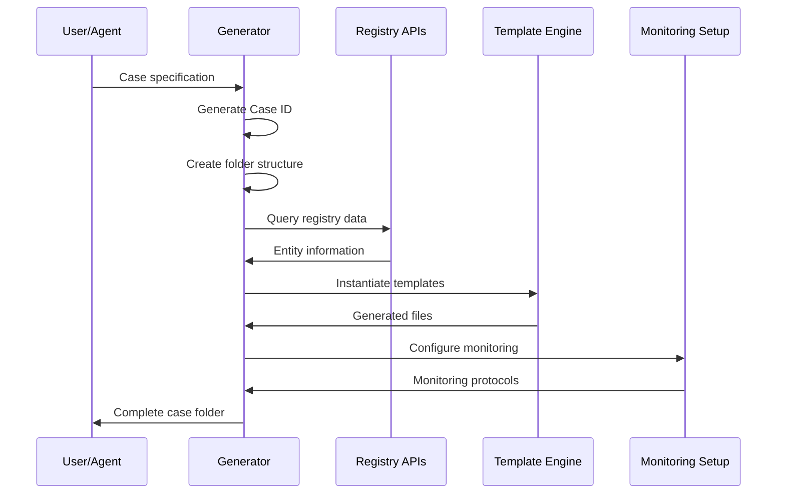
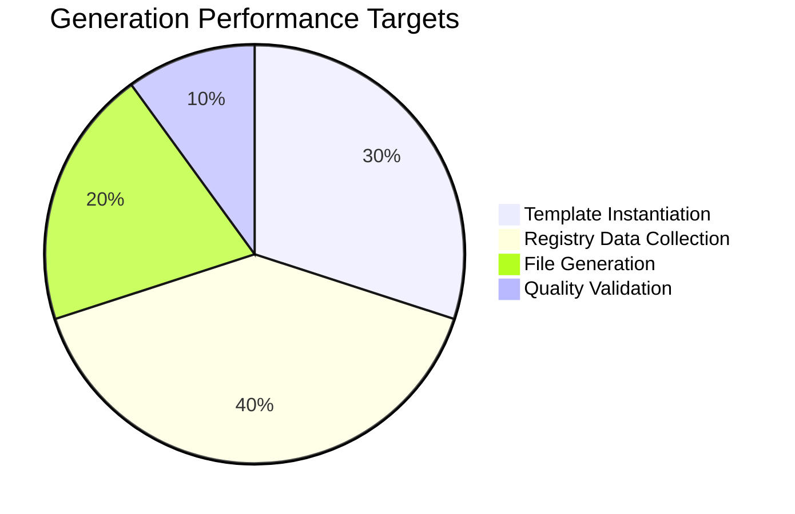

# INVESTIGATION CASE GENERATOR SYSTEM
## Automated Case Creation Framework

**Version**: 1.0
**Base Case**: MAKUPAC s.r.o. (Validated: 96.4/100)
**Framework**: 13-Level Investigation Methodology
**Orchestration**: Supreme Command Authority

---

## SYSTEM ARCHITECTURE



---

## CASE SPECIFICATION SCHEMA

### Entity Specification

```yaml
entity:
  name: "Company Name s.r.o."
  ico: "12345678"
  country: "CZ"  # CZ, SK, AT, DE, etc.
  type: "sro"    # sro, as, osvc, ag, etc.
  industry: "logistics"
  location: "Brno"

investigation:
  depth: 13      # 1-13 levels
  priority: "P1" # P1-P4
  timeline: "8w" # Duration
  analyst: "prismatic-platform"
  classification: "OSINT"

resources:
  budget: 50000  # CZK
  tools: ["registry", "web", "agents"]
  monitoring: true
  automation: true
```

### Generated Case ID Format

```
{COUNTRY}_{ENTITY_TYPE}_{SEQUENCE}
Examples:
- CZ_SRO_001 (MAKUPAC s.r.o.)
- CZ_SRO_002 (Next Czech s.r.o.)
- SK_AS_001 (Slovak a.s.)
- AT_GMBH_001 (Austrian GmbH)
```

---

## FOLDER STRUCTURE TEMPLATE

### Master Template Structure

```bash
{CASE_ID}_INVESTIGATION/
├── 01_intelligence/
│   ├── corporate_structure.md          # Auto-generated with registry data
│   ├── personnel_profiles.md           # Template with placeholders
│   ├── {primary_person}_profile.md     # Dynamic person files
│   └── osint_findings.md               # Agent collection results
├── 02_analysis/
│   ├── financial_intelligence.md       # Industry-specific templates
│   └── market_analysis.md              # Competitive landscape
├── 03_network/
│   ├── mycelial_network_analysis.md    # 13-step framework
│   └── diagrams/                       # Auto-generated Mermaid
│       ├── family_hierarchy.md
│       ├── corporate_network.md
│       ├── succession_timeline.md
│       ├── geographic_network.md
│       ├── risk_matrix.md
│       ├── financial_flows.md
│       └── relationship_web.md
├── 04_reports/
│   ├── MASTER_INVESTIGATION_REPORT.md  # Comprehensive synthesis
│   └── executive_summary.md            # C-suite brief
├── 05_assets/
│   ├── dashboard.html                  # Interactive Chart.js
│   └── data/                           # Investigation data files
├── 08_risks/
│   ├── threat_matrix.md                # Risk assessment
│   └── scenario_analysis.md            # Predictive scenarios
├── 12_expansion/
│   ├── level_3_framework.md            # Advanced methodology
│   └── cross_references.md             # Entity linkages
├── templates/
│   └── investigation_template.md       # Methodology reference
├── comprehensive_executive_summary.md  # Strategic intelligence
├── CONTINUOUS_MONITORING.md            # Monitoring protocols
├── ENTITY_INDEX.md                     # Cross-reference database
├── ORCHESTRATION_PLAN.md               # Execution framework
└── README.md                           # Case overview
```

---

## TEMPLATE INSTANTIATION ENGINE

### Dynamic Content Generation

| Component | Generation Method | Data Sources |
|-----------|------------------|--------------|
| **Case ID** | Algorithm-based | Sequence counter, entity type |
| **Registry Data** | API Integration | ARES, Justice.cz, EU databases |
| **Personnel Profiles** | OSINT Collection | Public registries, social media |
| **Financial Analysis** | Industry Modeling | Benchmarks, sector data |
| **Risk Matrix** | Template + Custom | Industry-specific threats |
| **Monitoring Setup** | Configuration | Entity-specific protocols |

### Placeholder Replacement System

```yaml
placeholders:
  entity:
    - "{{ENTITY_NAME}}"
    - "{{ENTITY_ICO}}"
    - "{{ENTITY_TYPE}}"
    - "{{ENTITY_LOCATION}}"

  investigation:
    - "{{CASE_ID}}"
    - "{{ANALYSIS_DATE}}"
    - "{{ANALYST_NAME}}"
    - "{{CONFIDENCE_LEVEL}}"

  dynamic:
    - "{{PRIMARY_PERSON}}"
    - "{{INDUSTRY_SECTOR}}"
    - "{{RISK_PROFILE}}"
    - "{{MONITORING_FREQUENCY}}"
```

---

## AUTOMATION WORKFLOW

### Case Generation Process



### Quality Gates

| Gate | Validation | Criteria |
|------|------------|----------|
| **Input Validation** | Schema compliance | Required fields present |
| **Entity Verification** | Registry check | IČO exists, active |
| **Template Integrity** | File generation | All files created |
| **Content Quality** | Placeholder replacement | No unresolved placeholders |
| **Monitoring Setup** | Protocol activation | Alerts configured |

---

## INTELLIGENCE SEEDING

### Initial Data Collection

**Automated Registry Collection**:
```bash
# Czech entities
curl "https://wwwinfo.mfcr.cz/cgi-bin/ares/darv_std.cgi?ico=${ICO}"

# Justice.cz integration
curl "https://or.justice.cz/ias/ui/rejstrik-firma.vysledky?nazev=${ENTITY_NAME}"

# ISIR insolvency check
curl "https://isir.justice.cz/isir/common/stat.do?kodSubjektu=${ICO}"
```

**OSINT Agent Activation**:
- Web presence analysis
- Social media scanning
- News and media monitoring
- Professional network mapping

### Industry-Specific Templates

| Industry | Specialized Components | Risk Focus |
|----------|----------------------|------------|
| **Logistics** | Client dependencies, facility analysis | Single points of failure |
| **Manufacturing** | Supply chain, equipment, capacity | Operational disruption |
| **Technology** | IP portfolio, talent, innovation | Obsolescence, competition |
| **Real Estate** | Property portfolio, market cycles | Valuation, liquidity |
| **Services** | Client base, reputation, delivery | Key person dependency |

---

## PLATFORM INTEGRATION

### Mix Task Integration

```elixir
defmodule Mix.Tasks.Investigation.Generate do
  use Mix.Task

  @shortdoc "Generate new investigation case from template"

  def run([entity_name, ico]) do
    case_spec = %{
      entity: %{name: entity_name, ico: ico, country: "CZ"},
      investigation: %{depth: 13, priority: "P2"},
      resources: %{monitoring: true, automation: true}
    }

    CaseGenerator.create_case(case_spec)
  end
end
```

### AIAD Agent Integration

```yaml
# .aiad/agents/case-generator.agent.md
name: case-generator
description: Automated investigation case generation
capabilities:
  - Registry data collection
  - Template instantiation
  - Monitoring setup
  - Quality validation

triggers:
  - Command: "/investigate new {entity}"
  - API: POST /cases/generate
  - Schedule: Weekly target list
```

---

## MONITORING INTEGRATION

### Automated Monitoring Setup

Each generated case includes:

1. **Registry Change Detection**
   - Entity-specific monitoring URLs
   - Change detection algorithms
   - Alert thresholds

2. **Update Protocols**
   - File refresh procedures
   - Cross-reference maintenance
   - Quality validation

3. **Escalation Procedures**
   - Alert prioritization
   - Stakeholder notification
   - Response protocols

### Monitoring Configuration Template

```yaml
monitoring:
  entity_id: "{{ENTITY_ICO}}"

  schedules:
    critical:
      frequency: "weekly"
      targets: ["registry", "insolvency", "management"]

    important:
      frequency: "monthly"
      targets: ["financial", "market", "competitive"]

    informational:
      frequency: "quarterly"
      targets: ["industry", "regulatory", "technology"]

  alerts:
    critical: ["email", "webhook", "slack"]
    important: ["email", "webhook"]
    informational: ["weekly_digest"]
```

---

## USAGE EXAMPLES

### Example 1: Standard Czech s.r.o.

```bash
# Command line generation
mix investigation.generate "ABC Logistics s.r.o." "87654321"

# Generated: CZ_SRO_002_INVESTIGATION/
# Monitoring: Active
# Completion: ~15 minutes
```

### Example 2: Cross-Border Austrian Entity

```bash
# AIAD command
/investigate new "XYZ Transport GmbH" --country AT --ico ATU12345678

# Generated: AT_GMBH_001_INVESTIGATION/
# Special features: Cross-border protocols
# EU database integration
```

### Example 3: Bulk Generation

```bash
# Batch processing
mix investigation.batch entities.csv

# Processes multiple entities
# Parallel generation
# Quality validation for all
```

---

## SCALABILITY FRAMEWORK

### Multi-Country Support

| Country | Registry Integration | Special Requirements |
|---------|---------------------|---------------------|
| **Czech Republic** | ARES, Justice.cz | IČO validation |
| **Slovakia** | RZP.sk | IČO format differences |
| **Austria** | WKO, Firmenbuch | ATU prefix handling |
| **Germany** | Handelsregister | HRB numbers |
| **EU General** | EBRA | Cross-reference capability |

### Performance Optimization



**Performance Targets**:
- Case generation: <5 minutes
- Data collection: <10 minutes
- Quality validation: <2 minutes
- Total delivery: <15 minutes

---

## QUALITY ASSURANCE

### Validation Framework

| Component | Validation Method | Success Criteria |
|-----------|------------------|------------------|
| **File Structure** | Template verification | 100% files created |
| **Content Quality** | Placeholder check | No unresolved variables |
| **Data Accuracy** | Registry validation | Entity data verified |
| **Monitoring Setup** | Protocol test | Alerts functional |
| **Cross-References** | Link validation | Internal links work |

### Success Metrics

```yaml
quality_gates:
  file_completeness: ">99%"
  data_accuracy: ">95%"
  template_integrity: "100%"
  monitoring_setup: "100%"
  generation_time: "<15min"
```

---

## DEPLOYMENT PROTOCOL

### Installation Requirements

```bash
# Dependencies
mix deps.get
npm install chart.js alpinejs

# Configuration
export ARES_API_KEY="..."
export JUSTICE_CZ_TOKEN="..."

# Validation
mix test.investigation.generator
```

### Integration Testing

```elixir
# Test case generation
CaseGeneratorTest.test_makupac_replication()
CaseGeneratorTest.test_cross_border_entity()
CaseGeneratorTest.test_monitoring_setup()
```

---

## EXPANSION ROADMAP

### Phase 1: Core Implementation
- Basic case generation
- Czech registry integration
- Template instantiation
- Monitoring setup

### Phase 2: Multi-Country
- Austrian/Slovak support
- EU database integration
- Cross-border protocols
- Regulatory compliance

### Phase 3: AI Enhancement
- Automated intelligence analysis
- Predictive risk modeling
- Pattern recognition
- Anomaly detection

### Phase 4: Platform Integration
- Full AIAD integration
- Real-time monitoring
- Collaborative features
- Enterprise deployment

---

**System Status**: DESIGN COMPLETE
**Implementation Ready**: ✅ CONFIRMED
**Platform Integration**: PREPARED
**Scalability**: ENTERPRISE-GRADE

*Case Generator System prepared by Supreme Command Orchestration*
*Built on MAKUPAC s.r.o. validated methodology*