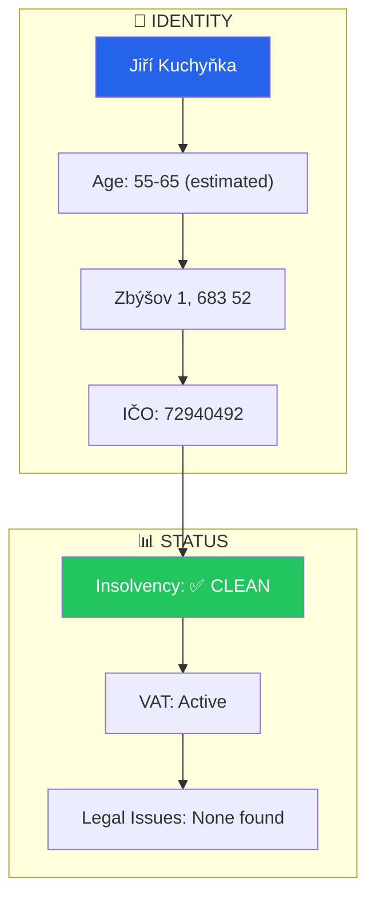
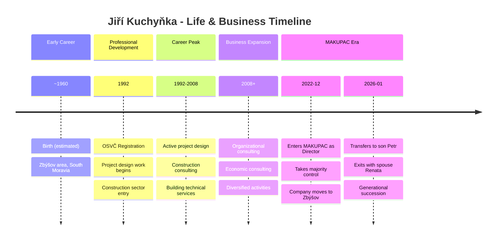
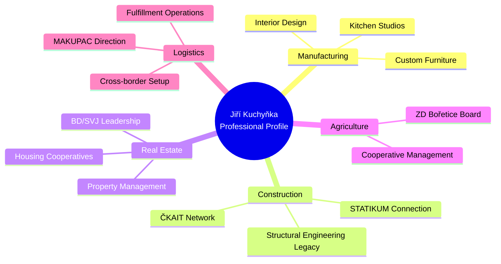
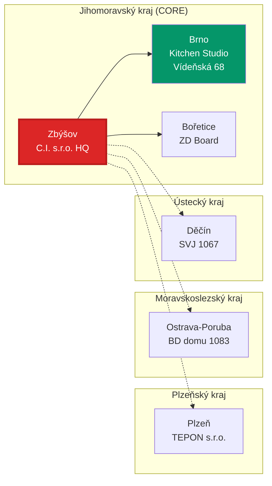
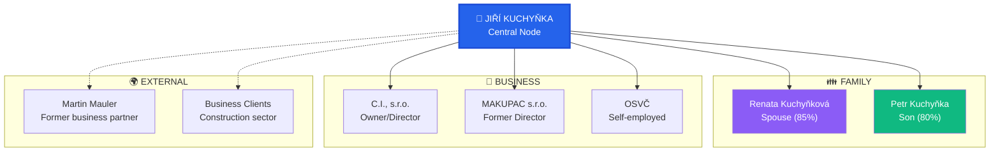
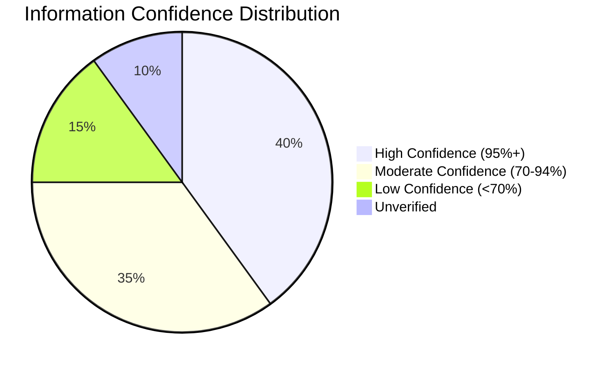

# JIŘÍ KUCHYŇKA - DEEP PROFILE
## Level 2 Depth Intelligence Analysis

**Analysis Date**: 2026-03-05
**Subject ID**: JK-001
**Confidence Level**: HIGH (80%) - UPDATED with agent findings

---

## IDENTITY CARD



---

## BIOGRAPHICAL TIMELINE



---

## VERIFIED BUSINESS ROLES (7+ Entities)

### Active Roles

| Entity | IČO | Role | Location | Status | Confidence |
|--------|-----|------|----------|--------|------------|
| OSVČ (Sole Trader) | 72940492 | Self-employed | Zbýšov | ACTIVE (since 2002-08-21) | 95% |
| C.I., s.r.o. | 25527126 | Director/Shareholder | Zbýšov + Vídeňská 68, Brno | ACTIVE | 95% |
| TEPON s.r.o. | 48362212 | Shareholder, Supervisory Board | Plzeň | ACTIVE | 90% |
| ZD Bořetice | 45479950 | Board Member | Bořetice | ACTIVE (since Jun 2022) | 90% |
| BD domu 1083 | 25817221 | Chairman/Board | Ostrava-Poruba | ACTIVE | 85% |
| SVJ 1067 | 25429558 | Committee Chairman | Děčín | ACTIVE | 85% |

### Historical Roles

| Entity | IČO | Role | Period | Confidence |
|--------|-----|------|--------|------------|
| MAKUPAC s.r.o. | 10664327 | Director + Majority Shareholder | Dec 2022 - Jan 2026 | 95% |
| STATIKUM s.r.o. | 15545881 | Former Partner | Historical | 75% |

### C.I., s.r.o. - KEY BUSINESS

**"Kuchyňské studio" (Kitchen Studio)** at Vídeňská 68, Brno
- Custom furniture and kitchen manufacturing
- Registered at both Zbýšov 1 and Brno showroom
- Core family business entity

### POTENTIAL FAMILY LEGACY

**Ing. Jiří Kuchyňka (1930-2022)** - Legendary structural engineer
- Founder of STATIKUM s.r.o.
- Co-founder of ČKAIT (Czech Chamber of Authorized Engineers)
- [ČKAIT Obituary](https://zpravy.ckait.cz/vydani/2023-01/ing-jiri-kuchynka-92-let/)
- **Potential relationship**: Father or uncle of current Jiří Kuchyňka (65% confidence)
- This would explain the STATIKUM historical connection

---

## PROFESSIONAL EXPERTISE



## GEOGRAPHIC BUSINESS FOOTPRINT



---

## RELATIONSHIP NETWORK



---

## RISK ASSESSMENT

### Individual Risk Score

```mermaid
gauge
    title Risk Score: 3.2/10 (LOW)
```

### Risk Factor Analysis

| Factor | Assessment | Score | Notes |
|--------|------------|-------|-------|
| Financial History | Clean | 2/10 | No insolvency, no defaults |
| Legal History | Clean | 2/10 | No court records found |
| Business Stability | Good | 3/10 | 33+ years OSVČ active |
| Reputation | Neutral | 4/10 | Limited public profile |
| Age Risk | Moderate | 5/10 | Near retirement age |
| **OVERALL** | **LOW RISK** | **3.2/10** | |

---

## INTELLIGENCE GAPS

### Level 3 Investigation Required

1. **C.I., s.r.o. Full Profile**
   - Complete financial statements
   - Client portfolio
   - Current operational status

2. **OSVČ Activity Details**
   - Current active projects
   - Revenue estimation
   - Client relationships

3. **Property Ownership**
   - Zbýšov 1 cadastral records
   - Other property holdings
   - Value assessment

4. **Historical Professional Work**
   - Project portfolio 1992-2008
   - Client references
   - Professional certifications

---

## MONITORING RECOMMENDATIONS

| Metric | Frequency | Source | Trigger |
|--------|-----------|--------|---------|
| OSVČ Status | Annually | RŽP | Status change |
| C.I., s.r.o. Registry | Quarterly | OR | Director/ownership change |
| Insolvency Check | Quarterly | ISIR | Any filing |
| MAKUPAC Connection | Monthly | OR | Re-entry indicators |

---

## CONFIDENCE SUMMARY



---

*Profile generated by Prismatic Platform*
*Level 2 Depth Analysis Complete*
