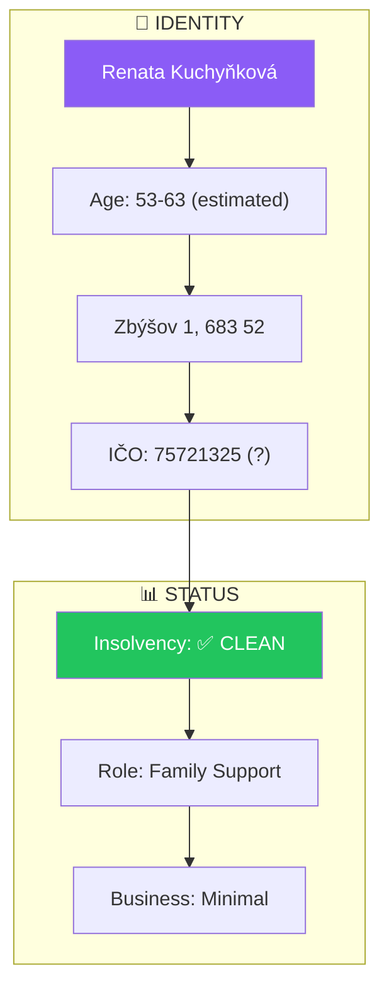
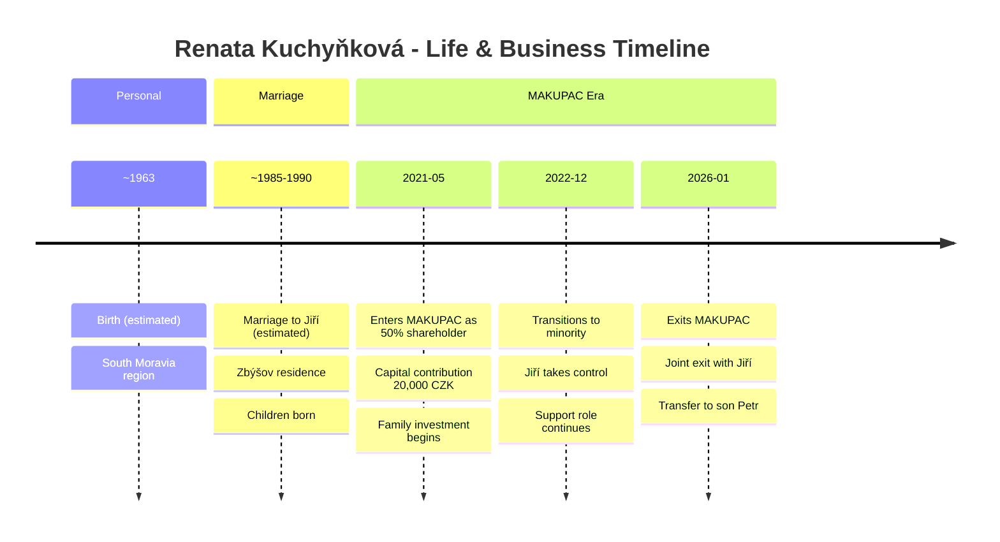
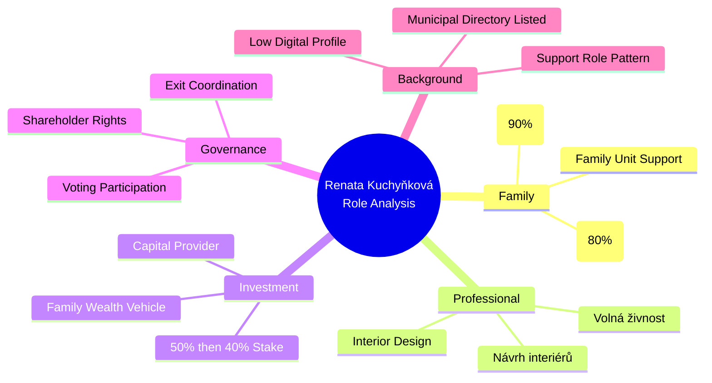
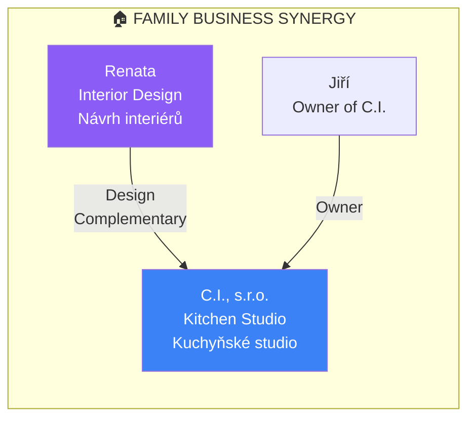
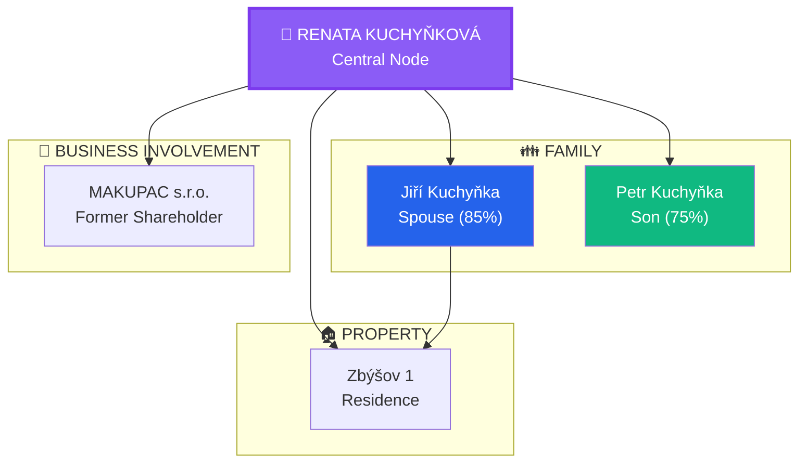
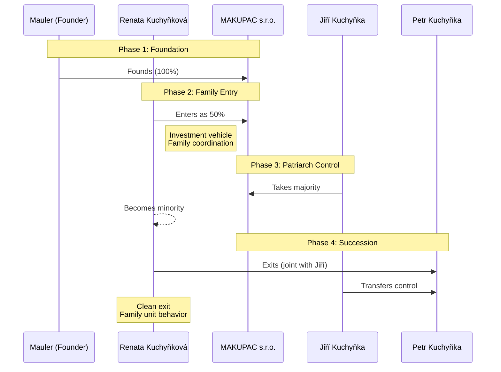
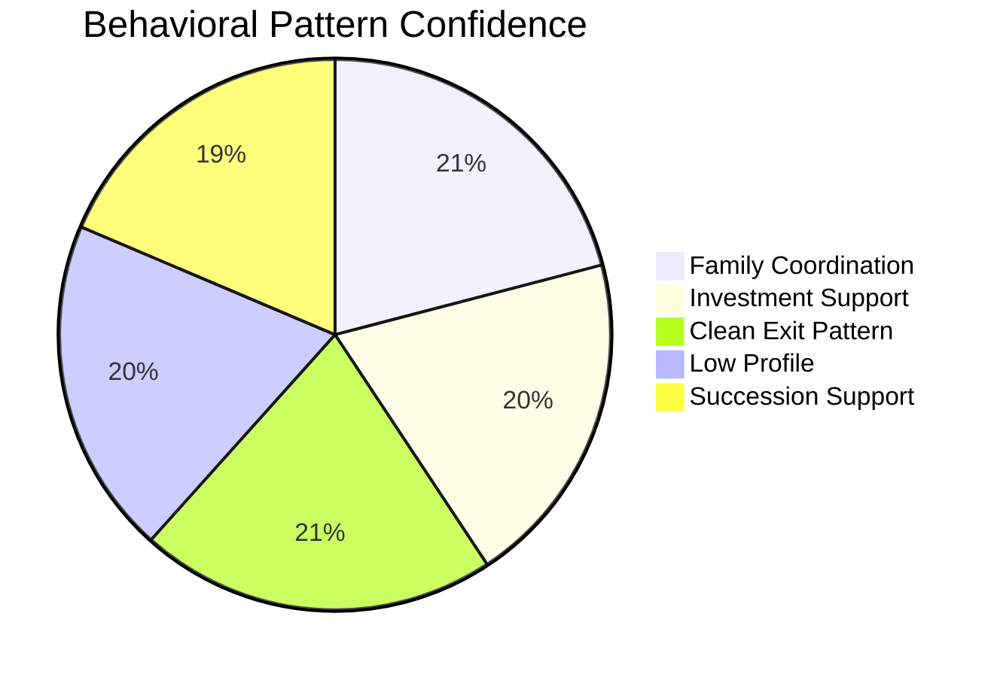
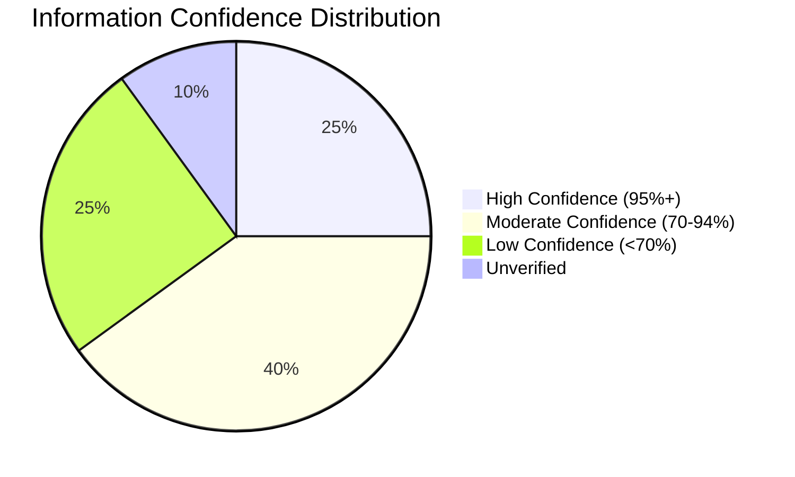

# RENATA KUCHYŇKOVÁ - DEEP PROFILE
## Level 2 Depth Intelligence Analysis

**Analysis Date**: 2026-03-05
**Subject ID**: RK-001
**Confidence Level**: HIGH (85%) - UPDATED with agent findings

---

## IDENTITY CARD



---

## BIOGRAPHICAL TIMELINE



---

## VERIFIED BUSINESS ROLES

### Active Roles

| Entity | Role | Location | Status | Confidence |
|--------|------|----------|--------|------------|
| Interior Design Services | Self-employed ("Návrh interiérů") | Zbýšov | ACTIVE | 85% |

**Source**: [Obec Zbýšov Business Directory](https://www.obec-zbysov.cz/seznam-podnikatelu-a-sluzeb/os-54)
**Phone**: 602 724 666
**Trade Type**: Volná živnost (Free trade - no license required)
**Note**: Listed in municipal business directory. No formal IČO found in registries - likely informal/small-scale activity.

### Historical Roles

| Entity | IČO | Role | Period | Capital | Confidence |
|--------|-----|------|--------|---------|------------|
| MAKUPAC s.r.o. | 10664327 | 50% Shareholder | May 2021 - Dec 2022 | 20,000 CZK | 95% |
| MAKUPAC s.r.o. | 10664327 | 40% Shareholder | Dec 2022 - Jan 2026 | 88,889 CZK | 95% |

---

## ROLE ANALYSIS



## INTERIOR DESIGN BUSINESS CONNECTION



**Analysis**: Renata's interior design activity is complementary to Jiří's C.I., s.r.o. kitchen studio business. This suggests a coordinated family enterprise where interior design consulting feeds into kitchen manufacturing/installation orders.

---

## RELATIONSHIP NETWORK



---

## MAKUPAC INVOLVEMENT ANALYSIS



---

## RISK ASSESSMENT

### Individual Risk Score

```mermaid
gauge
    title Risk Score: 2.8/10 (VERY LOW)
```

### Risk Factor Analysis

| Factor | Assessment | Score | Notes |
|--------|------------|-------|-------|
| Financial History | Clean | 2/10 | No negative records |
| Legal History | Clean | 2/10 | No issues found |
| Business Activity | Minimal | 3/10 | Limited exposure |
| Public Profile | Minimal | 3/10 | Low visibility |
| Investment Pattern | Family Support | 4/10 | Standard pattern |
| **OVERALL** | **VERY LOW RISK** | **2.8/10** | |

---

## INTELLIGENCE GAPS

### Level 3 Investigation Required

1. **Identity Verification**
   - IČO 75721325 confirmation
   - Independent business activity
   - Employment history

2. **Property Ownership**
   - Zbýšov 1 ownership structure
   - Other property holdings
   - Joint ownership with Jiří

3. **Family Structure**
   - Other children (if any)
   - Extended family connections
   - Inheritance patterns

4. **Professional Background**
   - Employment history
   - Educational background
   - Professional associations

---

## BEHAVIORAL PATTERNS

### Identified Patterns

| Pattern | Description | Confidence |
|---------|-------------|------------|
| **Family Coordination** | Actions coordinated with spouse Jiří | 90% |
| **Investment Support** | Capital provider, not operator | 85% |
| **Clean Exit** | Orderly business transitions | 90% |
| **Low Profile** | Minimal public/digital presence | 85% |
| **Succession Support** | Facilitates generational transfer | 80% |

### Pattern Visualization



---

## MONITORING RECOMMENDATIONS

| Metric | Frequency | Source | Trigger |
|--------|-----------|--------|---------|
| Insolvency Check | Quarterly | ISIR | Any filing |
| Business Registry | Annually | ARES | New registrations |
| Property Records | Annually | ČÚZK | Ownership changes |
| MAKUPAC Connection | Monthly | OR | Re-entry indicators |

---

## CONFIDENCE SUMMARY



---

## COMPARISON: RENATA vs JIŘÍ

| Attribute | Renata | Jiří |
|-----------|--------|------|
| Business Activity | Minimal | Extensive |
| Risk Score | 2.8/10 | 3.2/10 |
| Public Profile | Very Low | Low |
| MAKUPAC Role | Shareholder only | Director + Shareholder |
| Exit Pattern | Joint (coordinated) | Joint (coordinated) |
| Family Role | Support | Patriarch |

---

*Profile generated by Prismatic Platform*
*Level 2 Depth Analysis Complete*
