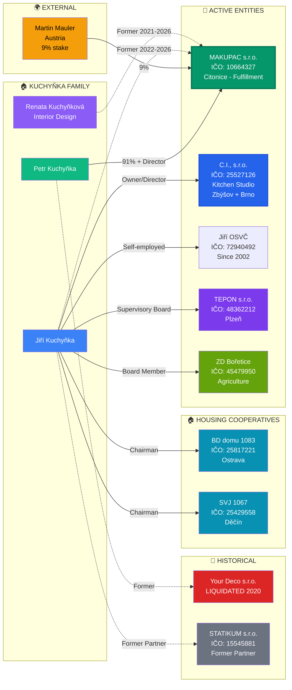
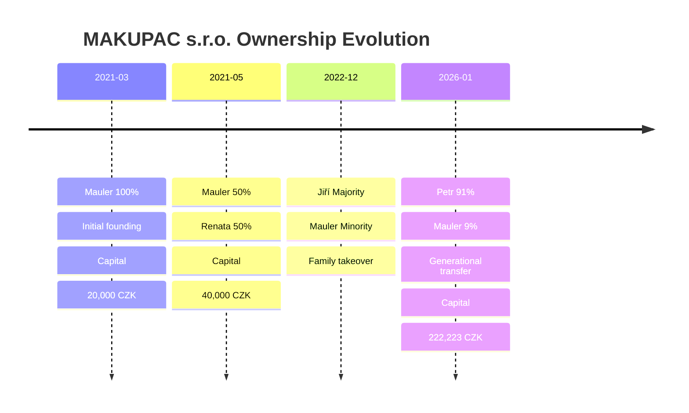
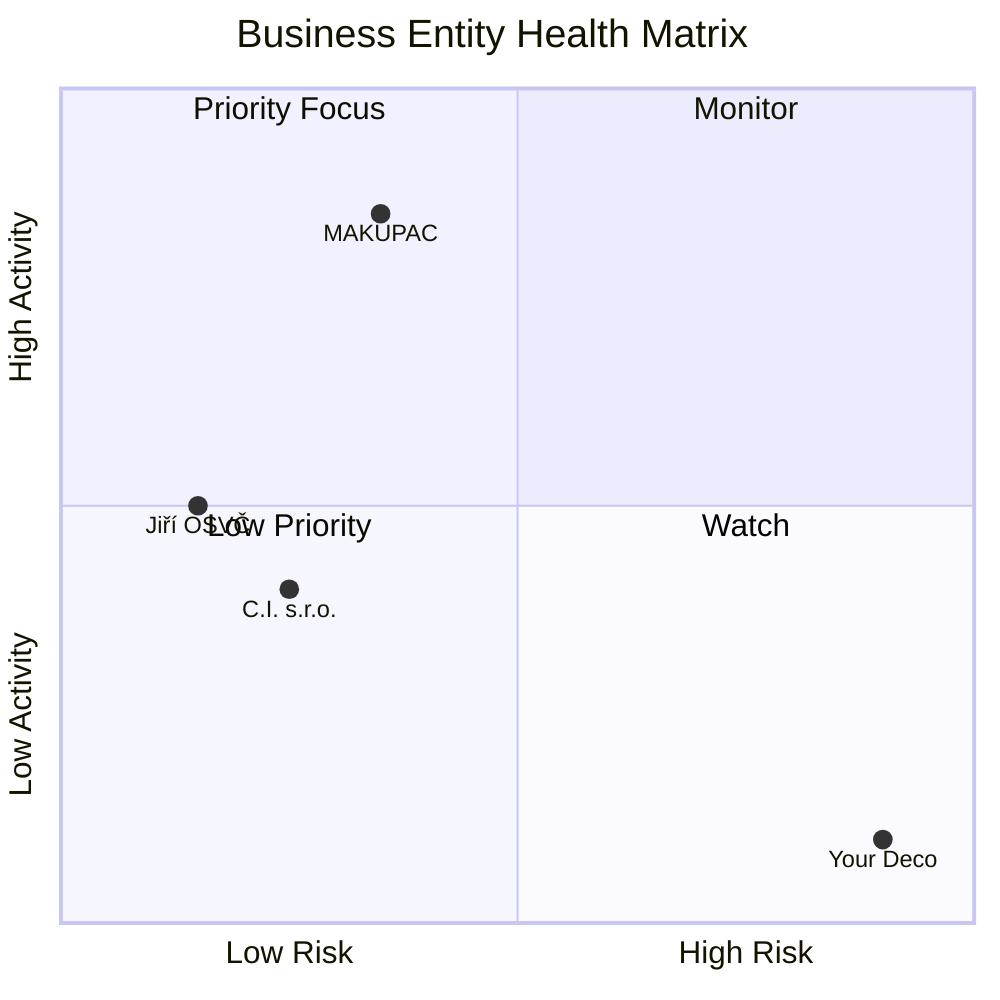

# CORPORATE NETWORK DIAGRAM
## Business Entity Relationships

```mermaid
graph LR
    subgraph KUCHYNKA_FAMILY["🏠 KUCHYŇKA FAMILY"]
        JK["Jiří Kuchyňka"]
        RK["Renata Kuchyňková<br/>Interior Design"]
        PK["Petr Kuchyňka"]
    end

    subgraph EXTERNAL["🌍 EXTERNAL"]
        MM["Martin Mauler<br/>Austria<br/>9% stake"]
    end

    subgraph ACTIVE_COMPANIES["🏢 ACTIVE ENTITIES"]
        MAKUPAC["MAKUPAC s.r.o.<br/>IČO: 10664327<br/>Citonice - Fulfillment"]
        CI["C.I., s.r.o.<br/>IČO: 25527126<br/>Kitchen Studio<br/>Zbýšov + Brno"]
        OSVČ["Jiří OSVČ<br/>IČO: 72940492<br/>Since 2002"]
        TEPON["TEPON s.r.o.<br/>IČO: 48362212<br/>Plzeň"]
        ZD["ZD Bořetice<br/>IČO: 45479950<br/>Agriculture"]
    end

    subgraph HOUSING["🏠 HOUSING COOPERATIVES"]
        BD["BD domu 1083<br/>IČO: 25817221<br/>Ostrava"]
        SVJ["SVJ 1067<br/>IČO: 25429558<br/>Děčín"]
    end

    subgraph HISTORICAL["📜 HISTORICAL"]
        DECO["Your Deco s.r.o.<br/>LIQUIDATED 2020"]
        STATIKUM["STATIKUM s.r.o.<br/>IČO: 15545881<br/>Former Partner"]
    end

    PK -->|"91% + Director"| MAKUPAC
    MM -->|"9%"| MAKUPAC
    JK -->|"Owner/Director"| CI
    JK -->|"Self-employed"| OSVČ
    JK -->|"Supervisory Board"| TEPON
    JK -->|"Board Member"| ZD
    JK -->|"Chairman"| BD
    JK -->|"Chairman"| SVJ
    PK -.->|"Former"| DECO
    JK -.->|"Former Partner"| STATIKUM

    JK -.->|"Former 2022-2026"| MAKUPAC
    RK -.->|"Former 2021-2026"| MAKUPAC

    style MAKUPAC fill:#059669,color:#fff,stroke:#047857,stroke-width:3px
    style CI fill:#2563eb,color:#fff,stroke:#1d4ed8,stroke-width:2px
    style TEPON fill:#7c3aed,color:#fff
    style ZD fill:#65a30d,color:#fff
    style BD fill:#0891b2,color:#fff
    style SVJ fill:#0891b2,color:#fff
    style DECO fill:#dc2626,color:#fff
    style STATIKUM fill:#6b7280,color:#fff
    style MM fill:#f59e0b,color:#000
    style PK fill:#10b981,color:#fff
    style JK fill:#3b82f6,color:#fff
    style RK fill:#8b5cf6,color:#fff
```

## Ownership Flow Over Time

```mermaid
timeline
    title MAKUPAC s.r.o. Ownership Evolution
    2021-03 : Mauler 100%
            : Initial founding
            : Capital: 20,000 CZK
    2021-05 : Mauler 50%
            : Renata 50%
            : Capital: 40,000 CZK
    2022-12 : Jiří Majority
            : Mauler Minority
            : Family takeover
    2026-01 : Petr 91%
            : Mauler 9%
            : Generational transfer
            : Capital: 222,223 CZK
```

## Entity Health Indicators

```mermaid
quadrantChart
    title Business Entity Health Matrix
    x-axis Low Risk --> High Risk
    y-axis Low Activity --> High Activity
    quadrant-1 Monitor
    quadrant-2 Priority Focus
    quadrant-3 Low Priority
    quadrant-4 Watch
    MAKUPAC: [0.35, 0.85]
    C.I. s.r.o.: [0.25, 0.40]
    Jiří OSVČ: [0.15, 0.50]
    Your Deco: [0.90, 0.10]
```
