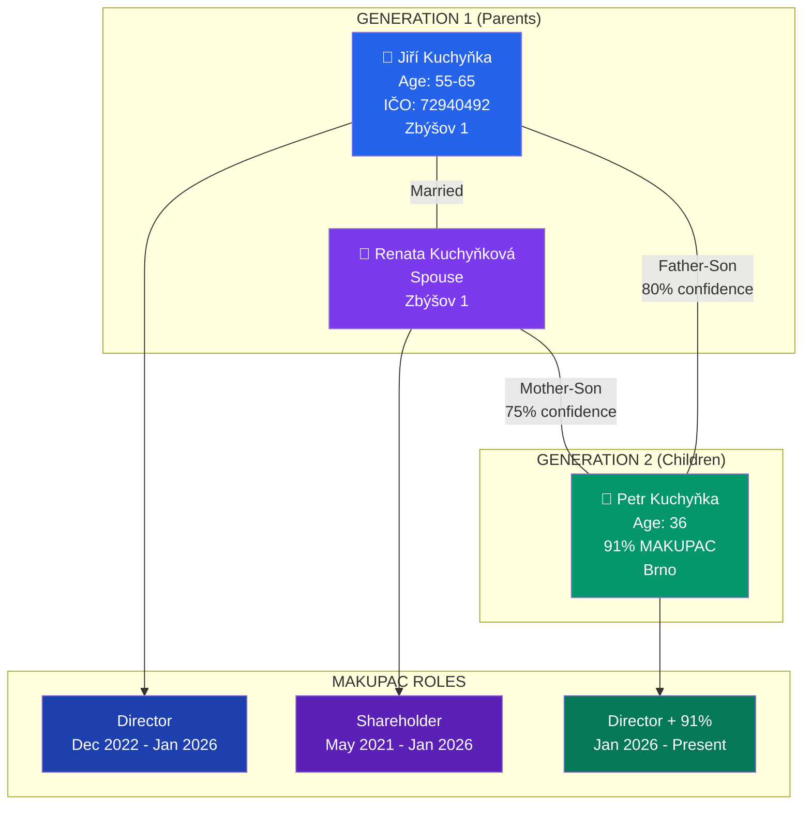
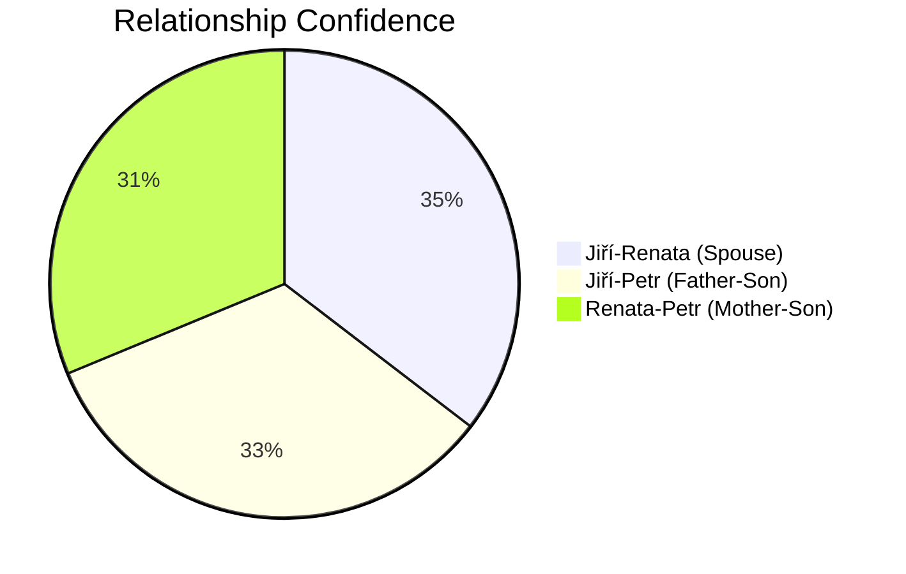
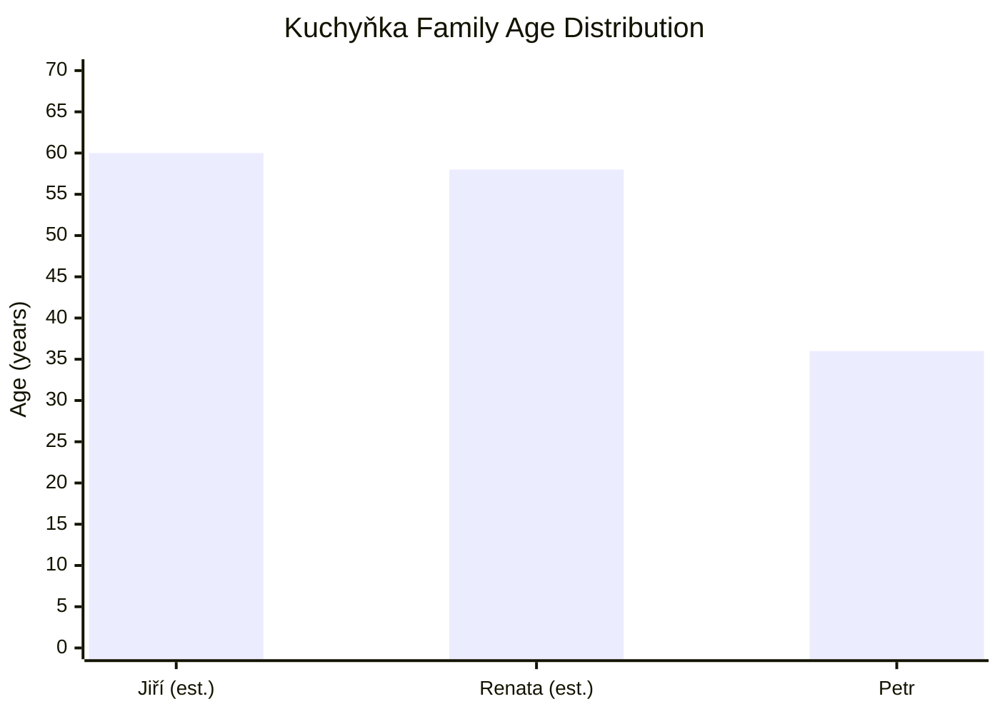

# FAMILY HIERARCHY DIAGRAM
## Kuchyňka Family Structure

```mermaid
graph TB
    subgraph GENERATION_1["GENERATION 1 (Parents)"]
        JK["👤 Jiří Kuchyňka<br/>Age: 55-65<br/>IČO: 72940492<br/>Zbýšov 1"]
        RK["👤 Renata Kuchyňková<br/>Spouse<br/>Zbýšov 1"]
    end

    subgraph GENERATION_2["GENERATION 2 (Children)"]
        PK["👤 Petr Kuchyňka<br/>Age: 36<br/>91% MAKUPAC<br/>Brno"]
    end

    JK ---|"Married"| RK
    JK ---|"Father-Son<br/>80% confidence"| PK
    RK ---|"Mother-Son<br/>75% confidence"| PK

    subgraph ROLES["MAKUPAC ROLES"]
        JK_ROLE["Director<br/>Dec 2022 - Jan 2026"]
        RK_ROLE["Shareholder<br/>May 2021 - Jan 2026"]
        PK_ROLE["Director + 91%<br/>Jan 2026 - Present"]
    end

    JK --> JK_ROLE
    RK --> RK_ROLE
    PK --> PK_ROLE

    style JK fill:#2563eb,color:#fff
    style RK fill:#7c3aed,color:#fff
    style PK fill:#059669,color:#fff
    style JK_ROLE fill:#1e40af,color:#fff
    style RK_ROLE fill:#5b21b6,color:#fff
    style PK_ROLE fill:#047857,color:#fff
```

## Relationship Confidence Matrix

```mermaid
pie title Relationship Confidence
    "Jiří-Renata (Spouse)" : 85
    "Jiří-Petr (Father-Son)" : 80
    "Renata-Petr (Mother-Son)" : 75
```

## Age Distribution

```mermaid
xychart-beta
    title "Kuchyňka Family Age Distribution"
    x-axis ["Jiří (est.)", "Renata (est.)", "Petr"]
    y-axis "Age (years)" 0 --> 70
    bar [60, 58, 36]
```
