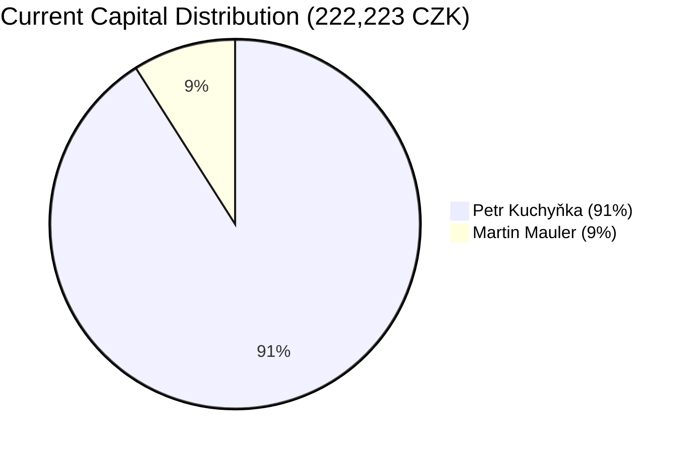
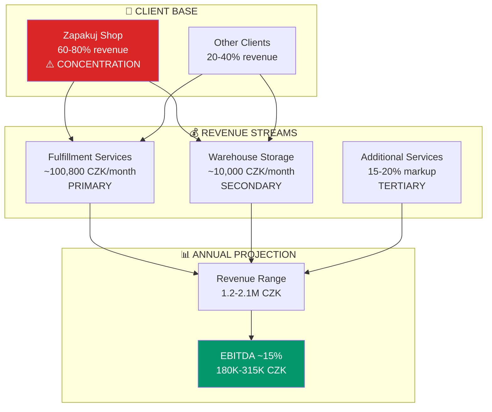
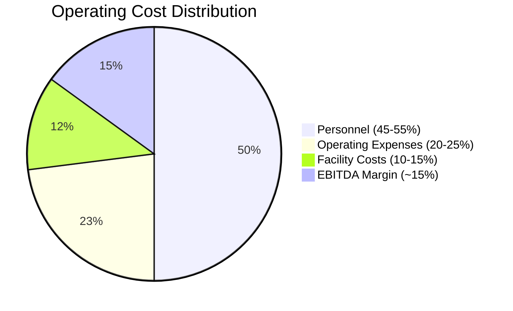
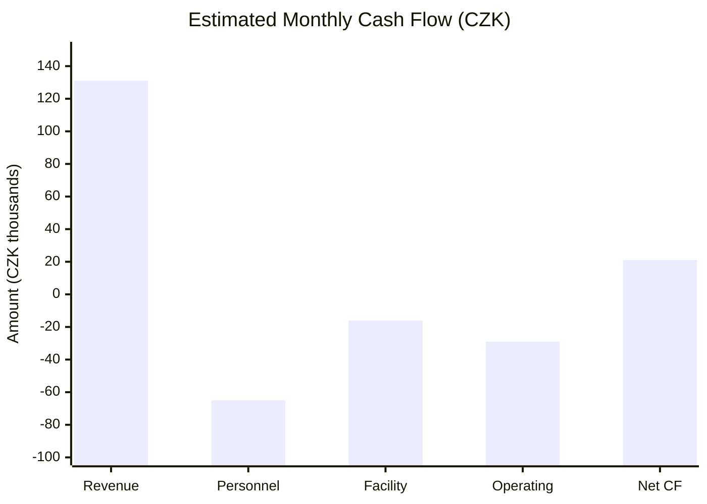
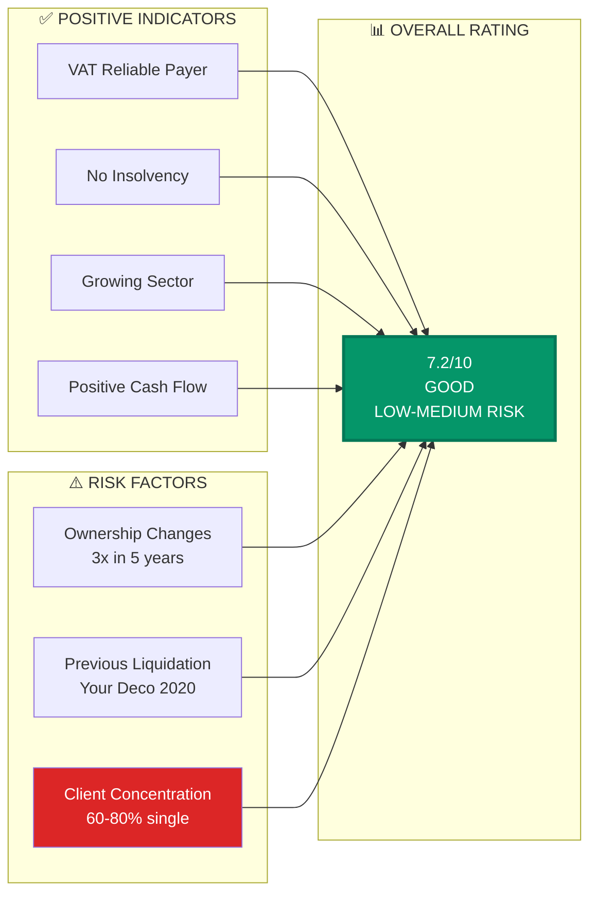
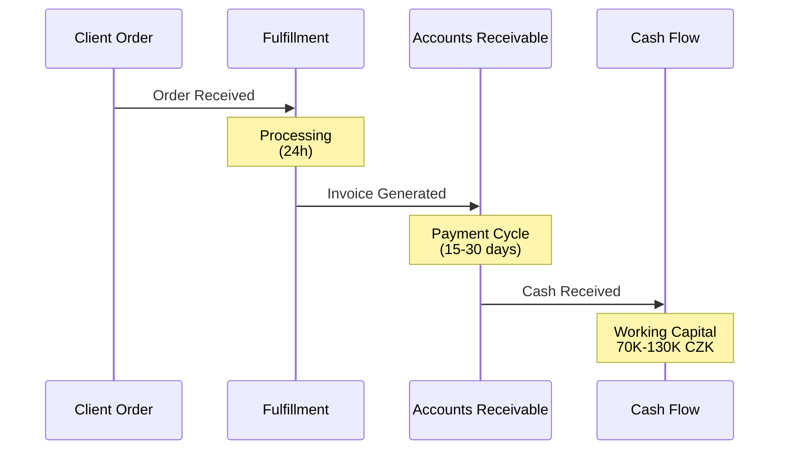

# FINANCIAL FLOWS DIAGRAM
## Capital & Revenue Intelligence

## Capital Structure Evolution

```mermaid
sankey-beta
    Mauler Initial,MAKUPAC Capital,20000
    Renata Entry,MAKUPAC Capital,20000
    MAKUPAC Capital,Operations 2021-2022,40000
    Jiří Era Growth,MAKUPAC Capital,182223
    MAKUPAC Capital,Current Capital,222223
    Current Capital,Petr Share (91%),202223
    Current Capital,Mauler Share (9%),20000
```

## Ownership Value Distribution



## Revenue Stream Analysis



## Cost Structure Breakdown



## Monthly Cash Flow Model



## Financial Health Indicators



## Working Capital Cycle


