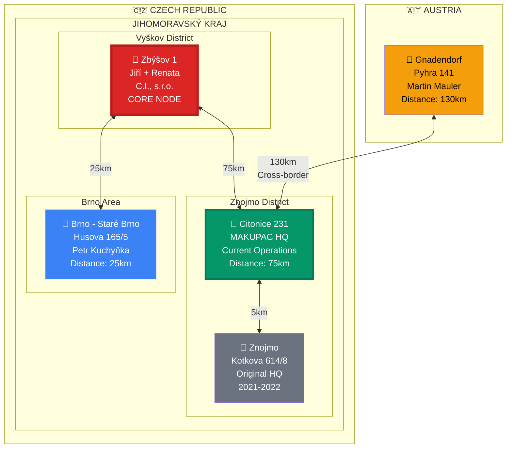
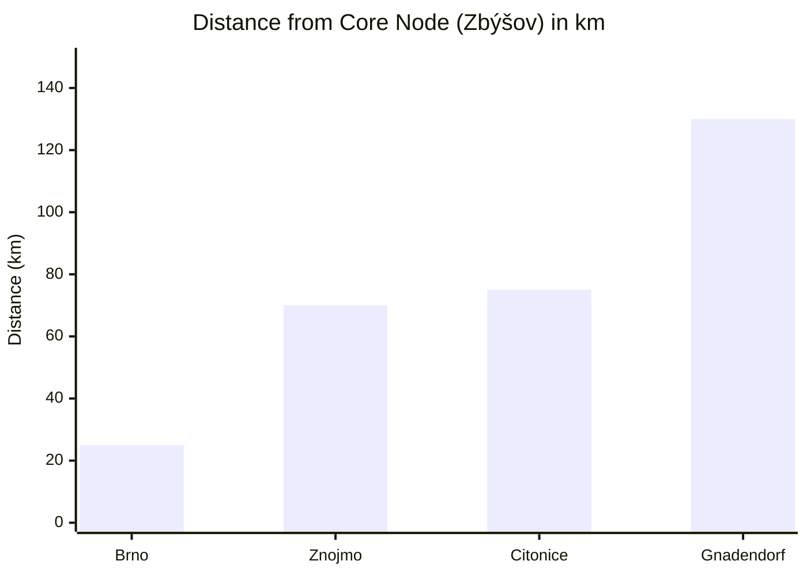
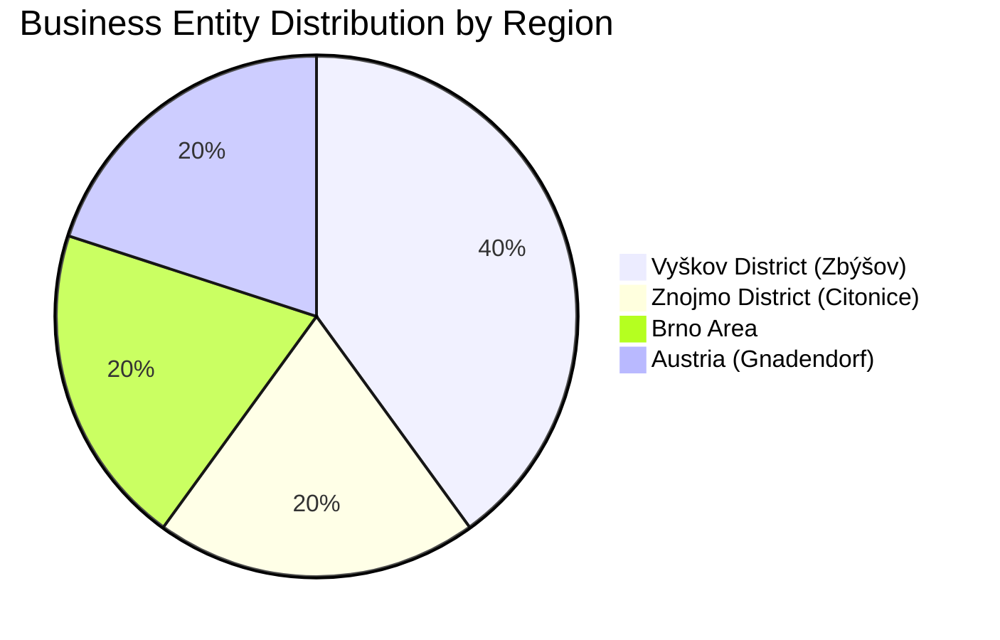
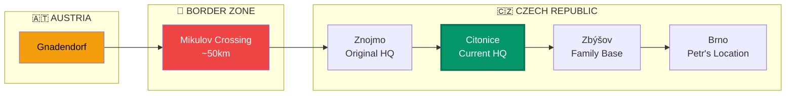
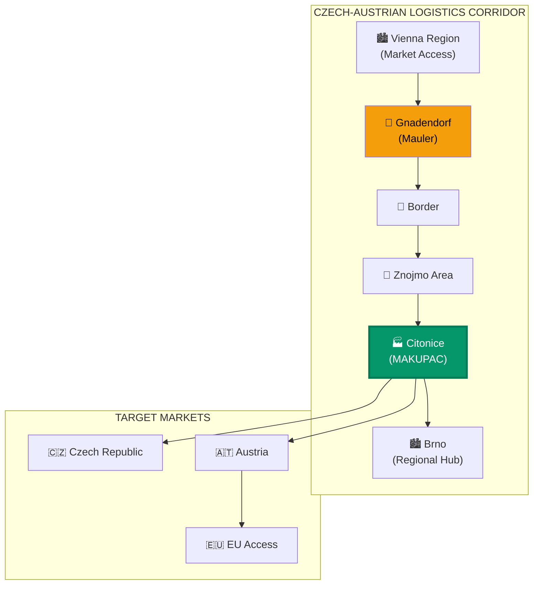

# GEOGRAPHIC NETWORK DIAGRAM
## Spatial Intelligence Analysis

```mermaid
graph TB
    subgraph AUSTRIA["🇦🇹 AUSTRIA"]
        GNADENDORF["📍 Gnadendorf<br/>Pyhra 141<br/>Martin Mauler<br/>Distance: 130km"]
    end

    subgraph CZECH["🇨🇿 CZECH REPUBLIC"]
        subgraph SOUTH_MORAVIA["JIHOMORAVSKÝ KRAJ"]
            subgraph VYSKOV["Vyškov District"]
                ZBYSOV["📍 Zbýšov 1<br/>Jiří + Renata<br/>C.I., s.r.o.<br/>CORE NODE"]
            end

            subgraph BRNO_AREA["Brno Area"]
                BRNO["📍 Brno - Staré Brno<br/>Husova 165/5<br/>Petr Kuchyňka<br/>Distance: 25km"]
            end

            subgraph ZNOJMO_AREA["Znojmo District"]
                CITONICE["📍 Citonice 231<br/>MAKUPAC HQ<br/>Current Operations<br/>Distance: 75km"]
                ZNOJMO["📍 Znojmo<br/>Kotkova 614/8<br/>Original HQ<br/>2021-2022"]
            end
        end
    end

    ZBYSOV <-->|"25km"| BRNO
    ZBYSOV <-->|"75km"| CITONICE
    CITONICE <-->|"5km"| ZNOJMO
    GNADENDORF <-->|"130km<br/>Cross-border"| CITONICE

    style ZBYSOV fill:#dc2626,color:#fff,stroke:#b91c1c,stroke-width:4px
    style CITONICE fill:#059669,color:#fff,stroke:#047857,stroke-width:3px
    style BRNO fill:#3b82f6,color:#fff
    style GNADENDORF fill:#f59e0b,color:#000
    style ZNOJMO fill:#6b7280,color:#fff
```

## Distance Matrix

```mermaid
xychart-beta
    title "Distance from Core Node (Zbýšov) in km"
    x-axis ["Brno", "Znojmo", "Citonice", "Gnadendorf"]
    y-axis "Distance (km)" 0 --> 150
    bar [25, 70, 75, 130]
```

## Regional Business Concentration

```mermaid
pie title Business Entity Distribution by Region
    "Vyškov District (Zbýšov)" : 2
    "Znojmo District (Citonice)" : 1
    "Brno Area" : 1
    "Austria (Gnadendorf)" : 1
```

## Cross-Border Corridor Analysis

```mermaid
flowchart LR
    subgraph AT["🇦🇹 AUSTRIA"]
        A1["Gnadendorf"]
    end

    subgraph BORDER["🚧 BORDER ZONE"]
        B1["Mikulov Crossing<br/>~50km"]
    end

    subgraph CZ["🇨🇿 CZECH REPUBLIC"]
        C1["Znojmo<br/>Original HQ"]
        C2["Citonice<br/>Current HQ"]
        C3["Zbýšov<br/>Family Base"]
        C4["Brno<br/>Petr's Location"]
    end

    A1 --> B1
    B1 --> C1
    C1 --> C2
    C2 --> C3
    C3 --> C4

    style A1 fill:#f59e0b,color:#000
    style B1 fill:#ef4444,color:#fff
    style C2 fill:#059669,color:#fff,stroke:#047857,stroke-width:3px
```

## Logistics Corridor Visualization

```mermaid
graph TB
    subgraph CORRIDOR["CZECH-AUSTRIAN LOGISTICS CORRIDOR"]
        direction TB
        VIENNA["🏙️ Vienna Region<br/>(Market Access)"]
        GNAD["📍 Gnadendorf<br/>(Mauler)"]
        MIK["🚧 Border"]
        ZNO["📍 Znojmo Area"]
        CIT["🏭 Citonice<br/>(MAKUPAC)"]
        BRNO["🏙️ Brno<br/>(Regional Hub)"]
    end

    VIENNA --> GNAD
    GNAD --> MIK
    MIK --> ZNO
    ZNO --> CIT
    CIT --> BRNO

    subgraph MARKET["TARGET MARKETS"]
        CZ_MARKET["🇨🇿 Czech Republic"]
        AT_MARKET["🇦🇹 Austria"]
        EU_MARKET["🇪🇺 EU Access"]
    end

    CIT --> CZ_MARKET
    CIT --> AT_MARKET
    AT_MARKET --> EU_MARKET

    style CIT fill:#059669,color:#fff,stroke:#047857,stroke-width:3px
    style GNAD fill:#f59e0b,color:#000
```
