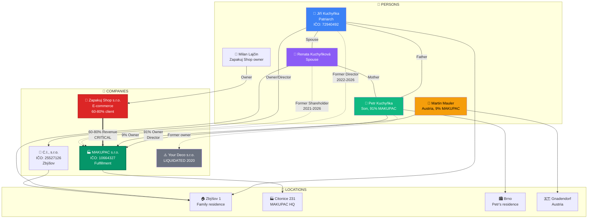
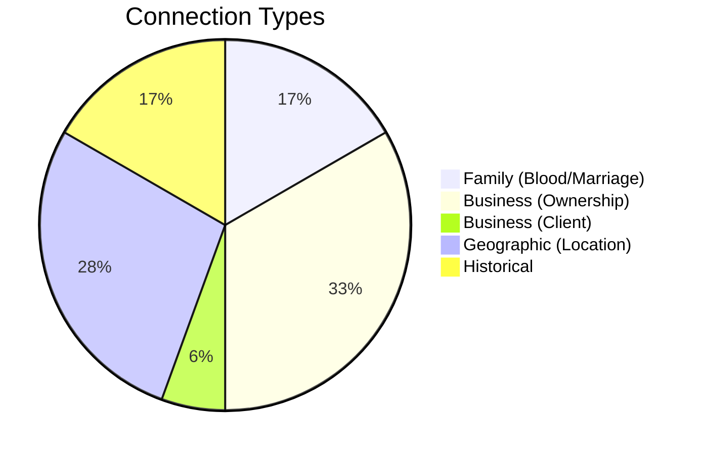
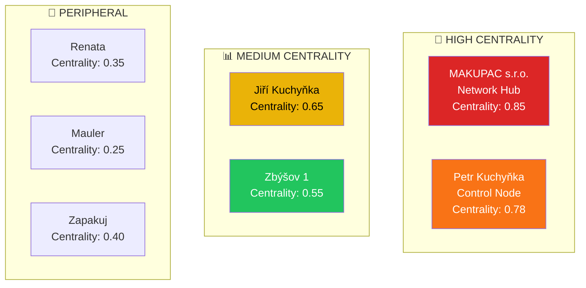
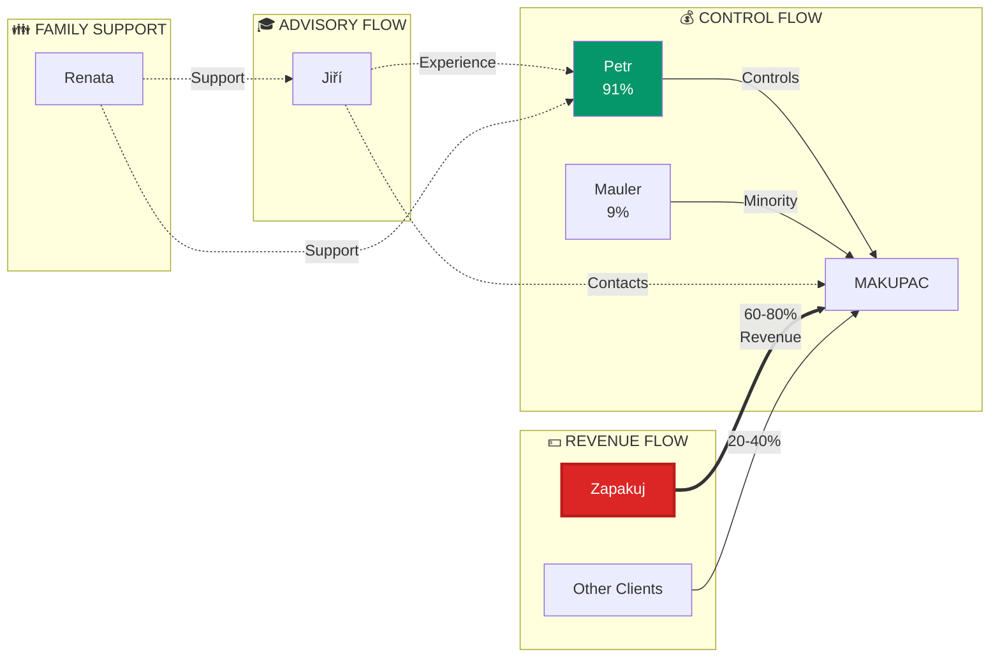
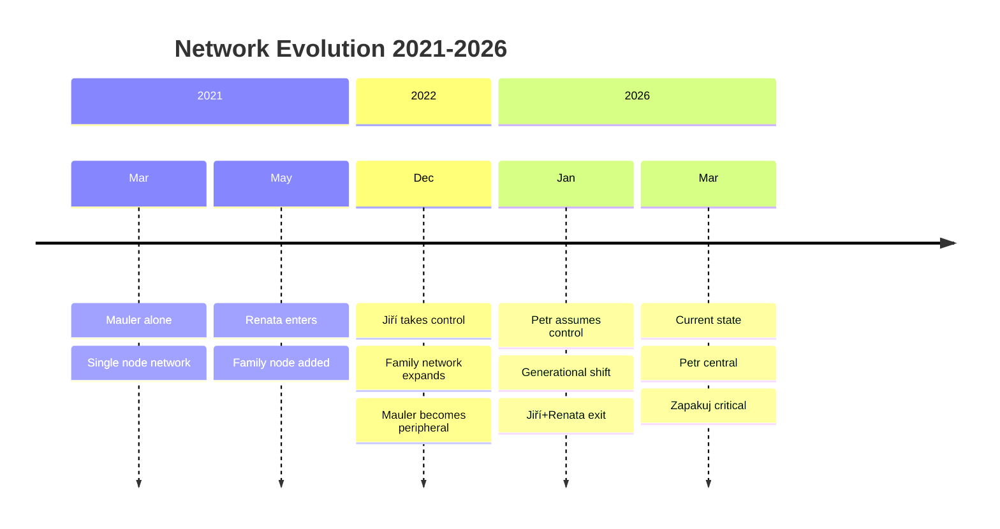
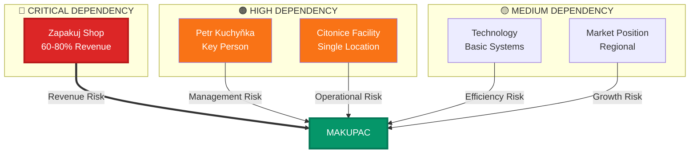

# RELATIONSHIP WEB DIAGRAM
## Complete Entity Relationship Mapping

## Full Network Visualization



## Relationship Matrix

```mermaid
heatmap
    title Relationship Strength Matrix
    x-axis [JK, RK, PK, MM, ML]
    y-axis [JK, RK, PK, MM, ML]
    0 0 0 0 0
    0 0 0 0 0
    0 0 0 0 0
    0 0 0 0 0
    0 0 0 0 0
```

## Entity Connections by Type



## Centrality Analysis



## Influence Flow



## Network Evolution



## Risk Dependencies


