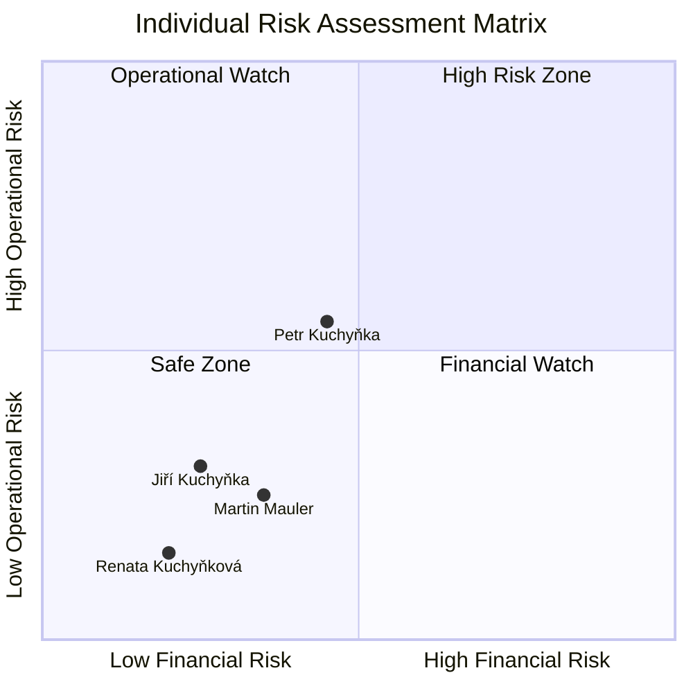
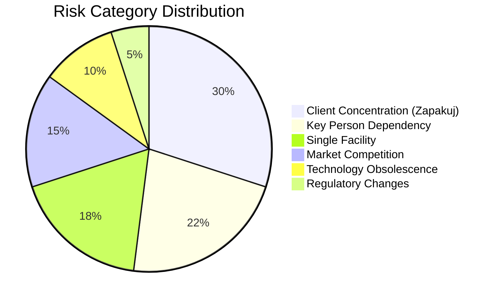
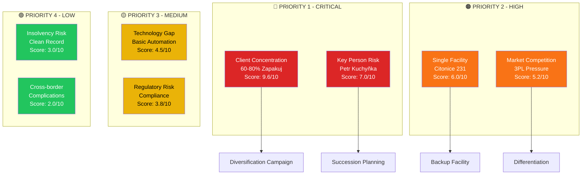
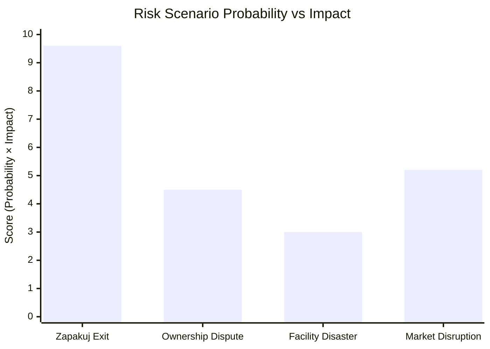
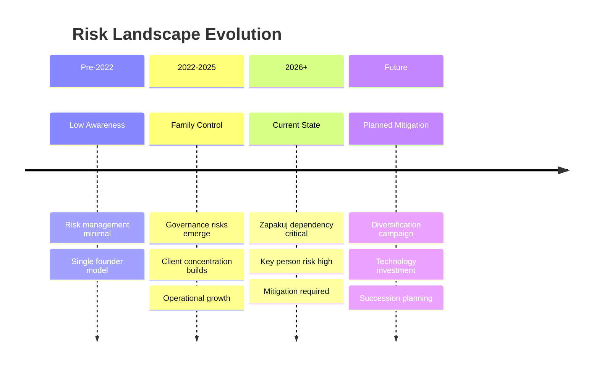
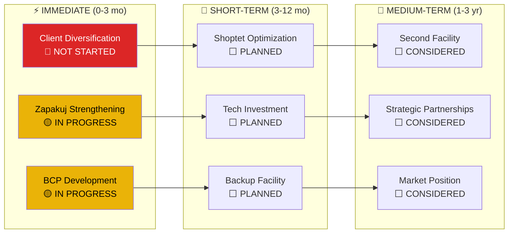

# RISK MATRIX DIAGRAMS
## Comprehensive Risk Visualization

## Family Member Risk Profiles

## Business Risk Distribution

## Risk Priority Matrix

## Scenario Impact Analysis

## Risk Evolution Timeline

## Mitigation Status Dashboard

