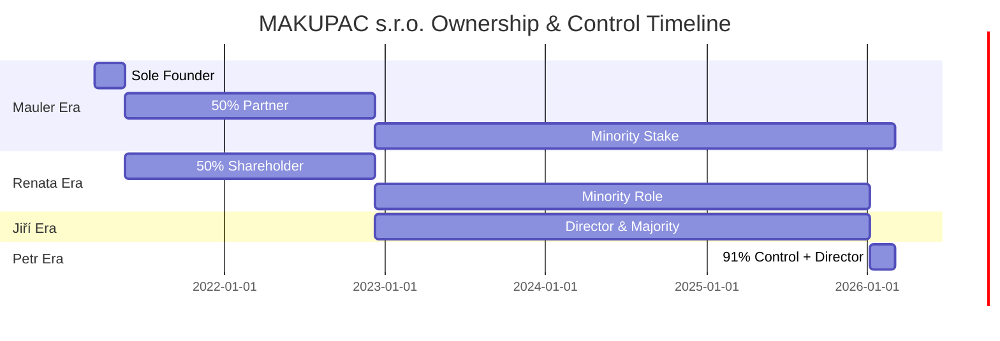
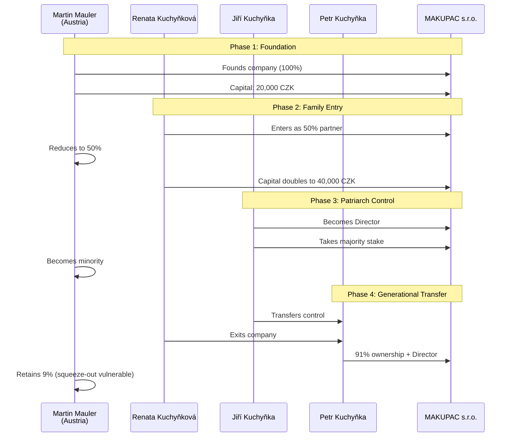
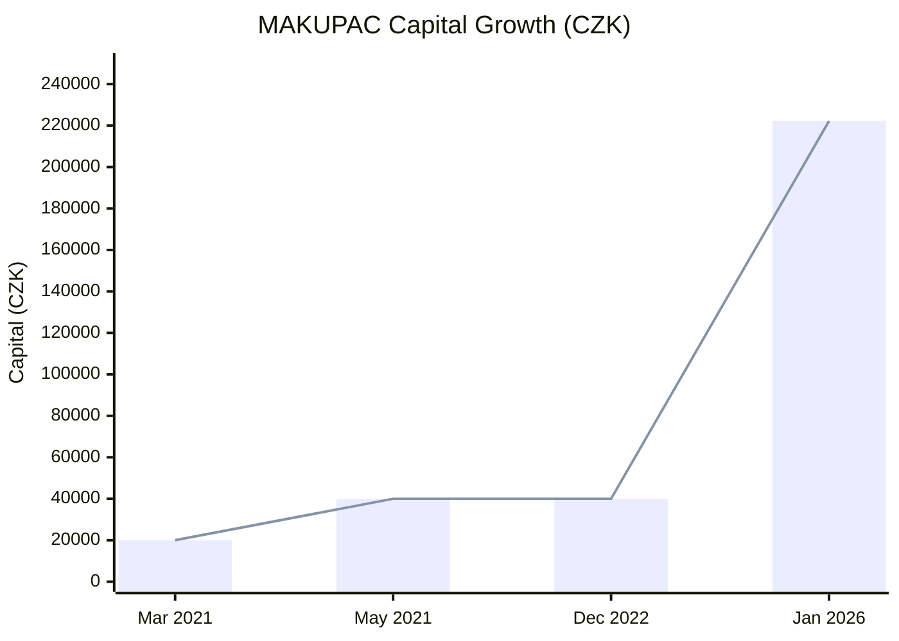
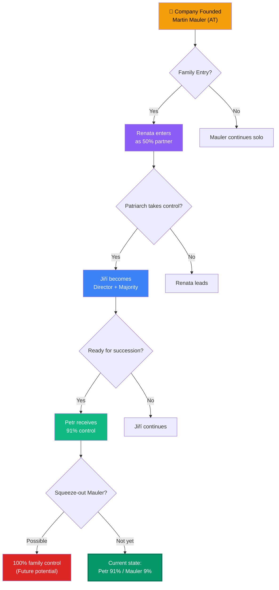

# SUCCESSION TIMELINE DIAGRAM
## Generational Transfer Analysis

```mermaid
gantt
    title MAKUPAC s.r.o. Ownership & Control Timeline
    dateFormat  YYYY-MM-DD
    section Mauler Era
        Sole Founder           :m1, 2021-03-11, 2021-05-18
        50% Partner            :m2, 2021-05-18, 2022-12-07
        Minority Stake         :m3, 2022-12-07, 2026-03-05
    section Renata Era
        50% Shareholder        :r1, 2021-05-18, 2022-12-07
        Minority Role          :r2, 2022-12-07, 2026-01-06
    section Jiří Era
        Director & Majority    :j1, 2022-12-07, 2026-01-06
    section Petr Era
        91% Control + Director :p1, 2026-01-06, 2026-03-05
```

## Control Transfer Sequence

```mermaid
sequenceDiagram
    participant MM as Martin Mauler<br/>(Austria)
    participant RK as Renata Kuchyňková
    participant JK as Jiří Kuchyňka
    participant PK as Petr Kuchyňka
    participant MAKUPAC as MAKUPAC s.r.o.

    Note over MM,MAKUPAC: Phase 1: Foundation
    MM->>MAKUPAC: Founds company (100%)
    MM->>MAKUPAC: Capital: 20,000 CZK

    Note over RK,MAKUPAC: Phase 2: Family Entry
    RK->>MAKUPAC: Enters as 50% partner
    MM->>MM: Reduces to 50%
    RK->>MAKUPAC: Capital doubles to 40,000 CZK

    Note over JK,MAKUPAC: Phase 3: Patriarch Control
    JK->>MAKUPAC: Becomes Director
    JK->>MAKUPAC: Takes majority stake
    MM->>MM: Becomes minority

    Note over PK,MAKUPAC: Phase 4: Generational Transfer
    JK->>PK: Transfers control
    RK->>PK: Exits company
    PK->>MAKUPAC: 91% ownership + Director
    MM->>MM: Retains 9% (squeeze-out vulnerable)
```

## Capital Evolution Chart

```mermaid
xychart-beta
    title "MAKUPAC Capital Growth (CZK)"
    x-axis ["Mar 2021", "May 2021", "Dec 2022", "Jan 2026"]
    y-axis "Capital (CZK)" 0 --> 250000
    bar [20000, 40000, 40000, 222223]
    line [20000, 40000, 40000, 222223]
```

## Succession Decision Tree

```mermaid
flowchart TD
    START["🏁 Company Founded<br/>Martin Mauler (AT)"]

    START --> Q1{"Family Entry?"}
    Q1 -->|"Yes"| RENATA["Renata enters<br/>as 50% partner"]
    Q1 -->|"No"| SOLO["Mauler continues solo"]

    RENATA --> Q2{"Patriarch takes control?"}
    Q2 -->|"Yes"| JIRI["Jiří becomes<br/>Director + Majority"]
    Q2 -->|"No"| RENATA_LEAD["Renata leads"]

    JIRI --> Q3{"Ready for succession?"}
    Q3 -->|"Yes"| PETR["Petr receives<br/>91% control"]
    Q3 -->|"No"| JIRI_CONTINUE["Jiří continues"]

    PETR --> Q4{"Squeeze-out Mauler?"}
    Q4 -->|"Possible"| SQUEEZE["100% family control<br/>(Future potential)"]
    Q4 -->|"Not yet"| CURRENT["Current state:<br/>Petr 91% / Mauler 9%"]

    style START fill:#f59e0b,color:#000
    style RENATA fill:#8b5cf6,color:#fff
    style JIRI fill:#3b82f6,color:#fff
    style PETR fill:#10b981,color:#fff
    style CURRENT fill:#059669,color:#fff,stroke:#047857,stroke-width:3px
    style SQUEEZE fill:#dc2626,color:#fff
```
