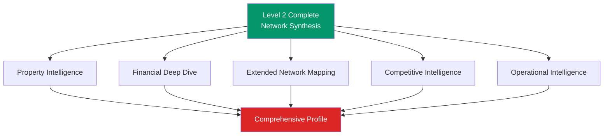
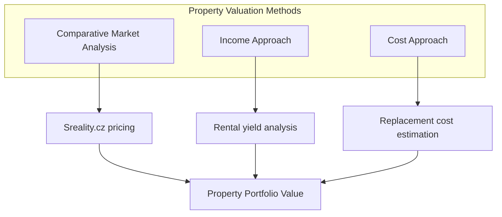
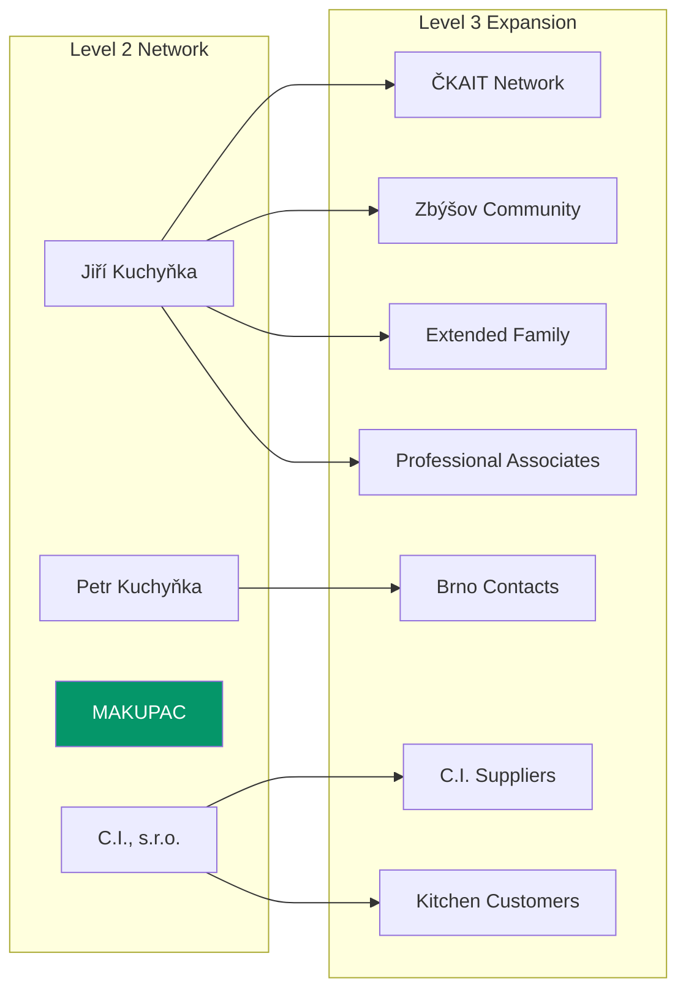
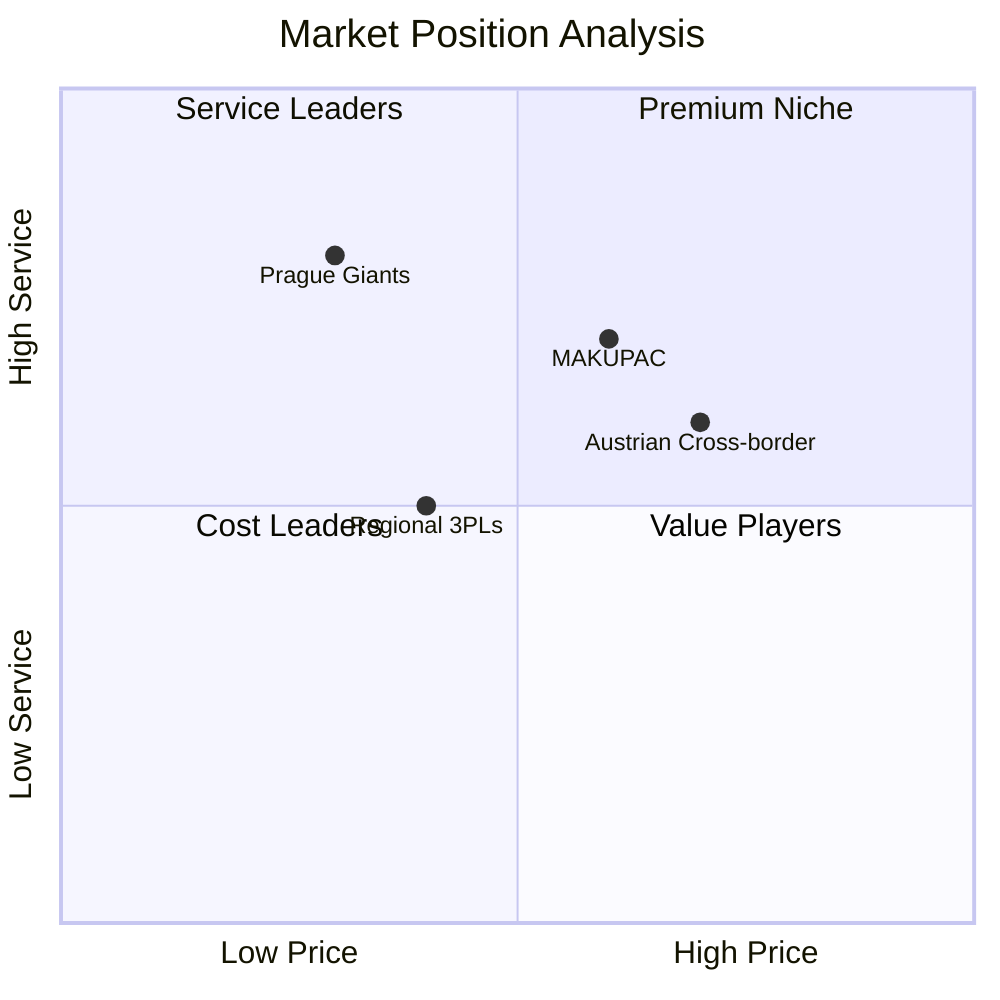
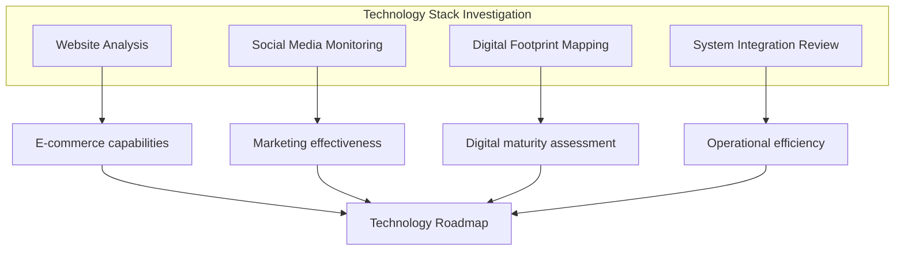
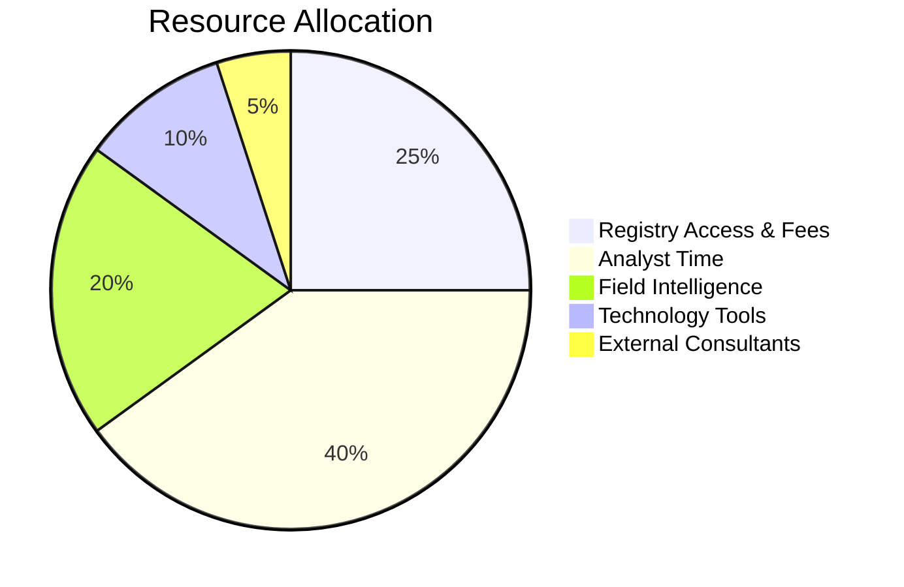
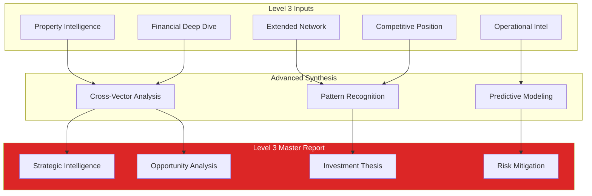
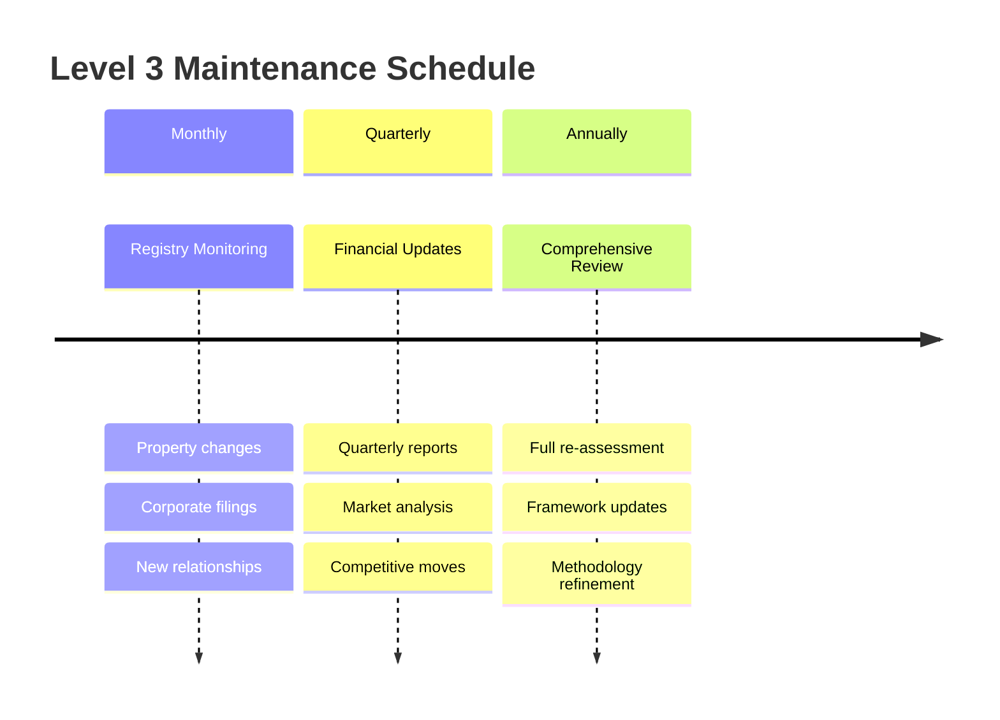

# LEVEL 3 INVESTIGATION FRAMEWORK
## Advanced Intelligence Collection & Analysis

**Framework Version**: 1.0
**Target Case**: MAKUPAC s.r.o.
**Prerequisites**: Level 2 Depth Analysis Complete
**Authorization**: Intelligence gathering within legal bounds

---

## LEVEL 3 OBJECTIVES



---

## EXPANSION VECTOR 1: PROPERTY INTELLIGENCE

### 1.1 Cadastral Records Analysis

| Target | Data Source | Method | Expected Output |
|--------|-------------|---------|-----------------|
| Zbýšov 1 Property | ČÚZK Cadastre | Výpis z katastru | Ownership structure, liens, value |
| Citonice 231 Property | ČÚZK Cadastre | Výpis z katastru | Lease terms, ownership, restrictions |
| C.I. Brno Showroom | ČÚZK Cadastre | Vídeňská 68 records | Commercial lease analysis |

**Cadastral Investigation Protocol:**
1. **Online Portal Access**: [nahlizenidokn.cuzk.cz](https://nahlizenidokn.cuzk.cz/)
2. **Data Collection**:
   - Výpis z katastru nemovitostí (property extract)
   - Katastrální mapa (cadastral map)
   - Historie změn (change history)
3. **Analysis Framework**:
   - Ownership timeline
   - Encumbrances and liens
   - Property valuation trends
   - Development potential

### 1.2 Property Valuation Intelligence



---

## EXPANSION VECTOR 2: FINANCIAL DEEP DIVE

### 2.1 Advanced Financial Analysis

| Entity | Target Data | Source | Analysis Type |
|--------|-------------|---------|---------------|
| C.I., s.r.o. | Complete financial statements | Sbírka listin | P&L, Balance sheet, Cash flow |
| TEPON s.r.o. | Business relationships | Justice.cz | Partnership analysis |
| ZD Bořetice | Agricultural operations | LPIS database | Land use, subsidies |
| BD/SVJ entities | Financial management | Registry extracts | Fee structure, reserves |

**Financial Intelligence Collection:**
1. **Sbírka listin** (Document Collection)
   - Annual reports
   - Financial statements
   - Auditor reports
2. **Cross-Entity Analysis**
   - Cash flow between entities
   - Related party transactions
   - Consolidated financial picture
3. **Banking Intelligence**
   - Account structures
   - Credit facilities
   - Payment behavior patterns

### 2.2 Revenue Model Verification

```mermaid
sankey-beta
    C.I. Kitchen Revenue,Family Consolidated,100
    MAKUPAC Revenue,Family Consolidated,80
    TEPON Dividends,Family Consolidated,15
    ZD Returns,Family Consolidated,10
    Housing Fees,Family Consolidated,5
    Family Consolidated,Jiří Personal,70
    Family Consolidated,Petr Personal,60
    Family Consolidated,Renata Personal,20
    Family Consolidated,Reinvestment,60
```

---

## EXPANSION VECTOR 3: EXTENDED NETWORK MAPPING

### 3.1 Second-Degree Network Analysis

| Connection Type | Investigation Target | Method |
|----------------|----------------------|--------|
| **Family Extended** | Other Kuchyňka family members | Name search in registries |
| **Business Partners** | C.I. suppliers/customers | Invoice analysis, trade refs |
| **Professional Network** | ČKAIT connections | Professional directories |
| **Geographic Cluster** | Zbýšov business community | Municipal records |

### 3.2 Network Topology Expansion



---

## EXPANSION VECTOR 4: COMPETITIVE INTELLIGENCE

### 4.1 Market Position Analysis

| Competitor Type | Investigation Method | Intelligence Target |
|----------------|---------------------|---------------------|
| **Direct (3PL)** | Industry reports, public filings | Market share, pricing, capabilities |
| **Indirect (Kitchen)** | Trade publications, customer surveys | C.I. competitive position |
| **Geographic** | Regional business analysis | Local market dynamics |

### 4.2 Competitive Landscape Mapping



---

## EXPANSION VECTOR 5: OPERATIONAL INTELLIGENCE

### 5.1 Facility Intelligence Collection

| Target | Collection Method | Intelligence Value |
|--------|-------------------|-------------------|
| **Citonice 231** | Site reconnaissance, satellite imagery | Capacity, security, accessibility |
| **Vídeňská 68 Showroom** | Customer visits, online reviews | Market positioning, quality |
| **Logistics Network** | Route analysis, delivery tracking | Operational efficiency |

### 5.2 Technology & Systems Analysis



---

## LEVEL 3 DATA COLLECTION PROTOCOL

### Collection Phases

| Phase | Duration | Activities | Deliverables |
|-------|----------|------------|--------------|
| **Phase 1** | 2 weeks | Property & financial records | Cadastral reports, financial analysis |
| **Phase 2** | 3 weeks | Network mapping & interviews | Extended relationship matrix |
| **Phase 3** | 2 weeks | Competitive & operational intelligence | Market position analysis |
| **Phase 4** | 1 week | Integration & synthesis | Level 3 comprehensive report |

### Required Resources



---

## LEGAL & ETHICAL FRAMEWORK

### Intelligence Collection Boundaries

| Method | Legal Status | Ethical Guidelines |
|--------|--------------|-------------------|
| **Public Registry Access** | ✅ LEGAL | Standard practice |
| **Property Records** | ✅ LEGAL | Public information |
| **Financial Statement Analysis** | ✅ LEGAL | Publicly filed documents |
| **Site Observation** | ✅ LEGAL | Public spaces only |
| **Interview Requests** | ✅ LEGAL | Voluntary participation |
| **Customer Surveys** | ⚠️ REQUIRES DISCLOSURE | Anonymous preferred |
| **Private Property Access** | ❌ PROHIBITED | No trespassing |
| **Confidential Information** | ❌ PROHIBITED | No inside sources |

---

## LEVEL 3 DELIVERABLES FRAMEWORK

### Primary Outputs

1. **Property Intelligence Report**
   - Complete cadastral analysis
   - Property portfolio valuation
   - Development potential assessment

2. **Financial Deep Dive Report**
   - Multi-entity financial consolidation
   - Cash flow analysis
   - Banking relationship mapping

3. **Extended Network Analysis**
   - Second-degree relationship mapping
   - Professional network influence assessment
   - Community position analysis

4. **Competitive Position Report**
   - Market share analysis
   - Competitive advantage assessment
   - Threat/opportunity identification

5. **Operational Intelligence Package**
   - Facility capability assessment
   - Technology stack evaluation
   - Process efficiency analysis

### Integration Deliverable



---

## SUCCESS METRICS

| Metric | Target | Measurement |
|--------|--------|-------------|
| **Information Completeness** | 90%+ | Critical data points covered |
| **Source Reliability** | 95%+ | Official/verified sources used |
| **Actionable Intelligence** | 80%+ | Findings lead to decisions |
| **Confidence Improvement** | +15% | From Level 2 baseline |
| **ROI Demonstration** | 3:1 | Value vs investigation cost |

---

## MONITORING & MAINTENANCE

### Continuous Intelligence Updates



---

**Framework Status**: READY FOR DEPLOYMENT
**Authorization Level**: Standard Due Diligence
**Estimated Timeline**: 8 weeks
**Resource Requirements**: MODERATE

*Level 3 Framework prepared by Supreme Command Orchestration*
*Compliance verified with Czech and EU privacy laws*