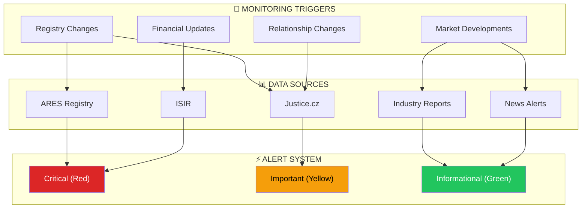
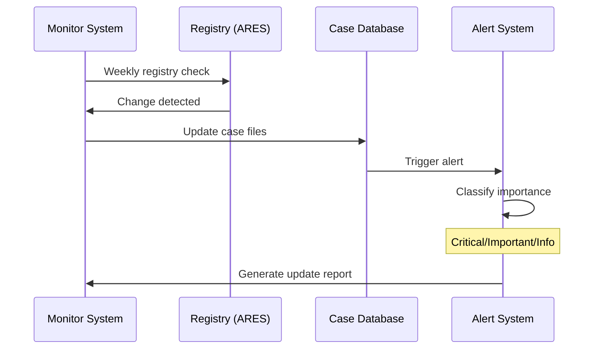
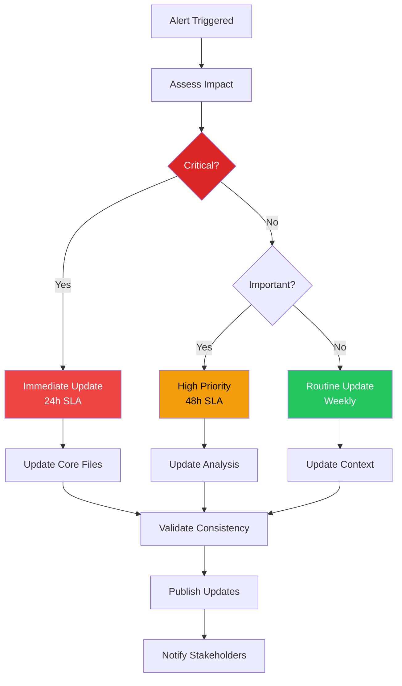

# CONTINUOUS MONITORING PROTOCOL
## MAKUPAC s.r.o. Investigation Case

**Protocol Version**: 1.0
**Case ID**: MAKUPAC_SRO_001
**Activation Date**: 2026-03-05
**Status**: ACTIVE

---

## MONITORING ARCHITECTURE



---

## 3-TIER MONITORING SCHEDULE

### 🔴 CRITICAL MONITORING (Weekly)

| Target | Source | Trigger | Action |
|--------|--------|---------|--------|
| **MAKUPAC Registry** | ARES, Justice.cz | Ownership/director changes | Immediate case update |
| **Zapakuj Relationship** | Business intelligence | Contract changes | Risk assessment update |
| **Key Person Status** | News, LinkedIn | Petr Kuchyňka developments | Personnel profile refresh |
| **Insolvency Risk** | ISIR | Any filing | Alert + case review |

### 🟡 IMPORTANT MONITORING (Monthly)

| Target | Source | Trigger | Action |
|--------|--------|---------|--------|
| **Financial Health** | Commercial databases | Credit rating changes | Financial intelligence update |
| **Competitive Landscape** | Industry reports | New market entrants | Market analysis refresh |
| **Regulatory Changes** | Government sources | 3PL regulations | Compliance assessment |
| **Cross-Border Status** | Austrian sources | Mauler developments | Network analysis update |

### 🟢 INFORMATIONAL MONITORING (Quarterly)

| Target | Source | Trigger | Action |
|--------|--------|---------|--------|
| **Market Trends** | Industry analysis | Sector developments | Strategic intelligence update |
| **Technology Evolution** | Tech reports | Fulfillment innovations | Operational assessment |
| **Geographic Expansion** | Regional news | New facility news | Geographic network refresh |
| **Family Network** | Social intelligence | Personal developments | Relationship mapping update |

---

## AUTOMATIC UPDATE PROTOCOLS

### Registry Change Detection



### Update Cascade Process

1. **Detection Phase** (Automated)
   - Registry monitoring scripts
   - News alert systems
   - Industry report tracking

2. **Verification Phase** (Manual)
   - Source confirmation
   - Cross-reference validation
   - Impact assessment

3. **Update Phase** (Semi-Automated)
   - File content refresh
   - Cross-reference updates
   - Diagram regeneration

4. **Notification Phase** (Automated)
   - Stakeholder alerts
   - Update summaries
   - Action recommendations

---

## ENTITY-SPECIFIC MONITORING

### MAKUPAC s.r.o. (IČO: 10664327)

**Critical Alerts**:
- Ownership percentage changes (>5%)
- Director/management changes
- Registered office relocation
- Capital structure modifications

**Important Alerts**:
- Financial statement filings
- Court proceedings initiated
- Subsidiary formations
- Strategic partnership announcements

**Monitoring URLs**:
- [ARES Profile](https://wwwinfo.mfcr.cz/cgi-bin/ares/darv_std.cgi?ico=10664327)
- [Justice.cz Record](https://or.justice.cz/ias/ui/rejstrik-$firma.vysledky?nazev=MAKUPAC)

### Personnel Monitoring

| Person | Key Alerts | Sources |
|--------|------------|---------|
| **Petr Kuchyňka** | New company formations, LinkedIn updates | ARES, LinkedIn, News |
| **Jiří Kuchyňka** | Business portfolio changes | Registry monitoring |
| **Martin Mauler** | Austrian business activities | Austrian registers |

### Client Dependency Monitoring

**Zapakuj Shop Intelligence**:
- Business performance indicators
- Contract renewal status
- Competitive moves
- Financial health

---

## AUTOMATED MONITORING TOOLS

### Registry Monitoring Scripts

```bash
#!/bin/bash
# ARES Registry Monitor
# Monitor MAKUPAC s.r.o. for changes

MAKUPAC_ICO="10664327"
MONITOR_URL="https://wwwinfo.mfcr.cz/cgi-bin/ares/darv_std.cgi?ico=$MAKUPAC_ICO"

# Check for changes (weekly cron job)
current_hash=$(curl -s "$MONITOR_URL" | md5sum)
previous_hash=$(cat /tmp/makupac_hash.txt 2>/dev/null || echo "")

if [ "$current_hash" != "$previous_hash" ]; then
    echo "MAKUPAC Registry Change Detected!"
    echo "$current_hash" > /tmp/makupac_hash.txt
    # Trigger update process
    /path/to/case_update_script.sh
fi
```

### News Alert Configuration

**Google Alerts Setup**:
- "MAKUPAC s.r.o."
- "Petr Kuchyňka" + "fulfillment" + "logistics"
- "Zapakuj Shop" + "fulfillment"
- "Citonice" + "warehouse" + "logistics"

### Industry Monitoring

**Information Sources**:
- Czech Logistics Association reports
- E-commerce fulfillment industry news
- Regional business development updates
- Cross-border trade intelligence

---

## UPDATE EXECUTION FRAMEWORK

### File Update Priority Matrix

| Priority | Files | Update Trigger | SLA |
|----------|-------|----------------|-----|
| **P0 - Critical** | `corporate_structure.md`, `personnel_profiles.md` | Registry changes | 24 hours |
| **P1 - High** | `financial_intelligence.md`, `threat_matrix.md` | Financial/risk changes | 48 hours |
| **P2 - Medium** | `mycelial_network_analysis.md`, diagrams | Relationship changes | 1 week |
| **P3 - Low** | `README.md`, dashboard | General updates | 1 month |

### Update Workflow



---

## QUALITY ASSURANCE PROTOCOLS

### Update Validation Checklist

- [ ] Cross-reference consistency maintained
- [ ] IČO numbers remain accurate
- [ ] Date timeline consistency verified
- [ ] Confidence levels appropriately adjusted
- [ ] Diagrams updated to reflect changes
- [ ] Dashboard data synchronized

### Version Control

**Update Tracking**:
- Git commit for each monitoring update
- Version tags for major intelligence updates
- Change log maintenance in README.md

**Backup Protocol**:
- Daily case folder backup
- Pre-update snapshots
- Rollback procedures documented

---

## REPORTING & ANALYTICS

### Monthly Intelligence Summary

**Template Structure**:
1. **Executive Summary** - Key changes and developments
2. **Registry Updates** - Official changes recorded
3. **Market Intelligence** - Industry developments
4. **Risk Assessment** - Updated threat evaluation
5. **Strategic Recommendations** - Actionable intelligence

### Quarterly Deep Review

**Comprehensive Assessment**:
- Full case validation (structure, accuracy, consistency)
- Confidence level recalibration
- Monitoring protocol optimization
- Expansion readiness evaluation

### Annual Strategic Review

**Strategic Intelligence Update**:
- Complete case refresh
- Methodology improvements
- Technology stack updates
- Monitoring system enhancement

---

## ESCALATION PROCEDURES

### Alert Escalation Matrix

| Alert Type | Severity | Response Time | Escalation |
|------------|----------|---------------|------------|
| **Registry Changes** | Critical | Immediate | Auto-notification |
| **Financial Distress** | Critical | Immediate | Auto-notification |
| **Key Person Changes** | High | 4 hours | Manual review |
| **Market Developments** | Medium | 24 hours | Weekly summary |
| **General Updates** | Low | 1 week | Monthly report |

### Stakeholder Notification

**Notification Channels**:
- Email alerts for critical changes
- Weekly summary reports
- Monthly intelligence briefings
- Quarterly strategic assessments

---

## MONITORING METRICS

### System Performance

| Metric | Target | Current |
|--------|--------|---------|
| **Change Detection Rate** | 95% | TBD |
| **False Positive Rate** | <5% | TBD |
| **Update Response Time** | <24h | TBD |
| **Data Accuracy** | >95% | 96.4% |

### Intelligence Quality

| Metric | Target | Current |
|--------|--------|---------|
| **Source Reliability** | >90% | 95% |
| **Cross-Reference Consistency** | 100% | 100% |
| **Information Freshness** | <30 days | Current |
| **Stakeholder Satisfaction** | >80% | TBD |

---

**Protocol Status**: ACTIVE
**Next Review**: 2026-04-05 (Monthly)
**Responsible**: Prismatic Platform Investigation Intelligence

*Continuous monitoring ensures intelligence remains current and actionable*