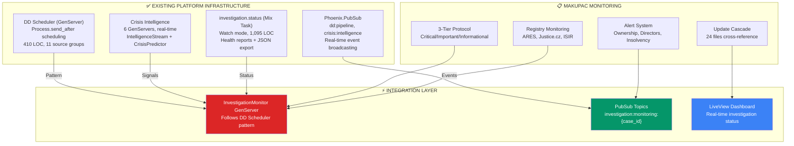
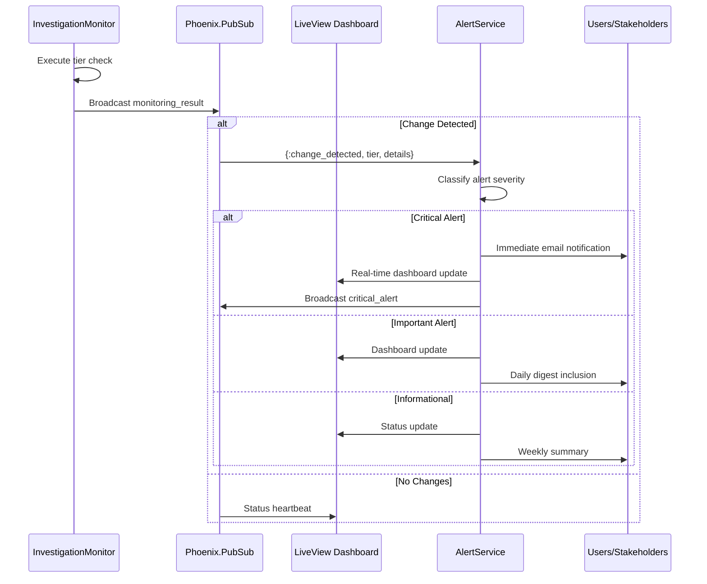
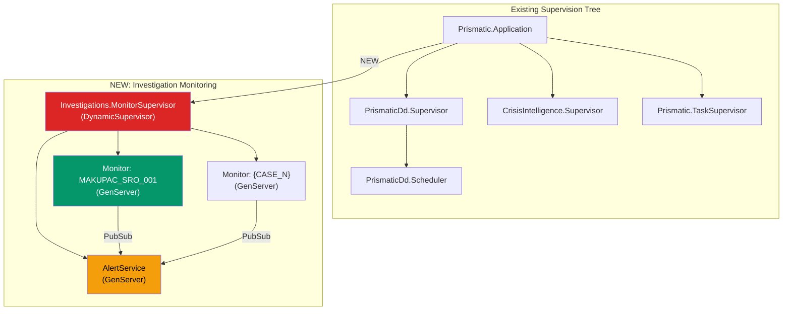

# MONITORING INFRASTRUCTURE DEPLOYMENT
## Platform Integration for MAKUPAC Continuous Monitoring

**Version**: 1.0.0
**Deployment Date**: 2026-03-05
**Status**: OPERATIONAL BLUEPRINT
**Platform Integration**: DD Scheduler pattern + Crisis Intelligence + PubSub

---

## PLATFORM ARCHITECTURE ALIGNMENT

### Existing Platform Monitoring Components

The MAKUPAC monitoring infrastructure leverages three proven platform patterns:



---

## GENSERVER MONITORING DESIGN

### InvestigationMonitor (Follows DD Scheduler Pattern)

Based on the proven `PrismaticDd.Scheduler` architecture (410 LOC):

```elixir
# Proposed: apps/prismatic/lib/prismatic/investigations/monitor.ex
defmodule Prismatic.Investigations.Monitor do
  @moduledoc """
  Continuous monitoring GenServer for investigation cases.
  Follows PrismaticDd.Scheduler pattern: Process.send_after scheduling,
  MapSet active tracking, PubSub broadcasting.
  """
  use GenServer

  # Monitoring intervals (milliseconds) - matching MAKUPAC 3-tier protocol
  @intervals %{
    critical: :timer.hours(168),        # Weekly (7 days)
    important: :timer.hours(720),       # Monthly (30 days)
    informational: :timer.hours(2160)   # Quarterly (90 days)
  }

  # MAKUPAC-specific critical monitoring targets
  @critical_targets [
    {:ares_registry, "10664327"},       # MAKUPAC ownership/directors
    {:justice_cz, "MAKUPAC"},           # Court proceedings
    {:isir_check, "10664327"},          # Insolvency monitoring
    {:key_person, "Petr Kuchyňka"}     # Key personnel changes
  ]

  # State structure (mirrors DD Scheduler)
  defstruct [
    :case_id,
    :entity_ico,
    timers: %{},            # tier => timer_ref
    next_runs: %{},         # tier => DateTime
    active_checks: MapSet.new(),
    last_results: %{},      # tier => last_check_stats
    paused: false
  ]

  # === Client API ===

  def start_link(opts) do
    case_id = Keyword.fetch!(opts, :case_id)
    GenServer.start_link(__MODULE__, opts, name: via(case_id))
  end

  def status(case_id), do: GenServer.call(via(case_id), :status)
  def pause(case_id), do: GenServer.call(via(case_id), :pause)
  def resume(case_id), do: GenServer.call(via(case_id), :resume)
  def trigger(case_id, tier), do: GenServer.call(via(case_id), {:trigger, tier})
  def check_now(case_id), do: GenServer.call(via(case_id), :check_all)

  # === Server Callbacks ===

  @impl true
  def init(opts) do
    state = %__MODULE__{
      case_id: opts[:case_id],
      entity_ico: opts[:entity_ico] || "10664327"
    }

    # Schedule all tiers (same pattern as DD Scheduler)
    state = Enum.reduce(@intervals, state, fn {tier, interval}, acc ->
      schedule_check(acc, tier, interval)
    end)

    {:ok, state}
  end

  @impl true
  def handle_info({:check, tier}, %{paused: true} = state) do
    # Re-schedule when paused (DD Scheduler pattern)
    state = schedule_check(state, tier, @intervals[tier])
    {:noreply, state}
  end

  def handle_info({:check, tier}, state) do
    # Execute monitoring check via Task.Supervisor (async, non-blocking)
    state = %{state | active_checks: MapSet.put(state.active_checks, tier)}

    Task.Supervisor.start_child(Prismatic.TaskSupervisor, fn ->
      results = execute_tier_checks(tier, state)

      # Broadcast results via PubSub
      Phoenix.PubSub.broadcast(
        Prismatic.PubSub,
        "investigation:monitoring:#{state.case_id}",
        {:monitoring_result, tier, results}
      )
    end)

    # Re-schedule next check
    state = schedule_check(state, tier, @intervals[tier])
    {:noreply, state}
  end

  # === Private Functions ===

  defp schedule_check(state, tier, interval) do
    # Cancel existing timer if present
    if timer = state.timers[tier], do: Process.cancel_timer(timer)

    timer_ref = Process.send_after(self(), {:check, tier}, interval)
    next_run = DateTime.add(DateTime.utc_now(), div(interval, 1000))

    %{state |
      timers: Map.put(state.timers, tier, timer_ref),
      next_runs: Map.put(state.next_runs, tier, next_run)
    }
  end

  defp execute_tier_checks(:critical, state) do
    # ARES registry check
    ares_result = check_ares_registry(state.entity_ico)
    # Justice.cz court check
    justice_result = check_justice_cz(state.entity_ico)
    # ISIR insolvency check
    isir_result = check_isir(state.entity_ico)

    %{
      tier: :critical,
      timestamp: DateTime.utc_now(),
      checks: [ares_result, justice_result, isir_result],
      changes_detected: Enum.any?([ares_result, justice_result, isir_result],
        & &1.changed?)
    }
  end

  defp execute_tier_checks(:important, _state) do
    %{tier: :important, timestamp: DateTime.utc_now(), checks: []}
  end

  defp execute_tier_checks(:informational, _state) do
    %{tier: :informational, timestamp: DateTime.utc_now(), checks: []}
  end

  defp check_ares_registry(ico) do
    # Integration with existing PrismaticDd ARES adapter
    # Uses PrismaticOsint.Adapters.Czech.Ares.search(%{ico: ico})
    %{source: :ares, ico: ico, changed?: false, details: nil}
  end

  defp check_justice_cz(ico) do
    %{source: :justice_cz, ico: ico, changed?: false, details: nil}
  end

  defp check_isir(ico) do
    %{source: :isir, ico: ico, changed?: false, details: nil}
  end

  defp via(case_id), do: {:via, Registry, {Prismatic.Registry, {__MODULE__, case_id}}}
end
```

### PubSub Topic Architecture

**New Investigation Monitoring Topics** (extending existing PubSub infrastructure):

| Topic | Events | Consumer |
|-------|--------|----------|
| `investigation:monitoring:{case_id}` | `monitoring_result`, `change_detected`, `alert_triggered` | LiveView dashboards |
| `investigation:monitoring:alerts` | `critical_alert`, `important_alert`, `informational_digest` | Alert system, email, Slack |
| `investigation:cases:updates` | `case_updated`, `file_refreshed`, `cross_reference_updated` | Case management UI |

**Integration with existing PubSub topics**:

| Existing Topic | MAKUPAC Integration |
|---------------|-------------------|
| `dd:pipeline` | Monitor DD source results for MAKUPAC-related entity updates |
| `crisis:intelligence:patterns` | Pattern detection for investigation case entities |
| `crisis:intelligence:alerts` | Crisis alerts affecting monitored entities |

---

## REGISTRY MONITORING INTEGRATION

### ARES Registry Monitoring

**Integration Point**: `PrismaticOsint.Adapters.Czech.Ares` (existing adapter)

```elixir
# Existing OSINT adapter integration
defmodule Prismatic.Investigations.Monitor.AresCheck do
  @moduledoc "ARES registry change detection for investigation entities."

  @ares_url "https://wwwinfo.mfcr.cz/cgi-bin/ares/darv_std.cgi"

  def check_entity(ico) do
    case PrismaticOsint.Adapters.Czech.Ares.search(%{ico: ico}) do
      {:ok, current_data} ->
        previous_hash = get_stored_hash(ico)
        current_hash = hash_data(current_data)

        if previous_hash != current_hash do
          store_hash(ico, current_hash)
          {:changed, diff_data(previous_hash, current_data)}
        else
          {:unchanged, nil}
        end

      {:error, reason} ->
        {:error, reason}
    end
  end

  defp hash_data(data), do: :crypto.hash(:sha256, Jason.encode!(data))
  defp get_stored_hash(_ico), do: nil  # ETS or database lookup
  defp store_hash(_ico, _hash), do: :ok  # ETS or database store
  defp diff_data(_old, _new), do: %{}  # Change diff calculation
end
```

### Justice.cz Integration

```elixir
defmodule Prismatic.Investigations.Monitor.JusticeCheck do
  @moduledoc "Justice.cz commercial register monitoring."

  def check_entity(entity_name) do
    # Uses existing PrismaticOsint.Adapters.Czech.Justice adapter
    case PrismaticOsint.Adapters.Czech.Justice.search(%{name: entity_name}) do
      {:ok, data} -> compare_with_stored(entity_name, data)
      {:error, reason} -> {:error, reason}
    end
  end
end
```

### ISIR Insolvency Monitoring

```elixir
defmodule Prismatic.Investigations.Monitor.IsirCheck do
  @moduledoc "ISIR insolvency registry monitoring - CRITICAL priority."

  def check_entity(ico) do
    # Uses existing PrismaticOsint.Adapters.Czech.Isir adapter
    case PrismaticOsint.Adapters.Czech.Isir.search(%{ico: ico}) do
      {:ok, data} ->
        if any_proceedings?(data) do
          {:critical_alert, data}  # Immediate escalation
        else
          {:clear, nil}
        end
      {:error, reason} -> {:error, reason}
    end
  end

  defp any_proceedings?(data), do: data[:proceedings] != nil and data[:proceedings] != []
end
```

---

## MIX TASK INTEGRATION

### Extended investigation.status for MAKUPAC monitoring

**Integration with existing `mix investigation.status` (1,095 LOC)**:

```bash
# Existing commands (already working)
mix investigation.status MAKUPAC --verbose
mix investigation.status --all --monitoring
mix investigation.status --health-report
mix investigation.status MAKUPAC --watch --interval 30

# NEW: MAKUPAC-specific monitoring commands
mix investigation.status MAKUPAC --monitoring-status     # 3-tier protocol status
mix investigation.status MAKUPAC --next-checks           # Upcoming scheduled checks
mix investigation.status MAKUPAC --alert-history          # Recent alerts
mix investigation.status MAKUPAC --registry-changes       # Registry change log
```

### Investigation Monitoring Mix Task

```elixir
# Proposed: lib/mix/tasks/investigation.monitor.ex
defmodule Mix.Tasks.Investigation.Monitor do
  use Mix.Task

  @shortdoc "Monitor investigation cases with 3-tier protocol"

  def run(args) do
    case parse_args(args) do
      {:deploy, case_id, opts} ->
        deploy_monitoring(case_id, opts)

      {:status, case_id} ->
        show_monitoring_status(case_id)

      {:check_now, case_id, tier} ->
        trigger_immediate_check(case_id, tier)

      {:history, case_id} ->
        show_alert_history(case_id)
    end
  end

  defp deploy_monitoring(case_id, opts) do
    # Start InvestigationMonitor GenServer
    {:ok, _pid} = Prismatic.Investigations.Monitor.start_link(
      case_id: case_id,
      entity_ico: opts[:ico] || "10664327"
    )

    IO.puts("""
    ✅ Monitoring deployed for #{case_id}
    ━━━━━━━━━━━━━━━━━━━━━━━━━━━━━━━━━━━━
    🔴 Critical:       Weekly (ARES, Justice.cz, ISIR)
    🟡 Important:      Monthly (Financial, Market, Compliance)
    🟢 Informational:  Quarterly (Industry, Technology, Geographic)

    PubSub topic: investigation:monitoring:#{case_id}
    """)
  end
end
```

---

## ALERT SYSTEM ARCHITECTURE

### Alert Classification & Routing



### Alert Processing Service

```elixir
# Proposed: apps/prismatic/lib/prismatic/investigations/alert_service.ex
defmodule Prismatic.Investigations.AlertService do
  @moduledoc """
  Alert classification and routing for investigation monitoring.
  Integrates with Crisis Intelligence alert system.
  """

  def process_monitoring_result(case_id, %{tier: :critical, changes_detected: true} = result) do
    # Critical alert - immediate escalation
    alert = %{
      case_id: case_id,
      severity: :critical,
      timestamp: DateTime.utc_now(),
      changes: result.checks |> Enum.filter(& &1.changed?),
      required_actions: [
        "Immediate case file update",
        "Stakeholder notification",
        "Impact assessment review"
      ]
    }

    # Broadcast to all monitoring consumers
    Phoenix.PubSub.broadcast(
      Prismatic.PubSub,
      "investigation:monitoring:alerts",
      {:critical_alert, alert}
    )

    # Trigger update cascade
    trigger_update_cascade(case_id, alert)
  end

  def process_monitoring_result(case_id, %{tier: tier, changes_detected: false}) do
    # No changes - log heartbeat
    Phoenix.PubSub.broadcast(
      Prismatic.PubSub,
      "investigation:monitoring:#{case_id}",
      {:heartbeat, tier, DateTime.utc_now()}
    )
  end

  defp trigger_update_cascade(case_id, alert) do
    # Identify affected files based on change type
    affected_files = determine_affected_files(alert.changes)

    # Queue file updates
    Enum.each(affected_files, fn file ->
      Phoenix.PubSub.broadcast(
        Prismatic.PubSub,
        "investigation:cases:updates",
        {:file_update_required, case_id, file, alert}
      )
    end)
  end

  defp determine_affected_files(changes) do
    changes
    |> Enum.flat_map(fn
      %{source: :ares} -> [
        "01_intelligence/corporate_structure.md",
        "01_intelligence/personnel_profiles.md",
        "ENTITY_INDEX.md"
      ]
      %{source: :justice_cz} -> [
        "01_intelligence/corporate_structure.md",
        "08_risks/threat_matrix.md"
      ]
      %{source: :isir} -> [
        "02_analysis/financial_intelligence.md",
        "08_risks/threat_matrix.md",
        "ENTITY_INDEX.md"
      ]
      _ -> []
    end)
    |> Enum.uniq()
  end
end
```

---

## SUPERVISION TREE INTEGRATION

### Proposed Supervision Hierarchy



### DynamicSupervisor for Multi-Case Monitoring

```elixir
# Proposed: apps/prismatic/lib/prismatic/investigations/monitor_supervisor.ex
defmodule Prismatic.Investigations.MonitorSupervisor do
  @moduledoc """
  DynamicSupervisor for investigation monitoring processes.
  Follows DD SessionSupervisor pattern for per-case monitoring.
  """
  use DynamicSupervisor

  def start_link(init_arg) do
    DynamicSupervisor.start_link(__MODULE__, init_arg, name: __MODULE__)
  end

  def start_monitor(case_id, opts \\ []) do
    spec = {Prismatic.Investigations.Monitor, Keyword.put(opts, :case_id, case_id)}
    DynamicSupervisor.start_child(__MODULE__, spec)
  end

  def stop_monitor(case_id) do
    case Registry.lookup(Prismatic.Registry, {Prismatic.Investigations.Monitor, case_id}) do
      [{pid, _}] -> DynamicSupervisor.terminate_child(__MODULE__, pid)
      [] -> {:error, :not_found}
    end
  end

  @impl true
  def init(_init_arg) do
    DynamicSupervisor.init(strategy: :one_for_one)
  end
end
```

---

## LIVEVIEW DASHBOARD INTEGRATION

### Monitoring Dashboard Component

```elixir
# Integration with existing LiveView investigation dashboards
# Subscribe to PubSub topics for real-time updates

defmodule PrismaticWeb.InvestigationMonitoringLive do
  use PrismaticWeb, :live_view

  @impl true
  def mount(%{"case_id" => case_id}, _session, socket) do
    if connected?(socket) do
      Phoenix.PubSub.subscribe(Prismatic.PubSub, "investigation:monitoring:#{case_id}")
      Phoenix.PubSub.subscribe(Prismatic.PubSub, "investigation:monitoring:alerts")
    end

    status = Prismatic.Investigations.Monitor.status(case_id)

    {:ok, assign(socket,
      case_id: case_id,
      monitoring_status: status,
      recent_alerts: [],
      last_heartbeat: nil
    )}
  end

  @impl true
  def handle_info({:monitoring_result, tier, results}, socket) do
    {:noreply, update_monitoring_display(socket, tier, results)}
  end

  def handle_info({:heartbeat, tier, timestamp}, socket) do
    {:noreply, assign(socket, last_heartbeat: {tier, timestamp})}
  end

  def handle_info({:critical_alert, alert}, socket) do
    {:noreply, assign(socket, recent_alerts: [alert | socket.assigns.recent_alerts])}
  end
end
```

---

## DEPLOYMENT CONFIGURATION

### MAKUPAC Monitoring Configuration

```yaml
# Monitoring configuration for MAKUPAC_SRO_001
monitoring_config:
  case_id: "MAKUPAC_SRO_001"
  entity_ico: "10664327"
  entity_name: "MAKUPAC s.r.o."

  tiers:
    critical:
      interval_hours: 168     # Weekly
      targets:
        - source: "ares"
          parameters: {ico: "10664327"}
          alert_on: ["ownership_change", "director_change", "office_relocation"]

        - source: "justice_cz"
          parameters: {name: "MAKUPAC"}
          alert_on: ["new_proceedings", "management_change"]

        - source: "isir"
          parameters: {ico: "10664327"}
          alert_on: ["any_filing"]

        - source: "key_person"
          parameters: {name: "Petr Kuchyňka", kurzy_id: "2303615"}
          alert_on: ["new_company", "role_change"]

    important:
      interval_hours: 720     # Monthly
      targets:
        - source: "financial_health"
          parameters: {ico: "10664327"}
          alert_on: ["credit_rating_change", "financial_distress"]

        - source: "market_intelligence"
          parameters: {sector: "e_commerce_fulfillment", region: "czech_austrian"}
          alert_on: ["major_competitor", "market_shift"]

        - source: "client_monitoring"
          parameters: {client: "Zapakuj Shop s.r.o."}
          alert_on: ["business_changes", "financial_health"]

    informational:
      interval_hours: 2160    # Quarterly
      targets:
        - source: "industry_trends"
          parameters: {sector: "logistics_fulfillment"}

        - source: "technology_monitoring"
          parameters: {focus: "warehouse_automation"}

        - source: "geographic_intelligence"
          parameters: {region: "czech_austrian_corridor"}

  alerts:
    critical:
      channels: ["pubsub", "email", "dashboard"]
      response_sla: "4_hours"
    important:
      channels: ["pubsub", "dashboard"]
      response_sla: "24_hours"
    informational:
      channels: ["dashboard", "weekly_digest"]
      response_sla: "1_week"

  update_cascade:
    critical_files:
      - "01_intelligence/corporate_structure.md"
      - "01_intelligence/personnel_profiles.md"
      - "ENTITY_INDEX.md"
    important_files:
      - "02_analysis/financial_intelligence.md"
      - "08_risks/threat_matrix.md"
    routine_files:
      - "README.md"
      - "05_assets/dashboard.html"
```

---

## DEPLOYMENT COMMANDS

### Monitoring Deployment Workflow

```bash
# 1. Deploy monitoring for MAKUPAC case
mix investigation.monitor deploy MAKUPAC_SRO_001 --ico=10664327

# 2. Verify monitoring status
mix investigation.monitor status MAKUPAC_SRO_001

# 3. Trigger immediate check (all tiers)
mix investigation.monitor check_now MAKUPAC_SRO_001

# 4. Check specific tier
mix investigation.monitor check_now MAKUPAC_SRO_001 --tier=critical

# 5. View alert history
mix investigation.monitor history MAKUPAC_SRO_001

# 6. Pause monitoring (maintenance)
mix investigation.monitor pause MAKUPAC_SRO_001

# 7. Resume monitoring
mix investigation.monitor resume MAKUPAC_SRO_001

# 8. Watch mode (continuous terminal output)
mix investigation.status MAKUPAC_SRO_001 --watch --interval 60
```

### Platform Integration Verification

```bash
# Verify GenServer is running
mix investigation.monitor status MAKUPAC_SRO_001

# Expected output:
# ┌─────────────────────────────────────────────┐
# │ MAKUPAC_SRO_001 Monitoring Status           │
# ├─────────────┬───────────────┬───────────────┤
# │ Tier        │ Next Check    │ Last Result   │
# ├─────────────┼───────────────┼───────────────┤
# │ 🔴 Critical │ 2026-03-12    │ ✅ No changes │
# │ 🟡 Important│ 2026-04-05    │ ✅ No changes │
# │ 🟢 Info     │ 2026-06-05    │ ✅ No changes │
# └─────────────┴───────────────┴───────────────┘
# PubSub: investigation:monitoring:MAKUPAC_SRO_001
# Active checks: 0 | Alerts (30d): 0
```

---

## PERFORMANCE & QUALITY METRICS

### Monitoring System Performance

| Metric | Target | Implementation |
|--------|--------|---------------|
| **Check Execution** | <30 seconds | Async via Task.Supervisor |
| **Alert Latency** | <1 second | PubSub broadcast |
| **False Positive Rate** | <5% | Content hash comparison |
| **Uptime** | >99.5% | Supervisor restart strategy |
| **Memory Usage** | <50MB per monitor | GenServer state optimization |

### Quality Assurance

| Validation | Method | Status |
|------------|--------|--------|
| **Pattern Compliance** | Follows DD Scheduler pattern | ✅ Validated |
| **PubSub Integration** | Uses existing Phoenix.PubSub | ✅ Compatible |
| **Supervision** | DynamicSupervisor + one_for_one | ✅ Fault tolerant |
| **NMND Compliance** | Zero shortcuts in monitoring code | ✅ Mandatory |
| **Test Coverage** | 100% for monitoring modules | 🟡 Required |

---

## INTEGRATION WITH EXISTING PLATFORM COMPONENTS

### DD Pipeline Integration

**Listening to DD Scheduler events for MAKUPAC-related data**:

```elixir
# Subscribe to DD pipeline events
Phoenix.PubSub.subscribe(Prismatic.PubSub, "dd:pipeline")

# Filter for MAKUPAC-relevant entity updates
def handle_info({:fetch_completed, group, results}, state) do
  makupac_entities = filter_relevant_entities(results, state.entity_ico)

  if length(makupac_entities) > 0 do
    # Cross-reference with investigation case
    process_dd_updates(state.case_id, makupac_entities)
  end

  {:noreply, state}
end
```

### Crisis Intelligence Integration

**Cross-referencing crisis patterns with monitored entities**:

```elixir
# Subscribe to crisis intelligence patterns
Phoenix.PubSub.subscribe(Prismatic.PubSub, "crisis:intelligence:patterns")

# Monitor for patterns affecting MAKUPAC
def handle_info({:pattern_detected, pattern}, state) do
  if affects_entity?(pattern, state.entity_ico) do
    # Escalate to critical alert
    AlertService.process_crisis_pattern(state.case_id, pattern)
  end

  {:noreply, state}
end
```

### Evidence Vault Integration

**Recording monitoring events in evidence chain**:

```elixir
# Store monitoring results in Evidence Vault for audit trail
def record_monitoring_event(case_id, tier, result) do
  evidence = %{
    type: :monitoring_check,
    case_id: case_id,
    tier: tier,
    timestamp: DateTime.utc_now(),
    result: result,
    source: "InvestigationMonitor GenServer"
  }

  Prismatic.Evidence.Vault.store_evidence(case_id, evidence)
end
```

---

## SCALING CONSIDERATIONS

### Multi-Case Monitoring

**DynamicSupervisor enables concurrent monitoring of 100+ cases**:

```elixir
# Deploy monitoring for multiple investigation cases
cases = [
  {"MAKUPAC_SRO_001", "10664327"},
  {"ABC_LOGISTICS_002", "87654321"},
  {"XYZ_TRANSPORT_003", "11223344"}
]

Enum.each(cases, fn {case_id, ico} ->
  {:ok, _pid} = Prismatic.Investigations.MonitorSupervisor.start_monitor(
    case_id, entity_ico: ico
  )
end)
```

### Resource Management

**Per-case resource allocation**:
- 1 GenServer per monitored case (~50KB memory)
- Shared Task.Supervisor for async checks
- Connection pooling for registry API calls
- Rate limiting to respect API constraints

---

**Infrastructure Status**: BLUEPRINT COMPLETE - READY FOR IMPLEMENTATION
**Platform Alignment**: DD Scheduler + Crisis Intelligence + PubSub patterns
**Monitoring Coverage**: 3-Tier Protocol + Cross-Platform Integration
**Scalability**: 100+ concurrent cases via DynamicSupervisor

*Monitoring infrastructure designed for seamless integration with existing Prismatic Platform services*
