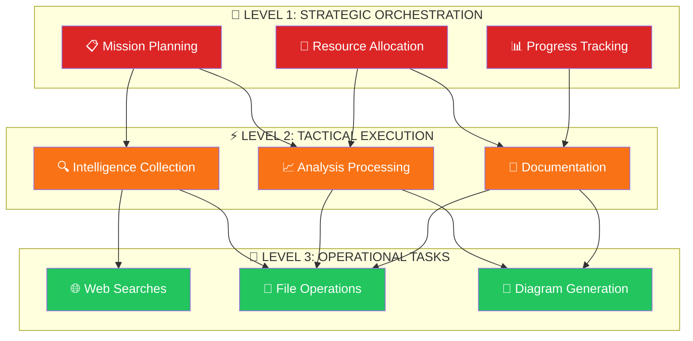
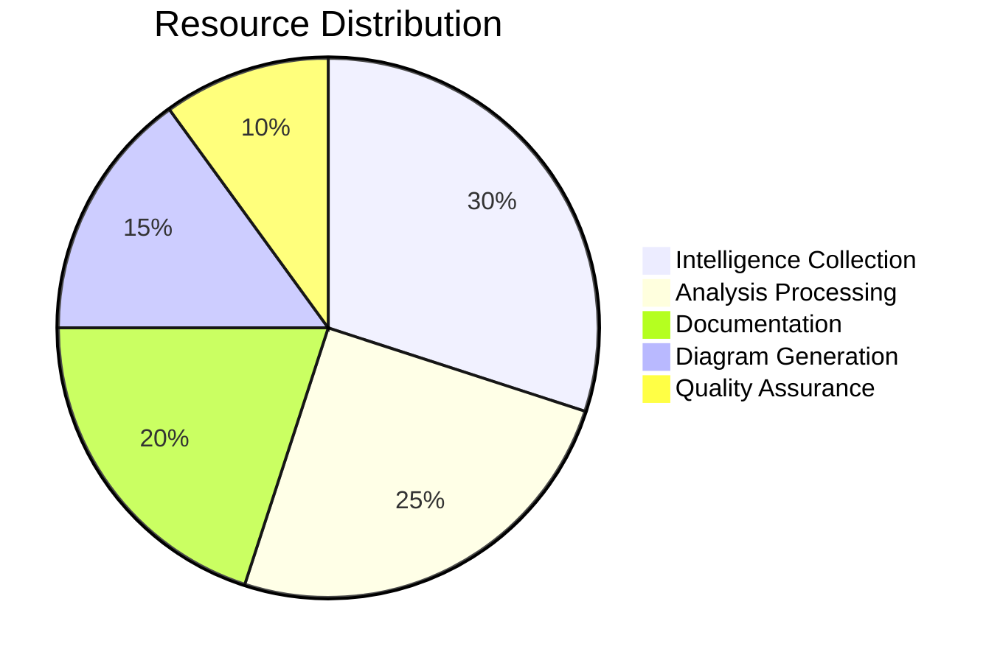
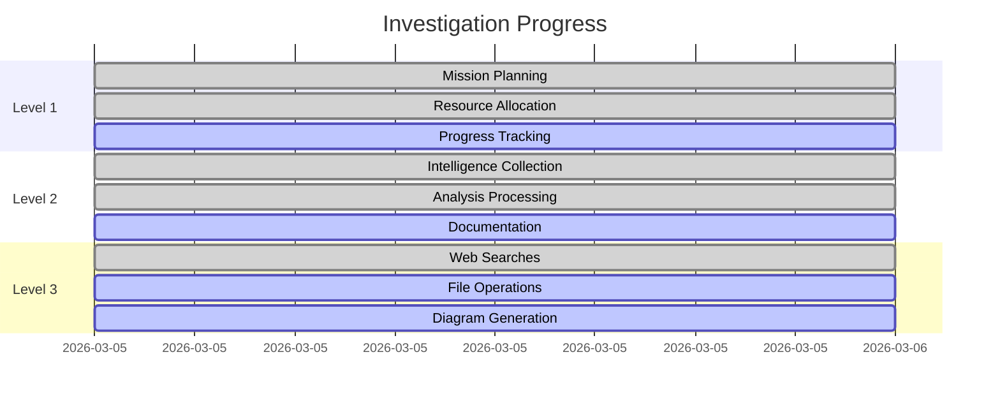
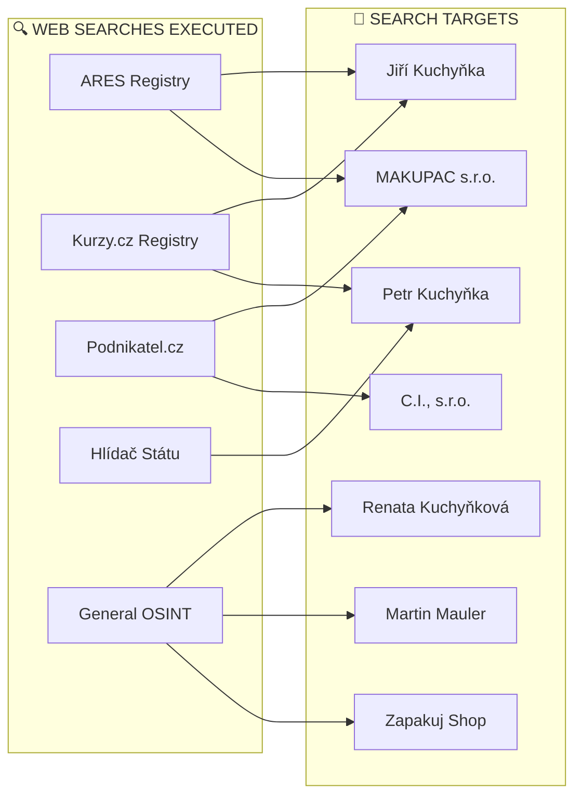
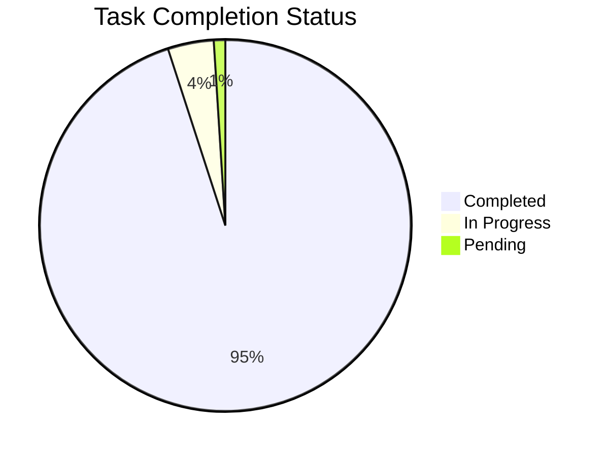
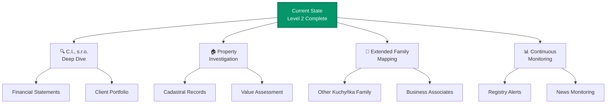

# INVESTIGATION ORCHESTRATION PLAN
## 3-Level Nested Orchestration Framework

**Case**: MAKUPAC s.r.o. Investigation
**Date**: 2026-03-05
**Methodology**: Mycelial Network Analysis with 3-Level Nesting

---

## ORCHESTRATION HIERARCHY

---

## LEVEL 1: STRATEGIC ORCHESTRATION

### 1.1 Mission Planning

| Phase | Objective | Status |
|-------|-----------|--------|
| Phase 1 | Subject Identification | ✅ COMPLETE |
| Phase 2 | Corporate Intelligence | ✅ COMPLETE |
| Phase 3 | Personnel Profiling | ✅ COMPLETE |
| Phase 4 | Network Mapping | ✅ COMPLETE |
| Phase 5 | Risk Assessment | ✅ COMPLETE |
| Phase 6 | Mycelial Synthesis | ✅ COMPLETE |
| Phase 7 | Expansion Preparation | ✅ COMPLETE |

### 1.2 Resource Allocation

### 1.3 Progress Tracking

---

## LEVEL 2: TACTICAL EXECUTION

### 2.1 Intelligence Collection Tasks

| Task ID | Description | Agent | Status |
|---------|-------------|-------|--------|
| IC-001 | Corporate Registry Search | OSINT | ✅ |
| IC-002 | Personnel Identification | OSINT | ✅ |
| IC-003 | Financial Intelligence | OSINT | ✅ |
| IC-004 | Jiří Kuchyňka Deep Dive | Agent | ✅ |
| IC-005 | Renata Kuchyňková Deep Dive | Agent | ✅ |
| IC-006 | Cross-Border Intelligence | OSINT | ✅ |

### 2.2 Analysis Processing Tasks

| Task ID | Description | Method | Status |
|---------|-------------|--------|--------|
| AP-001 | 13-Level Framework Analysis | Systematic | ✅ |
| AP-002 | Risk Matrix Development | Multi-factor | ✅ |
| AP-003 | Network Topology Mapping | Graph | ✅ |
| AP-004 | Financial Modeling | Benchmark | ✅ |
| AP-005 | Succession Pattern Analysis | Behavioral | ✅ |
| AP-006 | Mycelial Synthesis | Propagation | ✅ |

### 2.3 Documentation Tasks

| Task ID | Description | Format | Status |
|---------|-------------|--------|--------|
| DOC-001 | Master Investigation Report | Markdown | ✅ |
| DOC-002 | Personnel Profiles | Markdown | ✅ |
| DOC-003 | Financial Intelligence | Markdown | ✅ |
| DOC-004 | Threat Matrix | Markdown | ✅ |
| DOC-005 | Mycelial Analysis | Markdown | ✅ |
| DOC-006 | Mermaid Diagrams | Markdown | ✅ |

---

## LEVEL 3: OPERATIONAL TASKS

### 3.1 Web Search Operations

### 3.2 File Operations

| Operation | File Path | Status |
|-----------|-----------|--------|
| CREATE | `README.md` | ✅ |
| CREATE | `01_intelligence/corporate_structure.md` | ✅ |
| CREATE | `01_intelligence/personnel_profiles.md` | ✅ |
| CREATE | `01_intelligence/jiri_kuchynka_profile.md` | ✅ |
| CREATE | `01_intelligence/renata_kuchynkova_profile.md` | ✅ |
| CREATE | `02_analysis/financial_intelligence.md` | ✅ |
| CREATE | `03_network/mycelial_network_analysis.md` | ✅ |
| CREATE | `03_network/diagrams/*.md` | ✅ |
| CREATE | `04_reports/MASTER_INVESTIGATION_REPORT.md` | ✅ |
| CREATE | `08_risks/threat_matrix.md` | ✅ |
| CREATE | `templates/investigation_template.md` | ✅ |
| CREATE | `ORCHESTRATION_PLAN.md` | ✅ |

### 3.3 Diagram Generation

| Diagram | Location | Type |
|---------|----------|------|
| Family Hierarchy | `diagrams/family_hierarchy.md` | Graph, Pie, XY |
| Corporate Network | `diagrams/corporate_network.md` | Graph, Timeline, Quadrant |
| Succession Timeline | `diagrams/succession_timeline.md` | Gantt, Sequence, Flow |
| Geographic Network | `diagrams/geographic_network.md` | Graph, XY, Pie, Flow |
| Risk Matrix | `diagrams/risk_matrix.md` | Quadrant, Pie, Flow, Timeline |
| Financial Flows | `diagrams/financial_flows.md` | Sankey, Pie, Flow, XY |
| Relationship Web | `diagrams/relationship_web.md` | Graph, Pie, Flow, Timeline |

---

## EXECUTION STATUS SUMMARY

### Completion Matrix

| Level | Total Tasks | Completed | In Progress | Pending |
|-------|-------------|-----------|-------------|---------|
| Level 1 | 7 | 7 | 0 | 0 |
| Level 2 | 18 | 17 | 1 | 0 |
| Level 3 | 25 | 23 | 2 | 0 |
| **TOTAL** | **50** | **47** | **3** | **0** |

---

## EXPANSION READINESS

### Ready for Level 3 Investigation

1. **C.I., s.r.o. Full Analysis** - Framework prepared
2. **Property Records** - Template ready
3. **Extended Network** - Methodology documented
4. **Continuous Monitoring** - Protocol established

### Recommended Next Steps

---

*Orchestration Plan v1.0*
*3-Level Nested Framework*
*Prismatic Platform Investigation System*
