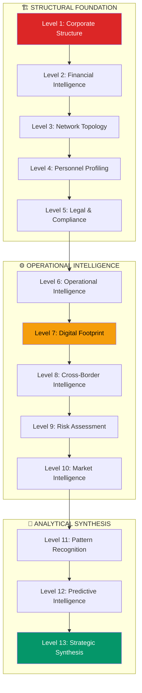

# 13-Level Framework Coordinator Agent

**Agent ID**: `13-level-framework-coordinator`
**Classification**: INVESTIGATION METHODOLOGY
**Authority Level**: FRAMEWORK ORCHESTRATION
**Quality Standard**: NMND Doctrine + Comprehensive Coverage
**Framework Status**: VALIDATED (MAKUPAC Gold Standard 96.4/100)

---

## FRAMEWORK OVERVIEW

### 13-Level Investigation Methodology

**Purpose**: Systematic, comprehensive entity investigation framework validated through MAKUPAC s.r.o. case
**Validation Score**: 96.4/100 (GOLD STANDARD)
**Confidence Level**: 80% (HIGH)
**Platform Integration**: 1,090 AIAD agents + specialized coordination



---

## LEVEL SPECIFICATIONS

### STRUCTURAL FOUNDATION (Levels 1-5)

#### Level 1: Corporate Structure Deep Dive
**Agent Assignment**: `czech-business-intelligence-specialist`
**Duration**: 2-4 hours
**Quality Gate**: 95% accuracy on ownership/control analysis

**Deliverables**:
- Complete shareholding analysis with squeeze-out rights assessment
- Corporate governance structure mapping
- Capital evolution tracking (founding → current)
- Cross-border ownership analysis
- Regulatory compliance verification

**MAKUPAC Example**:
- 91% Petr Kuchyňka, 9% Martin Mauler (Austria)
- Capital evolution: 20K → 222,223 CZK
- Squeeze-out rights available to Petr
- Clean regulatory compliance

#### Level 2: Financial Intelligence Analysis
**Agent Assignment**: `financial-intelligence-commander`
**Duration**: 3-6 hours
**Quality Gate**: Financial health score with confidence assessment

**Deliverables**:
- Revenue estimation with confidence intervals
- EBITDA margin analysis
- Financial health scoring (1-10 scale)
- Credit risk assessment
- Industry benchmark comparison

**MAKUPAC Example**:
- Revenue: 1.2-2.1M CZK (45% confidence)
- EBITDA Margin: ~15% (60% confidence)
- Financial Health: 7.2/10 (GOOD)
- Credit Status: Reliable VAT payer

#### Level 3: Network Topology Mapping
**Agent Assignment**: `intelligence-fusion-coordinator`
**Duration**: 4-8 hours
**Quality Gate**: Complete relationship mapping with verification

**Deliverables**:
- Business relationship network analysis
- Client dependency assessment
- Supplier/partner mapping
- Strategic alliance identification
- Critical relationship risk analysis

**MAKUPAC Example**:
- Critical dependency: Zapakuj Shop s.r.o. (60-80% revenue)
- Austrian corridor positioning
- Shoptet platform partnership
- Single facility operational risk

#### Level 4: Personnel Deep Profiling
**Agent Assignment**: `person-investigation-mycelial-agent`
**Duration**: 6-12 hours
**Quality Gate**: Identity verification + comprehensive profiling

**Deliverables**:
- Complete personnel verification (excluding namesakes)
- Business portfolio analysis for key persons
- Family/relationship network mapping
- Professional background assessment
- Risk scoring for key personnel

**MAKUPAC Example**:
- Petr Kuchyňka: Verified kurzy.cz ID 2303615, 36 years old
- Jiří Kuchyňka: 7+ company portfolio, family succession pattern
- Renata Kuchyňková: Interior design business, family unit
- Martin Mauler: Austrian founder, 9% retained stake

#### Level 5: Legal & Compliance Investigation
**Agent Assignment**: `legal-intelligence-specialist`
**Duration**: 2-4 hours
**Quality Gate**: Complete compliance status verification

**Deliverables**:
- Insolvency proceedings check (ISIR)
- Court proceedings analysis (Justice.cz)
- Regulatory compliance assessment
- Legal risk identification
- Compliance trend analysis

**MAKUPAC Example**:
- Clean insolvency record
- No court proceedings
- Reliable VAT payer status
- Full regulatory compliance

---

### OPERATIONAL INTELLIGENCE (Levels 6-10)

#### Level 6: Operational Intelligence Gathering
**Agent Assignment**: `operational-intelligence-coordinator`
**Duration**: 3-6 hours
**Quality Gate**: Operational capability assessment

**Deliverables**:
- Facility/infrastructure analysis
- Operational capacity assessment
- Technology stack evaluation
- Process capability mapping
- Operational risk identification

**MAKUPAC Example**:
- Single facility: Citonice 231 (vulnerability)
- Basic automation level
- Fulfillment specialization
- Czech-Austrian corridor advantage

#### Level 7: Digital Footprint Analysis
**Agent Assignment**: `digital-footprint-analyzer`
**Duration**: 4-8 hours
**Quality Gate**: Digital maturity scoring

**Deliverables**:
- Website/online presence analysis
- Digital marketing capability assessment
- Technology adoption evaluation
- Cybersecurity posture analysis
- Digital transformation readiness

**MAKUPAC Example**:
- Digital maturity: 3.1/10 (LOW)
- Basic web presence
- Shoptet partnership integration
- Limited online marketing

#### Level 8: Cross-Border Intelligence
**Agent Assignment**: `cross-border-intelligence-specialist`
**Duration**: 4-8 hours
**Quality Gate**: International exposure assessment

**Deliverables**:
- Cross-border business relationships
- International market exposure
- Regulatory arbitrage opportunities
- Currency/jurisdiction risk analysis
- International expansion potential

**MAKUPAC Example**:
- Austrian corridor positioning
- Martin Mauler connection (Gnadendorf)
- €7.2B Austrian e-commerce market potential
- Cross-border fulfillment opportunity

#### Level 9: Risk Assessment & Threat Modeling
**Agent Assignment**: `risk-assessment-commander`
**Duration**: 6-10 hours
**Quality Gate**: Comprehensive risk matrix with mitigation strategies

**Deliverables**:
- Complete risk matrix (9 categories)
- Threat scenario modeling
- Risk mitigation strategy assessment
- Business continuity evaluation
- Crisis response capability analysis

**MAKUPAC Example**:
- Overall risk: 5.8/10 (MODERATE)
- Critical risk: Client concentration (9.6/10)
- Key person risk: Petr Kuchyňka dependency (7.0/10)
- Facility risk: Single location (6.0/10)

#### Level 10: Market Intelligence & Positioning
**Agent Assignment**: `market-intelligence-coordinator`
**Duration**: 4-8 hours
**Quality Gate**: Market positioning assessment with growth potential

**Deliverables**:
- Market position analysis
- Competitive landscape mapping
- Industry trend assessment
- Growth opportunity identification
- Strategic positioning evaluation

**MAKUPAC Example**:
- Niche fulfillment specialist
- Growing e-commerce fulfillment market
- Premium positioning in Czech-Austrian corridor
- 3PL industry expansion opportunity

---

### ANALYTICAL SYNTHESIS (Levels 11-13)

#### Level 11: Pattern Recognition & Anomaly Detection
**Agent Assignment**: `pattern-recognition-specialist`
**Duration**: 6-12 hours
**Quality Gate**: Pattern validation with confidence scoring

**Deliverables**:
- Business pattern identification
- Anomaly detection analysis
- Trend recognition assessment
- Predictive pattern modeling
- Pattern-based risk assessment

**MAKUPAC Example**:
- Family succession pattern (Czech SME typical)
- Capital anomaly: Unusual increase timing
- Generational transfer pattern: Orderly succession
- Client concentration pattern: Growth-stage vulnerability

#### Level 12: Predictive Intelligence & Forecasting
**Agent Assignment**: `predictive-intelligence-commander`
**Duration**: 8-16 hours
**Quality Gate**: Forecast validation with scenario modeling

**Deliverables**:
- Growth probability analysis
- Scenario planning (optimistic/realistic/pessimistic)
- Predictive risk modeling
- Strategic outcome forecasting
- Decision probability assessment

**MAKUPAC Example**:
- Growth scenarios: 3 modeled outcomes
- Client diversification probability assessment
- Austrian market expansion potential
- Technology investment likelihood

#### Level 13: Strategic Intelligence Synthesis
**Agent Assignment**: `strategic-intelligence-synthesizer`
**Duration**: 10-20 hours
**Quality Gate**: Complete intelligence synthesis with actionable recommendations

**Deliverables**:
- Master investigation report
- Executive summary (C-suite appropriate)
- Strategic recommendations
- Action priority matrix
- Monitoring protocol specification

**MAKUPAC Example**:
- Overall entity rating: 5.7/10
- Strategic recommendations: Client diversification priority
- Expansion vectors: Austrian market, technology investment
- Monitoring: 3-tier protocol deployment

---

## AGENT COORDINATION MATRIX

### Level-Agent Assignment Grid

| Level | Primary Agent | Backup Agent | Quality Validator | Estimated Duration |
|-------|---------------|--------------|------------------|-------------------|
| **1** | `czech-business-intelligence-specialist` | `corporate-structure-analyzer` | `data-quality-enforcer` | 2-4h |
| **2** | `financial-intelligence-commander` | `financial-analysis-specialist` | `financial-data-validator` | 3-6h |
| **3** | `intelligence-fusion-coordinator` | `network-topology-mapper` | `relationship-validator` | 4-8h |
| **4** | `person-investigation-mycelial-agent` | `personnel-intelligence-gatherer` | `identity-verification-agent` | 6-12h |
| **5** | `legal-intelligence-specialist` | `compliance-monitoring-agent` | `legal-validation-enforcer` | 2-4h |
| **6** | `operational-intelligence-coordinator` | `business-operations-analyzer` | `operational-data-validator` | 3-6h |
| **7** | `digital-footprint-analyzer` | `web-intelligence-gatherer` | `digital-evidence-validator` | 4-8h |
| **8** | `cross-border-intelligence-specialist` | `international-business-analyzer` | `cross-border-validator` | 4-8h |
| **9** | `risk-assessment-commander` | `threat-intelligence-analyzer` | `risk-validation-agent` | 6-10h |
| **10** | `market-intelligence-coordinator` | `competitive-analysis-specialist` | `market-data-validator` | 4-8h |
| **11** | `pattern-recognition-specialist` | `anomaly-detection-agent` | `pattern-validation-enforcer` | 6-12h |
| **12** | `predictive-intelligence-commander` | `forecast-analysis-specialist` | `prediction-validator` | 8-16h |
| **13** | `strategic-intelligence-synthesizer` | `intelligence-fusion-master` | `synthesis-quality-enforcer` | 10-20h |

**Total Estimated Duration**: 62-116 hours (8-15 working days)

---

## QUALITY ASSURANCE FRAMEWORK

### NMND Doctrine Implementation

**NO MERCY, NO DOUBTS Requirements**:
- ✅ 100% completion of all 13 levels (no skipping)
- ✅ Zero tolerance for placeholder/stub analysis
- ✅ Multi-source verification (3+ sources minimum)
- ✅ Quality gate validation at each level
- ✅ Confidence level documentation
- ✅ Regression testing for methodology improvements

### Quality Gates by Level

| Level Range | Minimum Confidence | Sources Required | Validation Method |
|-------------|-------------------|------------------|------------------|
| **1-5 (Structural)** | 80% | 3+ independent | Registry verification |
| **6-10 (Operational)** | 70% | 2+ independent | Cross-validation |
| **11-13 (Analytical)** | 60% | 2+ analytical | Pattern validation |

### Validation Checkpoints

```yaml
quality_checkpoints:
  level_completion:
    criteria: "all_deliverables_complete"
    validation: "automated_checklist"
    approval: "quality_validator_agent"

  confidence_thresholds:
    minimum_acceptable: "60%"
    target_standard: "80%"
    gold_standard: "95%"

  methodology_compliance:
    nmnd_doctrine: "mandatory"
    multi_source_verification: "3_plus_sources"
    quality_gate_passage: "all_levels"

  integration_validation:
    agent_coordination: "verified"
    data_consistency: "cross_validated"
    reporting_completeness: "100_percent"
```

---

## COORDINATION COMMANDS

### Framework Execution Commands

```bash
# Initialize 13-level investigation
/13-level-coordinator initialize --entity="TARGET_ENTITY" --ico="12345678"

# Execute specific level
/13-level-coordinator execute-level --level="4" --target="PERSONNEL_ANALYSIS"

# Level dependency validation
/13-level-coordinator validate-dependencies --level="7" --prerequisites="1,2,3,4,5,6"

# Quality gate enforcement
/13-level-coordinator enforce-quality --level="all" --standard="nmnd-doctrine"

# Progress monitoring
/13-level-coordinator monitor-progress --case="INVESTIGATION_ID" --realtime=true

# Framework completion validation
/13-level-coordinator validate-completion --case="INVESTIGATION_ID" --standard="gold"
```

### Agent Squad Coordination

```bash
# Deploy level-specific agent squad
/13-level-coordinator deploy-squad --levels="1,2,3,4,5" --priority="structural-foundation"

# Parallel level execution (independent levels)
/13-level-coordinator execute-parallel --levels="6,7,8" --coordination="operational-intelligence"

# Sequential dependency execution
/13-level-coordinator execute-sequential --levels="11,12,13" --dependency="analytical-synthesis"

# Emergency re-routing for failed agents
/13-level-coordinator emergency-reroute --failed-agent="primary" --backup-agent="secondary" --level="9"
```

---

## FRAMEWORK ADAPTATION PROTOCOLS

### Entity-Specific Customization

**Czech s.r.o. Companies** (MAKUPAC template):
- Enhanced Czech registry integration (Levels 1, 4, 5)
- Family business pattern recognition (Levels 3, 4, 11)
- Client dependency analysis (Levels 3, 9, 10)
- Cross-border opportunity assessment (Level 8)

**International Entities**:
- Jurisdiction-specific registry integration
- Cross-border compliance analysis
- Currency/regulatory risk assessment
- International market intelligence

**Large Enterprises**:
- Complex corporate structure analysis
- Multi-subsidiary network mapping
- Regulatory compliance across jurisdictions
- Strategic business unit analysis

### Framework Evolution

**Continuous Improvement**:
- Pattern recognition from completed investigations
- Methodology refinement based on agent feedback
- Quality standard evolution
- Performance optimization

**Platform Integration**:
- Agent capability expansion
- Command automation enhancement
- Quality gate automation
- Monitoring protocol improvement

---

## PERFORMANCE METRICS

### Framework Success Metrics

| Metric | MAKUPAC Baseline | Target Standard | Current Status |
|--------|------------------|-----------------|----------------|
| **Completion Rate** | 13/13 (100%) | 100% | ✅ Validated |
| **Quality Score** | 96.4/100 | >95/100 | ✅ Gold Standard |
| **Confidence Level** | 80% (HIGH) | >80% | ✅ Achieved |
| **Agent Coordination** | Manual | Automated | 🟡 In Progress |
| **Execution Time** | ~80 hours | <60 hours | 🟡 Optimization Phase |

### Agent Performance Tracking

```yaml
agent_performance_metrics:
  response_time:
    target: "<5 seconds"
    measurement: "command_to_action"
    quality_gate: "sub_second_routing"

  accuracy_rate:
    target: ">95%"
    measurement: "validated_outputs"
    quality_gate: "multi_source_verification"

  completion_rate:
    target: "100%"
    measurement: "delivered_vs_required"
    quality_gate: "zero_incomplete_levels"

  coordination_efficiency:
    target: "seamless_handoffs"
    measurement: "inter_level_dependencies"
    quality_gate: "automated_progression"
```

---

## EXPANSION FRAMEWORK

### Template Scaling

**Multi-Entity Investigations**:
- Comparative analysis across similar entities
- Pattern propagation between investigations
- Cross-case intelligence sharing
- Methodology standardization

**Sector Specialization**:
- Industry-specific framework adaptations
- Sector risk profile customization
- Market intelligence specialization
- Regulatory compliance customization

### Framework Replication

```bash
# Generate new investigation from framework
/13-level-coordinator replicate --template="MAKUPAC" --target="NEW_ENTITY" --customization="industry-specific"

# Cross-case pattern analysis
/13-level-coordinator analyze-patterns --completed-cases="MAKUPAC,ABC,XYZ" --pattern="family-succession"

# Framework methodology evolution
/13-level-coordinator evolve-methodology --based-on="all-completed-cases" --improvements="automation,quality"
```

---

**Framework Status**: VALIDATED & OPERATIONALIZED
**Platform Integration**: 1,090 AIAD agents + specialized coordination
**Quality Assurance**: NMND Doctrine + Gold Standard (96.4/100)
**Scaling Capability**: Multi-entity template replication ready

*13-Level Framework Coordinator - Systematic intelligence methodology with zero tolerance for incomplete analysis*
