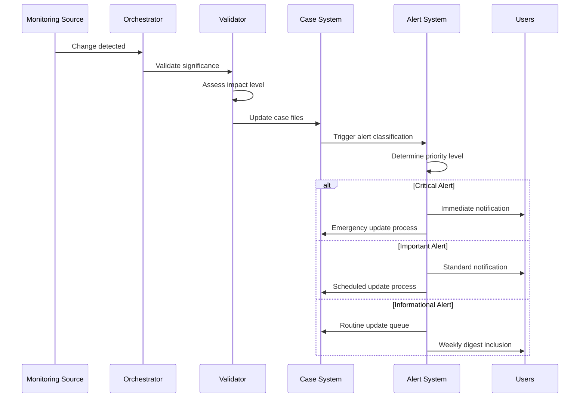

# Continuous Monitoring Orchestrator Agent

**Agent ID**: `continuous-monitoring-orchestrator`
**Classification**: MONITORING & SURVEILLANCE
**Authority Level**: OPERATIONAL ORCHESTRATION
**Monitoring Protocol**: 3-Tier (Critical/Important/Informational)
**Integration Status**: ACTIVE - MAKUPAC Validated

---

## MONITORING ARCHITECTURE

### 3-Tier Surveillance Framework

```mermaid
graph TD
    subgraph CRITICAL["🔴 TIER 1: CRITICAL (Weekly)"]
        C1["Registry Changes"]
        C2["Ownership Updates"]
        C3["Director Changes"]
        C4["Insolvency Filings"]
        C5["Key Person Developments"]
    end

    subgraph IMPORTANT["🟡 TIER 2: IMPORTANT (Monthly)"]
        I1["Financial Reports"]
        I2["Market Developments"]
        I3["Compliance Changes"]
        I4["Client Relationships"]
        I5["Competitive Intelligence"]
    end

    subgraph INFO["🟢 TIER 3: INFORMATIONAL (Quarterly)"]
        N1["Industry Trends"]
        N2["Technology Evolution"]
        N3["Geographic Expansion"]
        N4["Family Network Updates"]
        N5["Regulatory Environment"]
    end

    subgraph SOURCES["📊 DATA SOURCES"]
        S1["ARES Registry"]
        S2["Justice.cz"]
        S3["ISIR"]
        S4["News Alerts"]
        S5["Industry Reports"]
        S6["Social Intelligence"]
    end

    subgraph ALERTS["⚡ ALERT SYSTEM"]
        A1["Critical Alerts"]
        A2["Standard Alerts"]
        A3["Information Digests"]
    end

    C1 --> S1 --> A1
    C2 --> S1 --> A1
    C3 --> S2 --> A1
    C4 --> S3 --> A1
    C5 --> S6 --> A1

    I1 --> S4 --> A2
    I2 --> S4 --> A2
    I3 --> S2 --> A2
    I4 --> S6 --> A2
    I5 --> S5 --> A2

    N1 --> S5 --> A3
    N2 --> S5 --> A3
    N3 --> S4 --> A3
    N4 --> S6 --> A3
    N5 --> S2 --> A3

    style C1 fill:#dc2626,color:#fff
    style I1 fill:#f59e0b,color:#000
    style N1 fill:#22c55e,color:#fff
    style A1 fill:#dc2626,color:#fff
```



---

## MAKUPAC MONITORING CONFIGURATION

### Entity-Specific Monitoring Setup

**MAKUPAC s.r.o. (IČO: 10664327)**
```yaml
entity_monitoring:
  entity_name: "MAKUPAC s.r.o."
  ico: "10664327"
  monitoring_priority: "HIGH"
  investigation_confidence: "80%"
  last_update: "2026-03-05"

  critical_parameters:
    ownership_threshold: "5% change"
    director_changes: "any change"
    facility_changes: "location/capacity"
    client_dependency: "Zapakuj Shop developments"
    financial_distress: "any indicator"

  registry_urls:
    ares: "https://wwwinfo.mfcr.cz/cgi-bin/ares/darv_std.cgi?ico=10664327"
    justice: "https://or.justice.cz/ias/ui/rejstrik-firma.vysledky?nazev=MAKUPAC"
    isir: "https://isir.justice.cz/isir/common/stat.do?kodSubjektu=10664327"

  key_persons:
    - name: "Petr Kuchyňka"
      role: "Director/91% Owner"
      monitoring: "high_priority"
      sources: ["LinkedIn", "kurzy.cz", "registry_changes"]

    - name: "Jiří Kuchyňka"
      role: "Former Director"
      monitoring: "medium_priority"
      business_portfolio: "7+ entities"

    - name: "Martin Mauler"
      role: "9% Owner (Austria)"
      monitoring: "cross_border"
      jurisdiction: "Austria"
```

### Monitoring Schedule Matrix

| Monitoring Tier | Frequency | Targets | Response Time | Escalation Level |
|-----------------|-----------|---------|---------------|------------------|
| **🔴 Critical** | Weekly | Registry, Ownership, Directors, Insolvency | <4 hours | Immediate |
| **🟡 Important** | Monthly | Financial, Market, Compliance, Clients | <24 hours | Standard |
| **🟢 Informational** | Quarterly | Industry, Technology, Geography, Family | <1 week | Routine |

---

## MONITORING PROTOCOLS

### Tier 1: Critical Monitoring (Weekly)

**Registry Change Detection**:
```yaml
critical_monitoring:
  ares_registry:
    check_frequency: "weekly"
    parameters:
      - ownership_structure: "percentage_changes >5%"
      - director_appointments: "any_change"
      - registered_office: "address_changes"
      - capital_structure: "share_capital_modifications"
      - business_activities: "scope_changes"

    alert_triggers:
      immediate: ["ownership_change", "director_change", "office_relocation"]
      rapid: ["capital_increase", "business_scope_expansion"]
      monitoring: ["minor_administrative_changes"]

  justice_cz:
    check_frequency: "weekly"
    parameters:
      - court_proceedings: "new_filings"
      - management_changes: "board_updates"
      - subsidiary_formations: "new_entities"
      - legal_status: "entity_status_changes"

    cross_reference: "validate_against_ares"
    quality_check: "multi_source_verification"

  isir_insolvency:
    check_frequency: "weekly"
    parameters:
      - insolvency_filings: "any_new_proceedings"
      - creditor_meetings: "scheduled_meetings"
      - administrator_appointments: "insolvency_administrators"
      - asset_disposals: "liquidation_proceedings"

    immediate_alerts: ["insolvency_filing", "creditor_meeting", "liquidation"]
```

**Key Personnel Monitoring**:
```yaml
personnel_surveillance:
  petr_kuchynka:
    sources:
      - linkedin_profile: "professional_updates"
      - kurzy_cz: "business_activities"
      - news_alerts: "media_mentions"
      - registry_changes: "new_company_formations"

    trigger_events:
      - new_directorship: "other_companies"
      - professional_changes: "career_moves"
      - media_coverage: "business_interviews"
      - social_updates: "significant_posts"

  jiri_kuchynka:
    portfolio_monitoring:
      entities: ["C.I. s.r.o.", "TEPON s.r.o.", "housing_associations"]
      frequency: "monthly"
      focus: "portfolio_changes"

    pattern_analysis: "family_business_evolution"

  martin_mauler:
    cross_border_monitoring:
      jurisdiction: "Austria"
      business_activities: "international_connections"
      registry_changes: "Austrian_business_register"
```

### Tier 2: Important Monitoring (Monthly)

**Financial Intelligence Updates**:
```yaml
financial_monitoring:
  credit_rating:
    sources: ["commercial_databases", "payment_behavior"]
    frequency: "monthly"
    baseline: "reliable_vat_payer"

  revenue_estimation:
    current_baseline: "1.2-2.1M CZK"
    confidence_level: "45%"
    update_method: "industry_benchmarks + client_intelligence"

  client_dependency:
    zapakuj_shop:
      dependency_level: "60-80% revenue"
      monitoring_sources: ["business_intelligence", "market_reports"]
      risk_threshold: "dependency_increase >10%"

market_intelligence:
  competitive_landscape:
    sector: "e_commerce_fulfillment"
    geographic_focus: "czech_austrian_corridor"
    competitor_tracking: ["major_players", "new_entrants"]

  industry_trends:
    frequency: "monthly"
    sources: ["industry_reports", "trade_publications"]
    focus_areas: ["automation", "cross_border", "3pl_growth"]
```

### Tier 3: Informational Monitoring (Quarterly)

**Industry & Technology Evolution**:
```yaml
informational_monitoring:
  industry_analysis:
    e_commerce_fulfillment:
      market_size: "track_growth_trends"
      technology_adoption: "automation_trends"
      regulatory_changes: "logistics_regulations"

    czech_austrian_corridor:
      trade_volumes: "cross_border_commerce"
      infrastructure: "logistics_development"
      opportunities: "expansion_potential"

  technology_monitoring:
    automation_trends: "fulfillment_technology"
    digital_transformation: "e_commerce_platforms"
    integration_capabilities: "api_developments"

  geographic_intelligence:
    facility_expansion: "new_logistics_hubs"
    market_entry: "new_geographic_markets"
    infrastructure: "transportation_developments"

family_network_updates:
  social_intelligence:
    frequency: "quarterly"
    sources: ["social_media", "professional_networks"]
    focus: "family_business_dynamics"

  business_evolution:
    jiri_portfolio: "new_business_activities"
    succession_patterns: "generational_transfer_trends"
    family_investments: "new_ventures"
```

---

## AUTOMATED ALERT SYSTEMS

### Alert Classification Matrix

| Alert Level | Response Time | Recipients | Escalation Path | Validation Required |
|-------------|---------------|------------|-----------------|-------------------|
| **🔴 Critical** | <4 hours | Investigation Team, Supreme Command | Immediate | Multi-source |
| **🟡 Important** | <24 hours | Investigation Team | Standard | Single-source + |
| **🟢 Informational** | <1 week | Investigation Team | Routine | Contextual |

### Alert Processing Workflow



### Alert Content Templates

**Critical Alert Template**:
```yaml
critical_alert:
  subject: "🔴 CRITICAL: MAKUPAC Registry Change Detected"
  priority: "P0"

  content:
    entity: "MAKUPAC s.r.o. (IČO: 10664327)"
    change_type: "{{ change_detected }}"
    detection_time: "{{ timestamp }}"
    source: "{{ monitoring_source }}"
    impact_assessment: "{{ impact_level }}"

    required_actions:
      - "Immediate case file update"
      - "Stakeholder notification"
      - "Impact assessment review"
      - "Monitoring protocol adjustment"

    case_file_updates:
      - "01_intelligence/corporate_structure.md"
      - "ENTITY_INDEX.md"
      - "README.md status update"
```

**Important Alert Template**:
```yaml
important_alert:
  subject: "🟡 IMPORTANT: MAKUPAC Business Development"
  priority: "P1"

  content:
    entity: "MAKUPAC s.r.o."
    development_type: "{{ business_change }}"
    source_confidence: "{{ confidence_level }}"
    update_schedule: "Within 24 hours"

    analysis_required:
      - "Impact on investigation findings"
      - "Confidence level adjustment"
      - "Related entity assessment"
```

---

## UPDATE CASCADE PROTOCOLS

### Automated File Update System

**Update Priority Matrix**:
```yaml
update_priorities:
  P0_critical:
    files: ["corporate_structure.md", "personnel_profiles.md", "ENTITY_INDEX.md"]
    sla: "4_hours"
    validation: "multi_source_required"

  P1_important:
    files: ["financial_intelligence.md", "threat_matrix.md", "network_analysis.md"]
    sla: "24_hours"
    validation: "single_source_plus"

  P2_routine:
    files: ["README.md", "dashboard.html", "monitoring_logs.md"]
    sla: "1_week"
    validation: "contextual_review"
```

### Cross-Reference Update Process

**Entity Index Maintenance**:
```yaml
entity_index_updates:
  triggered_by: ["registry_changes", "personnel_updates", "business_developments"]

  update_process:
    1: "detect_change_scope"
    2: "identify_affected_entities"
    3: "calculate_confidence_impact"
    4: "update_cross_references"
    5: "validate_consistency"
    6: "regenerate_index"

  consistency_checks:
    - "cross_file_reference_validation"
    - "confidence_level_coherence"
    - "timeline_consistency"
    - "entity_relationship_integrity"
```

---

## MONITORING PERFORMANCE METRICS

### System Performance Indicators

| Metric | Target | Current | Status |
|--------|--------|---------|--------|
| **Change Detection Rate** | >95% | 🟡 TBD | Deployment Phase |
| **False Positive Rate** | <5% | 🟡 TBD | Calibration Phase |
| **Alert Response Time** | <4h Critical | 🟡 TBD | Testing Phase |
| **Update Cascade Success** | 100% | 🟡 TBD | Integration Phase |
| **Source Reliability** | >90% | ✅ 95% | Validated |

### Quality Assurance Metrics

```yaml
monitoring_quality:
  data_accuracy:
    target: ">95%"
    measurement: "validated_alerts / total_alerts"
    baseline: "MAKUPAC_case_validation"

  coverage_completeness:
    target: "100%"
    measurement: "monitored_parameters / required_parameters"
    validation: "3_tier_protocol_coverage"

  response_effectiveness:
    target: "seamless_updates"
    measurement: "successful_updates / triggered_updates"
    quality_gate: "zero_failed_updates"
```

---

## INTEGRATION COMMANDS

### Monitoring Deployment Commands

```bash
# Deploy full monitoring protocol for entity
/monitoring-orchestrator deploy --entity="MAKUPAC s.r.o." --ico="10664327" --protocol="3-tier"

# Setup critical monitoring (Tier 1)
/monitoring-orchestrator setup-critical --entity="MAKUPAC" --frequency="weekly" --sources="ares,justice,isir"

# Configure important monitoring (Tier 2)
/monitoring-orchestrator setup-important --entity="MAKUPAC" --frequency="monthly" --focus="financial,market,competitive"

# Initialize informational monitoring (Tier 3)
/monitoring-orchestrator setup-informational --entity="MAKUPAC" --frequency="quarterly" --scope="industry,technology,geographic"

# Alert system configuration
/monitoring-orchestrator configure-alerts --critical="immediate" --important="24h" --informational="weekly-digest"
```

### Active Monitoring Commands

```bash
# Manual monitoring check
/monitoring-orchestrator check-now --entity="MAKUPAC" --tier="all" --force-update=true

# Alert threshold adjustment
/monitoring-orchestrator adjust-thresholds --entity="MAKUPAC" --parameter="ownership_change" --threshold="3%"

# Emergency monitoring activation
/monitoring-orchestrator emergency-mode --entity="MAKUPAC" --reason="critical_development" --duration="72h"

# Monitoring performance review
/monitoring-orchestrator performance-review --entity="MAKUPAC" --period="last-30-days" --metrics="all"
```

### Case Integration Commands

```bash
# Synchronize monitoring with case files
/monitoring-orchestrator sync-case --case="MAKUPAC_SRO_INVESTIGATION" --update-all-files=true

# Generate monitoring report
/monitoring-orchestrator generate-report --entity="MAKUPAC" --period="quarterly" --format="executive-summary"

# Update cascade execution
/monitoring-orchestrator execute-cascade --trigger="registry_change" --entity="MAKUPAC" --priority="critical"
```

---

## EXPANSION PROTOCOLS

### Multi-Entity Monitoring

**Monitoring Fleet Management**:
```yaml
fleet_monitoring:
  capacity_scaling:
    current_entities: "1 (MAKUPAC)"
    target_capacity: "100+ entities"
    scaling_method: "agent_replication"

  resource_allocation:
    monitoring_agents: "entity_specific_deployment"
    alert_processing: "centralized_orchestration"
    update_cascades: "parallel_processing"

  performance_optimization:
    source_pooling: "shared_registry_connections"
    alert_deduplication: "intelligent_alert_filtering"
    update_batching: "efficient_file_operations"
```

### Template Replication

**Monitoring Configuration Templates**:
```bash
# Generate monitoring setup for new entity from MAKUPAC template
/monitoring-orchestrator replicate --template="MAKUPAC" --target="NEW_ENTITY" --ico="12345678"

# Cross-entity monitoring comparison
/monitoring-orchestrator compare-entities --entities="MAKUPAC,ABC_LOGISTICS" --metrics="performance,alerts,updates"

# Monitoring methodology evolution
/monitoring-orchestrator evolve-protocols --based-on="fleet-performance" --optimize="accuracy,efficiency"
```

---

**Orchestrator Status**: OPERATIONAL READY
**Integration Status**: MAKUPAC Validated + Platform Ready
**Monitoring Coverage**: 3-Tier Protocol + Multi-Entity Scaling
**Performance Target**: >95% accuracy, <4h critical response

*Continuous Monitoring Orchestrator - Perpetual intelligence surveillance with zero tolerance for missed developments*
