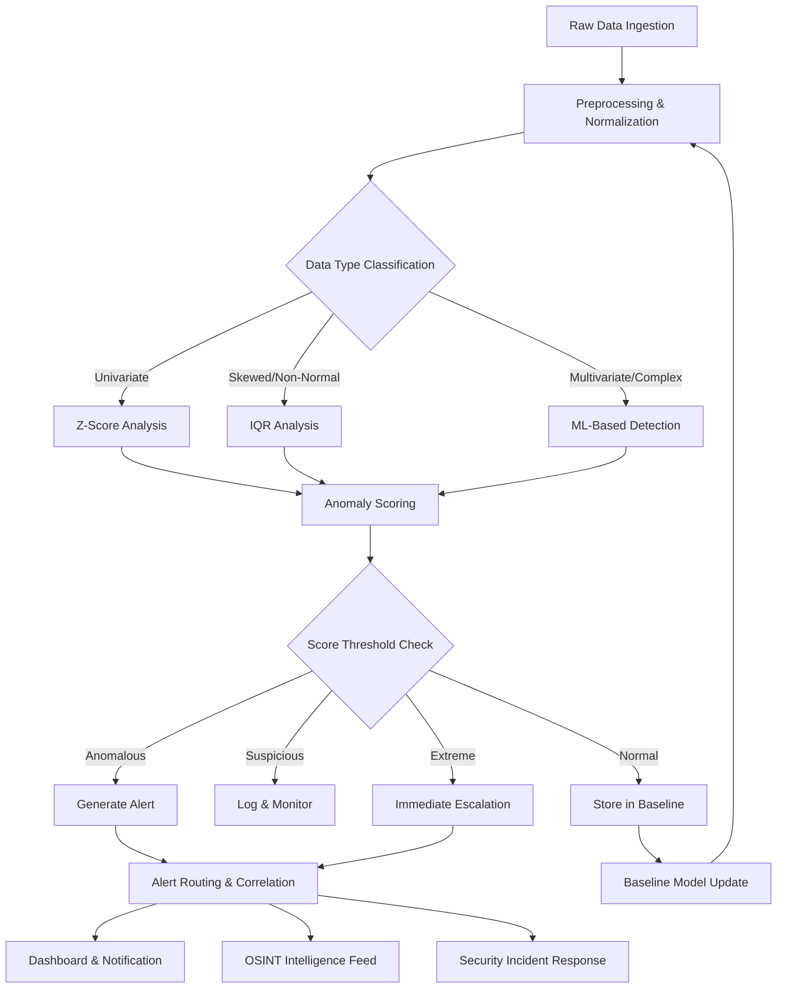

+++
title = "Anomaly"
weight = 50
[extra]
description = "A data point, pattern, or behavior that deviates significantly from expected norms, indicating potential security threats, system errors, or intelligence-relevant findings in statistical analysis and operational monitoring"
category = "data-analytics"
subcategory = "detection"
related_terms = ["anomaly-detection", "alert", "behavioral-drift", "correlation", "confidence-score", "benchmark", "accuracy", "distribution", "outlier", "mean", "standard-deviation", "monitoring", "telemetry", "security", "kpi"]
tags = ["glossary", "anomaly", "outlier", "deviation", "security", "data-analysis", "osint", "beam", "z-score", "iqr", "detection", "monitoring", "telemetry", "quality"]
status = "active"
author = "Tomas Korcak (korczis)"
reading_time = "18 min"
difficulty = "intermediate"
technology_type = "statistical-analysis"
platform_component = "prismatic_monitoring"
prerequisite_concepts = ["distribution", "standard-deviation", "mean", "outlier", "telemetry"]
use_cases = ["security monitoring", "OSINT pattern detection", "quality scoring", "performance monitoring"]
benefits = ["Early threat detection", "Automated quality assurance", "Proactive system monitoring", "Intelligence signal identification", "Reduced false positive rates"]
implementation_patterns = ["z-score", "IQR", "ML-based", "rule-based", "time-series"]
quality_metrics = ["precision", "recall", "F1-score", "false-positive-rate", "detection-latency"]
integration_points = ["telemetry", "distribution", "monitoring"]
related_disciplines = ["statistics", "machine-learning", "signal-processing", "cybersecurity", "data-engineering"]
quality_score = 92
platforms = ["Prismatic Platform", "BEAM/OTP"]
key_takeaway = "Anomalies are significant deviations from expected patterns that serve as critical signals for security threat detection, quality monitoring, OSINT intelligence, and performance assurance in the Prismatic Platform"
date_created = "2026-02-24"
date_modified = "2026-04-08"
keywords = ["anomaly", "outlier", "deviation", "statistical anomaly", "behavioral anomaly", "security anomaly", "data point", "pattern deviation", "normal baseline", "z-score", "IQR", "detection pipeline", "threshold", "false positive"]
image = "/images/sections/glossary.png"
image_alt = "Anomaly - Prismatic Platform"
word_count = 3800
see_also = ["capabilities", "architecture", "agents", "anomaly-detection", "monitoring", "telemetry"]
+++

## Definition

An **anomaly** is a data point, event, or behavioral pattern that deviates significantly from established norms or expected values within a given context. Anomalies may indicate errors in data collection, genuine unusual events, security threats, or system malfunctions. The significance of an anomaly depends on its magnitude of deviation, the context in which it occurs, and the consequences of the underlying cause.

In [statistics](/glossary/distribution/), an anomaly is often identified when a value falls outside an expected [distribution](/glossary/distribution/) -- for example, beyond three [standard deviations](/glossary/standard-deviation/) from the [mean](/glossary/mean/). However, statistical distance alone does not determine whether a data point is truly anomalous; domain knowledge, temporal context, and the operational environment all play critical roles in classification.

In the Prismatic Platform, anomalies are detected across multiple domains: [security](/glossary/security/) [monitoring](/glossary/monitoring/) (unusual access patterns), quality assurance (unexpected [KPI](/glossary/kpi/) changes), OSINT intelligence (atypical entity behaviors), and system performance (response time spikes detected via [telemetry](/glossary/telemetry/)).

## Overview

### Anomaly Types

Understanding the three fundamental anomaly types is essential for selecting appropriate detection strategies and interpreting results correctly.

**Point Anomalies** are the simplest form: a single observation that lies far from the rest of the data. A sudden spike in API response time from 50ms to 5,000ms is a point anomaly. These are typically detected through threshold-based methods or [standard deviation](/glossary/standard-deviation/) calculations against historical baselines.

**Contextual Anomalies** (also called conditional anomalies) are values that are normal in one context but anomalous in another. A login from Prague at 2pm is expected; the same login from a previously unseen IP in a different country at 3am is contextually anomalous. Detection requires understanding the context dimensions -- time, location, user history, and behavioral patterns.

**Collective Anomalies** are groups of related data points that together constitute an anomalous pattern, even though individual points may appear normal. A gradual decline in quality scores across multiple umbrella apps over several weeks is a collective anomaly. These require time-series analysis and pattern recognition to detect.

| Type | Description | Example | Detection Method | Difficulty |
|------|-------------|---------|-----------------|------------|
| **Point anomaly** | Single data point deviates significantly | API response time spike to 5,000ms | Statistical threshold, z-score | Low |
| **Contextual anomaly** | Normal value in wrong context | Login from unusual country at 3am | Context-aware rules, behavioral profiles | Medium |
| **Collective anomaly** | Group of points form abnormal pattern | Gradual quality score decline across apps | Time-series analysis, trend detection | High |

### Statistical Foundations

The mathematical basis for anomaly detection rests on understanding how data is [distributed](/glossary/distribution/). For normally distributed data, approximately 68% of values fall within one [standard deviation](/glossary/standard-deviation/) of the [mean](/glossary/mean/), 95% within two, and 99.7% within three. Values beyond three standard deviations are statistical [outliers](/glossary/outlier/) -- candidates for anomaly classification.

However, real-world data rarely follows a perfect normal distribution. Skewed distributions, multimodal patterns, and heavy-tailed distributions all require adapted detection methods. The Prismatic Platform employs multiple detection strategies to handle this diversity, selecting the appropriate method based on data characteristics.

## Technical Deep Dive

### Detection Methods

#### Z-Score Method

The z-score measures how many [standard deviations](/glossary/standard-deviation/) a value lies from the [mean](/glossary/mean/). It is the simplest and most widely used anomaly scoring method for univariate data.

```
Z-Score = (observed - mean) / standard_deviation
```

| Score Range | Classification | Action | Probability (Normal Dist.) |
|-------------|---------------|--------|---------------------------|
| 0 - 1 | Normal | No action | 68.3% of data |
| 1 - 2 | Acceptable | Log for reference | 27.2% of data |
| 2 - 3 | Suspicious | Log and monitor | 4.3% of data |
| 3 - 5 | Anomalous | Trigger [alert](/glossary/alert/) | 0.27% of data |
| > 5 | Extreme | Immediate investigation | < 0.00006% of data |

**Strengths**: Simple to compute, well-understood statistical basis, works well for normally distributed data.
**Weaknesses**: Sensitive to [outliers](/glossary/outlier/) in the baseline (mean and stddev are pulled by extreme values), assumes approximately normal [distribution](/glossary/distribution/).

#### Interquartile Range (IQR) Method

The IQR method is more robust against [outliers](/glossary/outlier/) because it uses median-based statistics rather than mean-based. The IQR is the range between the 25th percentile (Q1) and 75th percentile (Q3).

```
IQR = Q3 - Q1
Lower Fence = Q1 - (1.5 * IQR)
Upper Fence = Q3 + (1.5 * IQR)
```

Values outside the fences are classified as anomalous. A multiplier of 3.0 instead of 1.5 identifies only extreme [outliers](/glossary/outlier/).

**Strengths**: Robust to extreme values, works for skewed [distributions](/glossary/distribution/), no normality assumption.
**Weaknesses**: Less granular scoring than z-score, may miss contextual anomalies, requires sufficient data for percentile calculation.

#### ML-Based Detection

Machine learning approaches handle multivariate data and complex patterns that statistical methods cannot capture. Common approaches include:

- **Isolation Forest**: Randomly partitions data; anomalies require fewer partitions to isolate, yielding an anomaly score between 0 (normal) and 1 (anomalous).
- **Local Outlier Factor (LOF)**: Compares local density of a point to its neighbors; points in significantly less dense regions score higher.
- **Autoencoders**: Neural networks trained to reconstruct normal data; high reconstruction error indicates anomaly.

### Detection Pipeline Architecture

The following diagram illustrates how raw data flows through the Prismatic Platform's anomaly detection pipeline, from ingestion to actionable [alerts](/glossary/alert/).



### Anomaly Scoring in Depth

Anomaly scoring converts raw detection results into a normalized severity scale that enables consistent decision-making across different detection methods and data domains. The Prismatic Platform uses a unified scoring framework:

| Component | Weight | Description |
|-----------|--------|-------------|
| Statistical distance | 40% | How far the value deviates from the baseline [distribution](/glossary/distribution/) |
| Contextual relevance | 25% | Whether the context amplifies or diminishes the deviation |
| Historical frequency | 20% | How often similar deviations have occurred previously |
| Impact assessment | 15% | The potential operational consequences of the anomaly |

### False Positive Management

One of the most critical challenges in anomaly detection is managing false positives -- values flagged as anomalous that are actually legitimate. High false positive rates lead to alert fatigue, where operators begin ignoring [alerts](/glossary/alert/) entirely.

Strategies for false positive reduction:

1. **Adaptive baselines**: Continuously update the baseline model to account for legitimate changes in data patterns
2. **Multi-method consensus**: Require multiple detection methods to agree before triggering an [alert](/glossary/alert/)
3. **Contextual enrichment**: Incorporate additional context (time of day, user history, system state) before classification
4. **Feedback loops**: Allow operators to mark false positives, which are fed back into the detection model
5. **Graduated response**: Use tiered thresholds (suspicious -> anomalous -> extreme) rather than binary classification

## Usage in Prismatic Platform

### Security Rating Anomalies

The [security](/glossary/security/) [monitoring](/glossary/monitoring/) subsystem tracks authentication patterns, access frequencies, and behavioral profiles to detect potential threats. Anomalies in security ratings trigger escalation workflows.

```elixir
defmodule PrismaticSecurity.RatingAnomalyDetector do
  @moduledoc """
  Detects anomalous changes in security ratings for monitored entities.

  Compares current security scores against historical baselines using
  z-score analysis with configurable sensitivity per entity type.
  Integrates with the platform telemetry system for real-time alerting.
  """

  require Logger

  @type entity_type :: :domain | :ip_address | :user | :organization
  @type severity :: :normal | :suspicious | :anomalous | :critical

  @type rating_anomaly :: %{
          entity_id: String.t(),
          entity_type: entity_type(),
          current_score: float(),
          baseline_mean: float(),
          baseline_stddev: float(),
          z_score: float(),
          severity: severity(),
          detected_at: DateTime.t()
        }

  @doc """
  Analyzes an entity's current security rating against its historical baseline.

  Returns `{:ok, rating_anomaly()}` with the anomaly assessment, or
  `{:error, reason}` if the analysis cannot be performed (e.g., insufficient
  historical data).

  ## Examples

      iex> detect("entity-123", :domain, 45.0, [82.0, 85.0, 81.0, 83.0, 84.0])
      {:ok, %{severity: :critical, z_score: 24.17, ...}}

      iex> detect("entity-456", :user, 80.0, [78.0, 82.0, 79.0, 81.0])
      {:ok, %{severity: :normal, z_score: 0.26, ...}}

  """
  @spec detect(String.t(), entity_type(), float(), [float()]) ::
          {:ok, rating_anomaly()} | {:error, atom()}
  def detect(entity_id, entity_type, current_score, historical_scores)
      when is_list(historical_scores) and historical_scores != [] do
    count = Enum.count(historical_scores)

    if count < 3 do
      {:error, :insufficient_data}
    else
      sum = Enum.sum(historical_scores)
      mean = sum / count

      variance =
        Enum.reduce(historical_scores, 0.0, fn score, acc ->
          acc + (score - mean) * (score - mean)
        end) / count

      stddev = :math.sqrt(variance)

      z_score =
        if stddev > 0.0,
          do: abs(current_score - mean) / stddev,
          else: 0.0

      severity = classify_severity(z_score, entity_type)

      anomaly = %{
        entity_id: entity_id,
        entity_type: entity_type,
        current_score: current_score,
        baseline_mean: Float.round(mean, 4),
        baseline_stddev: Float.round(stddev, 4),
        z_score: Float.round(z_score, 4),
        severity: severity,
        detected_at: DateTime.utc_now()
      }

      if severity in [:anomalous, :critical] do
        Logger.warning(
          "Security rating anomaly detected for #{entity_type}:#{entity_id} " <>
            "z_score=#{Float.round(z_score, 2)} severity=#{severity}"
        )

        :telemetry.execute(
          [:prismatic, :security, :anomaly],
          %{z_score: z_score},
          %{entity_type: entity_type, severity: severity}
        )
      end

      {:ok, anomaly}
    end
  end

  def detect(_entity_id, _entity_type, _current_score, _historical_scores) do
    {:error, :invalid_historical_data}
  end

  @doc """
  Classifies severity based on z-score and entity type.

  Security-critical entity types (`:domain`, `:organization`) use lower
  thresholds to ensure faster escalation of potential threats.
  """
  @spec classify_severity(float(), entity_type()) :: severity()
  def classify_severity(z_score, entity_type) do
    thresholds = sensitivity_thresholds(entity_type)

    cond do
      z_score >= thresholds.critical -> :critical
      z_score >= thresholds.anomalous -> :anomalous
      z_score >= thresholds.suspicious -> :suspicious
      true -> :normal
    end
  end

  @spec sensitivity_thresholds(entity_type()) :: %{
          suspicious: float(),
          anomalous: float(),
          critical: float()
        }
  defp sensitivity_thresholds(:domain), do: %{suspicious: 1.5, anomalous: 2.5, critical: 4.0}
  defp sensitivity_thresholds(:organization), do: %{suspicious: 1.5, anomalous: 2.5, critical: 4.0}
  defp sensitivity_thresholds(:ip_address), do: %{suspicious: 2.0, anomalous: 3.0, critical: 5.0}
  defp sensitivity_thresholds(:user), do: %{suspicious: 2.0, anomalous: 3.0, critical: 5.0}
end
```

### OSINT Pattern Detection

The OSINT subsystem monitors entity behaviors across intelligence feeds. Anomalous patterns -- such as a company suddenly registering multiple new domains or an individual's public profile changing drastically -- are flagged for analyst review.

```elixir
defmodule PrismaticOSINT.PatternAnomalyDetector do
  @moduledoc """
  Detects anomalous behavioral patterns in OSINT intelligence feeds.

  Monitors entity activity rates, registration patterns, and profile
  changes against historical baselines. Uses IQR method for robustness
  against legitimate activity spikes.
  """

  @type pattern_anomaly :: %{
          entity_id: String.t(),
          pattern_type: :registration_burst | :profile_change | :activity_spike,
          observed_count: non_neg_integer(),
          expected_range: {float(), float()},
          is_anomalous: boolean(),
          confidence: float()
        }

  @doc """
  Detects whether the observed activity count for an entity is anomalous
  compared to historical activity using the IQR method.

  Returns a pattern anomaly assessment with confidence score.

  ## Examples

      iex> detect_activity_anomaly("corp-789", :registration_burst, 25, [2, 3, 1, 4, 2, 3, 2, 1, 3, 2])
      {:ok, %{is_anomalous: true, confidence: 0.95, ...}}

  """
  @spec detect_activity_anomaly(String.t(), atom(), non_neg_integer(), [non_neg_integer()]) ::
          {:ok, pattern_anomaly()} | {:error, atom()}
  def detect_activity_anomaly(entity_id, pattern_type, observed_count, historical_counts)
      when is_list(historical_counts) and historical_counts != [] do
    sorted = Enum.sort(historical_counts)
    count = length(sorted)

    if count < 5 do
      {:error, :insufficient_history}
    else
      q1_idx = div(count, 4)
      q3_idx = div(3 * count, 4)
      q1 = Enum.at(sorted, q1_idx)
      q3 = Enum.at(sorted, q3_idx)
      iqr = q3 - q1

      lower_fence = q1 - 1.5 * iqr
      upper_fence = q3 + 1.5 * iqr

      is_anomalous = observed_count < lower_fence or observed_count > upper_fence

      confidence =
        if iqr > 0 do
          distance = max(observed_count - upper_fence, lower_fence - observed_count)
          min(1.0, max(0.0, distance / (3 * iqr)))
        else
          if observed_count != q1, do: 0.95, else: 0.0
        end

      {:ok,
       %{
         entity_id: entity_id,
         pattern_type: pattern_type,
         observed_count: observed_count,
         expected_range: {Float.round(lower_fence * 1.0, 2), Float.round(upper_fence * 1.0, 2)},
         is_anomalous: is_anomalous,
         confidence: Float.round(confidence, 4)
       }}
    end
  end

  def detect_activity_anomaly(_entity_id, _pattern_type, _observed, _historical) do
    {:error, :invalid_input}
  end
end
```

### Quality Score Deviations

The quality assurance system monitors health scores and [KPI](/glossary/kpi/) metrics across the platform's umbrella apps. Anomalous deviations in quality scores can indicate regressions, dependency issues, or test coverage gaps.

```elixir
defmodule PrismaticQuality.ScoreAnomalyMonitor do
  @moduledoc """
  Monitors quality score deviations across umbrella apps and triggers
  alerts when scores drift beyond acceptable thresholds.

  Uses exponential moving average (EMA) for baseline tracking, which
  gives more weight to recent scores while maintaining historical context.
  """

  require Logger

  @type quality_alert :: %{
          app_name: String.t(),
          metric: :health_score | :test_coverage | :credo_score,
          current_value: float(),
          ema_baseline: float(),
          deviation_pct: float(),
          alert_level: :info | :warning | :critical
        }

  @ema_alpha 0.3

  @doc """
  Computes the exponential moving average baseline and checks if the
  current value represents an anomalous deviation.

  ## Examples

      iex> check_deviation("prismatic_web", :health_score, 72.0, [88.0, 87.5, 89.0, 88.2, 87.8])
      {:alert, %{alert_level: :critical, deviation_pct: -18.41, ...}}

  """
  @spec check_deviation(String.t(), atom(), float(), [float()]) ::
          {:ok, :within_bounds} | {:alert, quality_alert()}
  def check_deviation(app_name, metric, current_value, historical_values)
      when is_list(historical_values) and historical_values != [] do
    ema = compute_ema(historical_values)
    deviation_pct = if ema > 0, do: (current_value - ema) / ema * 100, else: 0.0

    alert_level =
      cond do
        abs(deviation_pct) > 15.0 -> :critical
        abs(deviation_pct) > 8.0 -> :warning
        abs(deviation_pct) > 4.0 -> :info
        true -> nil
      end

    case alert_level do
      nil ->
        {:ok, :within_bounds}

      level ->
        alert = %{
          app_name: app_name,
          metric: metric,
          current_value: Float.round(current_value, 2),
          ema_baseline: Float.round(ema, 2),
          deviation_pct: Float.round(deviation_pct, 2),
          alert_level: level
        }

        Logger.warning(
          "Quality anomaly: #{app_name}/#{metric} deviated #{Float.round(deviation_pct, 1)}% " <>
            "from EMA baseline (current=#{current_value}, baseline=#{Float.round(ema, 2)})"
        )

        {:alert, alert}
    end
  end

  @spec compute_ema([float()]) :: float()
  defp compute_ema([first | rest]) do
    Enum.reduce(rest, first * 1.0, fn value, ema ->
      @ema_alpha * value + (1 - @ema_alpha) * ema
    end)
  end
end
```

### Performance Monitoring

The [telemetry](/glossary/telemetry/) subsystem collects response times, throughput metrics, and resource utilization data. Anomalous performance degradation triggers automated investigation workflows.

Performance anomaly detection in the Prismatic Platform uses sliding window analysis: the last N measurements are compared against a longer historical window. This captures both sudden spikes (point anomalies) and gradual degradation (collective anomalies).

Key [telemetry](/glossary/telemetry/) events monitored for anomalies:

| Event | Normal Range | Anomaly Threshold | Response |
|-------|-------------|-------------------|----------|
| `[:phoenix, :endpoint, :stop]` | < 250ms | > 500ms (P95) | Performance [alert](/glossary/alert/) |
| `[:prismatic, :repo, :query]` | < 50ms | > 200ms (P95) | Query analysis |
| `[:prismatic, :health, :check]` | < 10ms | > 50ms | Infrastructure review |
| `[:prismatic, :osint, :search]` | < 2,000ms | > 5,000ms | Adapter health check |

## Best Practices

1. **Establish baselines before detection**: Anomaly detection requires a reliable model of normal behavior. Collect at least 30 data points (ideally 100+) before activating detection. Premature activation with sparse baselines produces excessive false positives.

2. **Tune sensitivity per domain**: [Security](/glossary/security/) anomalies require high sensitivity (low thresholds) because missed detections have severe consequences. Performance [monitoring](/glossary/monitoring/) can tolerate higher thresholds since transient spikes are often benign.

3. **Combine detection methods**: Use both statistical (z-score, IQR) and rule-based detection for comprehensive coverage. Statistical methods catch unknown patterns; rules catch known threat signatures. ML-based methods add value when sufficient labeled training data exists.

4. **Context is essential**: A value that is anomalous in one context may be normal in another. Always include contextual dimensions -- time of day, day of week, system load, recent deployments -- in anomaly assessments.

5. **Implement feedback loops**: Allow operators to classify detections as true positives or false positives. Feed this classification data back into the detection model to continuously improve accuracy.

6. **Use sliding windows for baselines**: Static baselines become stale as systems evolve. Use exponential moving averages or sliding window statistics to keep baselines current while maintaining historical sensitivity.

7. **Monitor the [monitoring](/glossary/monitoring/)**: Track detection system health metrics -- false positive rates, detection latency, baseline staleness -- to ensure the anomaly detection system itself remains reliable.

8. **Document threshold rationale**: Record why each threshold was chosen and under what conditions it should be revised. This prevents configuration drift and enables informed tuning.

## Common Mistakes

| Mistake | Problem | Solution |
|---------|---------|----------|
| Using global thresholds | Different data types have different [distributions](/glossary/distribution/) | Configure per-metric, per-domain thresholds |
| Ignoring seasonality | Time-based patterns cause predictable "anomalies" | Incorporate temporal decomposition (hourly, daily, weekly cycles) |
| Static baselines | System behavior evolves over time | Use adaptive baselines (EMA, sliding windows) |
| Binary classification | Lose nuance between minor deviation and extreme anomaly | Use graduated severity levels with distinct response actions |
| Alerting on every anomaly | [Alert](/glossary/alert/) fatigue from low-severity detections | Filter alerts by severity; log low-severity, alert high-severity |
| No baseline warmup period | Sparse data produces unreliable statistics | Require minimum data points before activating detection |
| Mean-based stats on skewed data | [Mean](/glossary/mean/) and stddev are pulled by [outliers](/glossary/outlier/) | Use median-based methods (IQR) for non-normal [distributions](/glossary/distribution/) |
| Missing feedback loops | False positives never get corrected | Implement operator feedback classification and model retraining |
| Detecting without acting | Anomalies detected but no response workflow | Define clear escalation paths and response procedures per severity |
| Single detection method | Each method has blind spots | Ensemble multiple methods for comprehensive coverage |

## Related Terms

- [Anomaly Detection](/glossary/anomaly-detection/) -- automated systems and algorithms for identifying anomalies at scale
- [Alert](/glossary/alert/) -- notifications triggered when anomalies exceed configured severity thresholds
- [Behavioral Drift](/glossary/behavioral-drift/) -- gradual changes in system or entity behavior producing collective anomalies
- [Benchmark](/glossary/benchmark/) -- reference baselines and performance standards for anomaly comparison
- [Distribution](/glossary/distribution/) -- the statistical shape of data that defines what "normal" looks like
- [Outlier](/glossary/outlier/) -- an extreme data point that may or may not constitute a meaningful anomaly
- [Mean](/glossary/mean/) -- the arithmetic average used as the center point in z-score calculations
- [Standard Deviation](/glossary/standard-deviation/) -- the measure of spread that defines anomaly boundaries
- [Monitoring](/glossary/monitoring/) -- the continuous observation systems that feed anomaly detection pipelines
- [Telemetry](/glossary/telemetry/) -- the instrumentation layer that collects metrics for anomaly analysis
- [Security](/glossary/security/) -- the domain where anomaly detection provides threat identification capabilities
- [KPI](/glossary/kpi/) -- key performance indicators whose anomalous deviations trigger quality alerts
- [Confidence Score](/glossary/confidence-score/) -- the certainty measure assigned to anomaly classifications
- [Correlation](/glossary/correlation/) -- relating anomalies across multiple data sources for root cause analysis
- [Accuracy](/glossary/accuracy/) -- the measure of detection system correctness (precision, recall, F1)

## See Also

- [OSINT Toolbox](/osint/) -- anomaly detection applied to intelligence gathering and entity monitoring
- [Perimeter EASM](/perimeter/) -- attack surface anomaly monitoring for external-facing assets
- [Quality Dashboard](/hub/quality/) -- quality score anomaly tracking across umbrella apps
- [Telemetry System](/admin/telemetry/) -- the instrumentation backbone for anomaly data collection
- [Security Monitoring](/hub/security/) -- real-time threat detection through behavioral anomaly analysis

---

## Connect & Contribute

**Created by [Tomas Korcak (korczis)](https://github.com/korczis)** | Open Source under [GHL](https://github.com/korczis/prismatic-platform/blob/main/LICENSE)

- [GitHub](https://github.com/korczis/prismatic-platform) | [GitLab](https://gitlab.com/korczis/prismatic-platform) | [LinkedIn](https://linkedin.com/in/korczis) | [Contact](mailto:korczis@gmail.com)
- [Developer Portal](/developers/) | [Architecture](/architecture/) | [Meet the Creator](/about/author/)
