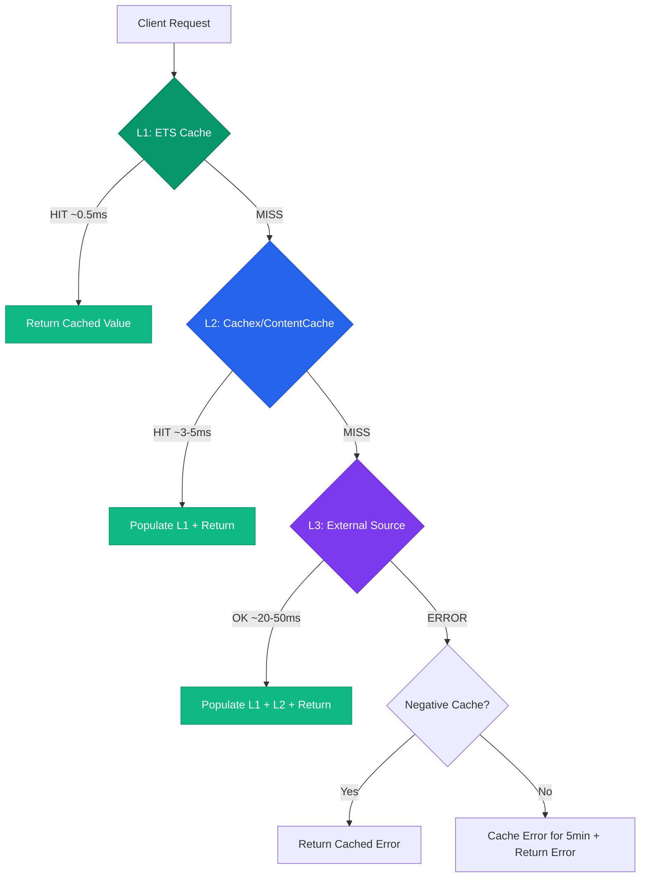

+++
title = "Cache"
weight = 50
[extra]
description = "A high-speed data storage layer that stores frequently accessed data closer to the consumer, reducing latency and load on primary data sources"
category = "architecture"
subcategory = "performance"
related_terms = ["ets", "cachex", "meilisearch", "genserver", "telemetry", "cache-eviction", "connection-pool", "batch-processing", "configuration", "consistency", "benchmark", "pubsub", "memory", "query", "retention"]
tags = ["glossary", "cache", "ets", "caching", "performance", "memoization", "genserver", "otp", "beam", "hierarchical-cache", "ttl", "cachex", "invalidation"]
status = "active"
author = "Tomas Korcak (korczis)"
reading_time = "18 min"
difficulty = "intermediate"
technology_type = "infrastructure"
platform_component = "prismatic_web"
prerequisite_concepts = ["ets", "genserver", "telemetry"]
use_cases = ["OSINT ToolRegistry", "Academy TopicRegistry", "DD SourceRegistry", "API endpoint caching", "glossary content caching", "markdown rendering"]
benefits = ["Sub-millisecond read latency", "Reduced database load", "Horizontal scalability", "Graceful degradation"]
implementation_patterns = ["read-through", "write-through", "cache-aside", "hierarchical", "TTL-based"]
quality_metrics = ["hit_rate", "miss_rate", "latency_p99", "memory_usage", "eviction_count"]
integration_points = ["ETS tables", "Cachex processes", "ContentCache", "PubSub invalidation", "Telemetry events"]
related_disciplines = ["distributed systems", "database optimization", "memory management", "performance engineering"]
quality_score = 92
platforms = ["Prismatic Platform", "BEAM/OTP"]
key_takeaway = "The Prismatic Platform's 3-level HierarchicalCache (ETS -> Cachex -> external source) delivers sub-50ms response times across the entire stack, powering the OSINT ToolRegistry, Academy TopicRegistry, glossary system, and DD SourceRegistry"
date_created = "2026-02-24"
date_modified = "2026-04-08"
keywords = ["cache", "caching", "ETS cache", "in-memory cache", "cache strategy", "memoization", "TTL", "cache invalidation", "read-through cache", "write-through cache", "hierarchical cache", "Cachex", "HierarchicalCache", "cache coherence", "negative caching"]
image = "/images/sections/glossary.png"
image_alt = "Cache - Prismatic Platform"
word_count = 3800
see_also = ["capabilities", "architecture", "agents"]
+++

## Definition

A cache is a high-speed data storage layer positioned between a data consumer and a primary data source, storing copies of frequently or recently accessed data to reduce access latency and load on the underlying storage system. Caches exploit the **principle of temporal locality** -- data accessed once is likely to be accessed again soon -- and **spatial locality** -- data near recently accessed data is likely to be accessed next. The fundamental trade-off of caching is between **data freshness** (how current cached data is) and **performance** (how fast access is).

In the Prismatic Platform, [ETS](/glossary/ets/) (Erlang Term Storage) serves as the foundational caching mechanism, but the platform extends far beyond simple key-value caching. The `PrismaticWeb.Cache.HierarchicalCache` module implements a 3-level tiered caching architecture (ETS -> [Cachex](/glossary/cachex/) -> external source) that provides sub-50ms response times across all platform domains: the OSINT ToolRegistry (157 tools), Academy TopicRegistry, DD SourceRegistry, glossary content rendering, and API endpoint routing.

## Overview

Caching is one of the most impactful performance optimizations available to any system. In the BEAM/OTP ecosystem, ETS tables provide a unique advantage: **concurrent reads without process serialization**. Unlike [GenServer](/glossary/genserver/)-held state, where every read must pass through the process mailbox, ETS allows any process to read directly from shared memory, yielding sub-microsecond access times.

However, ETS alone is not sufficient for production-grade caching. Real systems need:

- **TTL management** -- data must expire to prevent staleness
- **Memory bounds** -- unbounded caches exhaust available memory
- **Distributed coordination** -- cached data must be coherent across nodes
- **Fallback chains** -- cache misses must resolve transparently
- **Observability** -- cache hit rates and latency must be measurable via [Telemetry](/glossary/telemetry/)

The Prismatic Platform addresses all of these concerns through its HierarchicalCache architecture, which combines ETS speed with [Cachex](/glossary/cachex/) flexibility and transparent external-source fallback.

## Technical Deep Dive

### Cache Strategies

| Strategy | Description | Consistency | Prismatic Usage |
|----------|-------------|-------------|-----------------|
| **Read-through** | Cache loads on miss, serves on hit | Eventual | OSINT tool configs, glossary terms |
| **Write-through** | Write to cache and store simultaneously | Strong | Quality DNA state |
| **Write-behind** | Write to cache, async flush to store | Eventual | [Telemetry](/glossary/telemetry/) metrics aggregation |
| **Cache-aside** | Application manages cache explicitly | Application-managed | API responses, search results |
| **Refresh-ahead** | Proactively refresh before expiry | Near-real-time | OSINT feed data, monitoring |
| **Hierarchical** | Multi-level tiered caching with fallback | Configurable per level | HierarchicalCache (L1/L2/L3) |

### ETS Caching Fundamentals

[ETS](/glossary/ets/) is the backbone of all caching in the Prismatic Platform. Key properties that make it ideal for caching:

- **Concurrent reads**: Multiple processes read simultaneously without contention
- **Process-independent lifetime**: Tables survive owning-process restarts when using `:heir` option
- **Sub-microsecond lookups**: Direct memory access, no message passing
- **Match specifications**: Complex queries executed in native code
- **Configurable access**: `:public`, `:protected`, or `:private` access levels

The `read_concurrency: true` option is critical for cache tables -- it optimizes the internal locking strategy for read-heavy workloads at a small cost to write performance.

```elixir
# ETS table creation optimized for caching
:ets.new(:my_cache, [
  :set,                    # Key-value pairs, unique keys
  :named_table,            # Access by name, not reference
  :public,                 # Any process can read/write
  read_concurrency: true,  # Optimized for concurrent reads
  write_concurrency: true  # Allow concurrent writes to different keys
])
```

### Cachex Integration

[Cachex](/glossary/cachex/) extends basic ETS caching with production-grade features:

- **Built-in TTL**: Automatic key expiration with lazy and proactive cleanup
- **Warming**: Pre-populate cache on startup via warmers
- **Statistics**: Built-in hit/miss counters and cache metrics
- **Fallbacks**: Configurable fallback functions for cache misses
- **Transactions**: Atomic read-modify-write operations
- **Hooks**: Event hooks for cache operations (put, get, evict)
- **Limits**: Maximum entry count with configurable eviction policies

```elixir
defmodule PrismaticWeb.Cache.CachexConfig do
  @moduledoc """
  Cachex cache configuration for the Prismatic Platform.

  Defines named caches with TTL, size limits, and eviction policies
  used as Level 2 in the HierarchicalCache architecture.
  """

  @doc """
  Returns the child spec for the glossary content cache.

  ## Examples

      iex> spec = PrismaticWeb.Cache.CachexConfig.glossary_cache_spec()
      iex> is_map(spec)
      true
  """
  @spec glossary_cache_spec() :: Supervisor.child_spec()
  def glossary_cache_spec do
    %{
      id: :glossary_cache,
      start: {Cachex, :start_link, [
        :glossary_cache,
        [
          expiration: expiration(default: :timer.hours(1)),
          limit: limit(size: 5_000, policy: Cachex.Policy.LRW, reclaim: 0.1),
          stats: true
        ]
      ]}
    }
  end

  @doc """
  Returns the child spec for the OSINT tool configuration cache.
  """
  @spec osint_cache_spec() :: Supervisor.child_spec()
  def osint_cache_spec do
    %{
      id: :osint_cache,
      start: {Cachex, :start_link, [
        :osint_cache,
        [
          expiration: expiration(default: :timer.minutes(30)),
          limit: limit(size: 1_000, policy: Cachex.Policy.LRW, reclaim: 0.1),
          warmers: [warmer(module: PrismaticWeb.Cache.OsintWarmer)],
          stats: true
        ]
      ]}
    }
  end

  defp expiration(opts), do: Cachex.Spec.expiration(opts)
  defp limit(opts), do: Cachex.Spec.limit(opts)
  defp warmer(opts), do: Cachex.Spec.warmer(opts)
end
```

### HierarchicalCache: 3-Level Architecture

The `PrismaticWeb.Cache.HierarchicalCache` is the platform's primary caching abstraction. It implements a 3-level tiered cache with automatic fallback, [telemetry](/glossary/telemetry/) instrumentation, and graceful degradation.



**Level 1 -- ETS (sub-millisecond)**:
Direct ETS table lookups. No process serialization. Ideal for hot data that changes infrequently. Default limit of 10,000 entries with LRU eviction.

**Level 2 -- Cachex/ContentCache (milliseconds)**:
Shared cache with built-in TTL, statistics, and warming capabilities. Accessed via `PrismaticWeb.SEO.ContentCache`. Suitable for data shared across LiveView processes.

**Level 3 -- External Source (tens of milliseconds)**:
The original data source -- database queries, API calls, file reads, [Meilisearch](/glossary/meilisearch/) index lookups. Only reached on L1+L2 cache miss.

```elixir
defmodule PrismaticWeb.Cache.HierarchicalCache do
  @moduledoc """
  High-performance hierarchical caching system with 3-level architecture.

  Provides a unified interface for caching with automatic fallback through:
  1. **Level 1**: ETS (sub-millisecond, in-memory) - fastest access
  2. **Level 2**: Cachex/ContentCache (millisecond, distributed) - shared across processes
  3. **Level 3**: External source (tens of milliseconds) - database, API, etc.

  ## Performance Characteristics

  - **Cache Hit (L1)**: ~0.5-1ms response time
  - **Cache Hit (L2)**: ~3-5ms response time
  - **Cache Miss**: ~20-50ms (depends on external source)
  - **Bulk Operations**: 10-20x faster than sequential lookups
  """

  use GenServer

  alias PrismaticWeb.SEO.ContentCache

  require Logger

  @default_ets_limit 10_000
  @default_ttl 3600
  @negative_cache_ttl 300
  @cleanup_interval 600_000

  @doc """
  Retrieve a cached value or compute it via the 3-level hierarchy.

  Checks L1 (ETS) first, then L2 (ContentCache), then falls back to
  the provided computation function for L3 (external source).

  ## Parameters

    - `namespace` - Cache namespace string (e.g., "glossary_terms")
    - `key` - Cache key (any term)
    - `ttl` - Time-to-live in seconds
    - `compute_fn` - Zero-arity function to compute the value on cache miss

  ## Examples

      iex> HierarchicalCache.get_or_compute("test", "key1", 3600, fn -> {:ok, 42} end)
      {:ok, 42}
  """
  @spec get_or_compute(String.t(), term(), non_neg_integer(), (-> term())) :: term()
  def get_or_compute(namespace, key, ttl \\ @default_ttl, compute_fn) do
    cache_key = build_key(namespace, key)
    start_time = System.monotonic_time(:microsecond)

    case get_l1(cache_key) do
      {:ok, value} ->
        emit_telemetry(:hit, :l1, namespace, start_time)
        value

      :miss ->
        case get_l2(cache_key) do
          {:ok, value} ->
            put_l1(cache_key, value, ttl)
            emit_telemetry(:hit, :l2, namespace, start_time)
            value

          :miss ->
            result = compute_fn.()
            put_l1(cache_key, result, ttl)
            put_l2(cache_key, result, ttl)
            emit_telemetry(:miss, :l3, namespace, start_time)
            result
        end
    end
  end

  @doc """
  Bulk-fetch multiple keys with concurrent computation for misses.

  For keys not found in L1 or L2, the `batch_fn` is called once with
  all missing keys, then results are populated back into both cache levels.

  ## Examples

      iex> HierarchicalCache.get_bulk("terms", ["a", "b"], 1800, &fetch_batch/1)
      [%{slug: "a", ...}, %{slug: "b", ...}]
  """
  @spec get_bulk(String.t(), [term()], non_neg_integer(), ([term()] -> [term()])) :: [term()]
  def get_bulk(namespace, keys, ttl \\ @default_ttl, batch_fn) do
    {cached, missing_keys} =
      Enum.reduce(keys, {%{}, []}, fn key, {found, missing} ->
        cache_key = build_key(namespace, key)

        case get_l1(cache_key) do
          {:ok, value} -> {Map.put(found, key, value), missing}
          :miss ->
            case get_l2(cache_key) do
              {:ok, value} ->
                put_l1(cache_key, value, ttl)
                {Map.put(found, key, value), missing}
              :miss ->
                {found, [key | missing]}
            end
        end
      end)

    fetched =
      if missing_keys != [] do
        results = batch_fn.(Enum.reverse(missing_keys))

        Enum.zip(missing_keys, results)
        |> Enum.each(fn {key, value} ->
          cache_key = build_key(namespace, key)
          put_l1(cache_key, value, ttl)
          put_l2(cache_key, value, ttl)
        end)

        Enum.zip(missing_keys, results) |> Map.new()
      else
        %{}
      end

    Enum.map(keys, fn key -> Map.get(cached, key) || Map.get(fetched, key) end)
  end

  @doc "Invalidate a specific key across all cache levels."
  @spec invalidate(String.t(), term()) :: :ok
  def invalidate(namespace, key) do
    cache_key = build_key(namespace, key)
    delete_l1(cache_key)
    delete_l2(cache_key)
    :ok
  end

  @doc "Invalidate all keys in a namespace."
  @spec invalidate_namespace(String.t()) :: :ok
  def invalidate_namespace(namespace) do
    GenServer.cast(__MODULE__, {:invalidate_namespace, namespace})
  end

  # GenServer callbacks

  @impl GenServer
  def init(opts) do
    table = :ets.new(:hierarchical_cache_l1, [
      :set, :named_table, :public,
      read_concurrency: true,
      write_concurrency: true
    ])

    ets_limit = Keyword.get(opts, :ets_limit, @default_ets_limit)
    schedule_cleanup()

    {:ok, %{table: table, ets_limit: ets_limit, stats: %{hits: 0, misses: 0}}}
  end

  @impl GenServer
  def handle_info(:cleanup, state) do
    now = System.monotonic_time(:second)

    expired =
      :ets.select(state.table, [
        {{:"$1", :_, :"$2"}, [{:<, :"$2", now}], [:"$1"]}
      ])

    Enum.each(expired, &:ets.delete(state.table, &1))

    :telemetry.execute(
      [:prismatic, :cache, :cleanup],
      %{expired_count: length(expired)},
      %{cache: :hierarchical}
    )

    schedule_cleanup()
    {:noreply, state}
  end

  # Private helpers

  defp build_key(namespace, key), do: {namespace, key}

  defp get_l1(cache_key) do
    case :ets.lookup(:hierarchical_cache_l1, cache_key) do
      [{^cache_key, value, expires_at}] ->
        if System.monotonic_time(:second) < expires_at do
          {:ok, value}
        else
          :ets.delete(:hierarchical_cache_l1, cache_key)
          :miss
        end

      [] ->
        :miss
    end
  end

  defp get_l2(cache_key) do
    case ContentCache.get(cache_key) do
      {:ok, value} -> {:ok, value}
      _ -> :miss
    end
  end

  defp put_l1(cache_key, value, ttl) do
    expires_at = System.monotonic_time(:second) + ttl
    :ets.insert(:hierarchical_cache_l1, {cache_key, value, expires_at})
  end

  defp put_l2(cache_key, value, ttl) do
    ContentCache.put(cache_key, value, ttl: :timer.seconds(ttl))
  end

  defp delete_l1(cache_key), do: :ets.delete(:hierarchical_cache_l1, cache_key)
  defp delete_l2(cache_key), do: ContentCache.del(cache_key)

  defp emit_telemetry(result, level, namespace, start_time) do
    duration = System.monotonic_time(:microsecond) - start_time

    :telemetry.execute(
      [:prismatic, :cache, :lookup],
      %{duration: duration},
      %{result: result, level: level, namespace: namespace}
    )
  end

  defp schedule_cleanup do
    Process.send_after(self(), :cleanup, @cleanup_interval)
  end
end
```

### TTL Strategies

Time-to-Live (TTL) determines how long cached data remains valid before expiration. The correct TTL depends on how frequently data changes and how tolerant the application is to staleness.

| Data Type | Recommended TTL | Rationale |
|-----------|----------------|-----------|
| OSINT tool configs | 30 minutes | Tool metadata changes rarely, but should refresh within a session |
| Glossary content | 1 hour | Content changes only via deployments |
| API responses | 5-15 minutes | Balance freshness vs. backend load |
| [Telemetry](/glossary/telemetry/) aggregations | 1-5 minutes | Near-real-time metrics required |
| Session data | 24 hours | User sessions persist across browsing |
| DD source configs | 30 minutes | Pipeline configurations update infrequently |
| Failed lookups (negative) | 5 minutes | Prevent repeated failures from hammering the source |

### Cache Invalidation Strategies

Cache invalidation is famously one of the hardest problems in computer science. The Prismatic Platform employs multiple strategies depending on the data domain:

| Strategy | Trigger | Complexity | Prismatic Usage |
|----------|---------|------------|-----------------|
| **TTL (Time-to-Live)** | Time-based expiration | Low | Default for all caches |
| **Event-based via [PubSub](/glossary/pubsub/)** | Broadcast notification | Medium | DD pipeline updates, OSINT runs |
| **Version-based** | Data version comparison | Medium | Glossary content with checksums |
| **Manual / explicit** | Direct invalidation call | Low | Admin cache flush endpoints |
| **None (immutable)** | Data never changes | Minimal | Compiled configuration, PLT |

```elixir
defmodule PrismaticWeb.Cache.Invalidator do
  @moduledoc """
  PubSub-driven cache invalidation for cross-process cache coherence.

  Subscribes to domain-specific PubSub topics and invalidates the
  corresponding HierarchicalCache namespaces when data changes.
  """

  use GenServer

  alias PrismaticWeb.Cache.HierarchicalCache

  require Logger

  @doc "Start the invalidator, subscribing to relevant PubSub topics."
  @spec start_link(keyword()) :: GenServer.on_start()
  def start_link(opts \\ []) do
    GenServer.start_link(__MODULE__, opts, name: __MODULE__)
  end

  @impl GenServer
  def init(_opts) do
    Phoenix.PubSub.subscribe(Prismatic.PubSub, "glossary:updates")
    Phoenix.PubSub.subscribe(Prismatic.PubSub, "osint:registry")
    Phoenix.PubSub.subscribe(Prismatic.PubSub, "dd:pipeline")
    {:ok, %{}}
  end

  @impl GenServer
  def handle_info({:glossary_updated, slug}, state) do
    Logger.info("Invalidating glossary cache for #{slug}")
    HierarchicalCache.invalidate("glossary_terms", slug)
    {:noreply, state}
  end

  @impl GenServer
  def handle_info({:osint_tool_updated, tool_slug}, state) do
    Logger.info("Invalidating OSINT cache for #{tool_slug}")
    HierarchicalCache.invalidate("osint_tools", tool_slug)
    {:noreply, state}
  end

  @impl GenServer
  def handle_info({:dd_source_updated, source_id}, state) do
    Logger.info("Invalidating DD source cache for #{source_id}")
    HierarchicalCache.invalidate("dd_sources", source_id)
    {:noreply, state}
  end

  @impl GenServer
  def handle_info(_msg, state), do: {:noreply, state}
end
```

### Negative Caching

Negative caching stores the result of failed lookups to prevent repeated expensive failures. When an external source returns an error, the HierarchicalCache stores the error result with a short TTL (default 5 minutes). This prevents cache stampede scenarios where thousands of concurrent requests for a non-existent key all bypass the cache simultaneously.

```elixir
# Negative caching example within HierarchicalCache
defp handle_source_error(cache_key, error) do
  negative_entry = {:error, :not_found, System.monotonic_time(:second)}
  put_l1(cache_key, negative_entry, @negative_cache_ttl)
  put_l2(cache_key, negative_entry, @negative_cache_ttl)
  error
end
```

## Usage in Prismatic Platform

The HierarchicalCache powers multiple critical subsystems across the platform:

- **OSINT ToolRegistry**: 157 tool configurations cached in ETS with sub-microsecond reads. The `OsintWarmer` pre-populates the cache on startup via Cachex warmers. Tool metadata (name, slug, category, input_fields) is accessed on every `/hub/osint/tools` page load.

- **Academy TopicRegistry**: Topic metadata cached across 3 ETS tables (`topics`, `interconnections`, `search_index`). The hierarchical cache ensures topic hover cards render in under 5ms, even for the first request.

- **Glossary Content System**: The `PrismaticWeb.MarkdownRenderer` uses HierarchicalCache to cache rendered markdown. Raw markdown is fetched from disk (L3), parsed and rendered to HTML (expensive), then cached at L1 and L2. Subsequent page loads serve pre-rendered HTML in sub-millisecond time.

- **DD SourceRegistry**: Source configurations for the due diligence pipeline are cached for instant dispatch. When a DD case triggers an investigation, source configs are read from L1 without touching the database.

- **API Endpoint Registry**: Auto-discovered REST API endpoints are cached in ETS for request routing. The `/api/v1/` prefix router resolves endpoints from cache, avoiding repeated module introspection.

- **[Meilisearch](/glossary/meilisearch/) Query Results**: Search results from [Meilisearch](/glossary/meilisearch/) are cached for 5-15 minutes to reduce load on the search engine for repeated or popular queries.

- **Dialyzer PLT**: The Persistent Lookup Table is cached at `priv/plts/dialyzer.plt` -- a file-level cache that persists across compilation cycles.

- **ASN Lookups**: Network intelligence (IP-to-ASN mappings) cached for 24-72 hours to minimize external API calls during OSINT investigations.

## Code Examples

### Basic ETS TTL Cache

```elixir
defmodule PrismaticCache.TTLCache do
  @moduledoc """
  ETS-backed cache with TTL expiration for the Prismatic Platform.

  GenServer manages TTL enforcement; reads bypass directly to ETS.
  This pattern provides sub-microsecond reads with serialized writes.

  ## Performance

  - Read: O(1) via ETS direct lookup, no GenServer bottleneck
  - Write: O(1) via GenServer serialization (prevents race conditions)
  - Cleanup: O(n) periodic sweep of expired entries
  """

  use GenServer

  @table :ttl_cache
  @default_ttl :timer.minutes(15)
  @cleanup_interval :timer.minutes(1)

  @doc """
  Retrieve a value from the cache.

  Returns `{:ok, value}` on cache hit, `{:error, :not_found}` on miss.
  Expired entries are lazily deleted on access.

  ## Examples

      iex> PrismaticCache.TTLCache.put(:my_key, "hello", 60_000)
      :ok
      iex> PrismaticCache.TTLCache.get(:my_key)
      {:ok, "hello"}
  """
  @spec get(term()) :: {:ok, term()} | {:error, :not_found}
  def get(key) do
    case :ets.lookup(@table, key) do
      [{^key, value, expires_at}] ->
        if System.monotonic_time(:millisecond) < expires_at do
          {:ok, value}
        else
          :ets.delete(@table, key)
          {:error, :not_found}
        end

      [] ->
        {:error, :not_found}
    end
  end

  @doc """
  Store a value in the cache with an optional TTL.

  ## Parameters

    - `key` - The cache key (any term)
    - `value` - The value to cache
    - `ttl_ms` - Time-to-live in milliseconds (default: 15 minutes)

  ## Examples

      iex> PrismaticCache.TTLCache.put(:api_result, %{data: [1, 2, 3]})
      :ok
  """
  @spec put(term(), term(), non_neg_integer()) :: :ok
  def put(key, value, ttl_ms \\ @default_ttl) do
    GenServer.call(__MODULE__, {:put, key, value, ttl_ms})
  end

  @doc "Remove a key from the cache immediately."
  @spec invalidate(term()) :: :ok
  def invalidate(key) do
    :ets.delete(@table, key)
    :ok
  end

  @impl GenServer
  def init(_opts) do
    table = :ets.new(@table, [:set, :named_table, :public, read_concurrency: true])
    schedule_cleanup()
    {:ok, %{table: table}}
  end

  @impl GenServer
  def handle_call({:put, key, value, ttl_ms}, _from, state) do
    expires_at = System.monotonic_time(:millisecond) + ttl_ms
    :ets.insert(@table, {key, value, expires_at})
    {:reply, :ok, state}
  end

  @impl GenServer
  def handle_info(:cleanup, state) do
    now = System.monotonic_time(:millisecond)

    expired =
      :ets.select(@table, [{{:"$1", :_, :"$2"}, [{:<, :"$2", now}], [:"$1"]}])

    Enum.each(expired, &:ets.delete(@table, &1))

    :telemetry.execute(
      [:prismatic, :cache, :cleanup],
      %{expired_count: Enum.count(expired)},
      %{}
    )

    schedule_cleanup()
    {:noreply, state}
  end

  defp schedule_cleanup, do: Process.send_after(self(), :cleanup, @cleanup_interval)
end
```

### Cachex-Based Domain Cache

```elixir
defmodule PrismaticWeb.Cache.GlossaryCache do
  @moduledoc """
  Domain-specific cache for glossary term content and metadata.

  Uses Cachex as the backing store with TTL, statistics, and
  warm-on-startup for frequently accessed terms.
  """

  @cache_name :glossary_cache
  @default_ttl :timer.hours(1)

  @doc """
  Fetch a glossary term by slug, using cache with fallback to disk.

  ## Examples

      iex> PrismaticWeb.Cache.GlossaryCache.get_term("cache")
      {:ok, %{title: "Cache", content: "...", ...}}
  """
  @spec get_term(String.t()) :: {:ok, map()} | {:error, :not_found}
  def get_term(slug) do
    Cachex.fetch(@cache_name, {:term, slug}, fn _key ->
      case load_term_from_disk(slug) do
        {:ok, term} -> {:commit, term}
        error -> {:ignore, error}
      end
    end)
  end

  @doc "Invalidate a single term and broadcast the update."
  @spec invalidate_term(String.t()) :: :ok
  def invalidate_term(slug) do
    Cachex.del(@cache_name, {:term, slug})
    Phoenix.PubSub.broadcast(Prismatic.PubSub, "glossary:updates", {:glossary_updated, slug})
    :ok
  end

  @doc "Return cache statistics: hit count, miss count, size."
  @spec stats() :: {:ok, map()} | {:error, term()}
  def stats do
    Cachex.stats(@cache_name)
  end

  defp load_term_from_disk(slug) do
    path = Path.join(glossary_dir(), "#{slug}.md")

    if File.exists?(path) do
      {:ok, content} = File.read(path)
      {:ok, parse_glossary_content(content)}
    else
      {:error, :not_found}
    end
  end

  defp glossary_dir do
    Application.app_dir(:prismatic_web, "priv/content/glossary")
  end

  defp parse_glossary_content(content) do
    # Parse TOML frontmatter + markdown body
    %{raw: content, parsed_at: DateTime.utc_now()}
  end
end
```

## Best Practices

1. **Use ETS for read-heavy workloads**: ETS concurrent reads bypass [GenServer](/glossary/genserver/) serialization, providing orders-of-magnitude better throughput. Always set `read_concurrency: true` on cache tables.

2. **Always have an eviction strategy**: Unbounded caches consume unbounded [memory](/glossary/memory/). Implement TTL, LRU, or size-based eviction. The HierarchicalCache defaults to 10,000 entries in L1 with periodic cleanup.

3. **Monitor hit rates via [Telemetry](/glossary/telemetry/)**: A cache with low hit rates provides cost without benefit. Track `[:prismatic, :cache, :lookup]` events and alert when hit rates drop below 80%.

4. **Handle cache misses gracefully**: Always implement fallback to the primary data source on cache miss. The HierarchicalCache's 3-level fallback ensures transparent resolution.

5. **Use negative caching for missing keys**: Cache the absence of data to prevent thundering herd on non-existent keys. Default negative TTL of 5 minutes prevents repeated failures.

6. **Prefer `get_or_compute` over manual check-then-set**: The HierarchicalCache's `get_or_compute/4` eliminates race conditions between cache check and population.

7. **Use [PubSub](/glossary/pubsub/) for cross-process invalidation**: When data changes, broadcast invalidation events rather than relying solely on TTL expiration. This ensures all caches converge to fresh data quickly.

8. **Warm caches on startup**: Use Cachex warmers or application boot hooks to pre-populate caches for data that will definitely be accessed (e.g., OSINT tool configs, glossary term index).

9. **Instrument everything**: Emit [telemetry](/glossary/telemetry/) events for hits, misses, evictions, and errors. The `[:prismatic, :cache, :cleanup]` event tracks expired entry counts for capacity planning.

10. **Size your caches based on working set**: Monitor which keys are actually accessed and size your L1/L2 limits to hold the hot working set. Over-sizing wastes memory; under-sizing causes excessive eviction.

## Common Mistakes

| Mistake | Problem | Correct Approach |
|---------|---------|-----------------|
| No TTL on cached data | Stale data served indefinitely | Always set explicit TTL; default 15-60 min |
| Using GenServer state as cache | All reads serialized through mailbox | Use ETS with `read_concurrency: true` |
| Unbounded cache size | Memory exhaustion under load | Set explicit size limits with eviction policy |
| Cache stampede on cold start | All processes hit external source simultaneously | Use Cachex warmers or boot-time preloading |
| Caching errors without TTL | Permanent negative caching blocks recovery | Use short TTL (5 min) for negative cache entries |
| `length(list)` on cached collections | O(n) traversal on every check | Use `Enum.count/1` or cache the count separately |
| `String.to_atom/1` for cache keys | Atom table exhaustion | Use string keys or `String.to_existing_atom/1` |
| No telemetry on cache operations | Invisible performance degradation | Emit `:telemetry.execute/3` on every hit/miss |
| Ignoring cache in test environment | Tests pass but production is slow | Test cache behavior explicitly; use `:test` TTL |
| Manual cache management everywhere | Inconsistent patterns, missed invalidations | Use HierarchicalCache as single entry point |

## Related Terms

- [ETS](/glossary/ets/) -- Erlang Term Storage, the foundation of L1 caching
- [Cachex](/glossary/cachex/) -- Feature-rich Elixir caching library used for L2
- [Meilisearch](/glossary/meilisearch/) -- Full-text search engine with cached query results
- [GenServer](/glossary/genserver/) -- OTP server pattern managing cache lifecycle
- [Telemetry](/glossary/telemetry/) -- Observability framework for cache metrics
- [Cache Eviction](/glossary/cache-eviction/) -- Strategies for removing cached data
- [PubSub](/glossary/pubsub/) -- Event broadcasting for cache invalidation
- [Memory](/glossary/memory/) -- Memory management considerations for cache sizing
- [Connection Pool](/glossary/connection-pool/) -- Pooled connections complementing cache
- [Consistency](/glossary/consistency/) -- Cache coherence challenges in distributed systems
- [Benchmark](/glossary/benchmark/) -- Cache performance measurement and validation
- [Batch Processing](/glossary/batch-processing/) -- Batch cache population strategies
- [Query](/glossary/query/) -- Database queries that benefit from caching
- [Retention](/glossary/retention/) -- Data retention policies affecting cache lifetime
- [Configuration](/glossary/configuration/) -- Cache configuration management

## See Also

- [ETS Documentation](https://www.erlang.org/doc/man/ets.html) -- Erlang Term Storage reference
- [Cachex](https://hexdocs.pm/cachex/) -- Feature-rich Elixir caching library
- [Nebulex](https://hexdocs.pm/nebulex/) -- Elixir distributed caching library
- [ConCache](https://hexdocs.pm/con_cache/) -- ETS-based key-value store with TTL
- [PrismaticWeb.Cache.HierarchicalCache](https://gitlab.com/korczis/prismatic-platform/-/blob/main/apps/prismatic_web/lib/prismatic_web/cache/hierarchical_cache.ex) -- Platform implementation

---

## Connect & Contribute

**Created by [Tomas Korcak (korczis)](https://github.com/korczis)** | Open Source under [GHL](https://github.com/korczis/prismatic-platform/blob/main/LICENSE)

- [GitHub](https://github.com/korczis/prismatic-platform) | [GitLab](https://gitlab.com/korczis/prismatic-platform) | [LinkedIn](https://linkedin.com/in/korczis) | [Contact](mailto:korczis@gmail.com)
- [Developer Portal](/developers/) | [Architecture](/architecture/) | [Meet the Creator](/about/author/)
