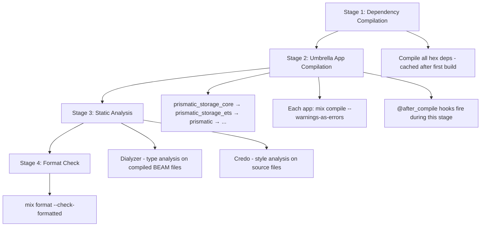
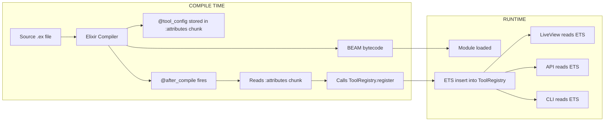

+++
title = "Compile-Time"
weight = 50
[extra]
description = "The build phase during which source code is transformed into executable artifacts, enabling static analysis, macro expansion, and configuration validation before runtime"
category = "architecture"
subcategory = "build_system"
difficulty = "intermediate"
technology_type = "build_phase"
platform_component = "quality_enforcement"
paradigm = "static_analysis"
prerequisite_concepts = ["source_code", "bytecode", "abstract_syntax_tree", "module_system"]
use_cases = ["macro_expansion", "self_registration", "type_checking", "configuration_validation", "code_generation", "quality_gates"]
benefits = ["early_error_detection", "zero_runtime_cost", "code_generation", "type_safety", "self_registration"]
implementation_patterns = ["after_compile_hooks", "module_attributes", "compile_env", "macro_expansion", "beam_chunks"]
quality_metrics = ["compile_time_duration", "warning_count", "dialyzer_errors", "credo_violations"]
integration_points = ["mix", "dialyzer", "credo", "beam_lib", "code_module", "openapi_spex"]
related_disciplines = ["compiler_design", "metaprogramming", "static_analysis", "type_theory"]
related_terms = ["compilation", "ast", "credo", "code-quality", "configuration", "mix", "dialyzer", "macro", "behaviour", "protocol", "beam", "module-attribute", "metaprogramming", "elixir"]
complexity_level = "intermediate"
platform_integration = "core"
author = "Tomas Korcak (korczis)"
reading_time = "15 min"
date_created = "2026-02-23"
date_modified = "2026-04-08"
keywords = ["compile-time", "build phase", "macro expansion", "static analysis", "BEAM compilation", "glossary", "Prismatic Platform", "@after_compile", "module attributes", "Dialyzer", "warnings-as-errors"]
tags = ["glossary", "architecture", "elixir", "compile-time", "metaprogramming"]
quality_score = 92
word_count = 3700
see_also = ["capabilities", "architecture", "quality-floor"]
image = "/images/sections/glossary.png"
image_alt = "Compile-Time - Prismatic Platform"
+++

## Definition

Compile-time refers to the phase of the software build process during which source code is transformed into executable artifacts -- bytecode, machine code, or intermediate representations. In statically-typed languages, compile-time is where type checking occurs; in dynamically-typed languages with [macro](@/glossary/macro.md) systems (like [Elixir](@/glossary/elixir.md)), compile-time is where macro expansion, code generation, and module attribute evaluation happen. The distinction between compile-time and runtime is fundamental to understanding where validation, optimization, and configuration occur in a system.

Compile-time represents a unique opportunity: any validation, computation, or code generation performed during compilation incurs zero runtime cost. A value computed at compile-time is embedded directly in the [BEAM](@/glossary/beam.md) bytecode as a literal. An error caught at compile-time is caught before any user encounters it. The Prismatic Platform exploits this opportunity aggressively -- compile-time serves as the first quality gate, the self-registration mechanism, and the foundation for API auto-discovery.

## Overview

Elixir's compile-time capabilities are exceptionally powerful due to its macro system, inherited from Lisp traditions. Elixir [macros](@/glossary/macro.md) operate on the [AST](@/glossary/ast.md) (Abstract Syntax Tree) at compile-time, enabling code generation, DSL creation, and compile-time validation patterns that would require runtime reflection in most other languages. The `@after_compile` callback is particularly significant -- it allows modules to execute code immediately after compilation, enabling self-registration patterns that form the backbone of the Prismatic Platform's dynamic capabilities.

### Compile-Time vs. Runtime Spectrum

The boundary between compile-time and runtime is not always sharp. Elixir has several intermediate phases:

| Phase | When | What Happens | Example |
|-------|------|-------------|---------|
| **Parse time** | Source → AST | Syntax validated, tokens produced | `def foo do` parsed to AST nodes |
| **Macro expansion** | AST → expanded AST | Macros generate code | `use GenServer` expands to callbacks |
| **Module compilation** | Expanded AST → BEAM bytecode | Type annotations embedded, attributes stored | `@moduledoc`, `@spec` stored in chunks |
| **After-compile hooks** | Post-bytecode generation | Side effects on compiled module | Self-registration in ETS |
| **Application start** | OTP boot sequence | Supervisors start, registries populate | GenServer.start_link |
| **Runtime** | Request handling | Business logic executes | HTTP request → response |

Each phase offers different opportunities and constraints:

```elixir
# Parse time: syntax must be valid
def example do
  # Macro expansion time: use/import/require expand here
  use GenServer

  # Module compilation time: attributes evaluated here
  @compile_time_value Application.compile_env(:my_app, :key)

  # Runtime: this code executes when the function is called
  Application.get_env(:my_app, :runtime_key)
end
```

### The Compile-Time / Runtime Trap

A critical gotcha in Elixir: `Application.get_env/2` called at the module level (outside a function body) executes at compile-time, not runtime. This means the value is frozen when the module compiles and won't reflect runtime configuration changes. This caused the infamous `Mix.env()` crash in releases -- `Mix.env()` is a compile-time function that doesn't exist in release builds.

```elixir
# ❌ DANGEROUS: Evaluated at compile-time, frozen in bytecode
defmodule MyModule do
  @api_url Application.get_env(:my_app, :api_url)  # Compile-time value!

  def fetch do
    HTTPClient.get(@api_url)  # Uses whatever value was set during compilation
  end
end

# ✅ CORRECT: Use Application.compile_env for explicit compile-time
defmodule MyModule do
  @api_url Application.compile_env(:my_app, :api_url)  # Explicit compile-time

  def fetch do
    # For runtime-configurable values, read in function body
    url = Application.get_env(:my_app, :api_url)
    HTTPClient.get(url)
  end
end

# ❌ CRASHES IN RELEASE: Mix.env() doesn't exist at runtime
defmodule MyModule do
  if Mix.env() == :test do  # Only works during compilation
    def test_helper, do: :ok
  end
end

# ✅ CORRECT: Use compile_env for environment-specific behavior
defmodule MyModule do
  @env Application.compile_env(:my_app, :env)

  if @env == :test do
    def test_helper, do: :ok
  end
end
```

## Technical Deep Dive

### BEAM Compilation Pipeline

Elixir source code undergoes multiple transformations before becoming executable BEAM bytecode:

```mermaid
flowchart LR
    A[.ex source] --> B[Elixir Tokenizer]
    B --> C[Elixir Parser]
    C --> D[AST]
    D --> E[Macro Expansion]
    E --> F[Expanded AST]
    F --> G[Elixir Compiler]
    G --> H[Erlang Abstract Format]
    H --> I[Erlang Compiler]
    I --> J[BEAM Bytecode .beam]
    J --> K[BEAM VM executes]
```



Each `.beam` file contains multiple "chunks" of data:

| Chunk | Content | Access |
|-------|---------|--------|
| `Code` | BEAM opcodes | VM execution |
| `Atom` | Atom table | Internal use |
| `StrT` | String table | Internal use |
| `FunT` | Function table | Module info |
| `ExpT` | Export table | Public functions |
| `Docs` | Documentation | `Code.fetch_docs/1` |
| `Type` | Type specifications | `Code.Typespec.fetch_specs/1` |
| `Attr` | Module attributes | `:beam_lib.chunks/2` |
| `Dbgi` | Debug info (AST) | Dialyzer, debugger |

The platform's API auto-discovery reads `Docs`, `Type`, and `Attr` chunks from compiled BEAM files to build the [OpenAPI](@/glossary/openapi-spec.md) specification without requiring any manual endpoint configuration.

### Self-Registration via @after_compile

The `@after_compile` hook fires immediately after a module's bytecode is generated, enabling the platform's zero-configuration registration pattern:

```elixir
defmodule PrismaticOsintCore.Tool do
  @moduledoc """
  Behaviour and compile-time self-registration for OSINT tools.
  The @after_compile hook fires immediately after the module compiles,
  extracting config from BEAM chunks and registering in ETS.
  """

  defmacro __using__(_opts) do
    quote do
      @behaviour PrismaticOsintCore.Tool
      @before_compile PrismaticOsintCore.Tool
      @after_compile PrismaticOsintCore.Tool

      import PrismaticOsintCore.Tool, only: [register_tool: 1]
    end
  end

  defmacro register_tool(config) do
    quote do
      @tool_config unquote(config)
      Module.put_attribute(__MODULE__, :registered_tool, unquote(config))
    end
  end

  def __after_compile__(env, _bytecode) do
    module = env.module

    case :beam_lib.chunks(module, [:attributes]) do
      {:ok, {^module, [{:attributes, attrs}]}} ->
        case Keyword.get(attrs, :registered_tool) do
          nil -> :ok
          config -> PrismaticOsintCore.ToolRegistry.register(module, config)
        end

      _ ->
        :ok
    end
  end
end

# Usage in an OSINT adapter:
defmodule PrismaticOsintSources.CzechAres do
  use PrismaticOsintCore.Tool

  register_tool(%{
    name: "Czech ARES",
    slug: :czech_ares,
    category: :czech,
    description: "Czech Business Registry (ARES)",
    input_fields: [%{name: :query, type: :text, required: true}]
  })

  @impl true
  def search(%{query: query}) do
    # Implementation...
  end
end
# When this module compiles, @after_compile automatically registers
# it in the ToolRegistry. No manual registration needed.
```

This pattern is replicated across three subsystems:

| Registry | Domain | Items | Hook |
|----------|--------|-------|------|
| `ToolRegistry` | OSINT | 157 adapters | `@after_compile` |
| `TopicRegistry` | Academy | 4+ topics | `@after_compile` |
| `SourceRegistry` | DD | 10 sources | `@after_compile` |

### Compile-Time Configuration Validation

```elixir
defmodule PrismaticConfig.CompileTimeValidator do
  @moduledoc """
  Validates configuration at compile-time using module attributes.
  Catches configuration errors during build rather than at startup.
  """

  defmacro validate_config!(config_key, schema) do
    quote do
      @config_value Application.compile_env(:prismatic, unquote(config_key))

      case PrismaticConfig.CompileTimeValidator.validate_against_schema(
        @config_value,
        unquote(schema)
      ) do
        :ok ->
          :ok

        {:error, reason} ->
          raise CompileError,
            description: "Invalid config for #{inspect(unquote(config_key))}: #{reason}"
      end
    end
  end

  @spec validate_against_schema(term(), map()) :: :ok | {:error, String.t()}
  def validate_against_schema(nil, %{required: true}), do: {:error, "required but missing"}
  def validate_against_schema(nil, _schema), do: :ok
  def validate_against_schema(val, %{type: :string}) when is_binary(val), do: :ok
  def validate_against_schema(val, %{type: :integer}) when is_integer(val), do: :ok
  def validate_against_schema(val, %{type: :boolean}) when is_boolean(val), do: :ok
  def validate_against_schema(val, %{type: :list}) when is_list(val), do: :ok
  def validate_against_schema(val, %{type: type}), do: {:error, "expected #{type}, got #{inspect(val)}"}
end
```

### Compile-Time Code Generation with Macros

Macros enable generating repetitive code patterns at compile-time, eliminating runtime overhead and boilerplate:

```elixir
defmodule PrismaticOsintCore.ToolDSL do
  @moduledoc """
  DSL macros for defining OSINT tools with compile-time validation.
  Generates the full tool implementation from a declarative specification.
  """

  defmacro deftool(name, opts) do
    slug = Keyword.fetch!(opts, :slug)
    category = Keyword.fetch!(opts, :category)
    fields = Keyword.get(opts, :fields, [])

    quote do
      @tool_name unquote(name)
      @tool_slug unquote(slug)
      @tool_category unquote(category)
      @tool_fields unquote(Macro.escape(fields))

      register_tool(%{
        name: @tool_name,
        slug: @tool_slug,
        category: @tool_category,
        input_fields: @tool_fields
      })

      # Generate validation function at compile-time
      @spec validate_input(map()) :: :ok | {:error, String.t()}
      def validate_input(input) do
        required_fields = Enum.filter(@tool_fields, & &1.required)

        missing = Enum.reject(required_fields, fn field ->
          Map.has_key?(input, field.name)
        end)

        case missing do
          [] -> :ok
          fields -> {:error, "Missing required fields: #{inspect(Enum.map(fields, & &1.name))}"}
        end
      end
    end
  end
end
```

### Module Attributes as Compile-Time Constants

Module attributes evaluated at compile-time are embedded directly in BEAM bytecode as literals:

```elixir
defmodule PrismaticSafety.DoctrineConfig do
  @moduledoc """
  Compile-time doctrine configuration.
  Values are embedded in bytecode -- zero runtime lookup cost.
  """

  # These are evaluated at compile-time and stored as BEAM constants
  @pillars [:zero, :perf, :seal, :deps, :docs, :otel, :gitl,
            :know, :rdme, :nllb, :hygiene, :nmnd, :nwb, :fllm,
            :m5m, :nclb, :tach, :three_nl]

  @blocking_pillars [:zero, :seal, :perf, :hygiene, :nmnd, :tach, :docs, :deps, :rdme]

  @pillar_count length(@pillars)      # Computed at compile-time: 18
  @blocking_count length(@blocking_pillars)  # Computed at compile-time: 9

  # These functions return compile-time constants -- no computation at runtime
  def all_pillars, do: @pillars
  def blocking_pillars, do: @blocking_pillars
  def pillar_count, do: @pillar_count
  def blocking_count, do: @blocking_count
end
```

## Compile-Time Quality Gates

The Prismatic Platform uses compile-time as its first line of defense:

| Gate | Tool | Flag | Enforcement |
|------|------|------|-------------|
| Zero warnings | `mix compile` | `--warnings-as-errors` | BLOCKING |
| Type specs | Dialyzer | `--halt-exit-status` | BLOCKING |
| Style | [Credo](@/glossary/credo.md) | `--strict` | BLOCKING |
| Format | `mix format` | `--check-formatted` | BLOCKING |
| Forbidden patterns | Custom | `mix quality.forbidden_patterns` | BLOCKING |
| Module docs | Credo | `Credo.Check.Readability.ModuleDoc` | WARNING |
| Unused deps | `mix deps.unlock --check-unused` | | WARNING |

### The --warnings-as-errors Flag

This single compiler flag is the most impactful quality gate in the platform:

```bash
mix compile --warnings-as-errors --force
```

It catches at compile-time:
- Unused variables and imports
- Missing function clauses (pattern match coverage)
- Deprecated function calls
- Undefined function references
- Module attribute type mismatches
- Unreachable code paths

Without this flag, these issues become runtime surprises. With it, they block the build immediately.

### Dialyzer Type Analysis

[Dialyzer](@/glossary/dialyzer.md) (Discrepancy Analyzer for Erlang/Elixir) performs compile-time type analysis using success typing. It reads `@spec` annotations from compiled BEAM files and identifies type inconsistencies:

```elixir
# Dialyzer catches this at compile-time:
@spec process(String.t()) :: {:ok, integer()}
def process(input) do
  {:ok, String.length(input)}  # ✅ Returns integer

  {:ok, "not_an_integer"}      # ❌ Dialyzer flags: returns String.t(), not integer()
end
```

## Architecture and Implementation

### Compilation Pipeline in the Prismatic Platform

The platform's compilation is a multi-stage process orchestrated by [Mix](@/glossary/mix.md):



### How Self-Registration Flows



### Compile-Time Cost Amortization

The key insight driving the platform's compile-time strategy: **pay once at build time, benefit at every runtime invocation**.

| Operation | Compile-Time Cost | Runtime Cost |
|-----------|------------------|-------------|
| Tool registration | ~1ms per tool (157 total) | 0ms (ETS lookup) |
| Config validation | ~5ms per module | 0ms (errors prevented) |
| Macro expansion | ~50ms total | 0ms (code pre-generated) |
| Warning checks | ~10s full build | 0ms (bugs prevented) |
| Dialyzer | ~60s full PLT | 0ms (type errors prevented) |

## Usage in Prismatic Platform

### Pre-Commit Phase 1: Compilation

The 11-phase pre-commit hook starts with compilation as Phase 1, establishing the foundational quality gate. If code does not compile cleanly with `--warnings-as-errors`, no further checks run -- the commit is blocked immediately.

```bash
# Pre-commit Phase 1
mix compile --warnings-as-errors --force
# If this fails, the commit is rejected before any other checks run
```

### API Auto-Discovery

The API [gateway](@/glossary/gateway.md) (`prismatic_api`) leverages compile-time information for its auto-introspection capabilities. At boot time, it scans compiled BEAM files:

```elixir
# Reading compile-time metadata at runtime
defmodule PrismaticApi.Introspector do
  @spec discover_functions(module()) :: list(map())
  def discover_functions(module) do
    # Read documentation from compiled BEAM chunks
    {:docs_v1, _, _, _, _, _, docs} = Code.fetch_docs(module)

    # Read type specifications from compiled BEAM chunks
    {:ok, specs} = Code.Typespec.fetch_specs(module)

    # Combine into endpoint specifications
    Enum.map(docs, fn {{:function, name, arity}, _, _, doc, _} ->
      spec = Enum.find(specs, fn {^name, ^arity} -> true; _ -> false end)

      %{
        function: name,
        arity: arity,
        doc: doc,
        spec: spec
      }
    end)
  end
end
```

### Academy Topic Registration

The Academy's [metaprogramming](@/glossary/metaprogramming.md) system uses compile-time topic registration:

```elixir
defmodule PrismaticAcademy.Topic do
  defmacro __using__(_opts) do
    quote do
      @after_compile PrismaticAcademy.TopicRegistrar

      import PrismaticAcademy.Topic, only: [register_topic: 1]
    end
  end
end

# When this module compiles, the topic auto-registers:
defmodule PrismaticAcademy.Topics.ElixirOtp do
  use PrismaticAcademy.Topic

  register_topic(%{
    name: "Elixir & OTP Fundamentals",
    slug: :elixir_otp,
    level: :beginner,
    prerequisites: []
  })
end
```

## Common Pitfalls

| Pitfall | Description | Solution |
|---------|------------|----------|
| `Application.get_env` at module level | Value frozen at compile-time | Use `Application.compile_env` (explicit) or read in function body |
| `Mix.env()` in release | Mix doesn't exist in releases | Use `Application.compile_env(:my_app, :env)` |
| Heavy computation in macros | Slows every recompilation | Cache results, minimize macro complexity |
| `@after_compile` side effects | Unreliable order between modules | Use GenServer registries that handle out-of-order registration |
| Conditional compilation on Mix.env | Compiled code differs by env | Prefer runtime config for env-specific behavior |
| Module attribute mutation | Attributes are append-only during compilation | Use `Module.put_attribute` with accumulate: true |

## Best Practices

1. **Use `--warnings-as-errors` always**: Never ship code with compilation warnings
2. **Prefer `Application.compile_env` over `Application.get_env`** at module level -- it makes the compile-time dependency explicit and triggers recompilation when config changes
3. **Keep macros simple**: Complex macros slow compilation and are hard to debug. Prefer functions when possible
4. **Validate early**: If something can be validated at compile-time, validate it at compile-time
5. **Document compile-time behavior**: Use `@moduledoc` to explain which values are compile-time constants
6. **Never use `Mix.env()` in library code**: It doesn't exist in releases
7. **Test macro output**: Write tests that verify the code generated by macros, not just the macro invocation

## Related Terms

- [Compilation](@/glossary/compilation.md) -- the full build process that encompasses compile-time
- [AST](@/glossary/ast.md) -- abstract syntax tree manipulated at compile-time by macros
- [Macro](@/glossary/macro.md) -- code that generates code during compilation
- [Metaprogramming](@/glossary/metaprogramming.md) -- programming techniques that operate at compile-time
- [BEAM](@/glossary/beam.md) -- virtual machine that executes compiled bytecode
- [Mix](@/glossary/mix.md) -- build tool that orchestrates the compilation pipeline
- [Dialyzer](@/glossary/dialyzer.md) -- compile-time type analysis tool
- [Credo](@/glossary/credo.md) -- compile-time static analysis for code quality
- [Module Attribute](/glossary/module-attribute/) -- compile-time metadata stored in BEAM chunks
- [Behaviour](@/glossary/behaviour.md) -- compile-time callback specifications
- [Protocol](@/glossary/protocol.md) -- compile-time polymorphic dispatch definitions
- [Elixir](@/glossary/elixir.md) -- the language with powerful compile-time capabilities
- [Code Quality](@/glossary/code-quality.md) -- quality enforcement that starts at compile-time
- [Configuration](@/glossary/configuration.md) -- settings that can be validated at compile-time

## See Also

- [Architecture](@/architecture/_index.md) -- platform architecture leveraging compile-time patterns
- [Capabilities](@/capabilities/_index.md) -- capabilities enabled by compile-time code generation
- [Quality Gates](/quality/) -- quality enforcement starting at compilation

---

## Connect & Contribute

**Created by [Tomas Korcak (korczis)](https://github.com/korczis)** | Open Source under [GHL](https://github.com/korczis/prismatic-platform/blob/main/LICENSE)

- [GitHub](https://github.com/korczis/prismatic-platform) | [GitLab](https://gitlab.com/korczis/prismatic-platform) | [LinkedIn](https://linkedin.com/in/korczis) | [Contact](mailto:korczis@gmail.com)
- [Developer Portal](@/developers/_index.md) | [Architecture](@/architecture/_index.md) | [Meet the Creator](@/about/author.md)
