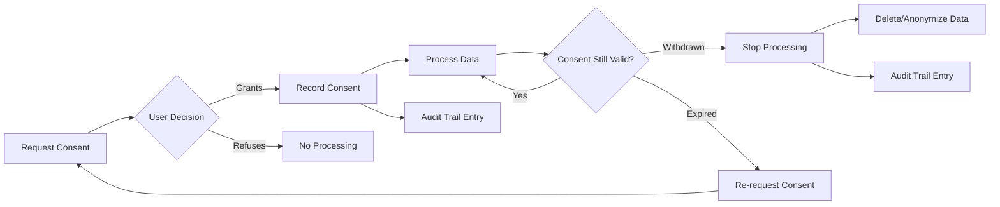
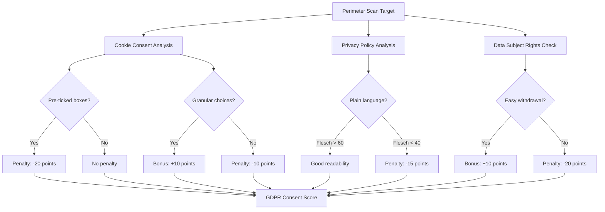

+++
title = "Consent"
weight = 50
[extra]
description = "A GDPR legal basis requiring freely given, specific, informed, and unambiguous agreement from a data subject before their personal data can be processed"
category = "privacy"
subcategory = "data_protection"
difficulty = "intermediate"
technology_type = "legal_concept"
platform_component = "compliance_engine"
paradigm = "privacy_by_design"
prerequisite_concepts = ["gdpr", "personal_data", "data_processing", "legal_basis"]
use_cases = ["user_data_collection", "cookie_consent", "marketing_opt_in", "osint_compliance_assessment", "third_party_data_sharing", "perimeter_gdpr_scoring"]
benefits = ["legal_compliance", "user_trust", "transparent_processing", "audit_readiness", "regulatory_safety"]
implementation_patterns = ["append_only_records", "event_sourcing", "consent_versioning", "purpose_limitation", "granular_consent"]
quality_metrics = ["consent_rate", "withdrawal_rate", "audit_completeness", "consent_freshness"]
integration_points = ["ecto", "postgresql", "perimeter", "osint", "academy", "compliance"]
related_disciplines = ["data_protection_law", "privacy_engineering", "compliance_management", "user_experience"]
related_terms = ["compliance", "credential", "audit-trail", "authentication", "authorization", "gdpr", "data-breach", "encryption", "nis2", "perimeter", "osint", "data-quality", "changeset", "ecto"]
complexity_level = "intermediate"
platform_integration = "supporting"
author = "Tomas Korcak (korczis)"
reading_time = "15 min"
date_created = "2026-02-23"
date_modified = "2026-04-08"
keywords = ["consent", "GDPR", "data protection", "privacy", "data subject rights", "lawful basis", "glossary", "Prismatic Platform", "Article 7", "consent withdrawal", "cookie consent", "privacy by design"]
tags = ["glossary", "privacy", "compliance", "gdpr"]
quality_score = 92
word_count = 3800
see_also = ["capabilities", "architecture", "compliance"]
image = "/images/sections/glossary.png"
image_alt = "Consent - Prismatic Platform"
+++

## Definition

Consent, under the General Data Protection Regulation (GDPR, EU 2016/679), is one of six lawful bases for processing personal data. Article 4(11) defines consent as "any freely given, specific, informed and unambiguous indication of the data subject's wishes by which he or she, by a statement or by a clear affirmative action, signifies agreement to the processing of personal data relating to him or her." This definition sets a high bar: pre-ticked boxes, silence, and inactivity do not constitute valid consent.

The four requirements for valid GDPR consent are: freely given (no coercion, power imbalance, or bundled consent), specific (tied to a particular processing purpose), informed (clear explanation of what data is collected and why), and unambiguous (requiring a clear affirmative act). Additionally, consent must be withdrawable at any time, with withdrawal as easy as granting consent. Controllers must maintain auditable records demonstrating that valid consent was obtained.

## Overview

### The Six Lawful Bases for Processing

Consent is one of six lawful bases under GDPR Article 6(1). Understanding where consent sits among alternatives is crucial for choosing the right legal basis:

| Lawful Basis | Article | When to Use | Consent Needed? |
|-------------|---------|-------------|----------------|
| **Consent** | 6(1)(a) | Optional data collection (marketing, analytics) | Yes, explicit |
| **Contract** | 6(1)(b) | Necessary for service delivery | No |
| **Legal Obligation** | 6(1)(c) | Required by law (tax records, AML) | No |
| **Vital Interests** | 6(1)(d) | Life-threatening situations | No |
| **Public Interest** | 6(1)(e) | Government/public authority tasks | No |
| **Legitimate Interest** | 6(1)(f) | Balanced business needs (fraud prevention) | No, but requires balancing test |

A common mistake is defaulting to consent when another basis is more appropriate. Using consent when contract performance suffices creates unnecessary complexity and gives users a withdrawal right that could disrupt service delivery.

### Consent Lifecycle



### Consent vs Other Privacy Patterns

| Pattern | Scope | Binding | Revocable | GDPR Article |
|---------|-------|---------|-----------|-------------|
| **Consent** | Specific purpose | Legally binding | Yes, any time | Art. 6(1)(a) |
| **Opt-in** | Marketing preference | Business rule | Yes | Art. 7 |
| **Opt-out** | Default processing | Business rule | Yes | Not sufficient for GDPR |
| **Notice** | Informing about processing | One-way | N/A | Art. 13/14 |
| **Agreement** | Contract terms | Legally binding | Per contract terms | Art. 6(1)(b) |

## Technical Deep Dive

### GDPR Consent Requirements

| Requirement | Article | Description | Validation Method |
|-------------|---------|-------------|-------------------|
| **Freely Given** | Art. 7(4) | Not a condition for service, no power imbalance | Unbundled consent checks |
| **Specific** | Art. 6(1)(a) | Per-purpose consent, not blanket | Purpose limitation audit |
| **Informed** | Art. 13/14 | Clear, plain language, identity of controller | Readability analysis (Flesch score) |
| **Unambiguous** | Art. 4(11) | Clear affirmative action, no pre-ticked boxes | UI [pattern](@/glossary/pattern-matching.md) analysis |
| **Withdrawable** | Art. 7(3) | Easy withdrawal mechanism, as easy as granting | Withdrawal flow test |
| **Documented** | Art. 7(1) | Demonstrable consent record with timestamp | [Audit trail](@/glossary/audit-trail.md) verification |
| **Age-verified** | Art. 8 | Parental consent for children (<16 in most EU states) | Age gate validation |

### Special Categories (Article 9)

Processing of sensitive data (health, biometrics, political opinions, ethnic origin, religious beliefs, sexual orientation) requires **explicit** consent -- a higher bar than standard consent. Explicit consent must be:

- Expressly confirmed in words ("I consent to...")
- Not inferred from conduct
- Specific to each category of sensitive data
- Documented with the exact wording presented

### Consent Record Architecture

The consent management architecture follows an append-only, [event-sourced](@/glossary/event-sourcing.md) pattern. Every consent action produces an immutable record. Current consent state is derived from the latest record per (subject, purpose) pair.

```elixir
defmodule PrismaticPrivacy.ConsentRecord do
  @moduledoc """
  Immutable consent record for GDPR compliance.
  
  Every consent grant and withdrawal produces an auditable record.
  Records are append-only -- consent state is derived from the
  latest record per (subject, purpose) pair. This design satisfies
  GDPR Article 7(1): "the controller shall be able to demonstrate
  that the data subject has consented."
  """

  use Ecto.Schema
  import Ecto.Changeset

  @type action :: :granted | :withdrawn
  @type t :: %__MODULE__{
    id: Ecto.UUID.t(),
    subject_id: String.t(),
    purpose: String.t(),
    action: action(),
    legal_basis: String.t(),
    version: String.t(),
    consent_text: String.t(),
    ip_address: String.t() | nil,
    user_agent: String.t() | nil,
    metadata: map(),
    recorded_at: DateTime.t()
  }

  @primary_key {:id, :binary_id, autogenerate: true}
  schema "consent_records" do
    field :subject_id, :string
    field :purpose, :string
    field :action, Ecto.Enum, values: [:granted, :withdrawn]
    field :legal_basis, :string
    field :version, :string
    field :consent_text, :string
    field :ip_address, :string
    field :user_agent, :string
    field :metadata, :map, default: %{}
    field :recorded_at, :utc_datetime_usec
  end

  @doc """
  Creates a validated consent record changeset.
  All required fields are enforced -- incomplete consent records
  are rejected to maintain audit integrity.
  """
  @spec changeset(t(), map()) :: Ecto.Changeset.t()
  def changeset(record, attrs) do
    record
    |> cast(attrs, [:subject_id, :purpose, :action, :legal_basis,
                     :version, :consent_text, :ip_address, :user_agent,
                     :metadata, :recorded_at])
    |> validate_required([:subject_id, :purpose, :action, :legal_basis,
                          :version, :recorded_at])
    |> validate_inclusion(:action, [:granted, :withdrawn])
    |> validate_length(:purpose, min: 1, max: 255)
  end
end
```

### Consent Management Engine

```elixir
defmodule PrismaticPrivacy.ConsentManager do
  @moduledoc """
  Manages consent lifecycle: grant, verify, withdraw, audit.
  
  All operations produce immutable audit records in an append-only table.
  Consent state is always derived from the latest record, never cached,
  ensuring real-time accuracy for compliance verification.
  """

  alias PrismaticPrivacy.ConsentRecord
  alias Prismatic.Repo

  import Ecto.Query

  require Logger

  @spec grant_consent(String.t(), String.t(), map()) :: {:ok, ConsentRecord.t()} | {:error, Ecto.Changeset.t()}
  def grant_consent(subject_id, purpose, context) do
    attrs = %{
      subject_id: subject_id,
      purpose: purpose,
      action: :granted,
      legal_basis: "GDPR Art. 6(1)(a)",
      version: consent_version(purpose),
      consent_text: Map.get(context, :consent_text, ""),
      ip_address: Map.get(context, :ip_address),
      user_agent: Map.get(context, :user_agent),
      metadata: Map.get(context, :metadata, %{}),
      recorded_at: DateTime.utc_now()
    }

    %ConsentRecord{}
    |> ConsentRecord.changeset(attrs)
    |> Repo.insert()
    |> tap(fn
      {:ok, record} ->
        :telemetry.execute(
          [:prismatic, :privacy, :consent, :granted],
          %{count: 1},
          %{purpose: purpose, subject_id: subject_id}
        )
        Logger.info("Consent granted: subject=#{subject_id} purpose=#{purpose}")

      {:error, _} -> :ok
    end)
  end

  @spec withdraw_consent(String.t(), String.t()) :: {:ok, ConsentRecord.t()} | {:error, Ecto.Changeset.t()}
  def withdraw_consent(subject_id, purpose) do
    attrs = %{
      subject_id: subject_id,
      purpose: purpose,
      action: :withdrawn,
      legal_basis: "GDPR Art. 7(3)",
      version: consent_version(purpose),
      recorded_at: DateTime.utc_now()
    }

    %ConsentRecord{}
    |> ConsentRecord.changeset(attrs)
    |> Repo.insert()
    |> tap(fn
      {:ok, _} ->
        :telemetry.execute(
          [:prismatic, :privacy, :consent, :withdrawn],
          %{count: 1},
          %{purpose: purpose, subject_id: subject_id}
        )
        Logger.info("Consent withdrawn: subject=#{subject_id} purpose=#{purpose}")

      {:error, _} -> :ok
    end)
  end

  @doc """
  Checks whether a subject has active consent for a given purpose.
  Always reads from database (no caching) for real-time accuracy.
  """
  @spec has_consent?(String.t(), String.t()) :: boolean()
  def has_consent?(subject_id, purpose) do
    query = from r in ConsentRecord,
      where: r.subject_id == ^subject_id and r.purpose == ^purpose,
      order_by: [desc: r.recorded_at],
      limit: 1,
      select: r.action

    case Repo.one(query) do
      :granted -> true
      _ -> false
    end
  end

  @doc """
  Returns the complete consent audit trail for a subject.
  Ordered chronologically for compliance review.
  """
  @spec get_consent_audit(String.t()) :: [ConsentRecord.t()]
  def get_consent_audit(subject_id) do
    from(r in ConsentRecord,
      where: r.subject_id == ^subject_id,
      order_by: [asc: r.recorded_at]
    )
    |> Repo.all()
  end

  @doc """
  Returns all active consents for a subject (latest grant without subsequent withdrawal).
  """
  @spec active_consents(String.t()) :: [%{purpose: String.t(), granted_at: DateTime.t()}]
  def active_consents(subject_id) do
    # Get latest record per purpose using a window function
    subquery = from r in ConsentRecord,
      where: r.subject_id == ^subject_id,
      distinct: [r.purpose],
      order_by: [r.purpose, desc: r.recorded_at]

    from(r in subquery, where: r.action == :granted)
    |> Repo.all()
    |> Enum.map(&%{purpose: &1.purpose, granted_at: &1.recorded_at})
  end

  @spec consent_version(String.t()) :: String.t()
  defp consent_version(purpose) do
    # Version tracks privacy policy changes per purpose
    Application.get_env(:prismatic_privacy, :consent_versions, %{})
    |> Map.get(purpose, "1.0.0")
  end
end
```

### Consent-Gated Processing

```elixir
defmodule PrismaticPrivacy.ConsentGate do
  @moduledoc """
  Plug-style consent verification for data processing pipelines.
  Ensures processing only occurs when valid consent exists.
  """

  @spec verify_consent!(String.t(), String.t()) :: :ok | no_return()
  def verify_consent!(subject_id, purpose) do
    unless PrismaticPrivacy.ConsentManager.has_consent?(subject_id, purpose) do
      raise PrismaticPrivacy.ConsentRequiredError,
        message: "No active consent for purpose '#{purpose}' from subject '#{subject_id}'",
        subject_id: subject_id,
        purpose: purpose
    end

    :ok
  end

  @doc """
  Wraps a processing function with consent verification.
  Processing only executes if consent is active.
  """
  @spec with_consent(String.t(), String.t(), (-> term())) :: {:ok, term()} | {:error, :no_consent}
  def with_consent(subject_id, purpose, processing_fn) do
    if PrismaticPrivacy.ConsentManager.has_consent?(subject_id, purpose) do
      {:ok, processing_fn.()}
    else
      {:error, :no_consent}
    end
  end
end
```

## Usage in Prismatic Platform

### Internal Consent Management

The Prismatic Platform manages consent for platform users in two contexts:

1. **Analytics consent**: Optional usage analytics for platform improvement
2. **Communication consent**: Email notifications and updates

Both follow the append-only pattern with versioned consent text, ensuring that if the privacy policy changes, previously granted consents are associated with the version the user actually saw.

### External Compliance Assessment (Perimeter)

The [Perimeter](/glossary/perimeter/) [compliance](@/glossary/compliance.md) engine evaluates external organizations' consent mechanisms as part of GDPR scoring:



### OSINT Consent Boundaries

The [OSINT](@/glossary/osint.md) toolbox's operations must respect consent boundaries when processing personal data. Tools that return personal information include consent-relevance metadata:

```elixir
defmodule PrismaticOsintCore.ConsentClassifier do
  @moduledoc """
  Classifies OSINT tool results by consent relevance.
  Flags results containing personal data that may require
  consent verification before further processing.
  """

  @personal_data_indicators ["email", "phone", "address", "name", "dob", "ssn"]

  @spec classify_result(map()) :: :public_data | :potentially_personal | :personal_data
  def classify_result(result) when is_map(result) do
    keys = result |> Map.keys() |> Enum.map(&to_string/1) |> Enum.map(&String.downcase/1)

    personal_matches = Enum.count(keys, fn key ->
      Enum.any?(@personal_data_indicators, &String.contains?(key, &1))
    end)

    cond do
      personal_matches >= 3 -> :personal_data
      personal_matches >= 1 -> :potentially_personal
      true -> :public_data
    end
  end
end
```

### NIS2 Consent Requirements

The Czech NIS2 implementation adds additional consent requirements for critical infrastructure entities. The [CER compliance](@/glossary/nis2.md) module tracks these alongside GDPR requirements.

## Cookie Consent Patterns

### Compliant Pattern (Flowbite-based)

```html
<!-- FLLM-compliant cookie consent banner using Tailwind/Flowbite -->
<div id="cookie-consent" class="fixed bottom-0 inset-x-0 z-50 p-4 bg-gray-900 border-t border-gray-700">
  <div class="max-w-7xl mx-auto flex flex-col sm:flex-row items-center justify-between gap-4">
    <p class="text-sm text-gray-300">
      We use cookies to improve your experience. You can customize your preferences below.
    </p>
    <div class="flex gap-3">
      <button phx-click="consent-customize" class="text-sm text-blue-400 hover:text-blue-300">
        Customize
      </button>
      <button phx-click="consent-reject-all" class="px-4 py-2 text-sm bg-gray-700 text-white rounded-lg">
        Reject All
      </button>
      <button phx-click="consent-accept-all" class="px-4 py-2 text-sm bg-blue-600 text-white rounded-lg">
        Accept All
      </button>
    </div>
  </div>
</div>
```

### Non-Compliant Anti-Patterns

| Anti-Pattern | GDPR Violation | Why It Fails |
|-------------|---------------|-------------|
| Pre-ticked checkboxes | Art. 4(11) | Not an affirmative action |
| "By continuing to use..." | Art. 4(11) | Inactivity is not consent |
| No reject option | Art. 7(4) | Consent not freely given |
| Bundled consent (all-or-nothing) | Art. 6(1)(a) | Not specific per purpose |
| Tiny "manage preferences" link | Art. 7(3) | Withdrawal not as easy as granting |
| Cookie wall (block access without consent) | Art. 7(4) | Consent not freely given |
| No consent version tracking | Art. 7(1) | Cannot demonstrate what was consented to |
| Consent before information | Art. 13/14 | Not informed consent |

## Best Practices

1. **Choose the right legal basis** -- don't default to consent if contract performance or legitimate interest applies. Consent creates withdrawal obligations that may disrupt service.
2. **Make consent granular** -- separate consent per purpose (analytics, marketing, third-party sharing). Bundled consent is invalid under GDPR.
3. **Use append-only records** -- never update or delete consent records. State is derived from the latest record.
4. **Version consent text** -- when privacy policies change, old consents reference the version the user actually saw.
5. **Make withdrawal as easy as granting** -- one-click withdrawal, prominently placed. Dark patterns around withdrawal violate Art. 7(3).
6. **Verify consent freshness** -- consent doesn't last forever. Re-request after significant policy changes or after a reasonable time period.
7. **Log context** -- record IP, user agent, timestamp, and exact consent text shown. This demonstrates compliance under audit.
8. **Never cache consent status** -- always read from the authoritative source. Stale cache could process data after withdrawal.

## Common Mistakes

| Mistake | GDPR Risk | Correct Approach |
|---------|-----------|-----------------|
| Using consent for everything | Unnecessary complexity, easy to lose basis | Use contract/legitimate interest where applicable |
| Pre-ticked consent boxes | Art. 4(11) violation, invalid consent | Require explicit affirmative action |
| No withdrawal mechanism | Art. 7(3) violation, regulatory fine | Implement easy one-click withdrawal |
| Caching consent status | Processing after withdrawal | Always query latest record |
| Bundled all-or-nothing consent | Art. 7(4) violation | Granular per-purpose consent |
| No version tracking | Cannot prove what was consented to | Version every consent text change |
| Consent as condition for service | Art. 7(4) violation | Separate optional from essential processing |
| Missing audit trail | Art. 7(1) violation | Append-only immutable records |
| Not re-requesting after policy change | Stale consent | Track consent-to-version mapping |
| Ignoring children's consent | Art. 8 violation | Age verification + parental consent |

## Related Terms

- [Compliance](@/glossary/compliance.md) -- regulatory framework including GDPR consent requirements
- [GDPR](@/glossary/gdpr.md) -- the regulation defining consent requirements
- [NIS2](@/glossary/nis2.md) -- EU directive with additional data protection requirements
- [Audit Trail](@/glossary/audit-trail.md) -- immutable record of consent actions
- [Authentication](@/glossary/authentication.md) -- identity verification prerequisite to consent
- [Authorization](@/glossary/authorization.md) -- access control informed by consent status
- [Data Breach](@/glossary/data-breach.md) -- security incident requiring consent-aware notification
- [Encryption](@/glossary/encryption.md) -- technical measure protecting consented data
- [Credential](@/glossary/credential.md) -- authentication tokens subject to consent for analytics
- [Perimeter](/glossary/perimeter/) -- EASM module assessing external consent mechanisms
- [OSINT](@/glossary/osint.md) -- intelligence gathering with consent boundary awareness
- [Changeset](/glossary/changeset/) -- [Ecto](@/glossary/ecto.md) validation enforcing consent record integrity
- [Event Sourcing](@/glossary/event-sourcing.md) -- architectural pattern underlying consent management
- [Data Quality](@/glossary/data-quality.md) -- quality of consent records and audit completeness

## See Also

- [Capabilities](@/capabilities/_index.md) -- compliance and privacy capabilities
- [Architecture](@/architecture/_index.md) -- consent management architecture
- [Perimeter](/perimeter/) -- GDPR compliance assessment dashboard

---

## Connect & Contribute

**Created by [Tomas Korcak (korczis)](https://github.com/korczis)** | Open Source under [GHL](https://github.com/korczis/prismatic-platform/blob/main/LICENSE)

- [GitHub](https://github.com/korczis/prismatic-platform) | [GitLab](https://gitlab.com/korczis/prismatic-platform) | [LinkedIn](https://linkedin.com/in/korczis) | [Contact](mailto:korczis@gmail.com)
- [Developer Portal](@/developers/_index.md) | [Architecture](@/architecture/_index.md) | [Meet the Creator](@/about/author.md)
