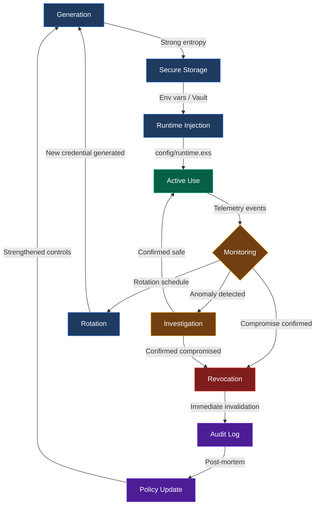
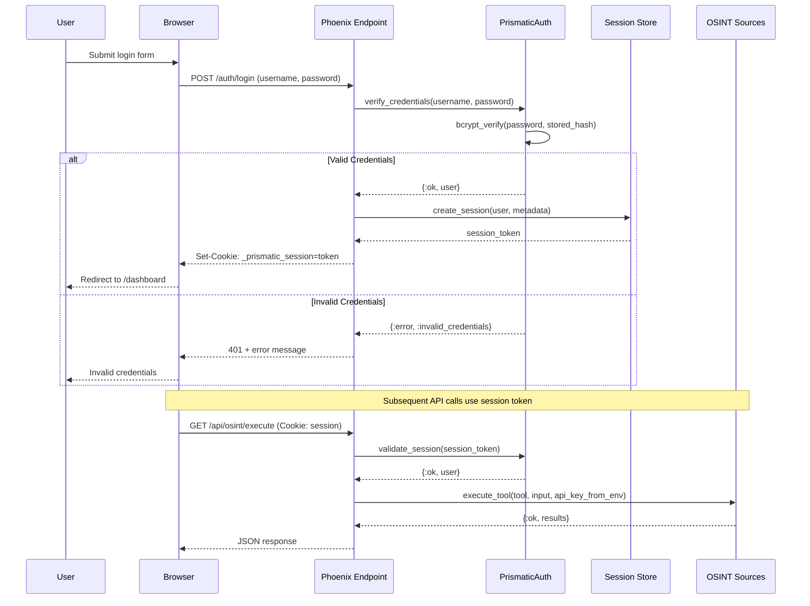

+++
title = "Credential"
weight = 50
[extra]
description = "An authentication token, certificate, API key, or digital artifact used to verify identity and authorize access to protected resources"
category = "security"
subcategory = "security"
difficulty = "intermediate"
technology_type = "security-primitive"
platform_component = "prismatic_auth"
prerequisite_concepts = ["authentication", "authorization", "encryption"]
use_cases = ["authentication", "API access", "OSINT source auth", "secrets management"]
benefits = ["identity verification", "access control", "audit trail", "least privilege enforcement", "automated rotation"]
implementation_patterns = ["environment variables", "vault integration", "runtime injection", "secret rotation"]
quality_metrics = ["rotation frequency", "exposure surface", "scope limitation", "revocation latency"]
integration_points = ["authentication", "authorization", "vault", "environment-variables"]
related_disciplines = ["cryptography", "identity-management", "zero-trust-architecture", "secrets-management"]
related_terms = ["authentication", "authorization", "api-key", "jwt", "oauth", "secret", "encryption", "injection", "seal", "credential-management", "credential-stuffing", "cipher-suite", "certificate", "token", "access-control"]
complexity_level = "intermediate"
platform_integration = "core"
author = "Tomas Korcak (korczis)"
reading_time = "15 min"
date_created = "2026-02-23"
date_modified = "2026-04-08"
keywords = ["credential", "authentication token", "API key", "certificate", "secret management", "vault", "SEAL doctrine", "credential rotation", "OSINT credentials", "glossary", "Prismatic Platform"]
tags = ["glossary", "security", "authentication", "SEAL", "secrets"]
quality_score = 92
word_count = 3800
see_also = ["capabilities", "architecture", "zero-trust", "compliance"]
image = "/images/sections/glossary.png"
image_alt = "Credential - Prismatic Platform"
+++

## Definition

A **credential** is a digital artifact that proves an entity's claimed identity and authorizes access to protected resources. Credentials serve as the foundational bridge between [authentication](@/glossary/authentication.md) (proving who you are) and [authorization](@/glossary/authorization.md) (determining what you can do). Without properly managed credentials, no security boundary can be trusted.

In the context of the Prismatic Platform, credentials govern three critical domains: platform infrastructure access, user session management, and OSINT tool [authentication](@/glossary/authentication.md) for intelligence-gathering operations. The platform's [SEAL](/glossary/seal/) doctrine mandates that credentials never appear in source code, are never logged, and are always injected at runtime through environment variables or secret management systems.

## Overview

### Credential Types

Credentials exist in many forms, each with distinct security properties, lifecycle characteristics, and appropriate use cases. Understanding these differences is essential for selecting the right credential type for each security boundary.

#### Passwords

The oldest and most familiar credential type. A shared secret known only to the user and the verifying system. Passwords are stored as cryptographic hashes (bcrypt, argon2) -- never in plaintext. Their primary weakness is human behavior: users choose weak passwords, reuse them across services, and fall victim to phishing. Password-based [authentication](@/glossary/authentication.md) should always be combined with a second factor.

#### Tokens

Short-lived digital artifacts issued after successful [authentication](@/glossary/authentication.md). [JWT](@/glossary/jwt.md) (JSON Web Tokens) are the most common form, carrying encoded claims about the bearer's identity and permissions. Tokens are self-contained -- the verifier needs only the signing key, not a database lookup. Session tokens, refresh tokens, and [OAuth](@/glossary/oauth.md) access tokens all fall in this category. Their short lifespan limits the damage window if compromised.

#### API Keys

Static strings that identify and [authenticate](@/glossary/authentication.md) a calling application or service. Unlike tokens, API keys typically do not expire automatically and must be rotated manually or through automated rotation policies. They are the primary credential type for OSINT tool integrations in the Prismatic Platform -- services like Shodan, VirusTotal, and Hunter.io all require [API keys](/glossary/api-key/) for programmatic access.

#### Certificates

Cryptographic documents that bind a public key to an identity, verified by a trusted Certificate Authority (CA). TLS certificates secure HTTPS connections, client certificates authenticate services in mutual TLS (mTLS) configurations, and code-signing certificates verify software provenance. Certificates have fixed expiration dates and can be revoked through Certificate Revocation Lists (CRL) or the Online Certificate Status Protocol (OCSP).

#### SSH Keys

Asymmetric key pairs used for server access and Git operations. The private key never leaves the holder's machine; the public key is distributed to servers that should grant access. SSH keys provide strong [authentication](@/glossary/authentication.md) without transmitting secrets over the network. Key rotation and access revocation require removing the public key from authorized hosts.

#### Erlang Distribution Cookies

A platform-specific credential type. The Erlang runtime uses a shared cookie to [authenticate](@/glossary/authentication.md) nodes in a distributed cluster. All nodes sharing the same cookie can communicate freely. This cookie must be treated with the same care as any other [secret](/glossary/secret/) -- if leaked, an attacker can join the cluster and execute arbitrary code on any connected node.

### Credential Properties Comparison

| Type | Scope | Expiration | Revocability | Storage | Rotation Complexity |
|------|-------|-----------|-------------|---------|-------------------|
| **Password** | User identity | None (manual change) | Immediate | Hashed (bcrypt/argon2) | Low |
| **API Key** | Service access | Configurable | Immediate | Env var / secrets manager | Medium |
| **JWT Token** | Session + claims | Short-lived (15m-24h) | Blocklist required | Client-side | Automatic |
| **TLS Certificate** | Server/service identity | 90 days (Let's Encrypt) | CRL/OCSP | File system / cert store | Medium |
| **SSH Key** | Server access | None (manual) | Key removal from hosts | `~/.ssh/` | Medium |
| **OAuth2 Token** | Delegated access | Short-lived | Token revocation endpoint | Secure storage | Automatic |
| **Erlang Cookie** | Cluster node auth | None | Cookie regeneration | File / env var | High (cluster restart) |
| **Client Certificate** | Service-to-service | Configurable | CRL/OCSP | Cert store | Medium |

## Technical Deep Dive

### SEAL Doctrine: No Hardcoded Secrets

The Prismatic Platform enforces the [SEAL](/glossary/seal/) (Security Enforcement Absolute Lock) doctrine, which absolutely prohibits hardcoded credentials in any form. This is not advisory -- it is enforced by pre-commit hooks that scan staged files for credential patterns and block commits containing potential [secrets](/glossary/secret/).

**Banned patterns under SEAL**:

```elixir
# BANNED: Hardcoded API key
api_key = "sk-1234567890abcdef"      # Pre-commit hook BLOCKS this

# BANNED: Credentials in configuration files
config :my_app, :shodan_key, "abc123" # BLOCKS - use System.get_env/1

# BANNED: Secrets in string interpolation
fragment("password = '#{password}'")  # BLOCKS - SQL injection + credential exposure

# APPROVED: Environment variable injection
api_key = System.get_env("SHODAN_API_KEY")  # Runtime injection

# APPROVED: Required env with clear failure
api_key = System.fetch_env!("SHODAN_API_KEY")  # Fails fast if missing

# APPROVED: Application config from runtime.exs
api_key = Application.get_env(:prismatic_osint_sources, :shodan_api_key)
```

### Environment Variables and Runtime Injection

All credentials in the Prismatic Platform flow through `config/runtime.exs`, which reads environment variables at application startup. This ensures credentials are never compiled into the release binary and can differ between environments (development, staging, production) without code changes.

```elixir
# config/runtime.exs - credential injection pattern
import Config

if config_env() == :prod do
  # Database credentials - required, fail fast if missing
  config :prismatic, Prismatic.Repo,
    url: System.fetch_env!("DATABASE_URL"),
    pool_size: String.to_integer(System.get_env("POOL_SIZE") || "10")

  # OSINT tool credentials - optional, degrade gracefully
  config :prismatic_osint_sources,
    shodan_api_key: System.get_env("SHODAN_API_KEY"),
    virustotal_api_key: System.get_env("VT_API_KEY"),
    hunter_api_key: System.get_env("HUNTER_API_KEY")

  # Secret key base - required for session security
  config :prismatic_web, PrismaticWeb.Endpoint,
    secret_key_base: System.fetch_env!("SECRET_KEY_BASE")
end
```

### Vault Integration Pattern

For production environments requiring centralized [secret](/glossary/secret/) management, the platform supports integration with external vault systems. The pattern retrieves credentials at startup and caches them in application configuration, with periodic refresh for rotation support.

```elixir
defmodule Prismatic.Credentials.VaultProvider do
  @moduledoc """
  Retrieves credentials from external vault systems at runtime.
  Supports HashiCorp Vault, AWS Secrets Manager, and Fly.io secrets.
  """

  require Logger

  @spec fetch(String.t(), keyword()) :: {:ok, String.t()} | {:error, term()}
  def fetch(secret_path, opts \\ []) do
    provider = Keyword.get(opts, :provider, :env)
    timeout = Keyword.get(opts, :timeout, 5_000)

    case provider do
      :env ->
        case System.get_env(secret_path) do
          nil -> {:error, :not_configured}
          value -> {:ok, value}
        end

      :fly_secrets ->
        # Fly.io injects secrets as environment variables
        case System.get_env(secret_path) do
          nil -> {:error, :fly_secret_not_found}
          value -> {:ok, value}
        end

      :vault ->
        fetch_from_vault(secret_path, timeout)
    end
  end

  defp fetch_from_vault(path, timeout) do
    vault_addr = System.get_env("VAULT_ADDR")
    vault_token = System.get_env("VAULT_TOKEN")

    if is_nil(vault_addr) or is_nil(vault_token) do
      {:error, :vault_not_configured}
    else
      # HTTP request to vault with timeout
      case Req.get("#{vault_addr}/v1/secret/data/#{path}",
             headers: [{"X-Vault-Token", vault_token}],
             receive_timeout: timeout) do
        {:ok, %{status: 200, body: %{"data" => %{"data" => data}}}} ->
          {:ok, data}

        {:ok, %{status: status}} ->
          Logger.warning("Vault returned status #{status} for path #{path}")
          {:error, {:vault_error, status}}

        {:error, reason} ->
          Logger.error("Vault connection failed: #{inspect(reason)}")
          {:error, {:connection_failed, reason}}
      end
    end
  end
end
```

### Credential Lifecycle



### Authentication Flow with Credentials



## Usage in Prismatic Platform

### OSINT API Credentials

The Prismatic Platform integrates with 157+ OSINT tools, many requiring [API key](/glossary/api-key/) [authentication](@/glossary/authentication.md). Each tool's `requires_auth` configuration determines whether credentials are needed at runtime. Tools check for their specific credential and return structured errors when credentials are missing, rather than failing silently.

| Tool Category | Auth Method | Credential Type | Environment Variable |
|--------------|-------------|----------------|---------------------|
| **Shodan** | API Key | String (32 char) | `SHODAN_API_KEY` |
| **VirusTotal** | API Key | String (64 char) | `VT_API_KEY` |
| **Hunter.io** | API Key | String | `HUNTER_API_KEY` |
| **Czech ARES** | None | N/A | Public API |
| **Companies House** | API Key | Basic Auth | `CH_API_KEY` |
| **SEC EDGAR** | User-Agent | Email header | Config |
| **Have I Been Pwned** | API Key | String | `HIBP_API_KEY` |
| **Censys** | API ID + Secret | Pair | `CENSYS_API_ID` / `CENSYS_API_SECRET` |
| **SecurityTrails** | API Key | String | `SECURITYTRAILS_API_KEY` |

The OSINT toolbox UI (`/hub/osint/tools`) displays [authentication](@/glossary/authentication.md) status per tool, showing which tools are configured and ready for use versus which require credential configuration.

### SEAL Enforcement in Practice

The platform enforces credential security through multiple layers:

1. **Pre-commit hooks** (Phase 9: Security scan) -- grep-based detection of credential patterns in staged files. Commits containing strings that match API key, password, or [token](@/glossary/token.md) patterns are blocked.

2. **`.gitignore` exclusions** -- Common credential file patterns (`.env`, `*.pem`, `*.key`, `credentials.json`) are excluded from version control.

3. **CI/CD validation** -- The `mix check.doctrines` task validates [SEAL](/glossary/seal/) compliance across the entire codebase, detecting hardcoded [secrets](/glossary/secret/) that might have bypassed pre-commit checks.

4. **Runtime validation** -- The platform validates credential format and liveness at startup, failing fast with clear error messages when required credentials are missing or malformed.

### Perimeter EASM Credential Assessment

The Perimeter External Attack Surface Management module assesses target organizations' credential exposure as part of security ratings. The assessment checks for:

- Exposed admin interfaces with default credentials
- [API keys](/glossary/api-key/) visible in client-side JavaScript
- Leaked credentials in public code repositories
- [Credential stuffing](@/glossary/credential-stuffing.md) vulnerability indicators
- Certificate misconfigurations and expirations

### Color Team Credential Monitoring

The Color Team's Blue Team `blue-auth-sentinel` agent monitors [authentication](@/glossary/authentication.md) events for credential abuse patterns: brute force attempts, [credential stuffing](@/glossary/credential-stuffing.md), [token](@/glossary/token.md) replay, and privilege escalation via compromised credentials. Detected patterns enter the Color Team pipeline for assessment and containment.

## Code Examples

### Safe Credential Retrieval

```elixir
defmodule PrismaticSecurity.CredentialManager do
  @moduledoc """
  Manages credential lifecycle: storage, retrieval, rotation, and
  compromise detection. Credentials are never logged, never stored
  in plain text, and never included in error messages.

  Enforces SEAL doctrine: no hardcoded secrets, environment variable
  injection only, structured error handling for missing credentials.
  """

  require Logger

  @type credential_status :: :active | :expired | :revoked | :compromised
  @type credential_type :: :api_key | :password | :token | :certificate | :ssh_key

  @type credential :: %{
    id: String.t(),
    type: credential_type(),
    scope: String.t(),
    created_at: DateTime.t(),
    expires_at: DateTime.t() | nil,
    last_used: DateTime.t() | nil,
    status: credential_status()
  }

  @spec fetch_credential(credential_type(), String.t()) ::
          {:ok, String.t()} | {:error, atom()}
  def fetch_credential(:env_var, identifier) do
    case System.get_env(identifier) do
      nil ->
        Logger.warning("Credential not found",
          credential_type: :env_var,
          identifier: redact_identifier(identifier)
        )
        {:error, :not_found}

      "" ->
        {:error, :empty_value}

      value ->
        {:ok, value}
    end
  end

  def fetch_credential(:application_env, identifier) do
    # Use String.to_existing_atom to prevent atom table exhaustion (ZERO doctrine)
    atom_key =
      try do
        String.to_existing_atom(identifier)
      rescue
        ArgumentError -> nil
      end

    case atom_key && Application.get_env(:prismatic, atom_key) do
      nil -> {:error, :not_found}
      value -> {:ok, value}
    end
  end

  def fetch_credential(type, _identifier) do
    Logger.warning("Unsupported credential type requested",
      credential_type: type
    )
    {:error, :unsupported_type}
  end

  @spec validate_credential(String.t() | nil, credential_type()) ::
          {:ok, credential()} | {:error, atom()}
  def validate_credential(nil, _type), do: {:error, :not_empty}
  def validate_credential("", _type), do: {:error, :not_empty}

  def validate_credential(value, expected_type) do
    with :ok <- check_minimum_length(value, expected_type),
         :ok <- check_not_placeholder(value),
         :ok <- check_format(value, expected_type) do
      {:ok, %{
        id: hash_id(value),
        type: expected_type,
        scope: "*",
        created_at: DateTime.utc_now(),
        expires_at: nil,
        last_used: nil,
        status: :active
      }}
    end
  end

  @spec check_for_exposure(String.t()) :: :safe | {:exposed, String.t()}
  def check_for_exposure(content) do
    patterns = [
      {~r/password\s*[=:]\s*["'][^"']+["']/, "Password in assignment"},
      {~r/api[_-]?key\s*[=:]\s*["'][^"']+["']/, "API key in assignment"},
      {~r/secret\s*[=:]\s*["'][^"']+["']/, "Secret in assignment"},
      {~r/sk-[a-zA-Z0-9]{20,}/, "Potential API secret key"},
      {~r/-----BEGIN (RSA |EC )?PRIVATE KEY-----/, "Private key material"}
    ]

    case Enum.find(patterns, fn {pattern, _} -> Regex.match?(pattern, content) end) do
      nil -> :safe
      {_, description} -> {:exposed, description}
    end
  end

  # Private helpers

  defp check_minimum_length(value, type) do
    min = minimum_length(type)
    if String.length(value) >= min, do: :ok, else: {:error, :too_short}
  end

  defp check_not_placeholder(value) do
    placeholders = ~w(changeme password123 xxx todo replace_me your_key_here
                      CHANGE_ME INSERT_KEY_HERE example test)
    if String.downcase(value) in placeholders, do: {:error, :placeholder}, else: :ok
  end

  defp check_format(value, :api_key) do
    if Regex.match?(~r/^[a-zA-Z0-9_\-]{16,}$/, value), do: :ok, else: {:error, :invalid_format}
  end

  defp check_format(_value, _type), do: :ok

  defp minimum_length(:api_key), do: 16
  defp minimum_length(:password), do: 12
  defp minimum_length(:token), do: 32
  defp minimum_length(:certificate), do: 64
  defp minimum_length(_), do: 8

  defp hash_id(value) do
    :crypto.hash(:sha256, value)
    |> Base.encode16(case: :lower)
    |> String.slice(0, 16)
  end

  defp redact_identifier(id) do
    # Show only first 4 chars to aid debugging without exposing full name
    String.slice(id, 0, 4) <> "****"
  end
end
```

### OSINT Tool Credential Check Pattern

```elixir
defmodule PrismaticOsintSources.CredentialCheck do
  @moduledoc """
  Validates OSINT tool credentials before execution.
  Returns structured errors when credentials are missing,
  enabling graceful degradation in the toolbox UI.
  """

  @spec check_tool_auth(map()) :: :ok | {:error, :auth_required, String.t()}
  def check_tool_auth(%{requires_auth: false}), do: :ok

  def check_tool_auth(%{requires_auth: true, slug: slug} = tool) do
    env_var = tool[:auth_env_var] || default_env_var(slug)

    case System.get_env(env_var) do
      nil ->
        {:error, :auth_required,
         "Tool '#{slug}' requires credential in #{env_var}"}

      "" ->
        {:error, :auth_required,
         "Tool '#{slug}' has empty credential in #{env_var}"}

      _value ->
        :ok
    end
  end

  defp default_env_var(slug) do
    slug
    |> String.upcase()
    |> String.replace("-", "_")
    |> Kernel.<>("_API_KEY")
  end
end
```

## Best Practices

### Credential Generation

- Use cryptographically secure random number generators (`crypto:strong_rand_bytes/1` in Erlang, `SecureRandom` in other languages)
- API keys should be at least 32 characters of high-entropy randomness
- Passwords must meet minimum complexity requirements enforced at the boundary
- Never derive credentials from predictable inputs (timestamps, sequential IDs, usernames)

### Storage and Transmission

- Store passwords only as salted cryptographic hashes (bcrypt with cost factor >= 12, or argon2id)
- Transmit credentials only over [encrypted](@/glossary/encryption.md) channels (TLS 1.2+)
- Store API keys in environment variables or dedicated [secret](/glossary/secret/) management systems, never in source code
- Use short-lived [tokens](@/glossary/token.md) for session management; long-lived credentials for service-to-service [authentication](@/glossary/authentication.md) only when rotation is automated

### Rotation and Revocation

- Rotate all credentials on a defined schedule (90 days for API keys, 30 days for service passwords)
- Implement zero-downtime rotation: new credential active before old credential is revoked
- Maintain audit logs of all credential operations (creation, use, rotation, revocation)
- Automate rotation where possible -- manual rotation introduces human error and drift

### Monitoring and Incident Response

- Log all [authentication](@/glossary/authentication.md) attempts (successes and failures) with structured metadata
- Alert on anomalous credential usage (geographic anomalies, frequency spikes, scope violations)
- Maintain a credential [injection](@/glossary/injection.md) response playbook: immediate revocation, scope assessment, forensic analysis
- Never include credential values in log output, error messages, or stack traces

## Common Mistakes

| Mistake | Risk Level | Impact | Correct Approach |
|---------|-----------|--------|-----------------|
| Hardcoding API keys in source code | **Critical** | Key exposed to all repo viewers, persists in git history | Use environment variables via `System.get_env/1` |
| Logging credential values | **Critical** | Credentials exposed in log aggregation systems | Log credential metadata only (type, scope, last 4 chars) |
| Using `String.to_atom/1` for credential identifiers | **High** | Atom table exhaustion DoS (ZERO doctrine violation) | Use `String.to_existing_atom/1` or allowlists |
| No credential rotation policy | **High** | Compromised credentials remain valid indefinitely | Implement automated rotation on defined schedule |
| Storing passwords in plaintext | **Critical** | Direct credential theft from any data breach | Use bcrypt/argon2 hashing with unique salts |
| Sharing credentials across environments | **High** | Staging compromise leads to production breach | Unique credentials per environment |
| Using bare `rescue` in credential handling | **Medium** | Error details swallowed, debugging impossible | Catch specific exceptions (ZERO doctrine) |
| No rate limiting on [authentication](@/glossary/authentication.md) endpoints | **High** | Brute force and [credential stuffing](@/glossary/credential-stuffing.md) attacks succeed | Implement exponential backoff and lockout |
| Transmitting credentials over HTTP | **Critical** | Network sniffing captures credentials in transit | Enforce TLS for all credential transmission |
| Committing `.env` files to version control | **Critical** | All environment [secrets](/glossary/secret/) exposed in repo | Add `.env` to `.gitignore`, use `.env.example` for templates |
| Using the same API key for all OSINT tools | **Medium** | Single key compromise affects all tool integrations | Unique keys per service with minimal scope |
| No credential validation at startup | **Medium** | Application starts with invalid/missing credentials, fails later | Validate required credentials in `runtime.exs` with `fetch_env!/1` |

## Related Terms

- [Authentication](@/glossary/authentication.md) -- the process of verifying identity using credentials
- [Authorization](@/glossary/authorization.md) -- determining permitted actions after credential verification
- [API Key](/glossary/api-key/) -- a specific credential type for programmatic service access
- [JWT](@/glossary/jwt.md) -- JSON Web Token, a self-contained credential carrying encoded claims
- [OAuth](@/glossary/oauth.md) -- delegated [authorization](@/glossary/authorization.md) framework using [token](@/glossary/token.md) credentials
- [Secret](/glossary/secret/) -- any sensitive value requiring protection, including credentials
- [Encryption](@/glossary/encryption.md) -- cryptographic protection for credentials in storage and transit
- [Injection](@/glossary/injection.md) -- attack vector that can expose or bypass credential checks
- [SEAL](/glossary/seal/) -- Security Enforcement Absolute Lock doctrine governing credential handling
- [Credential Management](@/glossary/credential-management.md) -- lifecycle practices for credential security
- [Credential Stuffing](@/glossary/credential-stuffing.md) -- automated attack using stolen credential databases
- [Cipher Suite](@/glossary/cipher-suite.md) -- TLS configuration protecting credential transmission
- [Certificate](/glossary/certificate/) -- cryptographic credential binding identity to public keys
- [Token](@/glossary/token.md) -- short-lived credential issued after successful authentication
- [Access Control](@/glossary/access-control.md) -- security framework enforcing credential-based permissions

## See Also

- **Livebooks**: `livebooks/domains/security_compliance/` -- credential security labs and interactive exercises
- **Perimeter EASM**: Credential exposure assessment in external security ratings
- **Color Team**: Blue Team `blue-auth-sentinel` agent for credential abuse detection
- **OSINT Toolbox**: `/hub/osint/tools` -- credential configuration status per tool
- **SEAL Doctrine**: Pre-commit hook Phase 9 security scan for credential leaks
- **Platform Configuration**: `config/runtime.exs` -- canonical credential injection point
- **Production Secrets**: Fly.io secrets management for production credential storage

---

**Created by [Tomas Korcak (korczis)](https://github.com/korczis)** | Open Source under [GHL](https://github.com/korczis/prismatic-platform/blob/main/LICENSE)

- [GitHub](https://github.com/korczis/prismatic-platform) | [GitLab](https://gitlab.com/korczis/prismatic-platform) | [LinkedIn](https://linkedin.com/in/korczis) | [Contact](mailto:korczis@gmail.com)
- [Developer Portal](@/developers/_index.md) | [Architecture](@/architecture/_index.md) | [Meet the Creator](@/about/author.md)
