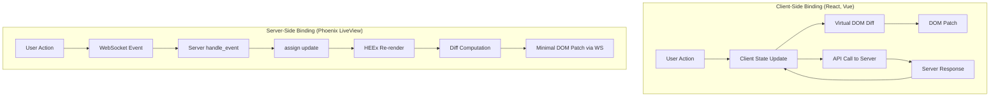
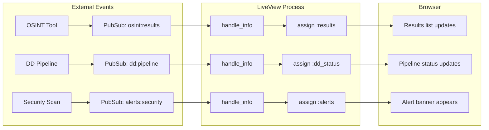

+++
title = "Data Binding"
weight = 50
[extra]
description = "Mechanism that establishes a connection between application UI and business data, enabling automatic synchronization so changes in one are reflected in the other"
category = "data"
subcategory = "ui_patterns"
difficulty = "intermediate"
technology_type = "ui_pattern"
platform_component = "liveview_rendering"
paradigm = "reactive_programming"
prerequisite_concepts = ["html", "websockets", "server_state", "dom_manipulation"]
use_cases = ["real_time_dashboards", "form_validation", "streaming_results", "live_search", "collaborative_editing"]
benefits = ["automatic_ui_sync", "reduced_boilerplate", "real_time_updates", "server_canonical_state", "no_client_framework"]
implementation_patterns = ["socket_assigns", "temporary_assigns", "pubsub_binding", "form_binding", "stream_binding"]
quality_metrics = ["render_latency", "payload_size", "assign_count", "re_render_frequency"]
integration_points = ["phoenix_liveview", "phoenix_pubsub", "heex_templates", "alpine_js", "chart_js"]
related_disciplines = ["frontend_development", "reactive_programming", "real_time_systems", "user_experience"]
related_terms = ["liveview", "phoenix", "assigns", "reactive-programming", "event-sourcing", "pubsub", "genserver", "ets", "websocket", "heex", "plug", "telemetry", "immutable-data", "pattern-matching"]
tags = ["glossary", "data-binding", "liveview", "phoenix", "reactive", "ui", "real-time"]
status = "active"
author = "Tomas Korcak (korczis)"
reading_time = "15 min"
quality_score = 92
platforms = ["Prismatic Platform", "BEAM/OTP"]
key_takeaway = "Phoenix LiveView implements server-side data binding through socket assigns, enabling real-time UI updates without client-side JavaScript frameworks while maintaining the full power of Elixir pattern matching"
date_created = "2026-02-24"
date_modified = "2026-04-08"
keywords = ["Data Binding", "LiveView", "assigns", "reactive", "glossary", "Prismatic Platform", "Phoenix", "socket assigns", "PubSub", "HEEx", "temporary assigns", "streams"]
image = "/images/sections/glossary.png"
image_alt = "Data Binding - Prismatic Platform"
word_count = 3800
see_also = ["capabilities", "architecture", "technologies"]
+++

## Definition

Data binding is the mechanism that creates a live connection between a data source and a consumer (typically a user interface), ensuring that changes to the underlying data are automatically propagated to the presentation layer and, in bidirectional binding, that user interactions update the data source. In traditional client-side frameworks (React, Vue, Angular), data binding operates through observer patterns, virtual DOM diffing, or reactive streams. In the Prismatic Platform's [Phoenix](/glossary/phoenix/) [LiveView](/glossary/liveview/) architecture, data binding is implemented server-side through socket assigns, where state changes on the server trigger minimal DOM patches sent over [WebSocket](/glossary/websocket/) connections.

This server-side approach eliminates the need for client-side state management libraries, [API](/glossary/api/) serialization layers, and complex synchronization logic. The server holds the canonical state and pushes diffs to the browser, creating a fundamentally simpler architecture that retains real-time responsiveness. The tradeoff: server memory usage scales with connected users, and network latency affects interaction responsiveness.

## Overview

### Data Binding Paradigms



| Aspect | Client-Side (React/Vue) | Server-Side (LiveView) |
|--------|------------------------|----------------------|
| **State location** | Browser (Redux, Vuex) | Server (socket assigns) |
| **Sync mechanism** | HTTP/REST + local state | WebSocket + server diff |
| **Initial load** | JS bundle + API calls | HTML + WS connection |
| **Offline support** | Possible (service worker) | Not possible (server required) |
| **SEO** | Requires SSR | Native (server-rendered) |
| **Complexity** | High (state management, sync) | Low (single source of truth) |
| **Memory** | Client-side | Server-side (per connection) |
| **Latency** | Instant (local state) | Network round-trip |
| **Security** | Logic exposed in JS | Logic stays on server |

### Why Server-Side Binding Works

The key insight behind LiveView's data binding model: most web applications are inherently server-connected. They need to read/write databases, enforce business rules, and coordinate across users. Client-side frameworks duplicate state between server and client, then spend enormous effort keeping them synchronized. LiveView eliminates this duplication by keeping state in one place.

The bandwidth cost is surprisingly low. LiveView's diffing engine sends only changed DOM fragments -- typically 50-500 bytes per update, compared to full API responses of 5-50KB in traditional SPAs.

## Technical Deep Dive

### Socket Assigns: The Core Mechanism

[Phoenix](/glossary/phoenix/) LiveView's data binding operates through three interconnected mechanisms:

1. **Socket assigns** (`assign/3`): Key-value state stored on the server socket
2. **[HEEx](/glossary/heex/) templates**: Declarative rendering that reads assigns
3. **Diffing engine**: Computes minimal DOM patches when assigns change

```elixir
# Each assign change triggers a re-render of the affected template region
socket
|> assign(:tools, tools)           # Replaces :tools, triggers render
|> assign(:loading, false)         # Replaces :loading, triggers render
|> assign(:results, new_results)   # Replaces :results, triggers render
```

When a socket assign changes, LiveView:
1. Re-evaluates the HEEx template (only the parts referencing changed assigns)
2. Compares the new rendered output against the previous fingerprint
3. Computes a minimal set of DOM operations (text changes, attribute updates, element insertions/removals)
4. Serializes the diff as a compact binary message
5. Sends it over the WebSocket
6. Client-side JS applies the patch to the live DOM

### Binding Types

| Binding Type | Mechanism | Direction | Example |
|-------------|-----------|-----------|---------|
| **Assign Binding** | `assign/3` on socket | Server -> Client | `assign(socket, :tools, tools)` |
| **Event Binding** | `phx-click`, `phx-change` | Client -> Server | `phx-click="filter"` |
| **Form Binding** | `phx-change` + changesets | Bidirectional | `phx-change="validate"` |
| **PubSub Binding** | `Phoenix.PubSub` | External -> Server -> Client | `broadcast("osint:results", data)` |
| **Stream Binding** | `stream/4` (LiveView 0.18+) | Server -> Client (append/prepend) | `stream(:results, results)` |
| **Hook Binding** | `phx-hook` + JS interop | Bidirectional | `phx-hook="ChartHook"` |

### PubSub-Driven Binding

The most powerful binding pattern in the Prismatic Platform: external events (OSINT results, DD pipeline updates, security alerts) flow through [PubSub](/glossary/pubsub/) into LiveView assigns:



### Temporary Assigns for Streaming Data

For high-volume data (OSINT results, log entries), storing all items in assigns would consume excessive server memory. Temporary assigns solve this:

```elixir
defmodule PrismaticWeb.OsintResultsLive do
  use PrismaticWeb, :live_view

  @impl true
  def mount(_params, _session, socket) do
    if connected?(socket) do
      Phoenix.PubSub.subscribe(Prismatic.PubSub, "osint:results")
    end

    {:ok,
      assign(socket, results: [], result_count: 0),
      temporary_assigns: [results: []]}
    # After each render, :results is reset to []
    # The DOM retains previously rendered items
    # New items are appended without keeping all in memory
  end

  @impl true
  def handle_info({:osint_result, result}, socket) do
    {:noreply,
      socket
      |> assign(:results, [result])
      |> update(:result_count, &(&1 + 1))}
  end
end
```

### LiveView Streams (Modern Approach)

LiveView 0.18+ introduced streams as the preferred pattern for large collections:

```elixir
defmodule PrismaticWeb.DdEntitiesLive do
  @moduledoc """
  DD entity list using LiveView streams for efficient
  large-collection rendering with insert/delete support.
  """
  use PrismaticWeb, :live_view

  @impl true
  def mount(_params, _session, socket) do
    entities = PrismaticDd.list_entities(limit: 50)

    {:ok,
      socket
      |> stream(:entities, entities)
      |> assign(:page, 1)}
  end

  @impl true
  def handle_event("load_more", _params, socket) do
    page = socket.assigns.page + 1
    entities = PrismaticDd.list_entities(limit: 50, offset: (page - 1) * 50)

    {:noreply,
      socket
      |> stream(:entities, entities)
      |> assign(:page, page)}
  end

  @impl true
  def handle_event("delete", %{"id" => id}, socket) do
    {:ok, entity} = PrismaticDd.delete_entity(id)
    {:noreply, stream_delete(socket, :entities, entity)}
  end
end
```

Streams vs temporary assigns:

| Feature | Temporary Assigns | Streams |
|---------|------------------|---------|
| **Insert position** | Append only | Insert at any position |
| **Delete** | Not supported | `stream_delete/3` |
| **Update** | Not supported | Re-stream same ID |
| **DOM ID** | Manual | Automatic (`streams-{id}`) |
| **Memory** | Reset after render | Server tracks IDs only |

## Usage in Prismatic Platform

### OSINT Toolbox Real-Time Binding

The OSINT toolbox at `/osint/toolbox` demonstrates sophisticated data binding where tool execution results stream in real-time:

```elixir
defmodule PrismaticWeb.OsintToolboxLive do
  @moduledoc """
  Interactive OSINT toolbox with real-time result streaming.
  Demonstrates multi-source data binding: tool registry (ETS),
  execution results (PubSub), and user interactions (events).
  """
  use PrismaticWeb, :live_view

  @impl Phoenix.LiveView
  def mount(_params, _session, socket) do
    if connected?(socket) do
      Phoenix.PubSub.subscribe(Prismatic.PubSub, "osint:results")
    end

    tools = PrismaticOsintCore.ToolRegistry.list_tools()
    categories = PrismaticOsintCore.ToolRegistry.categories()

    {:ok, assign(socket,
      tools: tools,
      categories: categories,
      selected_tool: nil,
      search_query: "",
      selected_category: "all",
      results: [],
      loading: false,
      view_mode: :grid
    )}
  end

  # Event binding: user selects a tool
  @impl Phoenix.LiveView
  def handle_event("select_tool", %{"slug" => slug}, socket) do
    tool = PrismaticOsintCore.ToolRegistry.get_tool(slug)
    {:noreply, assign(socket, selected_tool: tool, results: [])}
  end

  # Form binding: search input with debounce
  @impl Phoenix.LiveView
  def handle_event("search", %{"query" => query}, socket) do
    filtered = PrismaticOsintCore.ToolRegistry.search(query)
    {:noreply, assign(socket, tools: filtered, search_query: query)}
  end

  # Event binding: execute tool
  @impl Phoenix.LiveView
  def handle_event("execute", params, socket) do
    tool = socket.assigns.selected_tool
    Task.start(fn -> PrismaticOsintCore.execute(tool.slug, params) end)
    {:noreply, assign(socket, loading: true)}
  end

  # PubSub binding: results arrive asynchronously
  @impl Phoenix.LiveView
  def handle_info({:osint_result, result}, socket) do
    {:noreply, assign(socket,
      results: [result | socket.assigns.results],
      loading: false
    )}
  end
end
```

### Dashboard Multi-Source Binding

```elixir
defmodule PrismaticWeb.DashboardLive do
  @moduledoc """
  Real-time dashboard demonstrating multi-source data binding
  where multiple PubSub topics feed into a unified LiveView state.
  """
  use PrismaticWeb, :live_view

  @topics ["dd:pipeline", "osint:results", "alerts:security", "quality:metrics"]

  @impl Phoenix.LiveView
  def mount(_params, _session, socket) do
    if connected?(socket) do
      Enum.each(@topics, &Phoenix.PubSub.subscribe(Prismatic.PubSub, &1))
    end

    {:ok, assign(socket,
      dd_status: %{running: 0, completed: 0},
      osint_findings: [],
      security_alerts: [],
      quality_score: 0,
      connected_at: DateTime.utc_now()
    )}
  end

  @impl Phoenix.LiveView
  def handle_info({:dd_update, status}, socket) do
    {:noreply, assign(socket, dd_status: status)}
  end

  @impl Phoenix.LiveView
  def handle_info({:osint_finding, finding}, socket) do
    findings = [finding | Enum.take(socket.assigns.osint_findings, 49)]
    {:noreply, assign(socket, osint_findings: findings)}
  end

  @impl Phoenix.LiveView
  def handle_info({:security_alert, alert}, socket) do
    alerts = [alert | socket.assigns.security_alerts]
    {:noreply, assign(socket, security_alerts: alerts)}
  end

  @impl Phoenix.LiveView
  def handle_info({:quality_update, score}, socket) do
    {:noreply, assign(socket, quality_score: score)}
  end
end
```

### JavaScript Hook Binding

For client-side interactivity (Chart.js, Mermaid, D3.js), LiveView hooks bridge server assigns to JavaScript:

```elixir
# Server-side: push data to hook
def handle_info({:metrics_update, metrics}, socket) do
  {:noreply, push_event(socket, "chart-update", %{data: metrics})}
end
```

```javascript
// Client-side: hook receives server events
Hooks.MetricsChart = {
  mounted() {
    this.chart = new Chart(this.el, { type: 'line', data: {} });

    this.handleEvent("chart-update", ({ data }) => {
      this.chart.data.datasets[0].data = data;
      this.chart.update();
    });
  },

  destroyed() {
    this.chart.destroy();
  }
};
```

## Performance Optimization

### Assign Size Management

```elixir
# ❌ BAD: Storing large derived data in assigns
def handle_event("filter", %{"category" => cat}, socket) do
  filtered = Enum.filter(socket.assigns.all_tools, &(&1.category == cat))
  stats = compute_statistics(filtered)
  chart_data = build_chart_data(filtered)

  {:noreply, assign(socket,
    filtered_tools: filtered,    # Large list
    stats: stats,                # Derived data
    chart_data: chart_data       # More derived data
  )}
end

# ✅ GOOD: Minimal assigns, derive in render
def handle_event("filter", %{"category" => cat}, socket) do
  {:noreply, assign(socket, selected_category: cat)}
end

# Derive in the template or component
defp filtered_tools(tools, "all"), do: tools
defp filtered_tools(tools, category) do
  Enum.filter(tools, &(&1.category == category))
end
```

### Render Optimization Table

| Technique | When | Benefit |
|-----------|------|---------|
| `assign_new/3` | Data that never changes | Prevents re-fetch on reconnect |
| `temporary_assigns` | Streaming append-only lists | Constant server memory |
| `stream/4` | Large collections with CRUD | Efficient insert/delete |
| `push_event/3` | Client-side JS updates | No server re-render |
| Derived values in render | Computed data | Fewer assigns, less memory |
| Component boundaries | Independent UI sections | Isolated re-renders |

## Best Practices

1. **Minimize assign sizes** -- only store data the template actually renders. Derive computed values in render callbacks rather than storing them in assigns.
2. **Use temporary assigns for large lists** -- `temporary_assigns: [results: []]` prevents memory accumulation for streaming data.
3. **Subscribe to [PubSub](/glossary/pubsub/) only when connected** -- the `connected?(socket)` guard prevents duplicate subscriptions during static mount.
4. **Avoid unnecessary re-renders** -- assigning the same value to a key does not trigger a re-render, but computing and assigning derived data on every event does.
5. **Use `assign_new/3` for data that should not change** -- prevents re-fetching on reconnection.
6. **Prefer streams over temporary assigns** for collections with CRUD operations.
7. **Use `push_event/3` for pure client-side updates** -- chart updates, animations, and notifications that don't need server-side DOM rendering.
8. **Keep assigns serializable** -- avoid storing PIDs, references, or closures in assigns.
9. **Debounce rapid events** -- use `phx-debounce="300"` on search inputs to reduce server load.

## Common Mistakes

| Mistake | Impact | Solution |
|---------|--------|----------|
| Storing entire DB result set in assigns | Memory exhaustion | Paginate, use streams |
| Missing `connected?` guard on PubSub subscribe | Double subscriptions | Always guard with `if connected?(socket)` |
| Deriving large data in `handle_event` | Unnecessary re-renders | Derive in template/component |
| Using `Map.get` for assign access in HEEx | Crashes if key missing | Use `@assign_name` syntax |
| Not using `temporary_assigns` for streaming data | Server memory grows unbounded | Add `temporary_assigns` option |
| PubSub topic leaks (no unsubscribe) | Memory leak on disconnect | LiveView handles cleanup automatically |

## Related Terms

- [LiveView](/glossary/liveview/) -- Phoenix's server-side rendering framework implementing data binding
- [Phoenix](/glossary/phoenix/) -- web framework providing the data binding infrastructure
- [PubSub](/glossary/pubsub/) -- publish-subscribe system for external event binding
- [WebSocket](/glossary/websocket/) -- transport protocol for real-time binding updates
- [HEEx](/glossary/heex/) -- template engine that renders bound data
- [GenServer](/glossary/genserver/) -- OTP behaviour managing stateful data that binds to LiveView
- [ETS](/glossary/ets/) -- in-memory storage providing sub-millisecond data access for binding sources
- [Assigns](/glossary/assigns/) -- the key-value state mechanism underlying LiveView binding
- [Reactive Programming](/glossary/reactive-programming/) -- paradigm that data binding implements
- [Event Sourcing](/glossary/event-sourcing/) -- pattern where data changes drive binding updates
- [Immutable Data](/glossary/immutable-data/) -- functional principle enabling reliable diff computation
- [Pattern Matching](/glossary/pattern-matching/) -- Elixir feature used in handle_event/handle_info binding handlers
- [Telemetry](/glossary/telemetry/) -- observability for binding performance metrics
- [Plug](/glossary/plug/) -- request pipeline that initializes LiveView connections

## See Also

- [Architecture](/architecture/) -- platform data flow and binding architecture
- [Capabilities](/capabilities/) -- real-time dashboard capabilities
- [Technologies](/technologies/) -- Phoenix LiveView and real-time web technologies

---

## Connect & Contribute

**Created by [Tomas Korcak (korczis)](https://github.com/korczis)** | Open Source under [GHL](https://github.com/korczis/prismatic-platform/blob/main/LICENSE)

- [GitHub](https://github.com/korczis/prismatic-platform) | [GitLab](https://gitlab.com/korczis/prismatic-platform) | [LinkedIn](https://linkedin.com/in/korczis) | [Contact](mailto:korczis@gmail.com)
- [Developer Portal](/developers/) | [Architecture](/architecture/) | [Meet the Creator](/about/author/)
