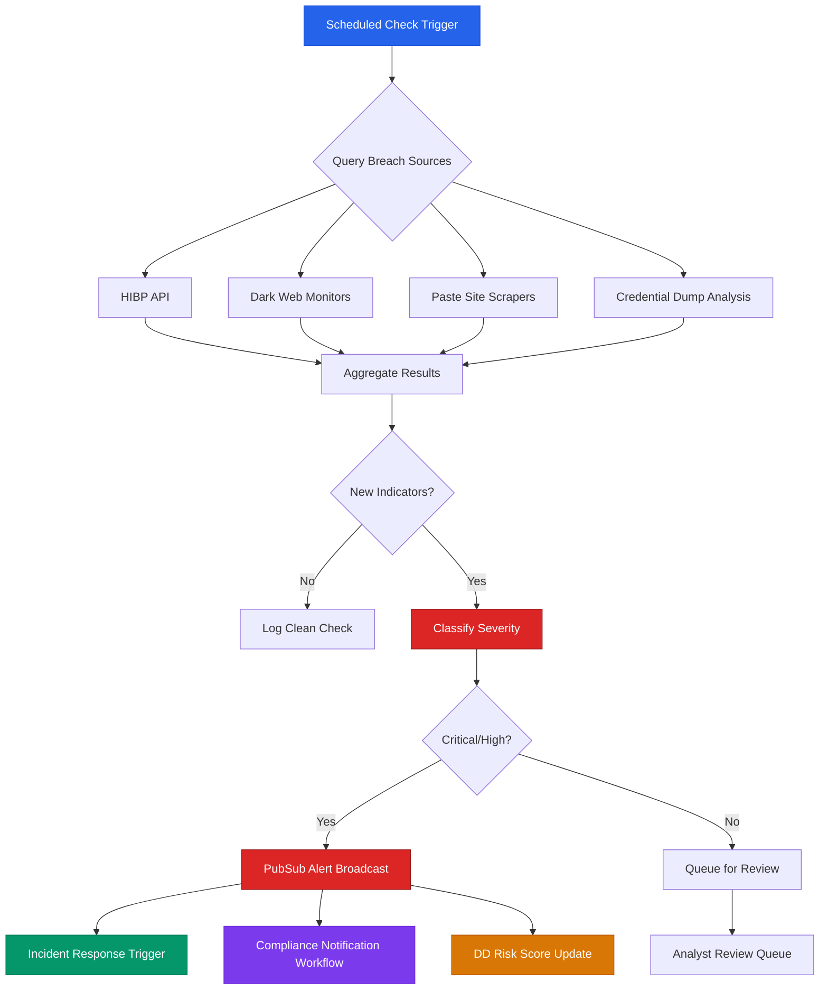

+++
title = "Data Breach"
weight = 50

[extra]
description = "Unauthorized access, disclosure, or acquisition of sensitive data that compromises confidentiality, integrity, or availability, requiring detection, containment, and regulatory notification under GDPR, NIS2, and sector-specific frameworks."
category = "security"
subcategory = "security_incidents"
related_terms = ["data-leak", "incident-response", "gdpr", "nis2", "data-controller", "dark-web", "encryption", "threat-intelligence", "ioc", "dmarc", "credential-management", "sql-injection", "monitoring", "osint", "attack-surface"]
tags = ["glossary", "security", "data-breach", "incident-response", "compliance", "gdpr", "nis2", "threat-intelligence", "osint", "perimeter", "due-diligence"]
status = "active"
author = "Tomas Korcak (korczis)"
reading_time = "16 min"
difficulty = "intermediate"
technology_type = "security-operations"
platform_component = "osint, perimeter, compliance, dd"
prerequisite_concepts = ["encryption", "authentication", "gdpr", "incident-response", "threat-intelligence"]
use_cases = ["OSINT investigation", "DD due diligence", "compliance reporting", "incident response"]
benefits = ["Early breach detection via OSINT monitoring", "Automated regulatory notification workflows", "Continuous credential exposure scanning", "DD risk scoring for M&A targets"]
implementation_patterns = ["GenServer-based continuous monitoring", "PubSub alert broadcasting", "Task.async breach source querying", "ETS-backed indicator caching"]
quality_metrics = ["Mean time to detect (MTTD)", "Mean time to respond (MTTR)", "False positive rate", "Source coverage ratio", "Notification compliance rate"]
integration_points = ["osint", "compliance", "perimeter", "dd"]
related_disciplines = ["Information Security", "Digital Forensics", "Regulatory Compliance", "Risk Management", "Threat Intelligence"]
quality_score = 92
platforms = ["Prismatic Platform", "BEAM/OTP"]
key_takeaway = "Effective data breach detection requires continuous monitoring across surface web, dark web, and paste site sources, combined with automated alerting, OSINT correlation, and regulatory compliance workflows integrated into DD risk assessment."
date_created = "2026-02-24"
date_modified = "2026-04-08"
keywords = ["Data Breach", "security", "incident response", "GDPR", "NIS2", "HIBP", "glossary", "Prismatic Platform", "compliance", "OSINT", "credential exposure", "dark web monitoring"]
image = "/images/sections/glossary.png"
image_alt = "Data Breach - Prismatic Platform"
word_count = 3800
see_also = ["capabilities", "osint", "architecture"]
+++

## Definition

A **data breach** is a security incident in which sensitive, protected, or confidential data is accessed, disclosed, or acquired by unauthorized parties. Breaches can result from external attacks (exploitation of vulnerabilities, phishing, [credential](/glossary/credential-management/) stuffing), insider threats (malicious or negligent employees), or third-party compromise (supply chain attacks). Under [GDPR](/glossary/gdpr/) Article 4(12), a personal data breach is defined as "a breach of security leading to the accidental or unlawful destruction, loss, alteration, unauthorised disclosure of, or access to, personal data."

Data breaches are distinct from [data leaks](/glossary/data-leak/) in that breaches imply a security boundary was actively violated, while leaks may result from misconfiguration or unintentional exposure. Both require detection, assessment, containment, and potentially regulatory notification within strict timelines (72 hours under GDPR, 24 hours for early warning under [NIS2](/glossary/nis2/)).

In the context of the Prismatic Platform, data breach detection and response operates across multiple integrated modules: [OSINT](/glossary/osint/) sources for breach database monitoring, [Perimeter](/glossary/attack-surface/) EASM for external exposure detection, [compliance](/glossary/gdpr/) frameworks for notification workflows, and [DD](/glossary/due-diligence/) risk assessment for M&A target evaluation.

## Overview

### Breach Types and Classification

Data breaches vary significantly in their nature, scope, and impact. Understanding breach taxonomy is essential for effective detection and response.

| Breach Type | Description | Common Vectors | Typical Data Exposed |
|------------|-------------|----------------|---------------------|
| **Credential Breach** | Theft of authentication credentials | Phishing, [credential](/glossary/credential-management/) stuffing, keyloggers | Usernames, passwords, API keys, tokens |
| **PII Breach** | Exposure of personally identifiable information | [SQL injection](/glossary/sql-injection/), application exploits, insider access | Names, addresses, SSNs, dates of birth |
| **Financial Breach** | Theft of financial records or payment data | POS malware, card skimming, database compromise | Credit card numbers, bank accounts, transactions |
| **Intellectual Property Breach** | Exfiltration of proprietary information | APT campaigns, insider theft, supply chain | Source code, trade secrets, research data |
| **Healthcare Breach** | Unauthorized access to medical records | Ransomware, misconfigured systems, phishing | Patient records, diagnoses, prescriptions |
| **Infrastructure Breach** | Compromise of system configuration or access | Misconfigurations, unpatched systems, zero-days | Network topology, credentials, configurations |

### Breach Lifecycle

Every breach follows a predictable lifecycle from initial compromise through detection and response. The gap between compromise and detection -- known as "dwell time" -- is the critical metric that determines breach severity. The mean dwell time was 204 days in 2023, though organizations with continuous [monitoring](/glossary/monitoring/) and [OSINT](/glossary/osint/) capabilities reduce this to hours or days.


### Regulatory Requirements

#### GDPR Breach Notification (Articles 33-34)

The [GDPR](/glossary/gdpr/) imposes strict breach notification obligations on [data controllers](/glossary/data-controller/):

- **72-hour notification**: Controllers must notify the supervisory authority within 72 hours of becoming aware of a personal data breach, unless the breach is unlikely to result in a risk to individuals.
- **Data subject notification**: When a breach is likely to result in high risk to the rights and freedoms of natural persons, controllers must communicate the breach to affected individuals "without undue delay."
- **Documentation obligation**: All breaches must be documented, including the facts, effects, and remedial actions taken, regardless of whether notification is required.
- **Processor obligations**: [Data processors](/glossary/data-controller/) must notify the controller "without undue delay" after becoming aware of a breach.

#### NIS2 Directive Requirements

The [NIS2](/glossary/nis2/) Directive, effective October 2024, introduces additional breach reporting obligations for essential and important entities:

- **24-hour early warning**: Entities must submit an early warning to the competent authority within 24 hours of becoming aware of a significant incident.
- **72-hour incident notification**: A full incident notification, including initial assessment of severity and impact, must follow within 72 hours.
- **One-month final report**: A detailed final report with root cause analysis, mitigation measures, and cross-border impact assessment within one month.
- **Supply chain scope**: NIS2 extends obligations to the supply chain, meaning breaches at critical suppliers trigger reporting requirements.

#### Notification Timeline Comparison

| Framework | Early Warning | Full Notification | Final Report | Scope |
|-----------|--------------|-------------------|-------------|-------|
| **GDPR** | N/A | 72 hours | As needed | Personal data |
| **NIS2** | 24 hours | 72 hours | 1 month | Essential/important entities |
| **HIPAA** | N/A | 60 days | N/A | Protected health information |
| **PCI-DSS** | Immediate | 72 hours | As required | Cardholder data |
| **Czech Cybersecurity Act** | Immediate | 24 hours | 30 days | Critical infrastructure |

## Technical Deep Dive

### Breach Detection Methods

Breach detection operates across multiple intelligence domains, each providing different visibility into compromise indicators.

| Detection Domain | Sources | Latency | Confidence | Prismatic Module |
|-----------------|---------|---------|------------|------------------|
| **Network Monitoring** | IDS/IPS, NetFlow, DNS logs | Real-time | High | [Perimeter](/glossary/attack-surface/) |
| **Endpoint Detection** | EDR agents, system logs | Minutes | High | External integration |
| **[Dark Web](/glossary/dark-web/) Monitoring** | Tor forums, paste sites, marketplaces | Hours-Days | Medium | [OSINT](/glossary/osint/) adapters |
| **OSINT Collection** | Breach databases, leak aggregators, HIBP | Hours-Weeks | Medium | OSINT ToolRegistry |
| **Third-Party Notification** | Vendor alerts, CERT advisories | Days-Weeks | High | Compliance module |
| **Regulatory Disclosure** | Public breach notifications | Weeks-Months | High | DD risk assessment |
| **Credential Monitoring** | Paste sites, combo lists, stealer logs | Hours-Days | High | OSINT adapters |

### OSINT Breach Databases and HIBP Integration

The most effective proactive breach detection leverages open-source intelligence databases that aggregate known breach data. The Prismatic Platform integrates with multiple breach intelligence sources:

**Have I Been Pwned (HIBP)**: Troy Hunt's breach notification service aggregates data from over 700 known breaches containing more than 13 billion exposed accounts. HIBP provides a k-anonymity-based API that allows checking email addresses and passwords against known breaches without exposing the query itself.

**Breach intelligence workflow**:
1. **Domain monitoring** -- Continuously check organizational domains against breach databases
2. **Credential exposure scanning** -- Identify exposed credentials matching organizational email patterns
3. **Paste site monitoring** -- Detect organizational data appearing on paste sites and code repositories
4. **[Dark web](/glossary/dark-web/) scanning** -- Monitor dark web marketplaces for corporate data listings
5. **Combo list analysis** -- Detect organizational credentials in aggregated credential dumps

### Breach Detection Flow



### Indicator of Compromise (IOC) Correlation

Breach detection generates [Indicators of Compromise](/glossary/ioc/) that must be correlated across multiple sources to reduce false positives and determine breach scope:

- **Email-based IOCs**: Organizational email addresses found in breach databases, paste sites, or combo lists
- **Domain-based IOCs**: Corporate domains appearing in DNS exfiltration logs or phishing infrastructure
- **IP-based IOCs**: Organizational IP ranges communicating with known C2 infrastructure
- **Credential-based IOCs**: Leaked credentials matching organizational authentication systems
- **Certificate-based IOCs**: Unauthorized certificates issued for organizational domains (via [certificate transparency](/glossary/certificate-transparency/) monitoring)

## Usage in Prismatic Platform

The Prismatic Platform provides automated breach detection through its [OSINT](/glossary/osint/) tool registry, [Perimeter](/glossary/attack-surface/) EASM module, and DD risk assessment pipeline. The platform continuously monitors for organizational exposure across breach databases, [dark web](/glossary/dark-web/) marketplaces, and paste sites, correlating findings with asset inventories.

### OSINT Breach-Checking Adapters

The platform's self-registering OSINT adapter system includes multiple breach-focused tools:

- **HIBP Adapter** -- Queries Have I Been Pwned for domain and email breach exposure
- **Dehashed Adapter** -- Searches leaked credential databases by email, username, IP, or domain
- **IntelX Adapter** -- Intelligence X archive searches for breach data, paste sites, and dark web content
- **LeakCheck Adapter** -- Real-time credential leak monitoring
- **Snusbase Adapter** -- Breach database search across multiple data types

### DD Risk Assessment Integration

During due diligence investigations, breach history is a critical risk factor. The platform automatically:

1. **Scans target domains** against all breach intelligence sources
2. **Scores breach exposure** as part of the overall DD risk assessment
3. **Identifies credential leaks** that may indicate ongoing compromise
4. **Correlates breach data** with other OSINT findings (e.g., exposed infrastructure, regulatory filings)
5. **Generates breach timeline** showing historical exposure patterns

### Compliance Reporting

The compliance module integrates breach detection with regulatory notification workflows:

- **GDPR Article 33 workflow**: Automated 72-hour notification tracking with supervisory authority templates
- **NIS2 early warning**: 24-hour alert generation for significant incidents
- **Cross-border coordination**: Multi-jurisdiction notification management
- **Documentation**: Automatic breach register maintenance per GDPR Article 33(5)

## Code Examples

### Breach Detection GenServer

```elixir
defmodule PrismaticPerimeter.BreachDetector do
  @moduledoc """
  Continuous breach detection engine that correlates OSINT findings
  with organizational asset inventories to identify potential
  data breach indicators.

  Operates on a configurable interval, querying multiple breach
  intelligence sources in parallel and broadcasting critical
  findings via PubSub.
  """

  use GenServer
  require Logger

  @check_interval :timer.minutes(15)
  @query_timeout 30_000

  @type severity :: :critical | :high | :medium | :low
  @type data_type :: :credentials | :pii | :financial | :intellectual_property | :unknown

  @type breach_indicator :: %{
    source: String.t(),
    severity: severity(),
    affected_assets: list(String.t()),
    discovered_at: DateTime.t(),
    data_types: list(data_type()),
    breach_name: String.t() | nil,
    record_count: non_neg_integer() | nil
  }

  @spec start_link(keyword()) :: GenServer.on_start()
  def start_link(opts) do
    GenServer.start_link(__MODULE__, opts, name: __MODULE__)
  end

  @doc """
  Returns the latest breach indicators from the last scan cycle.

  ## Examples

      iex> PrismaticPerimeter.BreachDetector.get_indicators()
      {:ok, [%{source: "hibp", severity: :high, ...}]}

  """
  @spec get_indicators() :: {:ok, list(breach_indicator())}
  def get_indicators do
    GenServer.call(__MODULE__, :get_indicators)
  end

  @impl GenServer
  def init(opts) do
    monitored_domains = Keyword.fetch!(opts, :domains)
    schedule_check()

    :telemetry.execute(
      [:prismatic, :breach_detector, :init],
      %{domain_count: length(monitored_domains)},
      %{}
    )

    {:ok, %{domains: monitored_domains, indicators: [], last_check: nil}}
  end

  @impl GenServer
  def handle_call(:get_indicators, _from, state) do
    {:reply, {:ok, state.indicators}, state}
  end

  @impl GenServer
  def handle_info(:check_breaches, state) do
    start_time = System.monotonic_time(:millisecond)
    indicators = check_all_sources(state.domains)

    duration = System.monotonic_time(:millisecond) - start_time

    :telemetry.execute(
      [:prismatic, :breach_detector, :scan_complete],
      %{duration_ms: duration, indicator_count: length(indicators)},
      %{domains: length(state.domains)}
    )

    Enum.each(indicators, fn indicator ->
      if indicator.severity in [:critical, :high] do
        Logger.warning(
          "Breach indicator detected: #{indicator.source} " <>
            "severity=#{indicator.severity} " <>
            "assets=#{inspect(indicator.affected_assets)}"
        )

        Phoenix.PubSub.broadcast(
          Prismatic.PubSub,
          "alerts:breach",
          {:breach_indicator, indicator}
        )
      end
    end)

    schedule_check()
    {:noreply, %{state | indicators: indicators, last_check: DateTime.utc_now()}}
  end

  defp check_all_sources(domains) do
    domains
    |> Task.async_stream(
      &query_breach_sources/1,
      max_concurrency: 4,
      timeout: @query_timeout,
      on_timeout: :kill_task
    )
    |> Enum.flat_map(fn
      {:ok, results} -> results
      {:exit, _reason} -> []
    end)
    |> Enum.sort_by(& &1.severity, :desc)
  end

  defp query_breach_sources(domain) do
    PrismaticOsintCore.ToolRegistry.list_tools()
    |> Enum.filter(&(&1.category in [:global, :sanctions]))
    |> Enum.flat_map(fn tool ->
      case PrismaticOsintCore.execute(tool.slug, %{query: domain}) do
        {:ok, results} ->
          Enum.map(results, &to_indicator(&1, domain))

        {:error, reason} ->
          Logger.debug("Breach source #{tool.slug} failed: #{inspect(reason)}")
          []
      end
    end)
  end

  defp to_indicator(result, domain) do
    %{
      source: result.source,
      severity: classify_severity(result),
      affected_assets: [domain],
      discovered_at: DateTime.utc_now(),
      data_types: extract_data_types(result),
      breach_name: Map.get(result, :breach_name),
      record_count: Map.get(result, :record_count)
    }
  end

  defp classify_severity(%{type: :credentials}), do: :critical
  defp classify_severity(%{type: :financial}), do: :critical
  defp classify_severity(%{type: :pii}), do: :high
  defp classify_severity(%{type: :intellectual_property}), do: :high
  defp classify_severity(%{type: :healthcare}), do: :critical
  defp classify_severity(_), do: :medium

  defp extract_data_types(result), do: Map.get(result, :data_types, [:unknown])
  defp schedule_check, do: Process.send_after(self(), :check_breaches, @check_interval)
end
```

### HIBP Domain Check Module

```elixir
defmodule PrismaticOsint.BreachCheck.HIBP do
  @moduledoc """
  Have I Been Pwned integration for domain-level breach checking.
  Uses the HIBP v3 API with k-anonymity for password checks
  and domain search for organizational breach exposure.
  """

  require Logger

  @hibp_api_base "https://haveibeenpwned.com/api/v3"
  @user_agent "PrismaticPlatform-BreachMonitor"

  @spec check_domain(String.t()) :: {:ok, list(map())} | {:error, term()}
  def check_domain(domain) do
    api_key = System.get_env("HIBP_API_KEY")

    case api_key do
      nil ->
        Logger.warning("HIBP_API_KEY not configured, skipping domain check")
        {:ok, []}

      key ->
        headers = [
          {"hibp-api-key", key},
          {"user-agent", @user_agent}
        ]

        url = "#{@hibp_api_base}/breaches?domain=#{URI.encode(domain)}"

        case Req.get(url, headers: headers, receive_timeout: 15_000) do
          {:ok, %{status: 200, body: breaches}} ->
            {:ok, Enum.map(breaches, &normalize_breach/1)}

          {:ok, %{status: 404}} ->
            {:ok, []}

          {:ok, %{status: 429}} ->
            Logger.warning("HIBP rate limit hit for domain=#{domain}")
            {:error, :rate_limited}

          {:error, reason} ->
            Logger.error("HIBP request failed: #{inspect(reason)}")
            {:error, reason}
        end
    end
  end

  @spec check_email(String.t()) :: {:ok, list(map())} | {:error, term()}
  def check_email(email) do
    api_key = System.get_env("HIBP_API_KEY")

    case api_key do
      nil ->
        {:ok, []}

      key ->
        headers = [
          {"hibp-api-key", key},
          {"user-agent", @user_agent}
        ]

        encoded = URI.encode(email)
        url = "#{@hibp_api_base}/breachedaccount/#{encoded}?truncateResponse=false"

        case Req.get(url, headers: headers, receive_timeout: 15_000) do
          {:ok, %{status: 200, body: breaches}} ->
            {:ok, Enum.map(breaches, &normalize_breach/1)}

          {:ok, %{status: 404}} ->
            {:ok, []}

          {:ok, %{status: 429}} ->
            {:error, :rate_limited}

          {:error, reason} ->
            {:error, reason}
        end
    end
  end

  defp normalize_breach(breach) do
    %{
      name: Map.get(breach, "Name", "Unknown"),
      title: Map.get(breach, "Title", "Unknown"),
      domain: Map.get(breach, "Domain", ""),
      breach_date: Map.get(breach, "BreachDate"),
      added_date: Map.get(breach, "AddedDate"),
      pwn_count: Map.get(breach, "PwnCount", 0),
      data_classes: Map.get(breach, "DataClasses", []),
      is_verified: Map.get(breach, "IsVerified", false),
      is_sensitive: Map.get(breach, "IsSensitive", false),
      source: "hibp"
    }
  end
end
```

### DD Breach Risk Scorer

```elixir
defmodule PrismaticDD.RiskScoring.BreachRisk do
  @moduledoc """
  Scores breach-related risk for DD investigation targets.
  Aggregates breach exposure data from OSINT sources and
  computes a normalized risk score for M&A due diligence.
  """

  @type breach_risk_score :: %{
    score: float(),
    rating: :critical | :high | :medium | :low | :clean,
    breach_count: non_neg_integer(),
    total_records_exposed: non_neg_integer(),
    most_recent_breach: Date.t() | nil,
    credential_exposure: boolean(),
    findings: list(String.t())
  }

  @spec score(String.t(), list(map())) :: breach_risk_score()
  def score(domain, breach_indicators) do
    breach_count = length(breach_indicators)
    total_records = Enum.reduce(breach_indicators, 0, &((&1[:record_count] || 0) + &2))
    has_credentials = Enum.any?(breach_indicators, &(:credentials in (&1[:data_types] || [])))

    most_recent =
      breach_indicators
      |> Enum.map(& &1[:breach_date])
      |> Enum.reject(&is_nil/1)
      |> Enum.sort(:desc)
      |> List.first()

    raw_score = compute_raw_score(breach_count, total_records, has_credentials, most_recent)
    normalized = min(raw_score / 100.0, 1.0)

    %{
      score: Float.round(normalized, 3),
      rating: score_to_rating(normalized),
      breach_count: breach_count,
      total_records_exposed: total_records,
      most_recent_breach: most_recent,
      credential_exposure: has_credentials,
      findings: generate_findings(domain, breach_indicators)
    }
  end

  defp compute_raw_score(0, _records, _creds, _recent), do: 0.0

  defp compute_raw_score(count, records, has_credentials, most_recent) do
    count_score = min(count * 10, 30)
    record_score = min(:math.log10(max(records, 1)) * 5, 25)
    credential_score = if has_credentials, do: 25, else: 0
    recency_score = recency_factor(most_recent) * 20

    count_score + record_score + credential_score + recency_score
  end

  defp recency_factor(nil), do: 0.0

  defp recency_factor(date) when is_binary(date) do
    case Date.from_iso8601(date) do
      {:ok, d} -> recency_factor(d)
      _ -> 0.5
    end
  end

  defp recency_factor(%Date{} = date) do
    days_ago = Date.diff(Date.utc_today(), date)

    cond do
      days_ago < 90 -> 1.0
      days_ago < 365 -> 0.8
      days_ago < 730 -> 0.5
      true -> 0.2
    end
  end

  defp score_to_rating(score) when score >= 0.8, do: :critical
  defp score_to_rating(score) when score >= 0.6, do: :high
  defp score_to_rating(score) when score >= 0.3, do: :medium
  defp score_to_rating(score) when score > 0.0, do: :low
  defp score_to_rating(_), do: :clean

  defp generate_findings(domain, indicators) do
    base = ["Domain #{domain} checked against breach databases"]

    breach_findings =
      Enum.map(indicators, fn ind ->
        "Found in #{ind[:source]}: #{ind[:breach_name] || "unknown breach"} " <>
          "(#{ind[:record_count] || "unknown"} records)"
      end)

    base ++ breach_findings
  end
end
```

## Best Practices

### Prevention

1. **Implement [encryption](/glossary/encryption/) at rest and in transit** -- All sensitive data must be encrypted using industry-standard algorithms. Use [TLS](/glossary/tls/) for network communication and AES-256 for stored data.
2. **Enforce strong [authentication](/glossary/authentication/)** -- Multi-factor authentication, strong password policies, and regular credential rotation reduce credential-based breach vectors.
3. **Maintain minimal data retention** -- Collect only necessary data and delete it when no longer required. Data that does not exist cannot be breached.
4. **Apply the principle of least privilege** -- Restrict access to sensitive data to only those who need it, and audit access regularly.
5. **Secure the supply chain** -- Evaluate third-party vendor security practices, require contractual security obligations, and monitor vendor breach exposure.

### Detection

1. **Implement continuous [OSINT](/glossary/osint/) [monitoring](/glossary/monitoring/)** -- Automated breach detection across OSINT sources reduces mean time to detection from months to hours.
2. **Maintain comprehensive asset inventories** -- Breach detection is only effective when you know what assets to monitor; integrate with the Perimeter EASM module for [attack surface](/glossary/attack-surface/) visibility.
3. **Deploy network and endpoint detection** -- IDS/IPS and EDR provide real-time visibility into active compromise attempts.
4. **Monitor [dark web](/glossary/dark-web/) and paste sites** -- Proactive monitoring of underground markets and paste sites catches breaches that have not yet been publicly disclosed.
5. **Implement [DMARC](/glossary/dmarc/) and email authentication** -- Prevents phishing campaigns that are the most common breach vector.

### Response

1. **Maintain and test incident response plans** -- Regular tabletop exercises using simulated breach scenarios improve response effectiveness and reduce MTTR.
2. **Automate notification workflows** -- [GDPR](/glossary/gdpr/) requires 72-hour notification and [NIS2](/glossary/nis2/) requires 24-hour early warning; automated workflows prevent compliance violations.
3. **Preserve forensic evidence** -- Use immutable logging and [audit trails](/glossary/audit-trail/) to maintain chain of custody for breach evidence.
4. **Classify data sensitivity** -- Not all breaches carry equal risk; classify data types to prioritize response efforts and determine notification requirements.
5. **Coordinate cross-functional response** -- Breach response requires coordination between security, legal, communications, and executive teams.

## Common Mistakes

| Mistake | Why It Is Wrong | Correct Approach |
|---------|----------------|-----------------|
| Relying solely on perimeter defenses | Breaches originate from multiple vectors including insider threats and supply chain compromise | Defense-in-depth with continuous internal and external monitoring |
| Treating all breaches equally | Different data types carry different regulatory and business risks | Classify breaches by data sensitivity, volume, and regulatory scope |
| Manual-only breach detection | Human analysts cannot monitor all sources continuously | Automated OSINT monitoring with human analyst escalation |
| Ignoring historical breaches in DD | Past breaches indicate systemic security weaknesses | Integrate breach history into DD risk scoring |
| Delaying notification to avoid PR damage | GDPR and NIS2 impose strict timelines with significant penalties for delay | Automated compliance workflows that trigger immediately upon breach confirmation |
| Not monitoring employee credentials | Credential reuse across personal and corporate accounts creates breach vectors | Continuous credential exposure monitoring via HIBP and leak databases |
| Skipping post-incident review | Without learning from breaches, the same vulnerabilities persist | Mandatory post-incident review with documented lessons learned and remediation tracking |
| Storing breach response plans only on paper | Paper plans are slow to execute and difficult to update | Digital, versioned, and regularly tested response procedures |
| Failing to revoke compromised credentials | Exposed credentials remain valid indefinitely if not rotated | Automated credential revocation triggered by breach indicator detection |
| Ignoring supply chain exposure | Third-party breaches may expose organizational data | Continuous monitoring of vendor and partner breach exposure |

## Related Terms

- [Data Leak](/glossary/data-leak/) -- Unintentional exposure of data without active security boundary violation
- [Incident Response](/glossary/incident-response/) -- Structured response procedures following breach detection
- [GDPR](/glossary/gdpr/) -- EU regulation governing personal data breach notification requirements
- [NIS2](/glossary/nis2/) -- EU directive imposing breach reporting on essential and important entities
- [Dark Web](/glossary/dark-web/) -- Encrypted networks where breach data is frequently traded and sold
- [DMARC](/glossary/dmarc/) -- Email authentication preventing phishing-based breach vectors
- [Encryption](/glossary/encryption/) -- Data protection mechanism reducing breach impact through confidentiality
- [OSINT](/glossary/osint/) -- Open-source intelligence for proactive breach detection and monitoring
- [Credential Management](/glossary/credential-management/) -- Secure handling of authentication credentials to prevent exposure
- [SQL Injection](/glossary/sql-injection/) -- Common attack vector leading to database breaches
- [Attack Surface](/glossary/attack-surface/) -- External exposure points that create breach entry vectors
- [Monitoring](/glossary/monitoring/) -- Continuous observation for breach indicators and anomalous activity
- [IOC](/glossary/ioc/) -- Indicators of compromise associated with breach activity
- [Threat Intelligence](/glossary/threat-intelligence/) -- Contextual intelligence about breach actors and campaigns
- [Data Controller](/glossary/data-controller/) -- Entity responsible for breach notification under GDPR

## See Also

- [OSINT Tools](/osint/) -- Intelligence collection tools for breach monitoring
- [Capabilities](/capabilities/) -- Platform security monitoring capabilities
- [Architecture](/architecture/) -- Security architecture and monitoring infrastructure

---

## Connect & Contribute

**Created by [Tomas Korcak (korczis)](https://github.com/korczis)** | Open Source under [GHL](https://github.com/korczis/prismatic-platform/blob/main/LICENSE)

- [GitHub](https://github.com/korczis/prismatic-platform) | [GitLab](https://gitlab.com/korczis/prismatic-platform) | [LinkedIn](https://linkedin.com/in/korczis) | [Contact](mailto:korczis@gmail.com)
- [Developer Portal](/developers/) | [Architecture](/architecture/) | [Meet the Creator](/about/author/)
