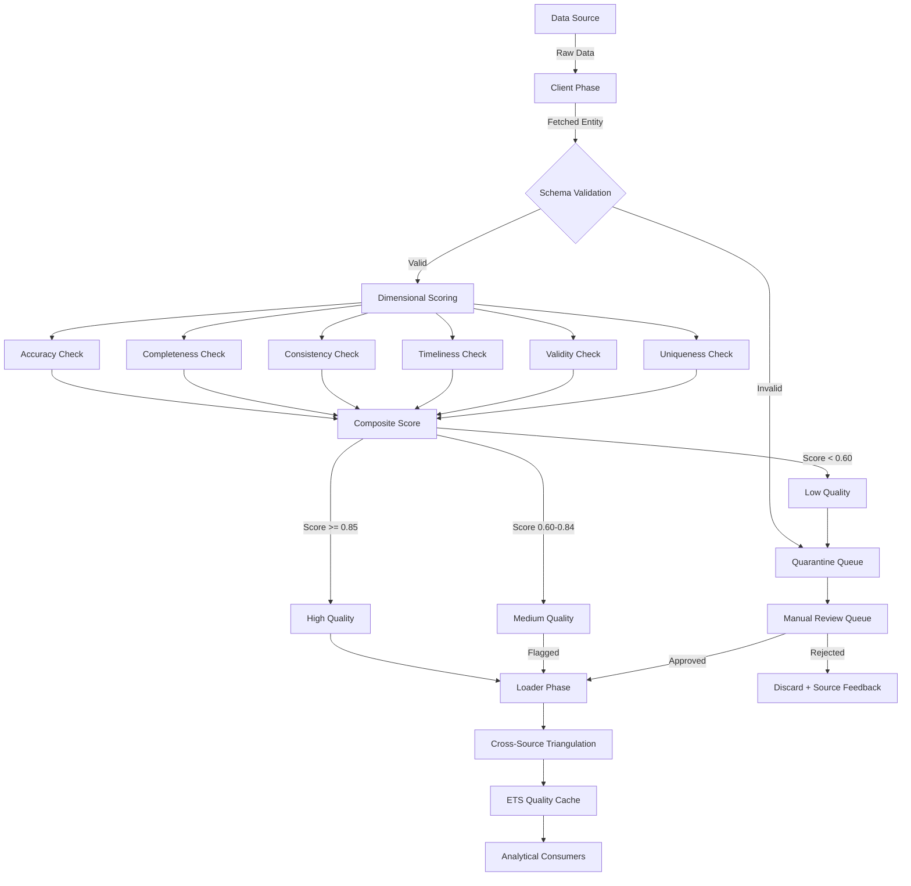

+++
title = "Data Quality"
weight = 50

[extra]
description = "Measure of data fitness for its intended purpose across dimensions of accuracy, completeness, consistency, timeliness, validity, and uniqueness, enforced through automated validation pipelines in the Prismatic Platform's DD and OSINT collection systems."
category = "data"
subcategory = "quality-engineering"
related_terms = ["data-pipeline", "data-migration", "etl", "data-provenance", "quality-gate", "validation", "ecto", "accuracy", "completeness", "confidence-score", "anomaly-detection", "correlation", "telemetry", "observability", "ets"]
tags = ["glossary", "data-quality", "validation", "accuracy", "completeness", "data-pipeline", "scoring", "time-decay", "triangulation", "osint", "dd"]
status = "active"
author = "Tomas Korcak (korczis)"
reading_time = "18 min"
difficulty = "intermediate"
technology_type = "quality-engineering"
platform_component = "prismatic_dd"
prerequisite_concepts = ["ecto-changesets", "genserver", "ets", "telemetry"]
use_cases = ["osint-validation", "dd-entity-verification", "pipeline-quality-gates", "cross-source-triangulation"]
benefits = ["reduced-false-positives", "automated-quality-gates", "traceable-provenance", "confidence-scoring"]
implementation_patterns = ["scoring-model", "time-decay", "cross-source-triangulation", "changeset-validation"]
quality_metrics = ["accuracy", "completeness", "consistency", "timeliness", "validity", "uniqueness"]
integration_points = ["prismatic_dd", "prismatic_osint_core", "prismatic_nabla", "prismatic_storage_ecto"]
related_disciplines = ["data-engineering", "information-quality", "statistical-validation", "osint-tradecraft"]
quality_score = 92
platforms = ["Prismatic Platform", "BEAM/OTP"]
key_takeaway = "Data quality in the Prismatic Platform is enforced through multi-dimensional validation pipelines with composite scoring, time-decay weighting, and cross-source triangulation at every stage of the DD and OSINT collection pipelines."
date_created = "2026-02-24"
date_modified = "2026-04-08"
keywords = ["Data Quality", "validation", "accuracy", "completeness", "glossary", "Prismatic Platform", "scoring model", "time decay", "triangulation", "OSINT", "DD", "quality gate"]
image = "/images/sections/glossary.png"
image_alt = "Data Quality - Prismatic Platform"
word_count = 3800
see_also = ["capabilities", "architecture", "apps"]
+++

## Definition

Data quality refers to the degree to which data meets the requirements of its intended use, measured across multiple dimensions including accuracy (correctness relative to real-world truth), completeness (absence of missing values), consistency (absence of contradictions across datasets), timeliness (currency and availability when needed), validity (conformance to defined formats and constraints), and uniqueness (absence of duplicates). High data quality is not an absolute property but is contextual -- data that is sufficient quality for one purpose may be inadequate for another.

In intelligence and OSINT contexts, data quality directly impacts analytical confidence. Low-quality input data propagates errors through analysis pipelines, producing unreliable conclusions that can lead to incorrect decisions. The Prismatic Platform treats data quality as a first-class concern, embedding automated validation at every stage of the [Data Pipeline](@/glossary/data-pipeline.md) and enforcing minimum quality thresholds through [Quality Gates](@/glossary/quality-gate.md).

## Overview

Data quality engineering in the BEAM/OTP ecosystem benefits from several architectural advantages that traditional imperative platforms lack. Erlang's pattern matching enables declarative validation rules, OTP supervision trees provide fault-tolerant quality monitoring, and ETS tables deliver sub-millisecond quality score lookups. The Prismatic Platform exploits all three to build a quality infrastructure that is both rigorous and performant.

The platform's approach to data quality is structured around three pillars:

1. **Dimensional Scoring** -- Each data point receives scores across six standardized dimensions, combined into a weighted composite score
2. **Temporal Awareness** -- Quality scores decay over time using configurable half-life functions, reflecting the reality that stale intelligence degrades analytical value
3. **Cross-Source Triangulation** -- Data confirmed by multiple independent sources receives higher quality ratings, following the [NABLA Infinity](/glossary/nabla/) epistemic framework's source independence axiom

These pillars operate in concert within the DD and OSINT pipelines, where entity data flows through Client (fetch), Validation (score), and Loader (persist) phases before reaching analytical consumers.

## Technical Deep Dive

### Scoring Model

Data quality is assessed across six standardized dimensions, each producing a score between 0.0 and 1.0. These individual scores are combined using a weighted average that reflects the relative importance of each dimension for the use case.

| Dimension | Definition | Metric Example | Prismatic Enforcement | Weight |
|-----------|-----------|----------------|----------------------|--------|
| **Accuracy** | Correctness relative to truth | Error rate < 1% | Cross-source [Validation](@/glossary/validation.md) | 0.25 |
| **Completeness** | Required fields present | Null rate < 5% | Schema validation via [Ecto](@/glossary/ecto.md) changesets | 0.25 |
| **Consistency** | No contradictions | Conflict rate = 0% | Content hash dedup + cross-record checks | 0.20 |
| **Timeliness** | Data is current | Staleness < 24h | Time decay scoring with configurable half-life | 0.15 |
| **Validity** | Conforms to format rules | Format error rate = 0% | Ecto changesets + custom validators | 0.10 |
| **Uniqueness** | No unintended duplicates | Duplicate rate < 0.1% | Unique constraints + content hashing | 0.05 |

The composite quality score Q is computed as:

```
Q = w_a * accuracy + w_c * completeness + w_k * consistency + w_t * timeliness + w_v * validity + w_u * uniqueness
```

Where the weights `w_*` sum to 1.0 and are configurable per data source. The default weights shown above reflect the DD pipeline's priority on accuracy and completeness for entity verification.

#### Quality Thresholds

The platform defines three quality tiers that determine how data is handled:

| Tier | Score Range | Action | Pipeline Behavior |
|------|-------------|--------|-------------------|
| **High** | >= 0.85 | Accept | Data proceeds to Loader phase and analytical consumers |
| **Medium** | 0.60 - 0.84 | Flag | Data is persisted with quality warnings, requires manual review |
| **Low** | < 0.60 | Reject | Data is quarantined, source reliability score decremented |

### Time Decay Model

Intelligence data degrades in value over time. A company registration record from yesterday is worth more than the same record from six months ago. The platform models this through an exponential decay function:

```
timeliness_score = e^(-lambda * age_hours)
```

Where `lambda` is the decay constant derived from the configured half-life. For a 168-hour (1 week) half-life:

```
lambda = ln(2) / 168 ≈ 0.00413
```

Different data types use different half-lives:

| Data Type | Half-Life | Rationale |
|-----------|-----------|-----------|
| **Financial filings** | 2160h (90 days) | Quarterly reporting cadence |
| **Company registration** | 4320h (180 days) | Semi-annual update frequency |
| **Court proceedings** | 720h (30 days) | Rapidly evolving legal status |
| **Social media profiles** | 168h (7 days) | Frequent changes |
| **Domain/DNS records** | 336h (14 days) | Moderate change frequency |
| **Sanctions lists** | 24h (1 day) | Critical, must be current |

### Cross-Source Triangulation

The cross-source triangulation model evaluates data confidence based on independent source corroboration. Following the [NABLA Infinity](/glossary/nabla/) framework's source independence axiom, data confirmed by N independent sources receives a triangulation bonus:

```
triangulation_score = 1 - (1 - base_confidence)^N
```

Where `base_confidence` is the individual source's historical reliability rating (typically 0.6-0.9) and N is the number of independent sources confirming the datum. This produces a rapid convergence toward 1.0 as independent confirmations accumulate:

| Sources (N) | Base 0.7 | Base 0.8 | Base 0.9 |
|-------------|----------|----------|----------|
| 1 | 0.70 | 0.80 | 0.90 |
| 2 | 0.91 | 0.96 | 0.99 |
| 3 | 0.97 | 0.99 | 0.999 |
| 4 | 0.99 | 0.998 | 0.9999 |

The triangulation score modulates the overall quality score as a multiplier on the accuracy dimension, rewarding data that has been independently verified.

### Data Quality Pipeline Architecture

The following diagram illustrates the complete data quality validation pipeline within the Prismatic Platform:



### Source Reliability Tracking

The platform maintains per-source reliability scores in [ETS](@/glossary/ets.md) for sub-millisecond access. Source reliability is updated using an exponential moving average:

```
new_reliability = alpha * current_batch_quality + (1 - alpha) * previous_reliability
```

Where `alpha` (typically 0.1) controls how quickly the reliability score responds to recent quality changes. Sources that consistently produce low-quality data see their reliability decline, which in turn affects the triangulation bonus applied to their data.

## Usage in Prismatic Platform

The DD pipeline enforces data quality at both the Client (fetch) and Loader (persist) phases, with content hashing for deduplication, changeset validation for structural integrity, and [Telemetry](@/glossary/telemetry.md) instrumentation for quality monitoring.

### Core Quality Validation Module

```elixir
defmodule PrismaticDd.DataQuality do
  @moduledoc """
  Data quality validation module for the DD pipeline.

  Validates entities against six quality dimensions before
  persistence, tracking quality metrics per source via ETS.
  Implements composite scoring with configurable weights,
  time-decay timeliness, and cross-source triangulation.

  ## Quality Dimensions

    * `:accuracy` - Correctness relative to ground truth
    * `:completeness` - Presence of all required fields
    * `:consistency` - Absence of contradictions across records
    * `:timeliness` - Currency of the data (exponential decay)
    * `:validity` - Conformance to format and type constraints
    * `:uniqueness` - Absence of unintended duplicates

  ## Examples

      iex> entity = %{name: "Acme Corp", entity_type: "company",
      ...>   external_id: "ICO-12345", source_slug: "czech-ares",
      ...>   fetched_at: DateTime.utc_now(), attributes: %{address: "Prague"},
      ...>   content_hash: "sha256:abc123"}
      iex> {:ok, report} = PrismaticDd.DataQuality.validate_entity(entity)
      iex> report.overall >= 0.8
      true
  """

  require Logger

  @type quality_dimension :: :accuracy | :completeness | :consistency |
                             :timeliness | :validity | :uniqueness

  @type quality_report :: %{
    accuracy: float(),
    completeness: float(),
    consistency: float(),
    timeliness: float(),
    validity: float(),
    uniqueness: float(),
    overall: float(),
    violations: list(violation()),
    source_slug: String.t() | nil,
    scored_at: DateTime.t()
  }

  @type violation :: %{
    dimension: quality_dimension(),
    score: float(),
    threshold: float(),
    message: String.t()
  }

  @type quality_tier :: :high | :medium | :low

  @default_weights %{
    accuracy: 0.25,
    completeness: 0.25,
    consistency: 0.20,
    timeliness: 0.15,
    validity: 0.10,
    uniqueness: 0.05
  }

  @required_fields [:name, :entity_type, :external_id, :source_slug]

  @high_threshold 0.85
  @medium_threshold 0.60

  @doc """
  Validates an entity map against all six quality dimensions.

  Returns `{:ok, report}` when the composite score meets the
  minimum threshold (>= #{@medium_threshold}), or `{:error, report}`
  when the entity fails quality gates.

  ## Parameters

    * `entity` - Map containing entity data with at least the
      required fields: #{inspect(@required_fields)}
    * `opts` - Optional keyword list:
      * `:weights` - Custom dimension weights (default: #{inspect(@default_weights)})
      * `:half_life_hours` - Timeliness decay half-life (default: 168)

  ## Examples

      iex> entity = %{name: "Test", entity_type: "company",
      ...>   external_id: "123", source_slug: "test-source",
      ...>   fetched_at: DateTime.utc_now(), attributes: %{},
      ...>   content_hash: "hash"}
      iex> {:ok, report} = PrismaticDd.DataQuality.validate_entity(entity)
      iex> is_float(report.overall)
      true
  """
  @spec validate_entity(map(), keyword()) :: {:ok, quality_report()} | {:error, quality_report()}
  def validate_entity(entity, opts \\ []) do
    weights = Keyword.get(opts, :weights, @default_weights)
    half_life = Keyword.get(opts, :half_life_hours, 168)

    report = %{
      accuracy: check_accuracy(entity),
      completeness: check_completeness(entity),
      consistency: check_consistency(entity),
      timeliness: check_timeliness(entity, half_life),
      validity: check_validity(entity),
      uniqueness: 1.0,
      violations: [],
      overall: 0.0,
      source_slug: Map.get(entity, :source_slug),
      scored_at: DateTime.utc_now()
    }

    overall = calculate_overall(report, weights)
    violations = collect_violations(report)
    report = %{report | overall: overall, violations: violations}

    :telemetry.execute(
      [:prismatic, :dd, :data_quality, :scored],
      %{overall: overall, dimension_count: 6},
      %{source_slug: report.source_slug, tier: classify_tier(overall)}
    )

    if overall >= @medium_threshold do
      {:ok, report}
    else
      Logger.warning("Data quality below threshold",
        source: report.source_slug,
        overall: overall,
        violations: length(violations)
      )
      {:error, report}
    end
  end

  @doc """
  Classifies a quality score into a tier.

  ## Examples

      iex> PrismaticDd.DataQuality.classify_tier(0.90)
      :high
      iex> PrismaticDd.DataQuality.classify_tier(0.70)
      :medium
      iex> PrismaticDd.DataQuality.classify_tier(0.40)
      :low
  """
  @spec classify_tier(float()) :: quality_tier()
  def classify_tier(score) when score >= @high_threshold, do: :high
  def classify_tier(score) when score >= @medium_threshold, do: :medium
  def classify_tier(_score), do: :low

  @doc """
  Computes cross-source triangulation confidence.

  Given a base confidence per source and the number of independent
  sources confirming the datum, computes the triangulated confidence
  using the formula: `1 - (1 - base)^n`.

  ## Examples

      iex> PrismaticDd.DataQuality.triangulation_score(0.8, 1)
      0.8
      iex> PrismaticDd.DataQuality.triangulation_score(0.8, 3) |> Float.round(4)
      0.992
  """
  @spec triangulation_score(float(), pos_integer()) :: float()
  def triangulation_score(base_confidence, source_count)
      when is_float(base_confidence) and base_confidence > 0.0
      and base_confidence <= 1.0 and is_integer(source_count)
      and source_count > 0 do
    1.0 - :math.pow(1.0 - base_confidence, source_count)
  end

  # -- Private dimension checks --

  defp check_completeness(entity) do
    present = Enum.count(@required_fields, &Map.has_key?(entity, &1))
    present / length(@required_fields)
  end

  defp check_timeliness(%{fetched_at: fetched_at}, half_life_hours) do
    age_hours = DateTime.diff(DateTime.utc_now(), fetched_at, :second) / 3600.0
    lambda = :math.log(2) / half_life_hours
    :math.exp(-lambda * age_hours)
  end

  defp check_timeliness(_, _half_life_hours), do: 0.5

  defp check_accuracy(%{attributes: attrs}) when map_size(attrs) > 0, do: 1.0
  defp check_accuracy(_), do: 0.5

  defp check_consistency(%{content_hash: hash}) when is_binary(hash), do: 1.0
  defp check_consistency(_), do: 0.5

  defp check_validity(%{entity_type: type})
       when type in ~w(person company organization domain), do: 1.0
  defp check_validity(_), do: 0.7

  defp calculate_overall(report, weights) do
    Enum.reduce(weights, 0.0, fn {dim, weight}, acc ->
      acc + Map.get(report, dim, 0.0) * weight
    end)
  end

  defp collect_violations(report) do
    dimensions = [:accuracy, :completeness, :consistency, :timeliness, :validity]

    Enum.flat_map(dimensions, fn dim ->
      score = Map.get(report, dim, 0.0)

      if score < 0.8 do
        [%{
          dimension: dim,
          score: score,
          threshold: 0.8,
          message: "#{dim} score #{Float.round(score, 3)} below threshold 0.8"
        }]
      else
        []
      end
    end)
  end
end
```

### Quality-Aware Pipeline Integration

The quality validation module integrates with the DD pipeline's GenServer-based processing:

```elixir
defmodule PrismaticDd.Pipeline.QualityGate do
  @moduledoc """
  Quality gate for the DD pipeline.

  Sits between the Client (fetch) and Loader (persist) phases,
  validating each entity against data quality thresholds before
  allowing persistence. Maintains per-source reliability scores
  in ETS for sub-millisecond lookups.
  """

  use GenServer

  require Logger

  @ets_table :dd_source_reliability
  @alpha 0.1

  @doc """
  Starts the quality gate server.
  """
  @spec start_link(keyword()) :: GenServer.on_start()
  def start_link(opts \\ []) do
    GenServer.start_link(__MODULE__, opts, name: __MODULE__)
  end

  @doc """
  Evaluates an entity against quality gates.

  Returns `{:pass, report}` for acceptable quality,
  `{:flag, report}` for medium quality requiring review,
  or `{:reject, report}` for low quality data.
  """
  @spec evaluate(map()) :: {:pass | :flag | :reject, map()}
  def evaluate(entity) do
    GenServer.call(__MODULE__, {:evaluate, entity})
  end

  @impl true
  def init(_opts) do
    :ets.new(@ets_table, [:named_table, :public, read_concurrency: true])

    :telemetry.execute(
      [:prismatic, :dd, :quality_gate, :started],
      %{system_time: System.system_time()},
      %{}
    )

    {:ok, %{evaluated: 0, passed: 0, flagged: 0, rejected: 0}}
  end

  @impl true
  def handle_call({:evaluate, entity}, _from, state) do
    case PrismaticDd.DataQuality.validate_entity(entity) do
      {:ok, report} ->
        tier = PrismaticDd.DataQuality.classify_tier(report.overall)
        update_source_reliability(report.source_slug, report.overall)

        case tier do
          :high ->
            {:reply, {:pass, report},
             %{state | evaluated: state.evaluated + 1, passed: state.passed + 1}}

          :medium ->
            Logger.info("Entity flagged for review",
              source: report.source_slug,
              score: report.overall
            )
            {:reply, {:flag, report},
             %{state | evaluated: state.evaluated + 1, flagged: state.flagged + 1}}
        end

      {:error, report} ->
        update_source_reliability(report.source_slug, report.overall)

        {:reply, {:reject, report},
         %{state | evaluated: state.evaluated + 1, rejected: state.rejected + 1}}
    end
  end

  defp update_source_reliability(nil, _score), do: :ok

  defp update_source_reliability(source_slug, score) do
    current =
      case :ets.lookup(@ets_table, source_slug) do
        [{^source_slug, reliability}] -> reliability
        [] -> 0.8
      end

    new_reliability = @alpha * score + (1 - @alpha) * current
    :ets.insert(@ets_table, {source_slug, new_reliability})
  end
end
```

### Telemetry Integration

Data quality metrics are exposed through the platform's [Observability](@/glossary/observability.md) layer:

```elixir
defmodule PrismaticDd.DataQuality.Telemetry do
  @moduledoc """
  Telemetry event definitions for data quality monitoring.

  Emits events on every quality evaluation, enabling real-time
  dashboards and alerting on quality degradation trends.
  """

  @doc """
  Returns the list of telemetry events emitted by the data quality system.

  ## Examples

      iex> events = PrismaticDd.DataQuality.Telemetry.events()
      iex> [:prismatic, :dd, :data_quality, :scored] in events
      true
  """
  @spec events() :: list(list(atom()))
  def events do
    [
      [:prismatic, :dd, :data_quality, :scored],
      [:prismatic, :dd, :quality_gate, :started],
      [:prismatic, :dd, :quality_gate, :evaluated],
      [:prismatic, :dd, :source_reliability, :updated]
    ]
  end
end
```

## Best Practices

1. **Validate at ingestion, not consumption** -- Catching quality issues early prevents error propagation through analysis pipelines. The DD pipeline's Client phase performs schema validation before any scoring occurs, ensuring structurally invalid data never reaches the Loader.

2. **Define quality thresholds per data source** -- Different sources have different reliability profiles. Czech business registry (ARES) data typically scores 0.9+ on completeness, while social media scrapes may score 0.6. Adjust weights and thresholds accordingly using the `:weights` option in `validate_entity/2`.

3. **Track quality metrics over time** -- Quality degradation often indicates source changes or collection failures. Use [Telemetry](@/glossary/telemetry.md) events to build dashboards showing quality trends per source, triggering alerts when the exponential moving average drops below historical baselines.

4. **Implement automated quality gates** -- Block low-quality data from entering production datasets. The `QualityGate` GenServer provides a centralized enforcement point that integrates with the pipeline's supervision tree.

5. **Use content hashing for deduplication** -- Deterministic hash comparison is more reliable than fuzzy matching for exact duplicate detection. The platform uses SHA-256 content hashes stored alongside entities, enabling O(1) uniqueness checks via database unique constraints.

6. **Report quality metrics alongside data** -- Consumers need quality context to assess analytical confidence. Every entity in the platform carries its quality report as metadata, enabling downstream [Confidence Score](@/glossary/confidence-score.md) calculations to incorporate data quality as an input variable.

7. **Leverage ETS for hot-path quality lookups** -- Source reliability scores are queried on every entity validation. Storing them in ETS with `read_concurrency: true` ensures sub-microsecond lookups without GenServer bottlenecks.

8. **Implement exponential time decay, not linear** -- Linear decay models overvalue stale data. Exponential decay with configurable half-lives per data type accurately reflects how intelligence value degrades -- sanctions data loses value in hours, while corporate registration data remains useful for months.

## Common Mistakes

| Mistake | Why It's Wrong | Correct Approach |
|---------|---------------|-----------------|
| Treating quality as binary (good/bad) | Loses nuance needed for confidence scoring | Use continuous 0.0-1.0 dimensional scores |
| Equal weighting across all dimensions | Not all dimensions matter equally for every use case | Configure weights per source and data type |
| Ignoring temporal decay | Stale data presented as current leads to wrong decisions | Apply exponential decay with appropriate half-lives |
| Validating only at write time | Read-time consumers see degraded data without warning | Re-score on read with current timestamps |
| Using `length(list) == 0` for emptiness | O(n) traversal of entire list for a simple check | Use `list == []` or `Enum.empty?(list)` for O(1) |
| Hardcoding quality thresholds | Different contexts require different standards | Make thresholds configurable via application env |
| Single-source trust | One source can be wrong, stale, or compromised | Require cross-source triangulation for high-confidence claims |
| Bare rescue in quality checks | Swallows errors, masks quality pipeline failures | Catch specific exceptions: `rescue e in [ArgumentError] ->` |
| `String.to_atom` for dimension names | Atom table exhaustion from untrusted input | Use `String.to_existing_atom/1` or explicit allowlists |
| Unbounded `Repo.all` for quality audits | Can return millions of rows, OOM crash | Always `|> limit(1000)` or use `Repo.stream/2` |

## Related Terms

- [Data Pipeline](@/glossary/data-pipeline.md) -- Automated processing workflows where quality validation is embedded at every stage
- [Data Migration](@/glossary/data-migration.md) -- Transfer processes requiring quality preservation validation and regression checks
- [ETL](@/glossary/etl.md) -- Extract-Transform-Load pattern with quality checks at each stage of the transformation
- [Data Provenance](@/glossary/data-provenance.md) -- Traceability enabling quality root cause analysis when scores degrade
- [Ecto](@/glossary/ecto.md) -- Database wrapper providing changeset validation as the foundation for data quality enforcement
- [Accuracy](@/glossary/accuracy.md) -- The correctness dimension of data quality, measuring alignment with ground truth
- [Completeness](@/glossary/completeness.md) -- The absence-of-missing-values dimension, critical for entity verification
- [Confidence Score](@/glossary/confidence-score.md) -- Analytical confidence metric that consumes data quality scores as inputs
- [Anomaly Detection](@/glossary/anomaly-detection.md) -- Detection of outliers that may indicate quality issues in source data
- [Validation](@/glossary/validation.md) -- The process of checking data against defined rules and constraints
- [Quality Gate](@/glossary/quality-gate.md) -- Enforcement checkpoint that blocks low-quality data from proceeding
- [Telemetry](@/glossary/telemetry.md) -- Observability infrastructure for tracking quality metrics in real time
- [ETS](@/glossary/ets.md) -- In-memory storage used for sub-millisecond source reliability lookups
- [Correlation](@/glossary/correlation.md) -- Statistical relationship analysis used in cross-source triangulation

## See Also

- [Capabilities](@/capabilities/_index.md) -- Platform data quality capabilities and enforcement features
- [Architecture](@/architecture/_index.md) -- Data pipeline architecture with quality gates at every stage
- [NABLA Infinity Framework](/glossary/nabla/) -- Epistemic framework providing the theoretical foundation for quality axioms

---

## Connect & Contribute

**Created by [Tomas Korcak (korczis)](https://github.com/korczis)** | Open Source under [GHL](https://github.com/korczis/prismatic-platform/blob/main/LICENSE)

- [GitHub](https://github.com/korczis/prismatic-platform) | [GitLab](https://gitlab.com/korczis/prismatic-platform) | [LinkedIn](https://linkedin.com/in/korczis) | [Contact](mailto:korczis@gmail.com)
- [Developer Portal](@/developers/_index.md) | [Architecture](@/architecture/_index.md) | [Meet the Creator](@/about/author.md)
