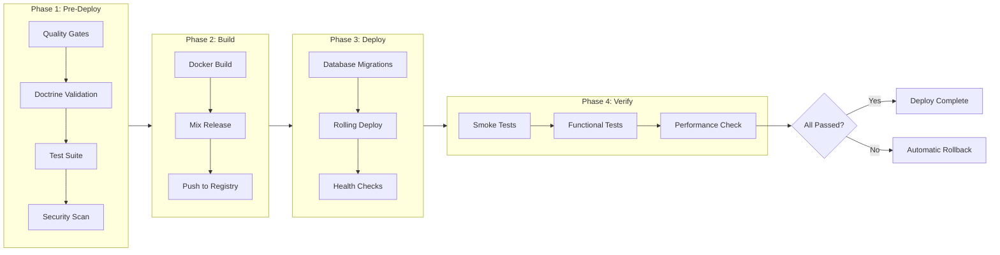
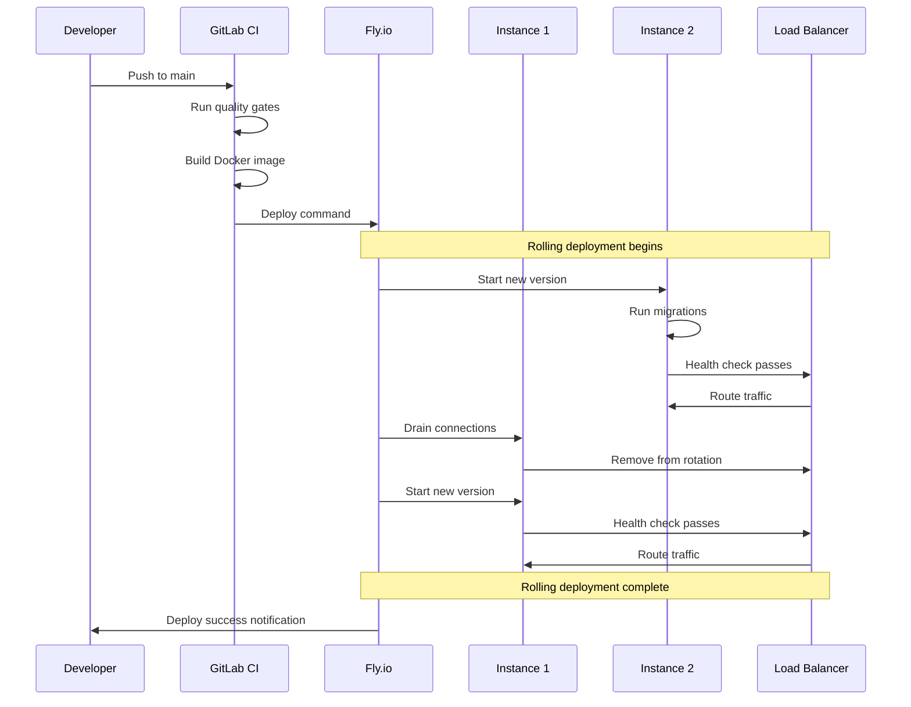
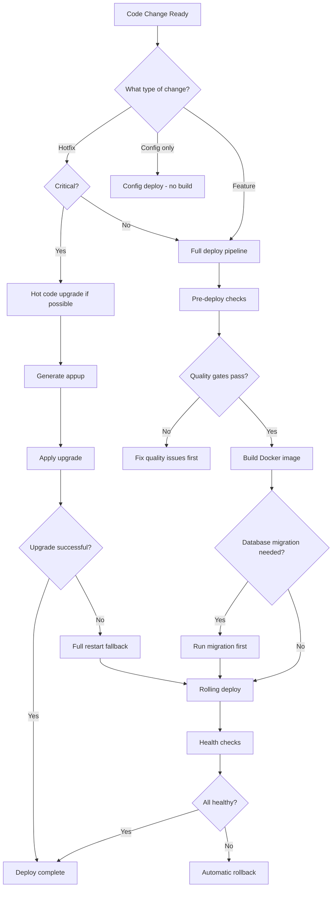
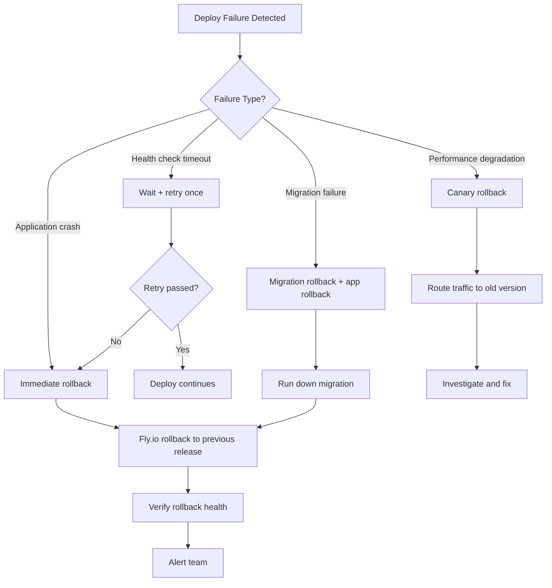

+++
title = "Deployment"
weight = 50
[extra]
description = "The process of releasing a software application to a target environment, encompassing build artifact creation, infrastructure provisioning, release execution, and health verification"
category = "platform"
subcategory = "operations"
difficulty = "intermediate"
technology_type = "operational_process"
platform_component = "release_management"
paradigm = "continuous_delivery"
prerequisite_concepts = ["docker", "elixir_releases", "ci_cd", "health_checks", "database_migrations"]
use_cases = ["production_release", "staging_validation", "rollback_recovery", "hot_code_upgrade", "canary_release"]
benefits = ["automated_delivery", "zero_downtime", "reproducible_releases", "fast_rollback", "health_verified"]
implementation_patterns = ["rolling_deployment", "blue_green", "canary", "hot_code_upgrade", "recreate"]
quality_metrics = ["deploy_frequency", "lead_time", "change_failure_rate", "mttr"]
integration_points = ["fly_io", "docker", "gitlab_ci", "mix_release", "health_checks", "telemetry"]
related_disciplines = ["devops", "site_reliability", "platform_engineering", "release_management"]
related_terms = ["delivery", "docker", "fly-io", "gitlab-ci", "hot-code-upgrade", "health-check", "gitops", "cicd", "rollback", "migration", "release", "supervision-tree", "telemetry", "configuration"]
tags = ["glossary", "deployment", "release", "fly-io", "docker", "elixir", "production"]
status = "active"
author = "Tomas Korcak (korczis)"
reading_time = "15 min"
quality_score = 92
platforms = ["Prismatic Platform", "BEAM/OTP"]
key_takeaway = "The Prismatic Platform deploys through Fly.io with Docker-based releases, rolling deployments with health checks, and Elixir release capabilities including hot code upgrades for zero-downtime updates"
date_created = "2026-02-24"
date_modified = "2026-04-08"
keywords = ["Deployment", "release", "Fly.io", "Docker", "glossary", "Prismatic Platform", "production", "rolling deployment", "blue-green", "canary", "hot code upgrade", "mix release"]
image = "/images/sections/glossary.png"
image_alt = "Deployment - Prismatic Platform"
word_count = 3800
see_also = ["technologies", "architecture", "capabilities"]
+++

## Definition

Deployment is the process of making a software application available in a target environment by building release artifacts, provisioning infrastructure, executing the release, and verifying system health. Modern deployment practices emphasize automation, reproducibility, and safety mechanisms including rolling deployments, canary releases, blue-green strategies, and automatic rollback on failure. The [BEAM](/glossary/beam/) virtual machine adds unique deployment capabilities through hot code upgrades, where running systems can be updated without restarting processes or dropping connections.

Deployment is the final stage of the delivery [pipeline](/glossary/pipeline/), where compiled, tested, and validated code transitions from the development environment to production. The quality of deployment automation directly determines two of the four DORA metrics: deployment frequency and lead time for changes. The Prismatic Platform's deployment pipeline embodies the NMND doctrine -- every deployment is fully automated, health-verified, and rollback-capable.

## Overview

### Deployment Strategy Comparison

| Strategy | Downtime | Risk | Rollback Speed | Prismatic Usage |
|----------|----------|------|----------------|-----------------|
| **Rolling** | Zero | Low | Instance-level (~30s) | Primary production strategy |
| **Blue-Green** | Near-zero | Very Low | Instant switch (~5s) | Database migration releases |
| **Canary** | Zero | Lowest | Percentage-based (~10s) | Feature flag releases |
| **Hot Code Upgrade** | Zero | Medium | Appup-based (~1s) | Critical patches |
| **Recreate** | Minutes | Highest | Redeploy (~2min) | Development only |

### Deployment Pipeline Flow



### DORA Metrics Context

The four DORA metrics measure deployment effectiveness:

| Metric | Elite | High | Medium | Prismatic Target |
|--------|-------|------|--------|-----------------|
| **Deploy Frequency** | Multiple/day | Daily-weekly | Monthly | Multiple/day |
| **Lead Time** | <1 hour | 1 day-1 week | 1-6 months | <30 minutes |
| **Change Failure Rate** | 0-15% | 16-30% | 16-30% | <10% |
| **MTTR** | <1 hour | <1 day | 1 day-1 week | <15 minutes |

## Technical Deep Dive

### Elixir Releases

[Elixir](/glossary/elixir/) releases, built with `mix release`, produce self-contained packages that include the Erlang runtime, compiled BEAM files, and boot scripts. These releases do not require Elixir or Erlang to be installed on the target system.

```elixir
# mix.exs release configuration
def project do
  [
    releases: [
      prismatic: [
        include_executables_for: [:unix],
        applications: [runtime_tools: :permanent],
        steps: [:assemble, :tar],
        strip_beams: true
      ]
    ]
  ]
end
```

Key release features:
- **Self-contained**: No Elixir/Erlang installation needed on target
- **Boot scripts**: Automatic startup with `bin/prismatic start`
- **Config providers**: Runtime configuration from environment variables
- **Remote console**: `bin/prismatic remote` for production debugging
- **Health checks**: Built-in liveness and readiness probes

### Docker Build Pipeline

The platform uses multi-stage Docker builds for minimal, secure images:

```dockerfile
# Stage 1: Build
FROM hexpm/elixir:1.16.0-erlang-26.2-debian-bullseye AS builder

ENV MIX_ENV=prod

WORKDIR /app
COPY mix.exs mix.lock ./
COPY apps/*/mix.exs ./apps/
RUN mix deps.get --only prod && mix deps.compile

COPY . .
RUN mix assets.deploy && mix release prismatic

# Stage 2: Runtime (minimal image)
FROM debian:bullseye-slim AS runner

RUN apt-get update && apt-get install -y libstdc++6 openssl libncurses5 \
    && rm -rf /var/lib/apt/lists/*

COPY --from=builder /app/_build/prod/rel/prismatic /app
ENV HOME=/app
WORKDIR /app

HEALTHCHECK --interval=30s --timeout=5s --retries=3 \
    CMD curl -f http://localhost:4000/health || exit 1

CMD ["bin/prismatic", "start"]
```

### Fly.io Deployment

The Prismatic Platform deploys to [Fly.io](/glossary/fly-io/), which provides globally distributed edge hosting with built-in TLS, auto-scaling, and rolling deployments:

```toml
# fly.toml
app = "prismatic-prod"
primary_region = "fra"

[build]
  dockerfile = "Dockerfile"

[deploy]
  strategy = "rolling"
  release_command = "bin/prismatic eval 'Prismatic.Release.migrate()'"

[http_service]
  internal_port = 4000
  force_https = true

  [[http_service.checks]]
    grace_period = "30s"
    interval = "15s"
    method = "GET"
    path = "/health"
    timeout = "5s"

[processes]
  app = "bin/prismatic start"
```

### Rolling Deployment Sequence



### Hot Code Upgrades

The BEAM's unique hot code upgrade capability allows updating running systems without restarting processes:

```elixir
defmodule Prismatic.Release.HotUpgrade do
  @moduledoc """
  Hot code upgrade support for zero-downtime patches.

  The BEAM can load two versions of a module simultaneously:
  the 'current' version and the 'old' version. Running processes
  continue with the old version until they make a fully-qualified
  call (Module.function), at which point they switch to the current
  version.
  """

  @spec upgrade(String.t()) :: :ok | {:error, term()}
  def upgrade(version) do
    # Generate appup files describing the upgrade path
    with :ok <- generate_appups(version),
         :ok <- build_relup(version),
         :ok <- apply_upgrade(version) do
      :ok
    end
  end

  defp generate_appups(version) do
    # Appup files describe how to upgrade each application
    # from the old version to the new version
    {:ok, _} = :release_handler.create_RELEASES(
      ~c"releases",
      ~c"releases/#{version}/prismatic.rel"
    )
    :ok
  end

  defp build_relup(version) do
    case :systools.make_relup(
      ~c"releases/#{version}/prismatic",
      [~c"releases/current/prismatic"],
      [~c"releases/current/prismatic"]
    ) do
      :ok -> :ok
      {:error, _, reason} -> {:error, reason}
    end
  end

  defp apply_upgrade(version) do
    case :release_handler.install_release(~c"#{version}") do
      {:ok, _, _} -> :ok
      {:error, reason} -> {:error, reason}
    end
  end
end
```

### Database Migration Strategy

Migrations run as a release command before new code deploys, ensuring schema compatibility:

```elixir
defmodule Prismatic.Release do
  @moduledoc """
  Release tasks for database migration and seed data.
  Called via: bin/prismatic eval 'Prismatic.Release.migrate()'
  """

  @app :prismatic

  @spec migrate() :: :ok
  def migrate do
    load_app()

    for repo <- repos() do
      {:ok, _, _} = Ecto.Migrator.with_repo(repo, &Ecto.Migrator.run(&1, :up, all: true))
    end

    :ok
  end

  @spec rollback(module(), integer()) :: :ok
  def rollback(repo, version) do
    load_app()
    {:ok, _, _} = Ecto.Migrator.with_repo(repo, &Ecto.Migrator.run(&1, :down, to: version))
    :ok
  end

  defp repos do
    Application.fetch_env!(@app, :ecto_repos)
  end

  defp load_app do
    Application.load(@app)
  end
end
```

### Health Check Implementation

Every deployment must pass health verification:

```elixir
defmodule PrismaticWeb.HealthController do
  @moduledoc """
  Health check endpoint for deployment verification.
  Returns 200 when all critical subsystems are operational.
  """
  use PrismaticWeb, :controller

  @spec check(Plug.Conn.t(), map()) :: Plug.Conn.t()
  def check(conn, _params) do
    checks = [
      {:database, &check_database/0},
      {:ets, &check_ets/0},
      {:pubsub, &check_pubsub/0},
      {:telemetry, &check_telemetry/0}
    ]

    results = Enum.map(checks, fn {name, check_fn} ->
      try do
        {name, check_fn.()}
      rescue
        e -> {name, {:error, Exception.message(e)}}
      end
    end)

    all_healthy = Enum.all?(results, fn {_, status} -> status == :ok end)

    status = if all_healthy, do: 200, else: 503

    json(conn, %{
      status: if(all_healthy, do: "healthy", else: "degraded"),
      checks: Map.new(results),
      version: Application.spec(:prismatic, :vsn) |> to_string(),
      uptime: System.monotonic_time(:second)
    })
    |> put_status(status)
  end

  defp check_database do
    Prismatic.Repo.query!("SELECT 1")
    :ok
  rescue
    _ -> {:error, "database unreachable"}
  end

  defp check_ets do
    case :ets.info(:prismatic_cache) do
      :undefined -> {:error, "ETS table missing"}
      _ -> :ok
    end
  end

  defp check_pubsub do
    Phoenix.PubSub.node_name(Prismatic.PubSub)
    :ok
  rescue
    _ -> {:error, "PubSub unavailable"}
  end

  defp check_telemetry do
    :telemetry.execute([:prismatic, :health, :check], %{value: 1}, %{})
    :ok
  end
end
```

## Deployment Automation

### The /deploy Skill

The Prismatic Platform provides a `/deploy` skill that orchestrates the full deployment pipeline:

```bash
# Full production deployment with validation
just deploy-production

# Staging deployment
just deploy-validate staging

# Dry run (preview without executing)
just deploy-dry-run production

# Emergency rollback
just production-recover
```

### Deployment Decision Tree



### Post-Deploy Verification

```bash
# Smoke test (4 endpoints)
just smoke-test production

# Full post-deploy validation
just post-deploy-validate production

# Check current production status
just production-status
```

## Rollback Strategy



## Best Practices

1. **Automate the entire deployment pipeline** -- manual steps introduce inconsistency and risk. Every deployment should be a single command (`just deploy-production`).
2. **Run database migrations before application deployment** -- ensures the schema is ready before new code attempts to use it. Make migrations backwards-compatible.
3. **Implement health checks** -- every deployed instance must pass health verification before receiving traffic. Check database, [ETS](/glossary/ets/), PubSub, and critical [GenServers](/glossary/genserver/).
4. **Use rolling deployments** -- update instances one at a time to maintain availability during releases.
5. **Maintain deployment parity** -- staging and production environments should be identical in configuration and infrastructure.
6. **Tag every deployment** -- associate Git SHAs with deployed versions for traceability and rollback.
7. **Make migrations reversible** -- every `up` migration should have a corresponding `down` for safe rollback.
8. **Monitor post-deploy** -- watch error rates, latency percentiles, and [telemetry](/glossary/telemetry/) dashboards for 30 minutes after deploy.
9. **Limit blast radius** -- deploy to staging first, canary to a subset of production, then full rollout.
10. **Never deploy on Fridays** -- unless the fix is more critical than the risk of weekend incidents.

## Common Pitfalls

| Pitfall | Impact | Prevention |
|---------|--------|-----------|
| Missing health checks | Broken instances receive traffic | Always implement /health endpoint |
| Non-reversible migrations | Can't rollback safely | Write both up and down migrations |
| `Mix.env()` in releases | Crash at startup | Use `Application.compile_env` |
| Missing env variables | Silent failures or crashes | Validate all required env at boot |
| Large Docker images | Slow deploy, wasted bandwidth | Multi-stage builds, strip beams |
| No rollback plan | Extended outage on failure | Test rollback procedure regularly |

## Related Terms

- [Docker](/glossary/docker/) -- containerization for reproducible deployment artifacts
- [Fly.io](/glossary/fly-io/) -- platform hosting Prismatic production deployments
- [CI/CD](/glossary/cicd/) -- continuous integration and delivery pipeline
- [GitLab CI](/glossary/gitlab-ci/) -- CI/CD system driving automated deployments
- [Hot Code Upgrade](/glossary/hot-code-upgrade/) -- BEAM capability for zero-downtime updates
- [Health Check](/glossary/health-check/) -- verification that deployed instances are functional
- [Delivery](/glossary/delivery/) -- complete pipeline from commit to production
- [Release](/glossary/release/) -- self-contained deployment artifact
- [Migration](/glossary/schema-migration/) -- database schema changes run during deployment
- [Supervision Tree](/glossary/supervision-tree/) -- fault tolerance structure that survives deployments
- [Configuration](/glossary/configuration/) -- runtime settings applied during deployment
- [Telemetry](/glossary/telemetry/) -- observability for post-deploy monitoring
- [Rollback](/glossary/rollback/) -- reverting to a previous deployment version
- [GitOps](/glossary/gitops/) -- Git-driven deployment automation

## See Also

- [Architecture](/architecture/) -- platform deployment architecture
- [Technologies](/technologies/) -- deployment infrastructure and tooling
- [Production Validation](/deploy/) -- three-phase deploy pipeline doctrine

---

## Connect & Contribute

**Created by [Tomas Korcak (korczis)](https://github.com/korczis)** | Open Source under [GHL](https://github.com/korczis/prismatic-platform/blob/main/LICENSE)

- [GitHub](https://github.com/korczis/prismatic-platform) | [GitLab](https://gitlab.com/korczis/prismatic-platform) | [LinkedIn](https://linkedin.com/in/korczis) | [Contact](mailto:korczis@gmail.com)
- [Developer Portal](/developers/) | [Architecture](/architecture/) | [Meet the Creator](/about/author/)
