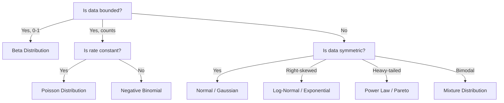
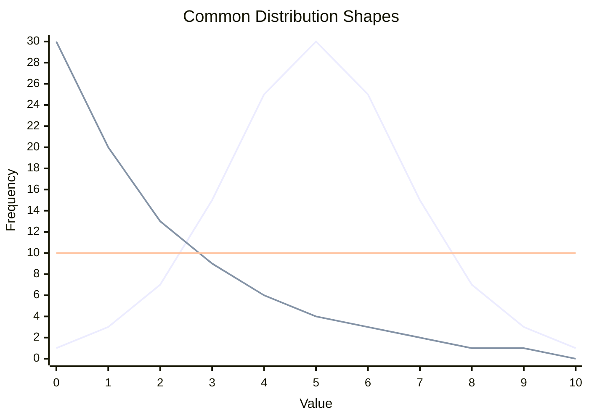
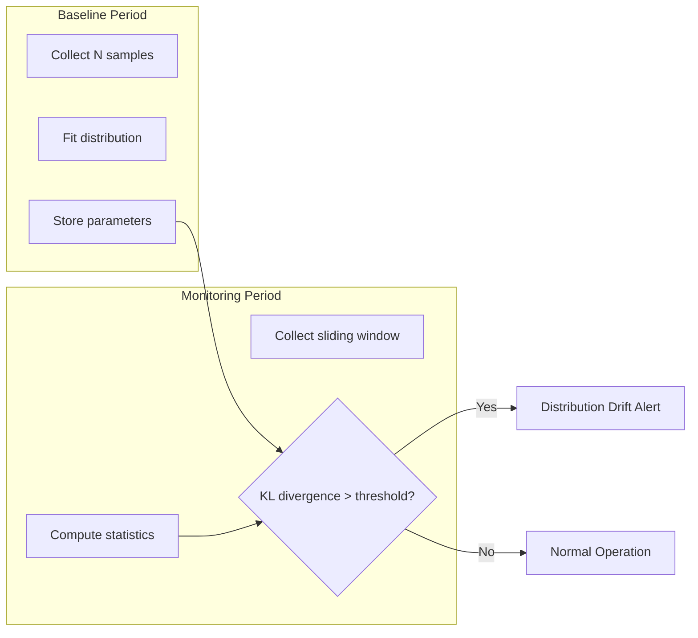
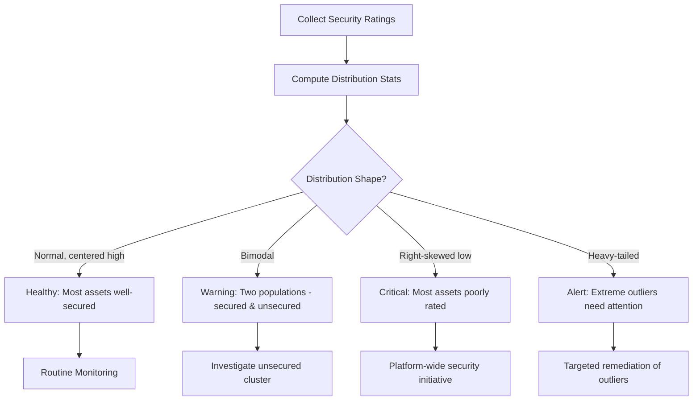

+++
title = "Distribution"
weight = 50
[extra]
description = "Statistical description of how values are spread across a dataset, characterized by shape, central tendency, and dispersion, essential for anomaly detection and quality scoring"
category = "data"
subcategory = "statistics"
difficulty = "intermediate"
technology_type = "statistical_concept"
platform_component = "analytics_engine"
paradigm = "descriptive_statistics"
prerequisite_concepts = ["mean", "median", "variance", "data_collection"]
use_cases = ["anomaly_detection", "quality_scoring", "performance_monitoring", "threshold_setting", "trend_analysis", "security_rating"]
benefits = ["data_understanding", "anomaly_identification", "informed_thresholds", "quality_validation", "predictive_analysis"]
implementation_patterns = ["histogram_binning", "percentile_computation", "kernel_density", "z_score_detection", "iqr_fencing"]
quality_metrics = ["goodness_of_fit", "normality_tests", "distribution_drift", "anomaly_rate"]
integration_points = ["quality_dna", "telemetry", "benchee", "security_ratings", "osint_analysis"]
related_disciplines = ["statistics", "data_science", "signal_processing", "quality_engineering", "machine_learning"]
related_terms = ["mean", "median", "percentile", "variance", "standard-deviation", "histogram", "outlier", "iqr", "f1-score", "data-quality", "anomaly", "kpi", "telemetry", "monitoring", "benchee"]
tags = ["glossary", "distribution", "statistics", "analytics", "anomaly-detection", "data-analysis"]
status = "active"
author = "Tomas Korcak (korczis)"
reading_time = "15 min"
quality_score = 92
platforms = ["Prismatic Platform", "BEAM/OTP"]
key_takeaway = "Understanding data distributions enables the Prismatic Platform to detect anomalies in security ratings, identify outliers in OSINT findings, and validate quality metric distributions across the umbrella"
date_created = "2026-02-24"
date_modified = "2026-04-08"
keywords = ["Distribution", "statistics", "normal", "anomaly", "glossary", "Prismatic Platform", "analytics", "Gaussian", "skewness", "kurtosis", "percentile", "IQR"]
image = "/images/sections/glossary.png"
image_alt = "Distribution - Prismatic Platform"
word_count = 3800
see_also = ["capabilities", "architecture", "technologies"]
+++

## Definition

A statistical distribution describes how values in a dataset are spread across the possible range, characterized by measures of central tendency ([mean](@/glossary/mean.md), [median](@/glossary/median.md), mode), dispersion ([variance](@/glossary/variance.md), [standard deviation](@/glossary/standard-deviation.md), IQR), and shape (skewness, kurtosis). Understanding distributions is fundamental to data analysis because it determines which analytical methods are valid, how to detect [anomalies](@/glossary/anomaly.md), and what constitutes "normal" behavior in a system.

In the context of platform [monitoring](@/glossary/monitoring.md) and intelligence analysis, distribution analysis enables anomaly detection (values far from expected distribution), threshold setting (based on [percentiles](@/glossary/percentile.md) rather than absolute values), and quality assessment (verifying that metrics follow expected patterns). The choice of distribution model determines whether your analytics produce reliable insights or misleading conclusions.

## Overview

### Why Distributions Matter in Software Systems

Every metric in a software system follows some distribution. Response times follow a log-normal distribution (long right tail). Error rates follow a Poisson distribution (rare events per time interval). Quality scores follow a beta distribution (bounded between 0 and 1). Understanding which distribution your data follows determines:

1. **Which summary statistics are meaningful** -- mean is only meaningful for symmetric distributions
2. **How to set alerting thresholds** -- normal-based thresholds fail for skewed data
3. **How to detect anomalies** -- the definition of "unusual" depends on the expected distribution
4. **Whether changes are statistically significant** -- different distributions require different tests

### Distribution Classification



### Common Distribution Types

| Distribution | Shape | Parameters | Use Case in Prismatic | Detection Method |
|-------------|-------|-----------|----------------------|-----------------|
| **Normal (Gaussian)** | Bell curve, symmetric | mean, std_dev | Quality scores, performance metrics | Shapiro-Wilk test |
| **Log-Normal** | Right-skewed, positive | mean_log, std_dev_log | Response latencies, file sizes | Log-transform + normality test |
| **Exponential** | Right-skewed, memoryless | rate (lambda) | Time between events, inter-arrival times | QQ-plot vs exponential |
| **Power Law** | Heavy tail | exponent (alpha) | OSINT finding frequencies, link counts | Log-log plot linearity |
| **Poisson** | Discrete, count data | rate (lambda) | Error counts per interval, event frequencies | Chi-squared goodness-of-fit |
| **Uniform** | Flat, equal probability | min, max | Random identifiers, hash distributions | Chi-squared test |
| **Beta** | Bounded [0,1], flexible | alpha, beta | Quality ratios, confidence scores | MLE parameter estimation |
| **Bimodal** | Two peaks | mixture params | Healthy vs unhealthy states, A/B splits | Kernel density estimation |

### Distribution Shapes Visualization



## Technical Deep Dive

### Measures of Shape

Beyond central tendency and spread, distribution shape determines which analytical methods are valid:

**Skewness** measures asymmetry:
- **Skewness = 0**: Symmetric (normal)
- **Skewness > 0**: Right-skewed (long right tail) -- latency, file sizes
- **Skewness < 0**: Left-skewed (long left tail) -- exam scores near ceiling

**Kurtosis** measures tail heaviness:
- **Kurtosis = 3** (or excess kurtosis = 0): Normal tails (mesokurtic)
- **Kurtosis > 3**: Heavy tails, more outliers (leptokurtic) -- financial data
- **Kurtosis < 3**: Light tails, fewer outliers (platykurtic) -- uniform-like

### Anomaly Detection Methods

Different distributions require different anomaly detection approaches:

| Method | Assumes | Formula | Best For |
|--------|---------|---------|----------|
| **Z-score** | Normal distribution | z = (x - mean) / std_dev | Symmetric, well-behaved data |
| **Modified Z-score** | Approximate symmetry | z = 0.6745 * (x - median) / MAD | Moderate skew, some outliers |
| **IQR fencing** | Any distribution | outlier if x < Q1 - 1.5*IQR or x > Q3 + 1.5*IQR | Robust, distribution-free |
| **Percentile-based** | Any distribution | outlier if x < P1 or x > P99 | Non-parametric, any shape |
| **Grubbs test** | Normal, single outlier | T = max(|x - mean|) / std_dev | Lab-style single outlier detection |
| **Distribution fit** | Known distribution | Likelihood ratio test | When distribution type is known |

### Distribution Drift Detection

Distribution drift occurs when the shape of incoming data changes over time -- a critical signal in monitoring:



**Kullback-Leibler (KL) divergence** quantifies how much the current distribution differs from the baseline. A sudden increase in KL divergence indicates:
- System behavior change (deployment, config change)
- Data quality issue (upstream schema change)
- Security anomaly (attack pattern shift)
- Performance degradation (resource exhaustion)

## Usage in Prismatic Platform

### Quality Score Distribution Analysis

The Prismatic Platform tracks quality scores across all umbrella apps. These scores follow an approximately normal distribution when the platform is healthy. Significant skew or bimodality signals quality issues:

```elixir
defmodule Prismatic.Analytics.Distribution do
  @moduledoc """
  Statistical distribution analysis for platform metrics,
  supporting anomaly detection, percentile computation,
  and distribution characterization.
  """

  @type stats :: %{
    count: non_neg_integer(),
    mean: float(),
    median: float(),
    std_dev: float(),
    min: number(),
    max: number(),
    p25: float(),
    p75: float(),
    p95: float(),
    p99: float(),
    iqr: float(),
    skewness: float(),
    kurtosis: float()
  }

  @spec describe(list(number())) :: {:ok, stats()} | {:error, :empty_dataset}
  def describe([]), do: {:error, :empty_dataset}
  def describe(values) when is_list(values) do
    sorted = Enum.sort(values)
    n = length(sorted)
    mean_val = Enum.sum(values) / n
    sd = std_dev(values, mean_val)
    p25 = percentile(sorted, 0.25)
    p75 = percentile(sorted, 0.75)

    {:ok, %{
      count: n,
      mean: mean_val,
      median: percentile(sorted, 0.5),
      std_dev: sd,
      min: List.first(sorted),
      max: List.last(sorted),
      p25: p25,
      p75: p75,
      p95: percentile(sorted, 0.95),
      p99: percentile(sorted, 0.99),
      iqr: p75 - p25,
      skewness: skewness(values, mean_val, sd),
      kurtosis: kurtosis(values, mean_val, sd)
    }}
  end

  @doc """
  Detects anomalies using z-score method.
  Values beyond z_threshold standard deviations from the mean
  are flagged as anomalous.

  ## Examples

      iex> Prismatic.Analytics.Distribution.detect_anomalies([1, 2, 3, 100, 2, 3])
      [{3, 100}]
  """
  @spec detect_anomalies(list(number()), float()) :: list({non_neg_integer(), number()})
  def detect_anomalies(values, z_threshold \\ 3.0) when is_list(values) do
    mean_val = Enum.sum(values) / length(values)
    sd = std_dev(values, mean_val)

    values
    |> Enum.with_index()
    |> Enum.filter(fn {value, _idx} ->
      z_score = abs(value - mean_val) / max(sd, 0.0001)
      z_score > z_threshold
    end)
    |> Enum.map(fn {value, idx} -> {idx, value} end)
  end

  @doc """
  Detects anomalies using IQR fencing (distribution-free).
  More robust than z-score for skewed distributions.
  """
  @spec detect_anomalies_iqr(list(number()), float()) :: list({non_neg_integer(), number()})
  def detect_anomalies_iqr(values, fence_multiplier \\ 1.5) when is_list(values) do
    sorted = Enum.sort(values)
    q1 = percentile(sorted, 0.25)
    q3 = percentile(sorted, 0.75)
    iqr = q3 - q1
    lower_fence = q1 - fence_multiplier * iqr
    upper_fence = q3 + fence_multiplier * iqr

    values
    |> Enum.with_index()
    |> Enum.filter(fn {value, _idx} ->
      value < lower_fence or value > upper_fence
    end)
    |> Enum.map(fn {value, idx} -> {idx, value} end)
  end

  @doc """
  Classifies distribution shape based on skewness and kurtosis.
  """
  @spec classify_shape(list(number())) :: atom()
  def classify_shape(values) when is_list(values) and length(values) > 10 do
    mean_val = Enum.sum(values) / length(values)
    sd = std_dev(values, mean_val)
    sk = skewness(values, mean_val, sd)
    ku = kurtosis(values, mean_val, sd)

    cond do
      abs(sk) < 0.5 and abs(ku - 3) < 1 -> :normal
      sk > 1.0 -> :right_skewed
      sk < -1.0 -> :left_skewed
      ku > 5 -> :heavy_tailed
      ku < 2 -> :light_tailed
      true -> :approximately_normal
    end
  end

  def classify_shape(_), do: :insufficient_data

  @spec percentile(list(number()), float()) :: float()
  defp percentile(sorted, p) when is_list(sorted) do
    k = (length(sorted) - 1) * p
    f = floor(k)
    c = ceil(k)

    if f == c do
      Enum.at(sorted, f) * 1.0
    else
      Enum.at(sorted, f) * (c - k) + Enum.at(sorted, c) * (k - f)
    end
  end

  defp std_dev(values, mean_val) do
    n = length(values)
    variance = Enum.reduce(values, 0.0, fn v, acc -> acc + (v - mean_val) * (v - mean_val) end) / n
    :math.sqrt(variance)
  end

  defp skewness(values, mean_val, sd) when sd > 0 do
    n = length(values)
    Enum.reduce(values, 0.0, fn v, acc -> acc + :math.pow((v - mean_val) / sd, 3) end) / n
  end
  defp skewness(_, _, _), do: 0.0

  defp kurtosis(values, mean_val, sd) when sd > 0 do
    n = length(values)
    Enum.reduce(values, 0.0, fn v, acc -> acc + :math.pow((v - mean_val) / sd, 4) end) / n
  end
  defp kurtosis(_, _, _), do: 3.0
end
```

### OSINT Finding Frequency Analysis

OSINT findings follow a power law distribution: most entities have few findings, while a small number have many. This shapes how the platform prioritizes investigation:

```elixir
defmodule PrismaticOsintCore.FindingAnalyzer do
  @moduledoc """
  Analyzes the distribution of OSINT findings across entities.
  Uses power law detection to identify high-value targets.
  """

  @spec analyze_finding_distribution(list(non_neg_integer())) :: map()
  def analyze_finding_distribution(finding_counts) do
    {:ok, stats} = Prismatic.Analytics.Distribution.describe(finding_counts)

    shape = Prismatic.Analytics.Distribution.classify_shape(finding_counts)

    high_value_threshold = stats.p95  # Top 5% = high-value targets

    %{
      stats: stats,
      shape: shape,
      high_value_threshold: high_value_threshold,
      high_value_count: Enum.count(finding_counts, &(&1 >= high_value_threshold)),
      recommendation: case shape do
        :right_skewed -> "Power law distribution detected. Focus resources on top 5% entities."
        :normal -> "Findings evenly distributed. Broad coverage approach recommended."
        :heavy_tailed -> "Extreme outliers present. Investigate highest-count entities first."
        _ -> "Mixed distribution. Use percentile-based prioritization."
      end
    }
  end
end
```

### Security Rating Distribution

The Perimeter module tracks security ratings across discovered assets. Distribution analysis reveals systemic patterns:



### Performance Latency Distribution

Response time distributions are inherently right-skewed (log-normal), which is why the PERF doctrine uses percentiles:

```elixir
# Why mean is wrong for latency:
# Distribution: [10, 12, 11, 10, 13, 11, 12, 10, 11, 5000]
# Mean:  511ms  (misleading - 90% of requests are ~11ms)
# P50:   11ms   (typical experience)
# P95:   13ms   (experience for most users)
# P99:   5000ms (captures the timeout)

# PERF doctrine thresholds use percentiles:
@perf_thresholds %{
  page_load_p95: 250,
  server_render_p95: 100,
  liveview_mount_p95: 150,
  health_check_p95: 10
}
```

### Telemetry Distribution Tracking

```elixir
defmodule PrismaticTelemetry.DistributionTracker do
  @moduledoc """
  Tracks distribution of telemetry metrics over time.
  Detects distribution drift and anomalies in real-time.
  """
  use GenServer

  require Logger

  @window_size 1000
  @drift_threshold 0.5

  defstruct baseline: nil, current_window: [], metric_name: nil

  @spec start_link(atom()) :: GenServer.on_start()
  def start_link(metric_name) do
    GenServer.start_link(__MODULE__, metric_name, name: via(metric_name))
  end

  @spec record(atom(), number()) :: :ok
  def record(metric_name, value) do
    GenServer.cast(via(metric_name), {:record, value})
  end

  @impl true
  def init(metric_name) do
    {:ok, %__MODULE__{metric_name: metric_name}}
  end

  @impl true
  def handle_cast({:record, value}, state) do
    window = [value | Enum.take(state.current_window, @window_size - 1)]

    new_state = %{state | current_window: window}

    if length(window) == @window_size do
      check_drift(new_state)
    end

    {:noreply, new_state}
  end

  defp check_drift(%{baseline: nil, current_window: window} = state) do
    {:ok, stats} = Prismatic.Analytics.Distribution.describe(window)
    %{state | baseline: stats}
  end

  defp check_drift(%{baseline: baseline, current_window: window} = state) do
    {:ok, current} = Prismatic.Analytics.Distribution.describe(window)

    drift = compute_drift(baseline, current)

    if drift > @drift_threshold do
      Logger.warning("Distribution drift detected for #{state.metric_name}: #{Float.round(drift, 3)}")

      :telemetry.execute(
        [:prismatic, :distribution, :drift],
        %{drift_score: drift},
        %{metric: state.metric_name, baseline_mean: baseline.mean, current_mean: current.mean}
      )
    end

    state
  end

  defp compute_drift(baseline, current) do
    # Simplified KL-divergence approximation using summary statistics
    mean_drift = abs(current.mean - baseline.mean) / max(baseline.std_dev, 0.001)
    spread_drift = abs(current.std_dev - baseline.std_dev) / max(baseline.std_dev, 0.001)
    shape_drift = abs(current.skewness - baseline.skewness)

    (mean_drift + spread_drift + shape_drift) / 3
  end

  defp via(metric_name), do: {:via, Registry, {PrismaticTelemetry.Registry, {:dist, metric_name}}}
end
```

## Best Practices

1. **Characterize distributions before applying analytics** -- methods assuming normality produce incorrect results on skewed data. Always visualize first with [histograms](/glossary/histogram/).
2. **Use percentiles instead of standard deviations for non-normal data** -- IQR-based thresholds are robust to [outliers](@/glossary/outlier.md). The PERF doctrine mandates P95/P99, not means.
3. **Monitor distribution changes over time** -- distribution drift indicates system behavior changes that may warrant investigation.
4. **Match anomaly detection to distribution type** -- z-scores for normal data, IQR fencing for skewed data, power law analysis for heavy-tailed data.
5. **Use appropriate sample sizes** -- distribution estimation requires sufficient data points. Rule of thumb: 30+ for central tendency, 100+ for shape, 1000+ for tail behavior.
6. **Log-transform right-skewed data** -- many analyses become valid after log transformation (latency, file sizes, monetary values).
7. **Report distribution type alongside summary statistics** -- a mean without distribution context is meaningless. Always report shape, spread, and percentiles.

## Common Mistakes

| Mistake | Why It's Wrong | Correct Approach |
|---------|---------------|-----------------|
| Assuming normality | Most real-world data is skewed | Test for normality before using parametric methods |
| Using mean for latency | Right tail hidden | Use P95/P99 percentiles |
| Fixed absolute thresholds | Ignore data distribution | Use percentile-based or distribution-aware thresholds |
| Ignoring distribution drift | System changes go undetected | Track KL divergence or Jensen-Shannon divergence |
| Too few samples for tails | P99 unreliable with <100 samples | Ensure sufficient sample size for target percentile |
| Comparing means of different distributions | Apples to oranges | Compare full distributions or use effect size measures |

## Related Terms

- [Mean](@/glossary/mean.md) -- central tendency measure sensitive to distribution shape
- [Median](@/glossary/median.md) -- robust central tendency for skewed distributions
- [Percentile](@/glossary/percentile.md) -- distribution-based thresholds for monitoring
- [Variance](@/glossary/variance.md) -- measure of spread around the mean
- [Standard Deviation](@/glossary/standard-deviation.md) -- square root of variance, same units as data
- [Histogram](/glossary/histogram/) -- visual representation of distribution shape
- [Outlier](@/glossary/outlier.md) -- extreme values identified by distribution analysis
- [IQR](@/glossary/iqr.md) -- interquartile range measuring distribution spread
- [Anomaly](@/glossary/anomaly.md) -- unusual values detected via distribution analysis
- [Data Quality](@/glossary/data-quality.md) -- quality metrics analyzed through distributions
- [Telemetry](@/glossary/telemetry.md) -- metric collection feeding distribution analysis
- [Monitoring](@/glossary/monitoring.md) -- observability systems using distribution-aware alerting
- [KPI](@/glossary/kpi.md) -- key performance indicators whose distributions reveal system health
- [Benchee](/glossary/benchee/) -- benchmarking library that reports distribution statistics
- [F1 Score](@/glossary/f1-score.md) -- classification metric with known distributions

## See Also

- [Capabilities](@/capabilities/_index.md) -- analytics capabilities using distribution analysis
- [Architecture](@/architecture/_index.md) -- data analysis and telemetry architecture
- [Quality Gates](/quality/) -- quality scoring based on metric distributions

---

## Connect & Contribute

**Created by [Tomas Korcak (korczis)](https://github.com/korczis)** | Open Source under [GHL](https://github.com/korczis/prismatic-platform/blob/main/LICENSE)

- [GitHub](https://github.com/korczis/prismatic-platform) | [GitLab](https://gitlab.com/korczis/prismatic-platform) | [LinkedIn](https://linkedin.com/in/korczis) | [Contact](mailto:korczis@gmail.com)
- [Developer Portal](@/developers/_index.md) | [Architecture](@/architecture/_index.md) | [Meet the Creator](@/about/author.md)
