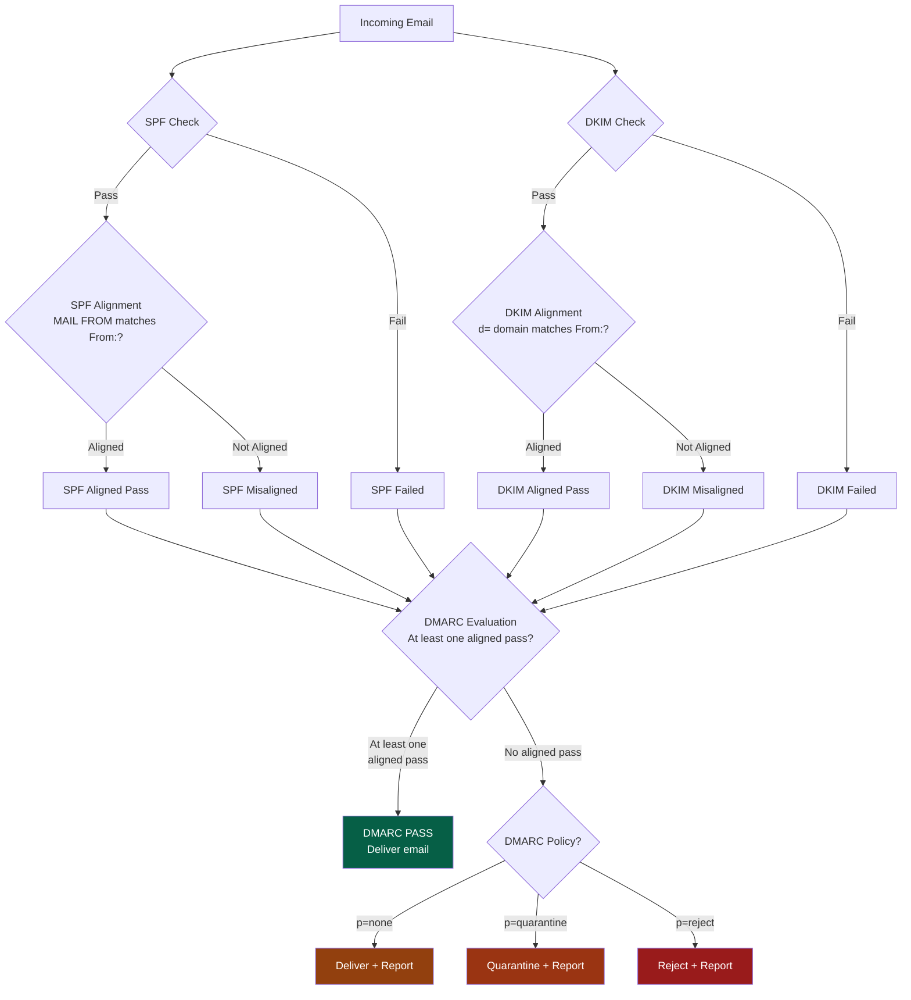

+++
title = "DMARC"
weight = 50

[extra]
description = "Domain-based Message Authentication, Reporting and Conformance - email authentication protocol that prevents domain spoofing by aligning SPF and DKIM with sender identity."
category = "security"
subcategory = "email_security"
related_terms = ["dns", "data-breach", "disposable-email", "osint", "phishing", "email", "threat-intelligence", "spf", "dkim", "perimeter", "compliance", "security-posture", "attack-surface", "social-engineering"]
tags = ["glossary", "dmarc", "email-security", "authentication", "spf", "dkim", "anti-spoofing", "dns", "phishing-prevention", "domain-protection"]
status = "active"
author = "Tomas Korcak (korczis)"
reading_time = "15 min"
difficulty = "intermediate"
technology_type = "protocol"
platform_component = "prismatic_osint_sources"
prerequisite_concepts = ["dns", "email", "spf", "dkim"]
use_cases = ["email authentication", "phishing prevention", "domain protection", "OSINT email investigation"]
benefits = ["prevents domain spoofing", "reduces phishing attacks", "provides visibility into email ecosystem", "enables OSINT email security assessment", "supports compliance requirements"]
implementation_patterns = ["DNS TXT record publication", "aggregate report processing", "forensic report analysis", "policy enforcement gradation"]
quality_metrics = ["DMARC policy strength", "alignment rate", "rejection rate", "report coverage"]
integration_points = ["osint", "perimeter", "dns", "email"]
related_disciplines = ["email security", "DNS administration", "phishing defense", "threat intelligence", "compliance", "OSINT"]
quality_score = 92
platforms = ["Prismatic Platform", "BEAM/OTP"]
key_takeaway = "DMARC analysis is a critical OSINT signal for assessing organizational email security posture, revealing whether domains are protected against phishing and spoofing attacks."
date_created = "2026-02-24"
date_modified = "2026-04-08"
keywords = ["DMARC", "email security", "SPF", "DKIM", "authentication", "glossary", "Prismatic Platform", "email authentication", "domain protection", "phishing prevention", "DNS records", "aggregate reports", "forensic reports", "alignment"]
image = "/images/sections/glossary.png"
image_alt = "DMARC - Prismatic Platform"
word_count = 3800
see_also = ["osint", "capabilities", "architecture", "perimeter"]
+++

## Definition

DMARC (Domain-based Message Authentication, Reporting and Conformance) is an email authentication protocol that enables domain owners to protect their domains from unauthorized use in email messages (spoofing). Published as an open standard in [RFC 7489](https://datatracker.ietf.org/doc/html/rfc7489), DMARC builds on two existing authentication mechanisms -- [SPF](@/glossary/spf.md) (Sender Policy Framework) and [DKIM](/glossary/dkim/) (DomainKeys Identified Mail) -- and adds a critical alignment check and reporting capability. A DMARC policy, published as a [DNS](@/glossary/dns.md) TXT record at `_dmarc.domain.com`, instructs receiving mail servers on how to handle messages that fail authentication: monitor only (`p=none`), quarantine (`p=quarantine`), or reject (`p=reject`).

In [OSINT](@/glossary/osint.md) investigations, DMARC record analysis reveals an organization's [email](/glossary/email/) security maturity. Domains without DMARC or with `p=none` policies are vulnerable to spoofing attacks, making them targets for [phishing](/glossary/phishing/) campaigns. This makes DMARC analysis an essential component of [attack surface](@/glossary/attack-surface.md) assessment and organizational [security posture](/glossary/security-posture/) evaluation.

## Overview: The Email Authentication Triangle

Email authentication relies on three complementary protocols that work together to verify message legitimacy. Each protocol addresses a different aspect of email forgery, and DMARC ties them together into a coherent policy framework.

**SPF (Sender Policy Framework)** verifies that the sending server's IP address is authorized to send email on behalf of the domain. It works at the envelope level (the SMTP `MAIL FROM` address), checking against a list of authorized IPs published in [DNS](@/glossary/dns.md) TXT records. SPF alone cannot prevent display-name spoofing because it does not check the `From:` header visible to the recipient.

**DKIM (DomainKeys Identified Mail)** uses public-key cryptography to sign email messages, allowing recipients to verify that the message was not tampered with in transit and that the signing domain is authentic. DKIM signatures are added as headers and validated against public keys published in DNS. However, DKIM alone does not specify what to do with messages that fail verification.

**DMARC** bridges the gap by requiring that at least one of SPF or DKIM not only passes but also **aligns** with the domain in the visible `From:` header. This alignment requirement is what prevents the most common spoofing attacks. Additionally, DMARC provides a reporting mechanism that gives domain owners visibility into who is sending email on their behalf.



## Technical Deep Dive

### DMARC Record Syntax

A DMARC record is a [DNS](@/glossary/dns.md) TXT record published at the `_dmarc` subdomain of the organizational domain. The record contains semicolon-separated tag-value pairs that define the domain's authentication policy.

| Tag | Required | Purpose | Example Values |
|-----|----------|---------|----------------|
| `v` | Yes | Protocol version (must be first) | `DMARC1` |
| `p` | Yes | Policy for organizational domain | `none`, `quarantine`, `reject` |
| `sp` | No | Policy for subdomains | `none`, `quarantine`, `reject` |
| `rua` | No | Aggregate report URI(s) | `mailto:dmarc-rua@example.com` |
| `ruf` | No | Forensic report URI(s) | `mailto:dmarc-ruf@example.com` |
| `adkim` | No | DKIM alignment mode | `r` (relaxed, default), `s` (strict) |
| `aspf` | No | SPF alignment mode | `r` (relaxed, default), `s` (strict) |
| `pct` | No | Percentage of messages subject to policy | `0`-`100` (default: `100`) |
| `fo` | No | Forensic report options | `0`, `1`, `d`, `s` |
| `rf` | No | Forensic report format | `afrf` (default) |
| `ri` | No | Aggregate report interval (seconds) | `86400` (default, 24 hours) |

**Example DMARC records at different maturity levels:**

```dns
; Monitoring only (Phase 1)
_dmarc.example.com.  IN TXT  "v=DMARC1; p=none; rua=mailto:dmarc@example.com; ruf=mailto:forensics@example.com; fo=1"

; Quarantine with gradual rollout (Phase 2)
_dmarc.example.com.  IN TXT  "v=DMARC1; p=quarantine; pct=25; rua=mailto:dmarc@example.com; sp=none"

; Full enforcement (Phase 3)
_dmarc.example.com.  IN TXT  "v=DMARC1; p=reject; rua=mailto:dmarc@example.com; adkim=s; aspf=s; sp=reject"
```

### DMARC Policies

The three DMARC policies represent a progression from monitoring to full enforcement. Organizations should follow this gradual path to avoid accidentally blocking legitimate email.

| Policy | Behavior | Security Level | Recommended Use |
|--------|----------|---------------|-----------------|
| `p=none` | Monitor only, deliver all messages | Low (no enforcement) | Initial deployment, baseline assessment |
| `p=quarantine` | Flag or route failed messages to spam | Medium | Transitional enforcement, testing phase |
| `p=reject` | Block messages that fail alignment | High (full enforcement) | Mature deployment, maximum protection |

The `pct` tag allows gradual rollout within a policy level. For example, `p=quarantine; pct=10` applies the quarantine policy to only 10% of failing messages, allowing administrators to monitor the impact before increasing coverage.

### Alignment Modes

DMARC alignment determines how strictly the authenticated domain must match the `From:` header domain:

- **Relaxed alignment** (`adkim=r` / `aspf=r`): The authenticated domain must share the same organizational domain. For example, `mail.example.com` aligns with `example.com`.
- **Strict alignment** (`adkim=s` / `aspf=s`): The authenticated domain must exactly match the `From:` header domain. `mail.example.com` does NOT align with `example.com`.

Strict alignment provides stronger protection against subdomain-based attacks but requires careful configuration of all legitimate sending infrastructure.

### DMARC Reporting

DMARC's reporting mechanism is one of its most valuable features for both domain administrators and [OSINT](@/glossary/osint.md) investigators.

**Aggregate Reports (RUA)** are XML documents sent periodically (typically daily) by receiving mail servers. They contain:
- Sending IP addresses and volumes
- Authentication results (SPF/DKIM pass/fail)
- Alignment results
- Policy applied to each message group
- Source and destination domains

**Forensic Reports (RUF)** contain detailed information about individual authentication failures:
- Full email headers of failing messages
- Authentication-Results headers
- The specific failure reason
- Timestamps and receiving server details

Forensic reports are increasingly restricted by privacy-conscious receivers but remain valuable for diagnosing authentication issues when available.

### Subdomain Policy

The `sp` tag controls how receiving servers handle messages from subdomains. This is critical because attackers often target subdomains that lack their own DMARC records:

```dns
; Protect organizational domain AND subdomains
_dmarc.example.com.  IN TXT  "v=DMARC1; p=reject; sp=reject; rua=mailto:dmarc@example.com"
```

Without an explicit `sp` tag, subdomains inherit the organizational domain's `p` policy. Organizations with many subdomains should audit each one's email sending requirements before applying strict subdomain policies.

## Usage in Prismatic Platform

### Perimeter EASM DMARC Checking

The Prismatic [Perimeter](/glossary/perimeter/) module (External Attack Surface Management) includes DMARC analysis as a core component of domain security assessment. When scanning a target organization's external attack surface, Perimeter automatically queries DMARC, [SPF](@/glossary/spf.md), and [DKIM](/glossary/dkim/) records and scores the email authentication posture.

DMARC policy strength directly influences the Perimeter security rating. Domains with `p=reject` and strict alignment receive the highest email security scores, while domains missing DMARC entirely are flagged as high-risk for [phishing](/glossary/phishing/) and [social engineering](/glossary/social-engineering/) attacks.

### OSINT Email Investigation Adapter

The [OSINT](@/glossary/osint.md) tool registry includes a dedicated DMARC analysis adapter (`dmarc-analyzer`) that feeds into the broader email investigation pipeline. This adapter performs recursive DNS lookups, parses DMARC records, evaluates policy strength, and generates actionable security recommendations.

The DMARC analyzer integrates with the email-osint investigation flow: when an investigator examines a domain through the [email](/glossary/email/) OSINT pipeline, DMARC analysis runs automatically alongside MX record inspection, SPF evaluation, and DKIM selector discovery.

## Code Examples

### DMARC Record Parser

```elixir
defmodule PrismaticOsintCore.Tools.DmarcParser do
  @moduledoc """
  Parses DMARC DNS TXT records into structured maps with
  comprehensive tag extraction and validation.

  Supports all DMARC tags defined in RFC 7489 including
  policy, alignment, reporting, and percentage controls.
  """

  @type alignment_mode :: :relaxed | :strict
  @type policy :: :none | :quarantine | :reject
  @type forensic_option :: :all_fail | :any_fail | :dkim_fail | :spf_fail

  @type dmarc_record :: %{
    version: String.t(),
    policy: policy(),
    subdomain_policy: policy() | nil,
    rua: list(String.t()),
    ruf: list(String.t()),
    adkim: alignment_mode(),
    aspf: alignment_mode(),
    pct: non_neg_integer(),
    fo: list(forensic_option()),
    rf: String.t(),
    ri: non_neg_integer(),
    raw: String.t()
  }

  @spec parse(String.t()) :: {:ok, dmarc_record()} | {:error, term()}
  def parse(record) when is_binary(record) do
    with :ok <- validate_version(record),
         tags <- extract_tags(record) do
      {:ok, %{
        version: Map.get(tags, "v", "DMARC1"),
        policy: parse_policy(Map.get(tags, "p")),
        subdomain_policy: parse_policy(Map.get(tags, "sp")),
        rua: parse_uri_list(Map.get(tags, "rua", "")),
        ruf: parse_uri_list(Map.get(tags, "ruf", "")),
        adkim: parse_alignment(Map.get(tags, "adkim", "r")),
        aspf: parse_alignment(Map.get(tags, "aspf", "r")),
        pct: parse_integer(Map.get(tags, "pct", "100"), 100),
        fo: parse_forensic_options(Map.get(tags, "fo", "0")),
        rf: Map.get(tags, "rf", "afrf"),
        ri: parse_integer(Map.get(tags, "ri", "86400"), 86400),
        raw: record
      }}
    end
  end

  @spec validate_version(String.t()) :: :ok | {:error, :invalid_version}
  defp validate_version(record) do
    if String.starts_with?(String.trim(record), "v=DMARC1") do
      :ok
    else
      {:error, :invalid_version}
    end
  end

  @spec extract_tags(String.t()) :: map()
  defp extract_tags(record) do
    record
    |> String.split(";")
    |> Enum.map(&String.trim/1)
    |> Enum.reject(&(&1 == ""))
    |> Enum.reduce(%{}, fn tag_pair, acc ->
      case String.split(tag_pair, "=", parts: 2) do
        [key, value] -> Map.put(acc, String.trim(key), String.trim(value))
        _ -> acc
      end
    end)
  end

  @spec parse_policy(String.t() | nil) :: policy() | nil
  defp parse_policy(nil), do: nil
  defp parse_policy("none"), do: :none
  defp parse_policy("quarantine"), do: :quarantine
  defp parse_policy("reject"), do: :reject
  defp parse_policy(_), do: :none

  @spec parse_alignment(String.t()) :: alignment_mode()
  defp parse_alignment("s"), do: :strict
  defp parse_alignment(_), do: :relaxed

  @spec parse_uri_list(String.t()) :: list(String.t())
  defp parse_uri_list(""), do: []
  defp parse_uri_list(uris) do
    uris
    |> String.split(",")
    |> Enum.map(&String.trim/1)
    |> Enum.reject(&(&1 == ""))
  end

  @spec parse_integer(String.t(), non_neg_integer()) :: non_neg_integer()
  defp parse_integer(value, default) do
    case Integer.parse(value) do
      {int, _} when int >= 0 -> int
      _ -> default
    end
  end

  @spec parse_forensic_options(String.t()) :: list(forensic_option())
  defp parse_forensic_options(fo) do
    fo
    |> String.split(":")
    |> Enum.map(fn
      "0" -> :all_fail
      "1" -> :any_fail
      "d" -> :dkim_fail
      "s" -> :spf_fail
      _ -> :all_fail
    end)
  end
end
```

### DMARC Analyzer Tool

```elixir
defmodule PrismaticOsintCore.Tools.DmarcAnalyzer do
  @moduledoc """
  Analyzes DMARC, SPF, and DKIM records for target domains,
  producing email security posture assessments that feed into
  the Perimeter security rating engine.

  Performs recursive DNS lookups, parses authentication records,
  evaluates policy strength, and generates actionable security
  recommendations for domain owners and OSINT investigators.
  """

  use PrismaticOsintCore.Tool

  alias PrismaticOsintCore.Tools.DmarcParser

  require Logger

  register_tool(%{
    slug: "dmarc-analyzer",
    name: "DMARC Analyzer",
    category: :global,
    api_style: :provider,
    input_fields: [
      %{name: :domain, type: :text, label: "Domain", required: true}
    ],
    requires_auth: false
  })

  @type dmarc_report :: %{
    domain: String.t(),
    dmarc_record: String.t() | nil,
    dmarc_parsed: DmarcParser.dmarc_record() | nil,
    dmarc_policy: :none | :quarantine | :reject | :missing,
    spf_record: String.t() | nil,
    spf_valid: boolean(),
    dkim_configured: boolean(),
    security_score: float(),
    maturity_level: :absent | :monitoring | :transitional | :enforcing,
    recommendations: list(String.t()),
    risk_factors: list(String.t())
  }

  @spec analyze(String.t()) :: {:ok, dmarc_report()} | {:error, term()}
  def analyze(domain) when is_binary(domain) do
    Logger.info("Analyzing DMARC configuration for #{domain}")

    dmarc_raw = lookup_dmarc(domain)
    spf = lookup_spf(domain)

    dmarc_parsed = case dmarc_raw do
      nil -> nil
      record ->
        case DmarcParser.parse(record) do
          {:ok, parsed} -> parsed
          {:error, _reason} -> nil
        end
    end

    policy = extract_policy(dmarc_parsed)
    maturity = assess_maturity(dmarc_parsed, spf)
    score = calculate_score(policy, spf, dmarc_parsed)

    {:ok, %{
      domain: domain,
      dmarc_record: dmarc_raw,
      dmarc_parsed: dmarc_parsed,
      dmarc_policy: policy,
      spf_record: spf,
      spf_valid: spf != nil,
      dkim_configured: false,
      security_score: score,
      maturity_level: maturity,
      recommendations: generate_recommendations(policy, spf, dmarc_parsed),
      risk_factors: identify_risk_factors(policy, spf, dmarc_parsed)
    }}
  end

  @spec lookup_dmarc(String.t()) :: String.t() | nil
  defp lookup_dmarc(domain) do
    case :inet_res.lookup(~c"_dmarc.#{domain}", :in, :txt) do
      [] -> nil
      [record | _] -> record |> List.flatten() |> to_string()
    end
  end

  @spec lookup_spf(String.t()) :: String.t() | nil
  defp lookup_spf(domain) do
    case :inet_res.lookup(~c"#{domain}", :in, :txt) do
      records ->
        records
        |> Enum.map(&(List.flatten(&1) |> to_string()))
        |> Enum.find(&String.starts_with?(&1, "v=spf1"))
    end
  end

  @spec extract_policy(DmarcParser.dmarc_record() | nil) :: :none | :quarantine | :reject | :missing
  defp extract_policy(nil), do: :missing
  defp extract_policy(%{policy: policy}), do: policy

  @spec assess_maturity(DmarcParser.dmarc_record() | nil, String.t() | nil) ::
    :absent | :monitoring | :transitional | :enforcing
  defp assess_maturity(nil, _spf), do: :absent
  defp assess_maturity(%{policy: :none}, _spf), do: :monitoring
  defp assess_maturity(%{policy: :quarantine}, _spf), do: :transitional
  defp assess_maturity(%{policy: :reject, pct: pct}, _spf) when pct < 100, do: :transitional
  defp assess_maturity(%{policy: :reject}, _spf), do: :enforcing

  @spec calculate_score(:none | :quarantine | :reject | :missing, String.t() | nil, map() | nil) :: float()
  defp calculate_score(:reject, _spf, %{adkim: :strict, aspf: :strict}), do: 1.0
  defp calculate_score(:reject, _spf, _parsed), do: 0.9
  defp calculate_score(:quarantine, _spf, _parsed), do: 0.7
  defp calculate_score(:none, _spf, %{rua: rua}) when rua != [], do: 0.35
  defp calculate_score(:none, _spf, _parsed), do: 0.3
  defp calculate_score(:missing, nil, _parsed), do: 0.0
  defp calculate_score(:missing, _spf, _parsed), do: 0.1

  @spec generate_recommendations(atom(), String.t() | nil, map() | nil) :: list(String.t())
  defp generate_recommendations(:missing, nil, _) do
    [
      "Publish an SPF record to authorize legitimate sending servers",
      "Publish a DMARC record with p=none and rua reporting to begin monitoring",
      "Configure DKIM signing for all outbound email services"
    ]
  end
  defp generate_recommendations(:missing, _spf, _) do
    [
      "Publish a DMARC record with p=none and rua reporting",
      "Configure DKIM signing for all outbound email services",
      "Review SPF record for completeness across all sending services"
    ]
  end
  defp generate_recommendations(:none, _spf, parsed) do
    base = ["Upgrade DMARC policy from p=none to p=quarantine after reviewing aggregate reports"]
    if parsed && parsed.rua == [] do
      ["Add rua= tag to receive aggregate reports for monitoring" | base]
    else
      base
    end
  end
  defp generate_recommendations(:quarantine, _spf, parsed) do
    base = ["Consider upgrading to p=reject for full enforcement"]
    if parsed && parsed.pct < 100 do
      ["Increase pct= value gradually toward 100 as confidence grows" | base]
    else
      base
    end
  end
  defp generate_recommendations(:reject, _spf, parsed) do
    if parsed && (parsed.adkim == :relaxed || parsed.aspf == :relaxed) do
      ["Consider strict alignment (adkim=s; aspf=s) for maximum protection"]
    else
      []
    end
  end

  @spec identify_risk_factors(atom(), String.t() | nil, map() | nil) :: list(String.t())
  defp identify_risk_factors(:missing, nil, _) do
    [
      "CRITICAL: No email authentication (SPF/DKIM/DMARC) - domain fully spoofable",
      "HIGH: Phishing campaigns can impersonate this domain with zero resistance"
    ]
  end
  defp identify_risk_factors(:missing, _spf, _) do
    [
      "HIGH: No DMARC record - SPF alone insufficient for spoofing prevention",
      "MEDIUM: No alignment enforcement between SPF and visible From: header"
    ]
  end
  defp identify_risk_factors(:none, _spf, _) do
    [
      "MEDIUM: DMARC in monitor-only mode - spoofed emails still delivered",
      "LOW: Reporting active but no enforcement action taken"
    ]
  end
  defp identify_risk_factors(:quarantine, _spf, %{pct: pct}) when pct < 100 do
    ["LOW: Partial enforcement - #{100 - pct}% of failing messages still delivered"]
  end
  defp identify_risk_factors(_, _, _), do: []
end
```

### Aggregate Report Parser

```elixir
defmodule PrismaticOsintCore.Tools.DmarcReportParser do
  @moduledoc """
  Parses DMARC aggregate report XML into structured Elixir maps.
  Aggregate reports contain authentication results sent by
  receiving mail servers to the address specified in the rua= tag.
  """

  @spec parse_aggregate_report(String.t()) :: {:ok, map()} | {:error, term()}
  def parse_aggregate_report(xml_content) when is_binary(xml_content) do
    case SweetXml.parse(xml_content) do
      {:error, reason} ->
        {:error, {:xml_parse_error, reason}}

      doc ->
        report = %{
          org_name: SweetXml.xpath(doc, ~x"//report_metadata/org_name/text()"s),
          email: SweetXml.xpath(doc, ~x"//report_metadata/email/text()"s),
          date_range: %{
            begin: SweetXml.xpath(doc, ~x"//date_range/begin/text()"i),
            end: SweetXml.xpath(doc, ~x"//date_range/end/text()"i)
          },
          policy: %{
            domain: SweetXml.xpath(doc, ~x"//policy_published/domain/text()"s),
            adkim: SweetXml.xpath(doc, ~x"//policy_published/adkim/text()"s),
            aspf: SweetXml.xpath(doc, ~x"//policy_published/aspf/text()"s),
            p: SweetXml.xpath(doc, ~x"//policy_published/p/text()"s),
            sp: SweetXml.xpath(doc, ~x"//policy_published/sp/text()"s),
            pct: SweetXml.xpath(doc, ~x"//policy_published/pct/text()"s)
          },
          records: parse_records(doc)
        }

        {:ok, report}
    end
  end

  @spec parse_records(term()) :: list(map())
  defp parse_records(doc) do
    SweetXml.xpath(doc, ~x"//record"l)
    |> Enum.map(fn record ->
      %{
        source_ip: SweetXml.xpath(record, ~x"./row/source_ip/text()"s),
        count: SweetXml.xpath(record, ~x"./row/count/text()"i),
        disposition: SweetXml.xpath(record, ~x"./row/policy_evaluated/disposition/text()"s),
        dkim_result: SweetXml.xpath(record, ~x"./row/policy_evaluated/dkim/text()"s),
        spf_result: SweetXml.xpath(record, ~x"./row/policy_evaluated/spf/text()"s),
        header_from: SweetXml.xpath(record, ~x"./identifiers/header_from/text()"s)
      }
    end)
  end
end
```

## Best Practices

1. **Start with `p=none` and rua reporting** -- monitor DMARC reports for at least 2-4 weeks before enabling enforcement to avoid blocking legitimate [email](/glossary/email/). Analyze aggregate reports to identify all authorized senders.

2. **Implement SPF, DKIM, and DMARC together** -- DMARC requires at least one of [SPF](@/glossary/spf.md) or [DKIM](/glossary/dkim/) to pass with alignment. Deploying all three provides defense-in-depth against [phishing](/glossary/phishing/) attacks.

3. **Use gradual policy escalation** -- progress from `p=none` to `p=quarantine; pct=10`, then increase `pct` gradually to 100, and finally move to `p=reject`. This staged approach minimizes the risk of blocking legitimate mail.

4. **Enforce subdomain policies** -- set `sp=reject` to prevent attackers from spoofing subdomains like `mail.example.com` or `hr.example.com`, which are common [social engineering](/glossary/social-engineering/) targets.

5. **Use strict alignment for high-security domains** -- setting `adkim=s; aspf=s` prevents subdomain alignment tricks where attackers use subdomains to bypass relaxed alignment checks.

6. **Monitor aggregate reports continuously** -- regular review reveals unauthorized email sources, misconfigured legitimate senders, and attempted spoofing campaigns. Automate report ingestion and alerting.

7. **Use DMARC analysis in security ratings** -- email authentication is a reliable indicator of organizational security maturity for [OSINT](@/glossary/osint.md) assessment and [compliance](@/glossary/compliance.md) evaluation.

8. **Include DMARC in attack surface scans** -- the [Perimeter](/glossary/perimeter/) module should check DMARC as part of every domain security assessment, flagging missing or weak policies as vulnerabilities.

9. **Configure both rua and ruf** -- aggregate reports provide volume-level visibility while forensic reports enable incident investigation. Use separate mailboxes for each.

10. **Document all authorized sending services** -- maintain an inventory of every service that sends email on behalf of your domain (marketing platforms, CRMs, transactional email, etc.) and ensure each is covered by SPF and DKIM.

## Common Mistakes

| Mistake | Impact | Correction |
|---------|--------|------------|
| Deploying `p=reject` without monitoring | Blocks legitimate email from third-party senders | Start with `p=none` and rua reporting for 2-4 weeks |
| Forgetting subdomain policy (`sp=`) | Attackers spoof subdomains like `hr.example.com` | Add `sp=reject` or `sp=quarantine` to DMARC record |
| Missing rua/ruf reporting URIs | No visibility into authentication results | Always include `rua=mailto:dmarc@example.com` |
| SPF record exceeding 10 DNS lookups | SPF permerror causes authentication failure | Use SPF flattening or consolidate `include:` mechanisms |
| Not aligning third-party DKIM selectors | Third-party sends pass DKIM but fail DMARC alignment | Configure DKIM signing with your domain as `d=` value |
| Using only SPF without DKIM | Forwarded emails fail SPF, reducing deliverability | Add DKIM signing to survive email forwarding |
| Ignoring DMARC reports after deployment | Misses newly added senders or configuration drift | Automate report processing with weekly review cadence |
| Setting `pct=0` permanently | DMARC policy never applies to any messages | Use `pct=0` only for initial testing, then increase |
| Multiple DMARC records on one domain | Receiving servers may use either or reject both | Ensure exactly one `_dmarc` TXT record per domain |
| Forgetting `v=DMARC1` prefix | Record is not recognized as DMARC by receivers | Always start the record with `v=DMARC1;` |

## Related Terms

- [DNS](@/glossary/dns.md) -- Infrastructure hosting DMARC, SPF, and DKIM records as TXT entries
- [SPF](@/glossary/spf.md) -- Sender Policy Framework authenticating sending server IP addresses
- [DKIM](/glossary/dkim/) -- DomainKeys Identified Mail providing cryptographic message signing
- [Email](/glossary/email/) -- Communication protocol protected by DMARC authentication
- [Phishing](/glossary/phishing/) -- Social engineering attack vector prevented by DMARC enforcement
- [OSINT](@/glossary/osint.md) -- Intelligence methodology using DMARC analysis for domain assessment
- [Perimeter](/glossary/perimeter/) -- External Attack Surface Management integrating DMARC checking
- [Attack Surface](@/glossary/attack-surface.md) -- Email authentication gaps as exploitable attack surface components
- [Compliance](@/glossary/compliance.md) -- Regulatory frameworks requiring email authentication controls
- [Security Posture](/glossary/security-posture/) -- Organizational security maturity indicated by DMARC policy strength
- [Social Engineering](/glossary/social-engineering/) -- Human-targeted attacks that DMARC helps prevent
- [Threat Intelligence](@/glossary/threat-intelligence.md) -- Intelligence feeds enriched by DMARC failure analysis
- [Data Breach](@/glossary/data-breach.md) -- Phishing-enabled breaches prevented by DMARC enforcement
- [Disposable Email](@/glossary/disposable-email.md) -- Temporary email services typically lacking DMARC compliance

## See Also

- [OSINT Tools](@/osint/_index.md) -- Email security analysis tools including the DMARC analyzer
- [Capabilities](@/capabilities/_index.md) -- Domain security assessment capabilities
- [Perimeter Module](/glossary/perimeter/) -- EASM integration with DMARC policy checking
- [RFC 7489: DMARC](https://datatracker.ietf.org/doc/html/rfc7489) -- The DMARC protocol specification
- [RFC 7208: SPF](https://datatracker.ietf.org/doc/html/rfc7208) -- Sender Policy Framework specification
- [RFC 6376: DKIM](https://datatracker.ietf.org/doc/html/rfc6376) -- DomainKeys Identified Mail specification

---

## Connect & Contribute

**Created by [Tomas Korcak (korczis)](https://github.com/korczis)** | Open Source under [GHL](https://github.com/korczis/prismatic-platform/blob/main/LICENSE)

- [GitHub](https://github.com/korczis/prismatic-platform) | [GitLab](https://gitlab.com/korczis/prismatic-platform) | [LinkedIn](https://linkedin.com/in/korczis) | [Contact](mailto:korczis@gmail.com)
- [Developer Portal](@/developers/_index.md) | [Architecture](@/architecture/_index.md) | [Meet the Creator](@/about/author.md)
