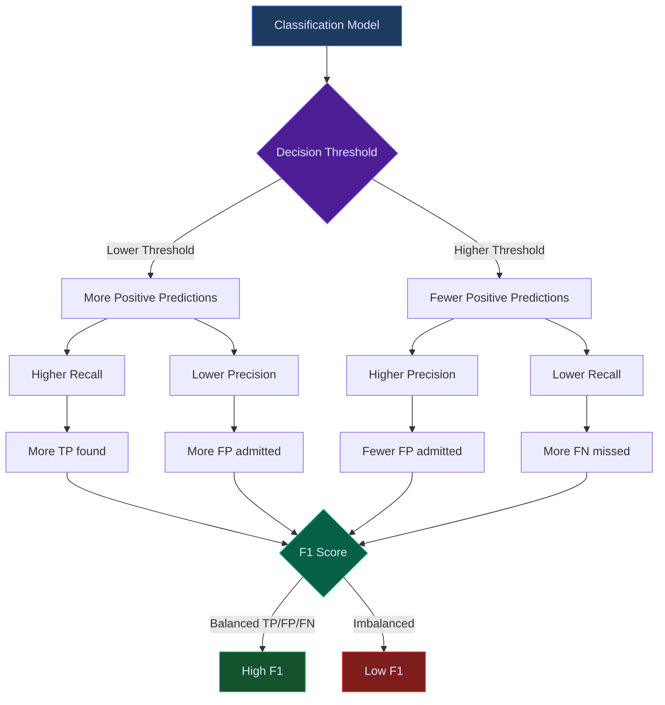

+++
title = "F1 Score"
description = "The harmonic mean of precision and recall in machine learning classification, providing a single metric that balances false positive and false negative rates for model evaluation."
weight = 50

[extra]
category = "ai-ml"
subcategory = "metrics"
tags = ["f1-score", "machine-learning", "precision", "recall", "classification", "evaluation", "metrics", "confusion-matrix", "binary-classification", "harmonic-mean", "micro-f1", "macro-f1", "weighted-f1", "threshold-tuning", "model-evaluation"]
date_created = "2026-02-23"
date_updated = "2026-04-08"
difficulty = "intermediate"
audience = ["data-scientists", "ml-engineers", "developers", "analysts", "security-researchers"]
related_terms = ["precision", "recall", "accuracy", "confusion-matrix", "classification", "mean", "distribution", "data-quality", "osint", "machine-learning", "roc-auc", "deep-learning", "natural-language-processing", "neural-network", "anomaly-detection"]
key_concepts = ["harmonic-mean", "precision-recall-tradeoff", "class-imbalance", "micro-macro-averaging", "threshold-tuning", "f-beta-score", "multi-class-evaluation"]
platforms = ["prismatic-platform", "python", "beam"]
prerequisites = ["classification-basics", "evaluation-metrics", "probability"]
use_cases = ["model-evaluation", "threat-detection", "spam-filtering", "entity-resolution", "anomaly-detection", "osint-quality", "search-relevance"]
complexity = "medium"
stability = "mature"
author = "Tomas Korcak (korczis)"
reading_time = "12 min"
word_count = 3200
date_modified = "2026-04-08"
keywords = ["F1 Score", "precision", "recall", "machine learning", "glossary", "Prismatic Platform", "harmonic mean", "confusion matrix", "micro F1", "macro F1"]
quality_score = 92
see_also = ["capabilities", "architecture"]
image = "/images/sections/glossary.png"
image_alt = "F1 Score - Prismatic Platform"
+++

## Definition

The **F1 score** is a machine learning evaluation metric that computes the **harmonic mean of precision and recall**, producing a single number between 0 and 1 that reflects a model's balance between identifying true positives without generating excessive false positives or missing true positives. The canonical formula is:

```
F1 = 2 * (precision * recall) / (precision + recall)
```

Where:
- **Precision** = TP / (TP + FP) -- "Of everything the model predicted as positive, how many were actually positive?"
- **Recall** = TP / (TP + FN) -- "Of everything that was actually positive, how many did the model find?"
- **TP** = True Positives, **FP** = False Positives, **FN** = False Negatives

The F1 score reaches its best value at 1.0 (perfect precision and recall) and its worst at 0.0. It is undefined when both precision and recall are zero (no true positives exist or are predicted), in which case implementations typically return 0.0 by convention.

An equivalent formulation that avoids computing precision and recall separately is:

```
F1 = 2TP / (2TP + FP + FN)
```

This form makes it clear that the F1 score depends only on the counts of true positives, false positives, and false negatives -- true negatives play no role, which is one of the metric's distinguishing characteristics compared to accuracy.

---

## Overview

### The Precision-Recall Tradeoff

Every classification system faces a fundamental tension: **precision and recall are inversely related** at the margins. Increasing a classifier's sensitivity (lowering the decision threshold) catches more true positives but also admits more false positives, raising recall at the cost of precision. Tightening the threshold (raising it) reduces false positives but misses more true positives, raising precision at the cost of recall.

This tradeoff means a single number that captures "overall quality" must somehow reconcile two opposing forces. The F1 score accomplishes this through the harmonic mean.

### Why the Harmonic Mean?

Three common types of mean exist for combining two values:

| Mean Type | Formula | F1-like Score for P=1.0, R=0.01 |
|-----------|---------|----------------------------------|
| **Arithmetic** | (P + R) / 2 | 0.505 |
| **Geometric** | sqrt(P * R) | 0.100 |
| **Harmonic** | 2PR / (P + R) | 0.0198 |

The arithmetic mean is too generous to imbalanced pairs -- a classifier with perfect precision but 1% recall gets a 50.5% score, which is misleading. The geometric mean is better but still lenient. The **harmonic mean aggressively penalizes low values in either component**, making it impossible to achieve a high F1 score unless *both* precision and recall are reasonably high.

This property is critical for real-world applications. A threat detection system that finds every threat but generates thousands of false alarms (high recall, low precision) is operationally useless. Equally, a system that never raises false alarms but misses 99% of threats (high precision, low recall) provides false confidence. The F1 score correctly rates both scenarios as poor.

### When Accuracy Fails

Consider a dataset with 99% negative samples and 1% positive samples (common in fraud detection, threat identification, and anomaly detection). A naive classifier that always predicts "negative" achieves:

- **Accuracy**: 99% (misleadingly excellent)
- **Precision**: undefined (0/0, no positive predictions)
- **Recall**: 0% (missed every positive case)
- **F1 Score**: 0% (correctly indicates failure)

The F1 score's independence from true negatives makes it robust against class imbalance, which is why it has become the standard metric for information retrieval, named entity recognition, object detection, and many other tasks where the positive class is the focus.

---

## Technical Deep Dive

### Confusion Matrix Foundation

The confusion matrix is the basis for all classification metrics. For binary classification:

```
                    Predicted
                 Positive  Negative
Actual Positive    TP        FN      <- Recall = TP / (TP + FN)
Actual Negative    FP        TN

                   ^
                   |
            Precision = TP / (TP + FP)
```

Every cell has a name and interpretation:

| Cell | Name | Meaning | Impact |
|------|------|---------|--------|
| **TP** | True Positive | Correctly identified positive | Good -- desired outcome |
| **FP** | False Positive | Incorrectly identified as positive | Bad -- false alarm |
| **FN** | False Negative | Missed positive | Bad -- missed detection |
| **TN** | True Negative | Correctly identified negative | Good -- but ignored by F1 |

### The F-Beta Family

The F1 score is a special case of the **F-beta score**, which allows weighting the relative importance of precision vs recall:

```
F_beta = (1 + beta^2) * (P * R) / (beta^2 * P + R)
```

| Variant | Beta | Behavior | Use Case |
|---------|------|----------|----------|
| **F0.5** | 0.5 | Weights precision 2x over recall | Content filtering, recommendation |
| **F1** | 1.0 | Equal weight to precision and recall | General-purpose evaluation |
| **F2** | 2.0 | Weights recall 2x over precision | Threat detection, medical screening |
| **F5** | 5.0 | Heavily favors recall | Safety-critical systems |

Choosing beta depends on the **cost asymmetry** between false positives and false negatives in your domain. In OSINT threat detection, missing a real threat (FN) is far more costly than investigating a false alarm (FP), so F2 is often more appropriate than F1.

### Multi-Class F1 Variants

When classification involves more than two classes, F1 must be aggregated across classes. Three standard approaches exist:

| Variant | Computation | Properties | Best For |
|---------|------------|------------|----------|
| **Micro F1** | Aggregate all TP, FP, FN globally, then compute F1 | Dominated by majority classes | Imbalanced datasets where overall performance matters |
| **Macro F1** | Compute per-class F1, then average | Equal weight to all classes | When every class matters equally regardless of size |
| **Weighted F1** | Compute per-class F1, weight by class support | Accounts for class frequency | Reporting when class sizes differ meaningfully |
| **Sample F1** | Compute F1 per sample, then average | Per-instance evaluation | Multi-label classification |

**Micro F1** in multi-class settings is mathematically equivalent to accuracy when every sample belongs to exactly one class. This equivalence breaks in multi-label settings.

**Macro F1** can be misleading when rare classes have unreliable F1 scores due to small sample sizes. A class with 3 samples where 2 are correctly classified can produce F1=0.8, which carries as much weight as a class with 10,000 samples and F1=0.8 in the macro average.

### F1 Score Interpretation Guide

| F1 Range | Quality | Interpretation | Typical Action |
|----------|---------|---------------|----------------|
| 0.95-1.00 | Excellent | Near-perfect balance | Verify no data leakage, deploy with confidence |
| 0.85-0.95 | Very Good | Strong performance | Fine-tune thresholds, monitor edge cases |
| 0.70-0.85 | Good | Acceptable for most applications | Investigate error patterns, improve features |
| 0.50-0.70 | Moderate | Significant room for improvement | Major model revision needed |
| 0.30-0.50 | Poor | Model provides limited value | Reconsider approach, collect more data |
| 0.00-0.30 | Very Poor | Likely worse than random for imbalanced data | Start from scratch, verify labels |

### Threshold Selection

For probabilistic classifiers that output confidence scores rather than binary predictions, the F1 score depends on the classification threshold. A **precision-recall curve** plots precision and recall across all possible thresholds, and the optimal F1 threshold can be found by:

1. Computing F1 at each threshold value
2. Selecting the threshold that maximizes F1
3. Validating on a held-out set to avoid overfitting the threshold

The optimal threshold is rarely 0.5. In imbalanced datasets, lower thresholds (0.1-0.3) often produce better F1 scores because they compensate for the model's bias toward the majority class.

---

## Precision-Recall Tradeoff Diagram



This diagram illustrates the core tradeoff: lowering the decision threshold increases recall (finds more positives) but decreases precision (admits more false alarms). The F1 score captures this tension as a single value -- it is high only when both branches produce acceptable results.

---

## Usage in Prismatic Platform

The Prismatic Platform leverages F1 scores across multiple intelligence and quality subsystems:

### OSINT Result Quality

When OSINT adapters return search results, the platform evaluates result quality by comparing returned entities against known-good reference sets. Each adapter's F1 score indicates how well it balances:
- **Precision**: Returning only genuinely relevant results (no noise)
- **Recall**: Finding all known relevant entities (no gaps)

Adapters with consistently low F1 scores are flagged for review and potential recalibration.

### Entity Deduplication

The DD (Due Diligence) pipeline performs entity resolution -- determining whether two records refer to the same real-world entity. Deduplication quality is measured by F1:
- **TP**: Correctly matched duplicate pairs
- **FP**: Incorrectly merged distinct entities (dangerous -- corrupts data)
- **FN**: Missed duplicate pairs (wasteful -- creates redundant records)

Entity deduplication typically optimizes for F0.5 (precision-heavy) because merging distinct entities is more harmful than missing a duplicate.

### Search Relevance

The Meilisearch-backed full-text search evaluates query relevance using F1 over annotated query-result pairs. This drives index tuning decisions: adjusting ranking rules, synonym lists, and typo tolerance.

### Intelligence Classification

The AI agent system classifies intelligence signals (threat indicators, risk factors, sentiment markers) and measures classification quality per category using macro F1 to ensure every signal type receives adequate detection coverage.

### Decision Engine Calibration

The Decision Engine at `/hub/dd/decisions` uses F1-based calibration to evaluate scoring model accuracy. When the engine predicts entity risk levels, historical outcomes provide ground truth for computing per-risk-level F1 scores, enabling calibration refinement through the reconciliation feedback loop.

---

## Code Examples

### Basic F1 Computation in Elixir

```elixir
defmodule Prismatic.ML.Metrics do
  @moduledoc """
  Machine learning evaluation metrics for classification
  models used in entity resolution, threat detection,
  and intelligence analysis.

  Provides F1 score, F-beta score, multi-class aggregation,
  and threshold optimization utilities.
  """

  @type confusion :: %{
    tp: non_neg_integer(),
    fp: non_neg_integer(),
    fn: non_neg_integer(),
    tn: non_neg_integer()
  }

  @type evaluation :: %{
    f1: float(),
    precision: float(),
    recall: float()
  }

  @doc """
  Computes the F1 score from a confusion matrix.

  Returns 0.0 when both precision and recall are zero
  (no true positives exist).

  ## Examples

      iex> Prismatic.ML.Metrics.f1_score(%{tp: 80, fp: 20, fn: 10, tn: 890})
      0.8421052631578948

      iex> Prismatic.ML.Metrics.f1_score(%{tp: 0, fp: 0, fn: 0, tn: 100})
      0.0
  """
  @spec f1_score(confusion()) :: float()
  def f1_score(%{tp: tp, fp: fp, fn: fn_count}) do
    precision = safe_divide(tp, tp + fp)
    recall = safe_divide(tp, tp + fn_count)
    safe_divide(2.0 * precision * recall, precision + recall)
  end

  @doc """
  Computes the F-beta score, generalizing F1 with a beta parameter.

  - beta < 1 favors precision (e.g., F0.5)
  - beta = 1 is the standard F1 score
  - beta > 1 favors recall (e.g., F2)

  ## Examples

      iex> cm = %{tp: 80, fp: 20, fn: 10, tn: 890}
      iex> Prismatic.ML.Metrics.f_beta_score(cm, 2.0)
      0.8695652173913043
  """
  @spec f_beta_score(confusion(), float()) :: float()
  def f_beta_score(%{tp: tp, fp: fp, fn: fn_count}, beta) do
    precision = safe_divide(tp, tp + fp)
    recall = safe_divide(tp, tp + fn_count)
    beta_sq = beta * beta

    safe_divide(
      (1.0 + beta_sq) * precision * recall,
      beta_sq * precision + recall
    )
  end

  @doc """
  Builds a confusion matrix from a list of {actual, predicted} pairs.

  ## Examples

      iex> pairs = [{true, true}, {true, false}, {false, true}, {false, false}]
      iex> Prismatic.ML.Metrics.from_predictions(pairs)
      %{tp: 1, fp: 1, fn: 1, tn: 1}
  """
  @spec from_predictions(list({boolean(), boolean()})) :: confusion()
  def from_predictions(actual_predicted_pairs) do
    Enum.reduce(actual_predicted_pairs, %{tp: 0, fp: 0, fn: 0, tn: 0},
      fn
        {true, true}, acc -> %{acc | tp: acc.tp + 1}
        {false, true}, acc -> %{acc | fp: acc.fp + 1}
        {true, false}, acc -> %{acc | fn: acc.fn + 1}
        {false, false}, acc -> %{acc | tn: acc.tn + 1}
      end
    )
  end

  @doc """
  Evaluates F1, precision, and recall at a given threshold.

  Takes a list of {actual_label, confidence_score} pairs and
  classifies scores >= threshold as positive.

  ## Examples

      iex> data = [{true, 0.9}, {true, 0.4}, {false, 0.8}, {false, 0.2}]
      iex> result = Prismatic.ML.Metrics.evaluate_threshold(data, 0.5)
      iex> result.precision
      0.5
  """
  @spec evaluate_threshold(list({boolean(), float()}), float()) :: evaluation()
  def evaluate_threshold(actual_score_pairs, threshold) do
    predictions =
      Enum.map(actual_score_pairs, fn {actual, score} ->
        {actual, score >= threshold}
      end)

    confusion = from_predictions(predictions)

    %{
      f1: f1_score(confusion),
      precision: safe_divide(confusion.tp, confusion.tp + confusion.fp),
      recall: safe_divide(confusion.tp, confusion.tp + confusion.fn)
    }
  end

  @doc """
  Finds the threshold that maximizes F1 score.

  Sweeps thresholds from 0.01 to 0.99 in steps of 0.01
  and returns the threshold with the highest F1.

  ## Examples

      iex> data = [{true, 0.9}, {true, 0.7}, {false, 0.3}, {false, 0.1}]
      iex> {threshold, f1} = Prismatic.ML.Metrics.optimal_threshold(data)
      iex> threshold >= 0.0 and threshold <= 1.0
      true
  """
  @spec optimal_threshold(list({boolean(), float()})) :: {float(), float()}
  def optimal_threshold(actual_score_pairs) do
    0.01
    |> Stream.iterate(&(&1 + 0.01))
    |> Enum.take(99)
    |> Enum.map(fn threshold ->
      eval = evaluate_threshold(actual_score_pairs, threshold)
      {threshold, eval.f1}
    end)
    |> Enum.max_by(fn {_t, f1} -> f1 end)
  end

  @doc """
  Computes macro F1 across multiple classes.

  Takes a map of %{class_label => confusion_matrix} and
  returns the unweighted average of per-class F1 scores.

  ## Examples

      iex> classes = %{
      ...>   "threat" => %{tp: 40, fp: 10, fn: 5, tn: 945},
      ...>   "benign" => %{tp: 900, fp: 5, fn: 45, tn: 50}
      ...> }
      iex> Prismatic.ML.Metrics.macro_f1(classes)
      0.8860759493670886
  """
  @spec macro_f1(%{term() => confusion()}) :: float()
  def macro_f1(class_confusion_maps) do
    scores =
      class_confusion_maps
      |> Map.values()
      |> Enum.map(&f1_score/1)

    case scores do
      [] -> 0.0
      scores -> Enum.sum(scores) / length(scores)
    end
  end

  @doc """
  Computes micro F1 by aggregating TP/FP/FN across all classes.

  ## Examples

      iex> classes = %{
      ...>   "threat" => %{tp: 40, fp: 10, fn: 5, tn: 945},
      ...>   "benign" => %{tp: 900, fp: 5, fn: 45, tn: 50}
      ...> }
      iex> Prismatic.ML.Metrics.micro_f1(classes)
      0.9693877551020408
  """
  @spec micro_f1(%{term() => confusion()}) :: float()
  def micro_f1(class_confusion_maps) do
    totals =
      class_confusion_maps
      |> Map.values()
      |> Enum.reduce(%{tp: 0, fp: 0, fn: 0, tn: 0}, fn cm, acc ->
        %{
          tp: acc.tp + cm.tp,
          fp: acc.fp + cm.fp,
          fn: acc.fn + cm.fn,
          tn: acc.tn + cm.tn
        }
      end)

    f1_score(totals)
  end

  @spec safe_divide(number(), number()) :: float()
  defp safe_divide(_num, 0), do: 0.0
  defp safe_divide(_num, 0.0), do: 0.0
  defp safe_divide(num, denom), do: num / denom
end
```

### Practical Usage: Evaluating OSINT Adapter Quality

```elixir
# Evaluate an OSINT adapter's entity matching quality
adapter_results = OsintAdapter.search("Navigara s.r.o.")
ground_truth = GroundTruth.known_entities("Navigara s.r.o.")

pairs =
  Enum.map(all_candidates, fn entity ->
    actual = entity.id in ground_truth
    predicted = entity.id in adapter_results
    {actual, predicted}
  end)

confusion = Prismatic.ML.Metrics.from_predictions(pairs)
f1 = Prismatic.ML.Metrics.f1_score(confusion)

Logger.info("Adapter F1: #{Float.round(f1, 4)}")
```

---

## Best Practices

1. **Always report precision and recall alongside F1** -- F1 is a summary, but the components tell the operational story. An F1 of 0.80 from P=0.95/R=0.69 has very different implications than P=0.69/R=0.95.

2. **Choose the right F-beta for your domain** -- Use F2 when missing positives is costly (threat detection, medical screening). Use F0.5 when false positives are costly (entity merging, automated blocking).

3. **Use macro F1 for balanced multi-class evaluation** -- Micro F1 can mask poor performance on rare classes. In OSINT, rare threat categories are often the most important.

4. **Never optimize thresholds on test data** -- Use a validation set for threshold selection, then report final F1 on a held-out test set.

5. **Account for confidence intervals** -- A single F1 number from a small test set is unreliable. Use bootstrap resampling or cross-validation to estimate variance.

6. **Prefer F1 over accuracy for imbalanced data** -- When positive class prevalence is below 10%, accuracy becomes meaningless. F1 remains informative.

7. **Monitor F1 drift in production** -- Models degrade over time as data distributions shift. Track F1 on periodic evaluation batches to detect degradation early.

8. **Handle edge cases in code** -- When TP=0, both precision and recall are 0 (or undefined). Return 0.0 rather than raising division-by-zero errors.

---

## Common Mistakes

| Mistake | Why It Happens | Consequence | Correct Approach |
|---------|---------------|-------------|-----------------|
| Using accuracy instead of F1 on imbalanced data | Accuracy is simpler and more intuitive | Misleading high scores (99% accuracy with 0% recall) | Use F1, report class distribution |
| Averaging precision and recall arithmetically | Confusion about mean types | Overestimates quality of imbalanced classifiers | Use harmonic mean (F1 formula) |
| Ignoring the threshold | Using default 0.5 threshold | Suboptimal F1, especially on imbalanced data | Sweep thresholds on validation set |
| Using micro F1 when classes matter equally | Default in many libraries | Rare class failures hidden by majority class | Use macro F1 for equal class importance |
| Computing F1 on training data | Convenience, faster iteration | Overestimation due to overfitting | Always evaluate on held-out data |
| Treating F1 as the only metric | Desire for a single number | Missing operational context (P vs R tradeoff) | Report F1 alongside P, R, and support |
| Not handling zero denominators | Edge case oversight | Runtime crashes or NaN propagation | Guard with safe_divide returning 0.0 |
| Comparing F1 across different datasets | Desire to benchmark | F1 depends on class balance and difficulty | Only compare F1 within the same evaluation setup |
| Using binary F1 for multi-label problems | Extending binary approach naively | Incorrect aggregation, misleading scores | Use sample-averaged or per-label F1 |
| Optimizing F1 during training | Treating F1 as a loss function | F1 is not differentiable, breaks gradient descent | Optimize cross-entropy loss, evaluate with F1 |

---

## Related Terms

- [Precision](/glossary/precision/) -- The fraction of predicted positives that are truly positive; the numerator component of F1 that measures prediction quality
- [Recall](/glossary/recall/) -- The fraction of actual positives that were correctly identified; the numerator component of F1 that measures detection completeness
- [Accuracy](/glossary/accuracy/) -- The fraction of all predictions that are correct; simpler but misleading for imbalanced datasets
- [Confusion Matrix](/glossary/confusion-matrix/) -- The 2x2 (or NxN) table of TP/FP/FN/TN counts from which F1 and all classification metrics are derived
- [Classification](/glossary/classification/) -- The supervised learning task of assigning discrete labels to inputs; the domain where F1 is most applicable
- [Mean](/glossary/mean/) -- Statistical averages; F1 uses the harmonic mean specifically because it penalizes extreme imbalance
- [Distribution](/glossary/distribution/) -- Statistical distributions; class distribution determines whether F1 or accuracy is the appropriate metric
- [Data Quality](/glossary/data-quality/) -- The reliability and completeness of training data; poor data quality directly degrades F1 scores
- [OSINT](/glossary/osint/) -- Open Source Intelligence; the Prismatic OSINT pipeline uses F1 to evaluate adapter result quality
- [Machine Learning](/glossary/machine-learning/) -- The broader field in which F1 serves as a standard evaluation metric
- [Deep Learning](/glossary/deep-learning/) -- Neural network approaches where F1 evaluation follows the same principles as classical ML
- [Natural Language Processing](/glossary/natural-language-processing/) -- NLP tasks like NER and sentiment classification rely heavily on F1 for evaluation
- [Anomaly Detection](/glossary/anomaly-detection/) -- Detecting rare events where F1 is preferred over accuracy due to extreme class imbalance
- [ROC-AUC](/glossary/roc-auc/) -- An alternative threshold-independent metric; complements F1 by evaluating across all thresholds simultaneously

---

## Further Reading

- Van Rijsbergen, C.J. (1979). *Information Retrieval*. Butterworths. -- The original formulation of the F-measure for information retrieval evaluation.
- Sokolova, M. & Lapalme, G. (2009). "A systematic analysis of performance measures for classification tasks." -- Comprehensive comparison of F1 variants and their properties.
- Powers, D.M.W. (2011). "Evaluation: From Precision, Recall and F-Measure to ROC, Informedness, Markedness & Correlation." -- Critical analysis of F1 limitations and alternatives.

---

## Connect & Contribute

**Created by [Tomas Korcak (korczis)](https://github.com/korczis)** | Open Source under [GHL](https://github.com/korczis/prismatic-platform/blob/main/LICENSE)

- [GitHub](https://github.com/korczis/prismatic-platform) | [GitLab](https://gitlab.com/korczis/prismatic-platform) | [LinkedIn](https://linkedin.com/in/korczis) | [Contact](mailto:korczis@gmail.com)
- [Developer Portal](/developers/) | [Architecture](/architecture/) | [Meet the Creator](/about/author/)
