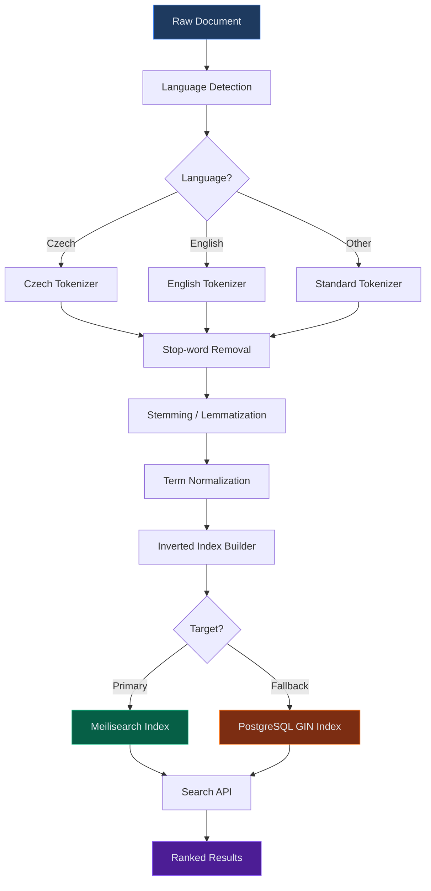
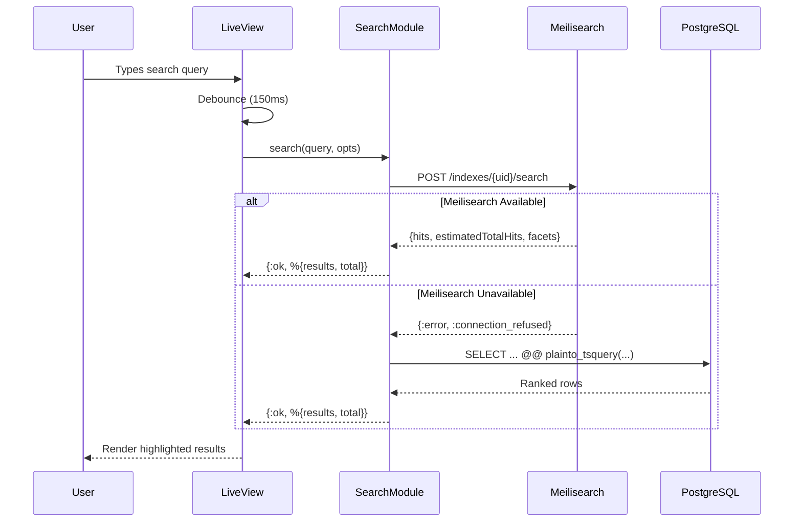

+++
title = "Full-Text Index"
description = "A specialized data structure that enables efficient searching of text content by tokenizing documents into terms and building inverted indexes that map terms to their containing documents."
weight = 50

[extra]
category = "database"
subcategory = "search"
tags = ["full-text-index", "search", "inverted-index", "tokenization", "meilisearch", "elasticsearch", "tfidf", "bm25", "stemming", "text-search", "gin-index", "tsvector", "ranking", "relevance"]
date_created = "2026-02-23"
date_updated = "2026-04-08"
difficulty = "intermediate"
audience = ["developers", "data-engineers", "architects", "search-engineers"]
related_terms = ["faceted-search", "meilisearch", "index", "tokenization", "inverted-index", "bm25", "elasticsearch", "postgresql", "glossary", "ets", "cache", "gin-index", "tsvector", "stemming", "relevance-scoring"]
key_concepts = ["inverted-index", "tokenization", "stemming", "relevance-scoring", "bm25", "tfidf", "analyzers", "gin-index", "tsvector", "ranking-rules"]
platforms = ["meilisearch", "elasticsearch", "postgresql", "solr", "beam"]
prerequisites = ["database-indexing", "text-processing", "information-retrieval"]
use_cases = ["document-search", "product-search", "log-search", "osint-data-search", "knowledge-base", "glossary-search", "dd-entity-search"]
complexity = "medium"
stability = "mature"
author = "Tomas Korcak (korczis)"
reading_time = "12 min"
word_count = 3200
date_modified = "2026-04-08"
keywords = ["Full-Text Index", "search", "inverted index", "glossary", "Prismatic Platform", "Meilisearch", "PostgreSQL", "BM25", "tokenization"]
quality_score = 92
see_also = ["capabilities", "architecture"]
image = "/images/sections/glossary.png"
image_alt = "Full-Text Index - Prismatic Platform"
+++

## Definition

A **full-text index** is a data structure optimized for searching natural language text content within databases and search engines. Unlike standard B-tree indexes that match exact values or numeric ranges, full-text indexes decompose text documents into individual terms (tokens), apply linguistic transformations (stemming, lowercasing, stop-word removal), and build an **inverted index** that maps each term to the set of documents containing it. This enables efficient retrieval of documents matching keyword queries, phrase searches, fuzzy matches, and relevance-ranked results.

Full-text indexes are the backbone of any search-driven application: document management systems, e-commerce product catalogs, knowledge bases, log analysis tools, OSINT intelligence platforms, and due diligence entity registries. The performance difference between a naive text search (sequential scan with string matching) and an indexed search is orders of magnitude -- scanning 10 million documents takes seconds, while an inverted index lookup returns results in milliseconds regardless of collection size.

---

## Overview

### Inverted Index Architecture

The core data structure underlying full-text search is the **inverted index** (also called a posting list). In a forward index, the mapping goes from document to terms:

```
Forward Index:
  doc1 -> ["prismatic", "platform", "osint", "search"]
  doc2 -> ["meilisearch", "search", "index", "fast"]
  doc3 -> ["prismatic", "glossary", "term", "search"]
```

An inverted index reverses this mapping -- from term to documents:

```
Inverted Index:
  "prismatic"   -> [doc1, doc3]
  "platform"    -> [doc1]
  "osint"       -> [doc1]
  "search"      -> [doc1, doc2, doc3]
  "meilisearch" -> [doc2]
  "index"       -> [doc2]
  "fast"        -> [doc2]
  "glossary"    -> [doc3]
  "term"        -> [doc3]
```

This inversion is what makes search fast -- to find documents containing a term, the engine looks up the term in the inverted index and immediately obtains the list of matching documents without scanning every document. For multi-term queries, the engine intersects or unions the posting lists depending on the Boolean operator (AND vs OR).

### Tokenization

Tokenization is the first step in the indexing pipeline. It splits raw text into discrete tokens that form the vocabulary of the index. Different tokenizers handle different challenges:

| Tokenizer Type | Strategy | Example Input | Output Tokens |
|----------------|----------|---------------|---------------|
| **Whitespace** | Split on spaces | "full-text search" | ["full-text", "search"] |
| **Standard** | Split on spaces + punctuation | "full-text search" | ["full", "text", "search"] |
| **N-gram** | Sliding window of N characters | "search" (bigram) | ["se", "ea", "ar", "rc", "ch"] |
| **CJK** | Character-level for ideographs | -- | Per-character tokens |
| **Czech** | Language-aware with diacritics | "Ceske firmy" | ["cesk", "firm"] (after stemming) |

### Stemming and Lemmatization

After tokenization, linguistic normalization reduces tokens to their root forms so that morphological variants match the same index entry:

- **Stemming** (algorithmic): "running" -> "run", "companies" -> "compani", "searching" -> "search"
- **Lemmatization** (dictionary-based): "running" -> "run", "companies" -> "company", "better" -> "good"

Stemming is faster but less precise. Lemmatization requires a dictionary but produces correct root forms. For Czech language text (critical in the Prismatic DD pipeline), the Czech stemmer handles declension across 7 grammatical cases, which English stemmers cannot address.

### BM25 Scoring

**BM25** (Best Matching 25) is the industry-standard relevance scoring algorithm used by Meilisearch, Elasticsearch, and PostgreSQL. It extends TF-IDF with two key improvements:

1. **Term frequency saturation**: Repeated terms contribute diminishing returns (controlled by parameter `k1`, typically 1.2)
2. **Document length normalization**: Longer documents are penalized to prevent bias (controlled by parameter `b`, typically 0.75)

The BM25 formula for a single query term `q` against document `D`:

```
score(D, q) = IDF(q) * (tf(q, D) * (k1 + 1)) / (tf(q, D) + k1 * (1 - b + b * |D| / avgdl))
```

Where:
- `IDF(q)` = inverse document frequency of term `q`
- `tf(q, D)` = frequency of term `q` in document `D`
- `|D|` = length of document `D` in tokens
- `avgdl` = average document length across the collection
- `k1` = term frequency saturation parameter (default 1.2)
- `b` = length normalization parameter (default 0.75)

| Algorithm | Strengths | Weaknesses | Use Case |
|-----------|-----------|------------|----------|
| **TF-IDF** | Simple, well-understood | No length normalization | Small collections, prototyping |
| **BM25** | Length-aware, industry standard | Two parameters to tune | General-purpose search |
| **BM25F** | Field-weighted scoring | More complex tuning | Multi-field documents (title + body) |
| **Language Model** | Theoretically principled | Computationally expensive | Academic, precision-critical |

---

## Technical Deep Dive

### Meilisearch Integration

Meilisearch is the primary full-text search engine in the Prismatic Platform. It provides sub-10ms search latency with built-in typo tolerance, faceted filtering, and language detection. The platform maintains dedicated indexes for each domain:

| Index | Documents | Searchable Fields | Filterable Fields |
|-------|-----------|-------------------|-------------------|
| `glossary_terms` | 890+ terms | title, description, content | category, difficulty, tags |
| `osint_tools` | 157 adapters | name, description, category | type, auth_required, country |
| `dd_entities` | Per-case | name, external_id, attributes | entity_type, case_id, status |
| `academy_topics` | 4 topics | title, description, content | difficulty, prerequisites |
| `blog_articles` | 101 articles | title, summary, content | category, tags, author |

The Meilisearch ranking rules determine result ordering:

```
Default Ranking Rules (in priority order):
1. words      - Number of query terms matched
2. typo       - Number of typos (fewer = better)
3. proximity  - Distance between query terms in document
4. attribute  - Which field matched (title > description > content)
5. sort       - User-defined sort criteria
6. exactness  - Exact match vs prefix match
```

### PostgreSQL tsvector and GIN Indexes

PostgreSQL provides built-in full-text search through the `tsvector` and `tsquery` types, backed by GIN (Generalized Inverted Index) indexes. This serves as the fallback search path when Meilisearch is unavailable or for transactional queries that must be consistent with the latest database state.

**tsvector** stores a sorted list of lexemes (normalized tokens) with positional information:

```sql
-- Creating a tsvector from text
SELECT to_tsvector('english', 'The Prismatic Platform provides OSINT tools');
-- Result: 'osint':5 'platform':3 'prismat':2 'provid':4 'tool':6

-- Czech language support
SELECT to_tsvector('czech', 'Ceske firmy a organizace');
-- Result: 'cesk':1 'firm':2 'organizac':4
```

**GIN indexes** store the inverted index on disk, enabling fast lookups:

```sql
-- Create a GIN index for full-text search
CREATE INDEX idx_entities_fts ON dd_entities
  USING GIN (to_tsvector('english', name || ' ' || coalesce(description, '')));

-- Query with ranking
SELECT id, name, ts_rank(
  to_tsvector('english', name || ' ' || coalesce(description, '')),
  plainto_tsquery('english', 'navigara investment')
) AS rank
FROM dd_entities
WHERE to_tsvector('english', name || ' ' || coalesce(description, ''))
  @@ plainto_tsquery('english', 'navigara investment')
ORDER BY rank DESC
LIMIT 20;
```

### GIN vs GiST Index Comparison

| Feature | GIN Index | GiST Index |
|---------|-----------|------------|
| **Build time** | Slower (3-10x) | Faster |
| **Query speed** | Faster (2-3x) | Slower |
| **Update cost** | Higher (batch-friendly) | Lower (update-friendly) |
| **Index size** | Larger | Smaller |
| **Best for** | Read-heavy, batch-updated | Write-heavy, real-time |
| **Prismatic usage** | Glossary, DD entities | Real-time OSINT results |

---

## Indexing Pipeline

The following diagram shows how documents flow through the full-text indexing pipeline in the Prismatic Platform, from raw content ingestion through to searchable index entries:



The pipeline operates in two modes:
- **Batch indexing**: Used during initial data load or reindexing. Documents are processed in batches of 1,000 and sent to Meilisearch via `add_documents/2`.
- **Real-time indexing**: Used for individual document updates. A PubSub listener triggers incremental index updates within 50ms of the database commit.

---

## Usage in Prismatic Platform

### Glossary Search (890+ Terms)

The glossary system indexes 890+ terms across categories (database, security, intelligence, architecture, development). Each term document includes the title, description, full markdown content, tags, and related terms. The search supports:

- **Instant search-as-you-type** with debounced queries (150ms)
- **Typo tolerance** (up to 2 typos for words > 5 characters)
- **Faceted filtering** by category, difficulty, and tags
- **Highlighted matches** in search results

```elixir
defmodule PrismaticWeb.Glossary.Search do
  @moduledoc """
  Full-text search integration for the glossary system.
  Uses Meilisearch as the primary engine with PostgreSQL fallback.
  """

  alias PrismaticStorageMeilisearch.Client

  @glossary_index "glossary_terms"
  @default_limit 20

  @spec search(String.t(), keyword()) :: {:ok, list(map())} | {:error, term()}
  def search(query, opts \\ []) do
    search_params = %{
      q: query,
      limit: Keyword.get(opts, :limit, @default_limit),
      offset: Keyword.get(opts, :offset, 0),
      filter: build_filter(opts),
      facets: ["category", "difficulty", "tags"],
      attributesToHighlight: ["title", "description", "content"],
      highlightPreTag: "<mark class=\"bg-yellow-200 dark:bg-yellow-800\">",
      highlightPostTag: "</mark>"
    }

    case Client.search(@glossary_index, search_params) do
      {:ok, %{"hits" => hits, "estimatedTotalHits" => total}} ->
        {:ok, %{results: hits, total: total}}

      {:error, reason} ->
        Logger.warning("Meilisearch glossary search failed, falling back to PostgreSQL",
          reason: inspect(reason)
        )

        fallback_search(query, opts)
    end
  end

  @spec build_filter(keyword()) :: String.t() | nil
  defp build_filter(opts) do
    filters =
      []
      |> maybe_add_filter("category", Keyword.get(opts, :category))
      |> maybe_add_filter("difficulty", Keyword.get(opts, :difficulty))
      |> Enum.join(" AND ")

    if filters == "", do: nil, else: filters
  end

  @spec maybe_add_filter(list(), String.t(), String.t() | nil) :: list()
  defp maybe_add_filter(filters, _field, nil), do: filters
  defp maybe_add_filter(filters, field, value), do: filters ++ ["#{field} = \"#{value}\""]

  @spec fallback_search(String.t(), keyword()) :: {:ok, list(map())} | {:error, term()}
  defp fallback_search(query, opts) do
    limit = Keyword.get(opts, :limit, @default_limit)

    results =
      from(g in GlossaryTerm,
        where: fragment(
          "to_tsvector('english', ? || ' ' || coalesce(?, '')) @@ plainto_tsquery('english', ?)",
          g.title,
          g.description,
          ^query
        ),
        order_by: [desc: fragment(
          "ts_rank(to_tsvector('english', ? || ' ' || coalesce(?, '')), plainto_tsquery('english', ?))",
          g.title,
          g.description,
          ^query
        )],
        limit: ^limit
      )
      |> Repo.all()

    {:ok, %{results: results, total: length(results)}}
  end
end
```

### OSINT Result Indexing

The 157 OSINT adapters produce structured results that are indexed for cross-tool search. Each OSINT run result is indexed with the tool name, query, result fields, and timestamps. This enables investigators to search across all historical OSINT results from a single search bar.

```elixir
defmodule PrismaticWeb.Osint.ResultIndexer do
  @moduledoc """
  Indexes OSINT tool execution results into Meilisearch
  for cross-tool full-text search capabilities.
  """

  alias PrismaticStorageMeilisearch.Client

  @osint_index "osint_results"

  @spec index_result(map()) :: {:ok, map()} | {:error, term()}
  def index_result(%{run_id: run_id, tool: tool, results: results} = run) do
    document = %{
      id: run_id,
      tool_slug: tool.slug,
      tool_name: tool.name,
      category: tool.category,
      query: run.query,
      result_text: extract_searchable_text(results),
      entity_names: extract_entity_names(results),
      timestamp: DateTime.utc_now() |> DateTime.to_iso8601()
    }

    Client.add_documents(@osint_index, [document])
  end

  @spec extract_searchable_text(map() | list()) :: String.t()
  defp extract_searchable_text(results) when is_map(results) do
    results
    |> Map.values()
    |> Enum.map(&to_string/1)
    |> Enum.join(" ")
    |> String.slice(0, 10_000)
  end

  defp extract_searchable_text(results) when is_list(results) do
    results
    |> Enum.map(&inspect/1)
    |> Enum.join(" ")
    |> String.slice(0, 10_000)
  end

  @spec extract_entity_names(map() | list()) :: list(String.t())
  defp extract_entity_names(results) when is_map(results) do
    [:name, :company_name, :entity_name, :organization]
    |> Enum.flat_map(fn key -> List.wrap(Map.get(results, key)) end)
    |> Enum.filter(&is_binary/1)
  end

  defp extract_entity_names(_), do: []
end
```

### DD Entity Search

Due diligence cases involve entities (persons, companies, domains) that must be searchable across all cases. The DD entity index supports:

- **Cross-case entity search**: Find entities across all DD cases
- **Relationship discovery**: Search for entities connected to a target
- **External ID lookup**: Search by ICO, registration number, or domain

```elixir
defmodule PrismaticWeb.DD.EntitySearch do
  @moduledoc """
  Full-text search for DD entities across all cases.
  Supports cross-case discovery and relationship mapping.
  """

  alias PrismaticStorageMeilisearch.Client

  @dd_entity_index "dd_entities"

  @spec search_entities(String.t(), keyword()) :: {:ok, map()} | {:error, term()}
  def search_entities(query, opts \\ []) do
    params = %{
      q: query,
      limit: Keyword.get(opts, :limit, 20),
      filter: build_entity_filter(opts),
      facets: ["entity_type", "case_id", "status"],
      attributesToHighlight: ["name", "external_id", "attributes"]
    }

    Client.search(@dd_entity_index, params)
  end

  @spec build_entity_filter(keyword()) :: String.t() | nil
  defp build_entity_filter(opts) do
    filters =
      []
      |> maybe_filter("entity_type", Keyword.get(opts, :entity_type))
      |> maybe_filter("case_id", Keyword.get(opts, :case_id))
      |> Enum.join(" AND ")

    if filters == "", do: nil, else: filters
  end

  @spec maybe_filter(list(), String.t(), term()) :: list()
  defp maybe_filter(filters, _field, nil), do: filters
  defp maybe_filter(filters, field, value), do: filters ++ ["#{field} = \"#{value}\""]
end
```

---

## Code Examples

### Meilisearch Client: Index Creation and Search

```elixir
defmodule PrismaticStorageMeilisearch.Index do
  @moduledoc """
  Full-text index management for Meilisearch.
  Handles index creation, document ingestion, and
  search configuration for platform content.
  """

  alias PrismaticStorageMeilisearch.Client

  @type index_config :: %{
    uid: String.t(),
    primary_key: String.t(),
    searchable_attributes: list(String.t()),
    filterable_attributes: list(String.t()),
    sortable_attributes: list(String.t()),
    ranking_rules: list(String.t())
  }

  @spec create_index(index_config()) :: {:ok, map()} | {:error, term()}
  def create_index(config) do
    with {:ok, _} <- Client.create_index(config.uid, config.primary_key),
         {:ok, _} <- configure_searchable(config.uid, config.searchable_attributes),
         {:ok, _} <- configure_filterable(config.uid, config.filterable_attributes),
         {:ok, _} <- configure_sortable(config.uid, config.sortable_attributes),
         {:ok, _} <- configure_ranking(config.uid, config.ranking_rules) do
      {:ok, %{index: config.uid, status: :created}}
    end
  end

  @spec index_documents(String.t(), list(map())) :: {:ok, map()} | {:error, term()}
  def index_documents(index_uid, documents) when is_list(documents) do
    # Batch in chunks of 1000 to respect Meilisearch payload limits
    documents
    |> Enum.chunk_every(1_000)
    |> Enum.reduce_while({:ok, []}, fn batch, {:ok, tasks} ->
      case Client.add_documents(index_uid, batch) do
        {:ok, task} -> {:cont, {:ok, [task | tasks]}}
        {:error, reason} -> {:halt, {:error, reason}}
      end
    end)
  end

  @spec search(String.t(), String.t(), keyword()) :: {:ok, map()} | {:error, term()}
  def search(index_uid, query, opts \\ []) do
    search_params = %{
      q: query,
      limit: Keyword.get(opts, :limit, 20),
      offset: Keyword.get(opts, :offset, 0),
      filter: Keyword.get(opts, :filter),
      facets: Keyword.get(opts, :facets),
      attributesToHighlight: Keyword.get(opts, :highlight, ["*"])
    }

    Client.search(index_uid, search_params)
  end

  defp configure_searchable(uid, attrs),
    do: Client.update_settings(uid, %{searchableAttributes: attrs})

  defp configure_filterable(uid, attrs),
    do: Client.update_settings(uid, %{filterableAttributes: attrs})

  defp configure_sortable(uid, attrs),
    do: Client.update_settings(uid, %{sortableAttributes: attrs})

  defp configure_ranking(uid, rules),
    do: Client.update_settings(uid, %{rankingRules: rules})
end
```

### PostgreSQL Full-Text Search with Ecto

```elixir
defmodule Prismatic.Search.PostgresFullText do
  @moduledoc """
  PostgreSQL full-text search utilities using tsvector/tsquery
  with GIN index support. Serves as the fallback search path
  when Meilisearch is unavailable.
  """

  import Ecto.Query

  @spec search_with_rank(Ecto.Queryable.t(), String.t(), keyword()) :: Ecto.Query.t()
  def search_with_rank(queryable, search_term, opts \\ []) do
    language = Keyword.get(opts, :language, "english")
    fields = Keyword.get(opts, :fields, [:name, :description])
    limit = Keyword.get(opts, :limit, 20)

    tsvector_expr = build_tsvector_fragment(fields, language)

    queryable
    |> where(
      [r],
      fragment(
        "to_tsvector(?, concat_ws(' ', ?, ?)) @@ plainto_tsquery(?, ?)",
        ^language,
        r.name,
        r.description,
        ^language,
        ^search_term
      )
    )
    |> order_by(
      [r],
      desc: fragment(
        "ts_rank(to_tsvector(?, concat_ws(' ', ?, ?)), plainto_tsquery(?, ?))",
        ^language,
        r.name,
        r.description,
        ^language,
        ^search_term
      )
    )
    |> limit(^limit)
  end

  @doc """
  Creates a GIN index migration for full-text search on the given table and columns.

  ## Example

      iex> gen_gin_index_sql("dd_entities", ["name", "description"], "english")
      "CREATE INDEX idx_dd_entities_fts ON dd_entities USING GIN (to_tsvector('english', coalesce(name, '') || ' ' || coalesce(description, '')))"
  """
  @spec gen_gin_index_sql(String.t(), list(String.t()), String.t()) :: String.t()
  def gen_gin_index_sql(table, columns, language \\ "english") do
    coalesce_parts =
      columns
      |> Enum.map(fn col -> "coalesce(#{col}, '')" end)
      |> Enum.join(" || ' ' || ")

    "CREATE INDEX idx_#{table}_fts ON #{table} USING GIN (to_tsvector('#{language}', #{coalesce_parts}))"
  end
end
```

---

## Best Practices

1. **Choose the right tokenizer for your language**. Czech text requires a language-aware tokenizer that handles diacritics (hacky, carky) and 7 grammatical cases. Using the English tokenizer on Czech text produces poor results.

2. **Use Meilisearch for user-facing search, PostgreSQL for transactional queries**. Meilisearch provides typo tolerance and sub-10ms latency for interactive search. PostgreSQL full-text search is better when you need ACID consistency with the latest database state.

3. **Always set a limit on search results**. Unbounded search results are a PERF doctrine violation. Use `limit: 20` as a default and paginate with `offset`.

4. **Index only searchable content**. Do not index binary data, UUIDs, or internal metadata. Keep the index lean by selecting only the fields users will search.

5. **Batch document indexing**. Send documents to Meilisearch in batches of 1,000 instead of one-by-one. This reduces HTTP overhead and improves indexing throughput by 10-50x.

6. **Configure ranking rules per domain**. The default Meilisearch ranking rules work well for general search, but DD entity search benefits from custom rules that prioritize exact name matches over description matches.

7. **Use GIN indexes for PostgreSQL full-text**. GIN indexes are 2-3x faster than GiST for read-heavy workloads. Use GiST only when write performance is critical.

8. **Monitor index health**. Track index size, document count, and average search latency. Meilisearch exposes these metrics via the `/stats` endpoint.

9. **Handle search failures gracefully**. Always implement a fallback path. If Meilisearch is down, degrade to PostgreSQL full-text search rather than showing an error.

10. **Re-index periodically**. Schedule full re-indexing weekly to clean up deleted documents and refresh term statistics for accurate BM25 scoring.

---

## Common Mistakes

| Mistake | Impact | Correct Approach |
|---------|--------|-----------------|
| Using `LIKE '%term%'` instead of full-text search | O(n) sequential scan, no ranking | Use `tsvector` + `tsquery` with GIN index |
| Not setting `limit` on search queries | Unbounded result sets, memory exhaustion (PERF violation) | Always set `limit: 20` default, paginate |
| Indexing all database columns | Bloated index, slow updates, irrelevant results | Index only user-searchable fields |
| Using English stemmer for Czech text | Poor recall -- "firmy" won't match "firma" | Use `to_tsvector('czech', ...)` for Czech content |
| Single-document indexing in a loop | N HTTP requests instead of 1 batch (N+1 anti-pattern) | Batch with `Enum.chunk_every(1_000)` |
| Ignoring typo tolerance configuration | Users misspelling "meilisearch" as "melisearch" get no results | Enable typo tolerance (default in Meilisearch) |
| Not creating GIN index on tsvector column | PostgreSQL falls back to sequential scan | `CREATE INDEX ... USING GIN (to_tsvector(...))` |
| Hardcoding search language | Multilingual documents indexed with wrong stemmer | Detect language per document or use multi-language index |
| Skipping stop-word removal | Common words dominate results, reducing precision | Use language-appropriate stop-word lists |
| Not monitoring index size | Index grows unbounded, search latency degrades | Track via Meilisearch `/stats` or `pg_total_relation_size` |

---

## Query Flow

The following diagram illustrates the complete query flow from user input through to ranked results, showing how the platform routes between Meilisearch and PostgreSQL:



---

## Related Terms

- [Faceted Search](@/glossary/faceted-search.md) -- Multi-dimensional filtering over indexed data with category counts
- [Meilisearch](@/glossary/meilisearch.md) -- Primary search engine used by the Prismatic Platform
- [Tokenization](@/glossary/tokenization.md) -- Text splitting for index building and NLP pipelines
- [Inverted Index](/glossary/inverted-index/) -- Core data structure mapping terms to documents
- [BM25](/glossary/bm25/) -- Industry-standard relevance scoring algorithm
- [Elasticsearch](/glossary/elasticsearch/) -- Distributed search engine for large-scale deployments
- [PostgreSQL](@/glossary/postgresql.md) -- Relational database with built-in full-text search via tsvector
- [GIN Index](/glossary/gin-index/) -- Generalized Inverted Index for PostgreSQL full-text and JSONB
- [ETS](@/glossary/ets.md) -- Erlang Term Storage used for in-memory caching of search results
- [Cache](@/glossary/cache.md) -- Caching strategies for search result performance
- [Glossary](/glossary/glossary/) -- The Prismatic glossary system with 890+ searchable terms
- [Index](/glossary/index/) -- General database index concepts and B-tree fundamentals
- **Livebooks**: `storage_data/` notebooks demonstrate full-text search operations
- **Academy**: Topics on information retrieval cover index architectures in depth

---

## Connect & Contribute

**Created by [Tomas Korcak (korczis)](https://github.com/korczis)** | Open Source under [GHL](https://github.com/korczis/prismatic-platform/blob/main/LICENSE)

- [GitHub](https://github.com/korczis/prismatic-platform) | [GitLab](https://gitlab.com/korczis/prismatic-platform) | [LinkedIn](https://linkedin.com/in/korczis) | [Contact](mailto:korczis@gmail.com)
- [Developer Portal](@/developers/_index.md) | [Architecture](@/architecture/_index.md) | [Meet the Creator](@/about/author.md)
