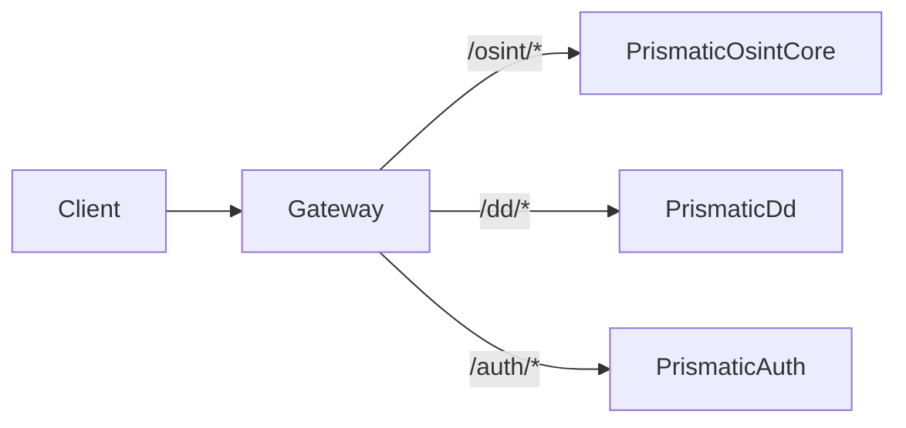
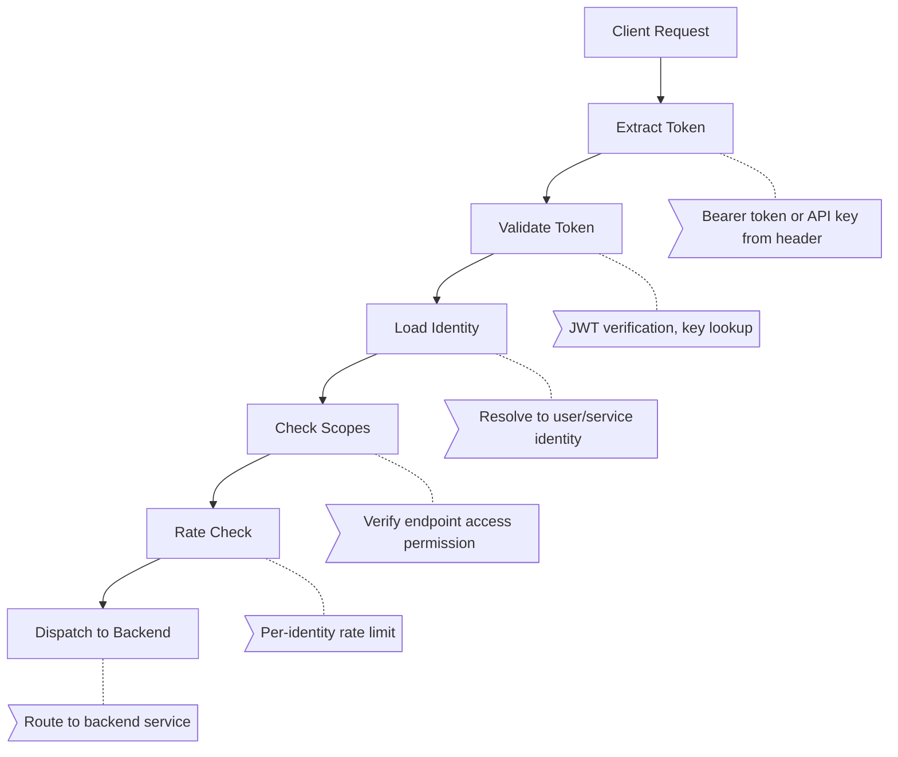

+++
title = "Gateway"
description = "An API gateway serves as the single entry point for client requests, handling routing, authentication, rate limiting, load balancing, and protocol translation between clients and backend services."
weight = 50

[extra]
category = "architecture"
subcategory = "api_infrastructure"
difficulty = "intermediate"
technology_type = "architectural_pattern"
platform_component = "api_layer"
paradigm = "centralized_access"
prerequisite_concepts = ["http_fundamentals", "rest_api_design", "distributed_systems", "authentication"]
use_cases = ["api_management", "microservice_routing", "authentication_centralization", "traffic_management", "api_versioning", "auto_introspection"]
benefits = ["centralized_security", "unified_monitoring", "client_simplification", "backend_decoupling", "api_documentation"]
implementation_patterns = ["plug_pipeline", "auto_discovery", "dispatcher", "middleware_chain", "circuit_breaker"]
quality_metrics = ["gateway_latency", "error_rate", "discovery_coverage", "auth_success_rate"]
integration_points = ["prismatic_api", "plug", "phoenix", "tesla", "openapi_spex", "ets_registry"]
related_disciplines = ["api_management", "network_architecture", "security_engineering", "distributed_systems"]
tags = ["gateway", "api-gateway", "routing", "authentication", "rate-limiting", "load-balancing", "proxy", "microservices", "openapi", "rest"]
date_created = "2026-02-23"
date_updated = "2026-04-08"
audience = ["architects", "developers", "devops-engineers", "api-designers"]
related_terms = ["api", "rest", "authentication", "rate-limiting", "load-balancer", "reverse-proxy", "openapi-spec", "endpoint", "plug", "pipeline", "telemetry", "circuit-breaker", "json", "middleware", "integration"]
key_concepts = ["request-routing", "authentication", "rate-limiting", "protocol-translation", "request-aggregation"]
platforms = ["prismatic-api", "phoenix", "beam", "plug"]
prerequisites = ["http-fundamentals", "rest-api-design", "distributed-systems"]
complexity = "medium"
stability = "mature"
author = "Tomas Korcak (korczis)"
reading_time = "15 min"
word_count = 3800
date_modified = "2026-04-08"
keywords = ["Gateway", "API Gateway", "routing", "glossary", "Prismatic Platform", "auto-introspection", "OpenAPI", "Plug pipeline", "rate limiting", "circuit breaker"]
quality_score = 92
see_also = ["capabilities", "architecture", "api"]
image = "/images/sections/glossary.png"
image_alt = "Gateway - Prismatic Platform"
+++

## Definition

An API gateway is a server that acts as the single entry point for a group of backend services, providing a unified interface for external clients while handling cross-cutting concerns such as [authentication](@/glossary/authentication.md), authorization, rate limiting, request routing, load balancing, protocol translation, and response caching. The gateway pattern decouples client-facing [API](@/glossary/api.md) design from internal service architecture, enabling backend services to evolve independently while maintaining a stable external API contract.

API gateways solve several architectural challenges that emerge as applications grow beyond monolithic designs. Without a gateway, each client must know the addresses and APIs of individual backend services, authenticate separately with each service, and handle cross-cutting concerns like retry logic and circuit breaking independently. A gateway centralizes these responsibilities, reducing client complexity and providing a single point for security enforcement, monitoring, and traffic management.

## Overview

The pattern has roots in the facade design pattern from object-oriented programming and the [integration](@/glossary/integration.md) layer pattern from enterprise application architecture. Modern API gateways range from simple reverse proxies with authentication (Nginx, Caddy) to full-featured API management platforms (Kong, AWS API Gateway, Apigee) with developer portals, analytics, and lifecycle management.

The Prismatic Platform implements a distinctive gateway through the `prismatic_api` application, which auto-discovers backend functions and exposes them through a unified [OpenAPI](@/glossary/openapi-spec.md)-documented [REST](@/glossary/rest.md) interface. This auto-introspection approach eliminates the common maintenance burden of keeping route configurations synchronized with backend service APIs.

### Gateway Evolution

| Generation | Approach | Example | Limitation |
|-----------|----------|---------|-----------|
| **Gen 1** | Hardware load balancer | F5, Citrix NetScaler | No application awareness |
| **Gen 2** | Reverse proxy | Nginx, HAProxy | Limited routing logic |
| **Gen 3** | API gateway | Kong, Apigee | Manual route configuration |
| **Gen 4** | Service mesh | Istio, Linkerd | High operational complexity |
| **Prismatic** | Auto-introspecting gateway | PrismaticAPI | Zero manual route management |

The Prismatic Platform's approach is unique in Generation 4+: rather than requiring manual route configuration or service mesh infrastructure, the gateway scans all `Prismatic*` facade modules at boot time, discovers their public functions, maps [Elixir](@/glossary/elixir.md) type specifications to OpenAPI schemas, and exposes every function as a REST [endpoint](@/glossary/endpoint.md). This creates a self-documenting, self-configuring API surface.

## Technical Deep Dive

### Gateway Responsibilities

| Responsibility | Description | Prismatic Implementation |
|---------------|-------------|--------------------------|
| **Request Routing** | Direct requests to appropriate backend | URL pattern matching → module/function dispatch |
| **Authentication** | Verify client identity | [Plug](@/glossary/plug.md) pipeline, Bearer tokens, API keys |
| **Authorization** | Enforce access control policies | RBAC via Casbin, scope validation |
| **Rate Limiting** | Prevent abuse, enforce quotas | Token bucket per-client in [ETS](@/glossary/ets.md) |
| **Protocol Translation** | Convert between formats | [JSON](@/glossary/json.md) ↔ Elixir terms, auto-coercion |
| **Request Validation** | Verify request structure | OpenApiSpex schema validation |
| **Response Transformation** | Normalize response format | Consistent envelope structure |
| **Caching** | Cache frequent responses | ETS cache with TTL |
| **Monitoring** | Track latency, errors, throughput | [Telemetry](@/glossary/telemetry.md) events per-endpoint |
| **Circuit Breaking** | Prevent cascade failures | Per-backend circuit breaker state |
| **Documentation** | Generate API docs | OpenAPI 3.0 + SwaggerUI |

### Gateway Architectural Patterns

Different gateway patterns serve different architectural needs:

#### 1. Routing Gateway (Simple Proxy)

Routes requests to the correct backend based on URL path or host header. The simplest pattern, adding minimal latency.



#### 2. Aggregation Gateway (BFF Pattern)

Combines responses from multiple backend services into a single response, reducing client round-trips. Essential for mobile and low-bandwidth clients.

```elixir
# Aggregation: combine OSINT results from multiple tools
defmodule PrismaticApi.Aggregator do
  @moduledoc """
  Aggregates responses from multiple backend services
  into a single unified response for the client.
  """

  @spec aggregate_entity_intelligence(String.t()) :: {:ok, map()}
  def aggregate_entity_intelligence(entity_name) do
    tasks = [
      Task.async(fn -> PrismaticOsintCore.search(:czech_ares, %{query: entity_name}) end),
      Task.async(fn -> PrismaticOsintCore.search(:czech_justice, %{query: entity_name}) end),
      Task.async(fn -> PrismaticDd.get_entity_by_name(entity_name) end),
      Task.async(fn -> PrismaticPerimeter.check_domain(entity_name) end)
    ]

    results = Task.await_many(tasks, 15_000)

    {:ok, %{
      ares: Enum.at(results, 0),
      justice: Enum.at(results, 1),
      dd_entity: Enum.at(results, 2),
      perimeter: Enum.at(results, 3),
      aggregated_at: DateTime.utc_now()
    }}
  end
end
```

#### 3. Offloading Gateway

Handles cross-cutting concerns (auth, logging, rate limiting) while passing requests through with minimal transformation. The backend services remain unaware of these concerns.

#### 4. Translation Gateway

Converts between protocols and data formats. For example, exposing a [GenServer](@/glossary/genserver.md)-based backend as a REST API, or translating between JSON and internal Elixir terms.

### Gateway vs Reverse Proxy vs Service Mesh

| Feature | Reverse Proxy | API Gateway | Service Mesh |
|---------|--------------|-------------|-------------|
| **Scope** | Network level | Application level | Inter-service level |
| **Routing** | Simple path/host | Complex with transforms | Service-to-service |
| **Auth** | Basic (HTTP, IP) | Full (JWT, OAuth, RBAC) | mTLS, SPIFFE |
| **Rate Limiting** | Basic or none | Per-client quotas | Per-service quotas |
| **API Docs** | None | OpenAPI, portal | None |
| **Protocol** | HTTP/TCP passthrough | Full translation | Sidecar proxy |
| **Monitoring** | Access logs | Detailed analytics | Distributed tracing |
| **Complexity** | Low | Medium | High |
| **Prismatic** | Nginx (production) | PrismaticAPI (app) | N/A (monolith) |

### Plug Pipeline Architecture

The Prismatic Platform's gateway architecture is built on [Phoenix](@/glossary/phoenix.md)'s Plug pipeline model. Each cross-cutting concern is implemented as an independent plug:

```elixir
defmodule PrismaticApi.Router do
  use PrismaticApi, :router

  pipeline :api do
    plug :accepts, ["json"]
    plug PrismaticApi.Plugs.RequestId
    plug PrismaticApi.Plugs.Telemetry
    plug PrismaticApi.Plugs.RateLimiter
    plug PrismaticApi.Plugs.Authentication
    plug PrismaticApi.Plugs.Authorization
    plug PrismaticApi.Plugs.RequestValidation
    plug OpenApiSpex.Plug.PutApiSpec, module: PrismaticApi.ApiSpec
  end

  scope "/api/v1", PrismaticApi do
    pipe_through :api

    # Auto-discovered endpoints
    get "/:app/:action", DispatchController, :dispatch
    post "/:app/:action", DispatchController, :dispatch
  end

  # OpenAPI documentation
  scope "/api" do
    get "/openapi", OpenApiSpex.Plug.RenderSpec, []
    get "/swaggerui", OpenApiSpex.Plug.SwaggerUI, path: "/api/openapi"
  end
end
```

Each plug in the pipeline has a single responsibility:

```elixir
defmodule PrismaticApi.Plugs.RateLimiter do
  @moduledoc """
  Token bucket rate limiter plug.
  Limits requests per API key to prevent abuse.
  """
  @behaviour Plug

  import Plug.Conn

  @max_requests 100
  @window_seconds 60

  @impl true
  def init(opts), do: opts

  @impl true
  def call(conn, _opts) do
    client_id = get_client_id(conn)

    case check_rate(client_id) do
      :ok ->
        conn
        |> put_resp_header("x-ratelimit-remaining", to_string(remaining(client_id)))
        |> put_resp_header("x-ratelimit-limit", to_string(@max_requests))

      {:error, :rate_limited} ->
        conn
        |> put_resp_header("retry-after", to_string(@window_seconds))
        |> send_resp(429, Jason.encode!(%{error: "rate_limited"}))
        |> halt()
    end
  end

  defp get_client_id(conn) do
    case get_req_header(conn, "authorization") do
      ["Bearer " <> token] -> token
      _ -> conn.remote_ip |> :inet.ntoa() |> to_string()
    end
  end

  defp check_rate(client_id) do
    now = System.system_time(:second)
    key = {client_id, div(now, @window_seconds)}

    case :ets.update_counter(:api_rate_limits, key, {2, 1}, {key, 0}) do
      count when count <= @max_requests -> :ok
      _ -> {:error, :rate_limited}
    end
  end

  defp remaining(client_id) do
    now = System.system_time(:second)
    key = {client_id, div(now, @window_seconds)}

    case :ets.lookup(:api_rate_limits, key) do
      [{_, count}] -> max(@max_requests - count, 0)
      [] -> @max_requests
    end
  end
end
```

### Auto-Discovery and Introspection

The most distinctive feature of the Prismatic gateway is its auto-discovery system. At boot time, the gateway:

1. **Scans modules**: Finds all modules matching `Prismatic*` that export public functions
2. **Extracts specs**: Reads `@spec` annotations to determine parameter types and return types
3. **Maps to OpenAPI**: Converts Elixir typespecs to JSON Schema / OpenAPI 3.0 types
4. **Registers endpoints**: Creates route entries in the [ETS](@/glossary/ets.md) registry
5. **Generates docs**: Builds OpenAPI 3.0 specification from discovered metadata

```elixir
defmodule PrismaticApi.Scanner do
  @moduledoc """
  Scans Prismatic facade modules and discovers public functions
  for automatic REST API exposure.
  """

  @spec scan_prismatic_modules() :: list(module())
  def scan_prismatic_modules do
    :code.all_available()
    |> Enum.filter(fn {mod, _, _} ->
      mod_string = to_string(mod)
      String.starts_with?(mod_string, "Elixir.Prismatic") and
        not String.contains?(mod_string, "Test") and
        not String.contains?(mod_string, "Web")
    end)
    |> Enum.map(fn {mod, _, _} -> List.to_atom(mod) end)
  end

  @spec extract_functions(module()) :: list(map())
  def extract_functions(module) do
    module.__info__(:functions)
    |> Enum.reject(fn {name, _arity} ->
      name in [:__info__, :module_info, :__struct__]
    end)
    |> Enum.map(fn {name, arity} ->
      %{
        module: module,
        function: name,
        arity: arity,
        doc: get_function_doc(module, name, arity),
        spec: get_function_spec(module, name, arity)
      }
    end)
  end

  @spec build_endpoint_spec(map()) :: map()
  def build_endpoint_spec(%{module: module, function: function} = func_info) do
    app_name = module
      |> Module.split()
      |> Enum.at(0)
      |> Macro.underscore()
      |> String.replace("_", "-")

    %{
      app: app_name,
      action: to_string(function),
      module: module,
      function: function,
      arity: func_info.arity,
      http_method: if(func_info.arity <= 1, do: :get, else: :post),
      param_specs: extract_param_specs(func_info.spec),
      doc: func_info.doc,
      path: "/api/v1/#{app_name}/#{function}"
    }
  end

  defp get_function_doc(module, name, arity) do
    case Code.fetch_docs(module) do
      {:docs_v1, _, _, _, _, _, docs} ->
        Enum.find_value(docs, fn
          {{:function, ^name, ^arity}, _, _, %{"en" => doc}, _} -> doc
          _ -> nil
        end)
      _ -> nil
    end
  end

  defp get_function_spec(_module, _name, _arity), do: nil

  defp extract_param_specs(nil), do: []
  defp extract_param_specs(spec), do: [spec]
end
```

### Dispatch Controller

The dispatch controller resolves URL parameters to module/function pairs and handles the actual invocation:

```elixir
defmodule PrismaticApi.DispatchController do
  @moduledoc """
  Generic dispatch controller for auto-discovered API endpoints.
  Resolves {app, action} URL parameters to {module, function} pairs,
  validates parameters, and invokes the backend function.
  """
  use PrismaticApi, :controller

  alias PrismaticApi.{Registry, Dispatcher}

  require Logger

  @spec dispatch(Plug.Conn.t(), map()) :: Plug.Conn.t()
  def dispatch(conn, %{"app" => app, "action" => action} = params) do
    start_time = System.monotonic_time()

    with {:ok, endpoint} <- Registry.lookup(app, action),
         {:ok, args} <- Dispatcher.validate_params(endpoint, params),
         {:ok, result} <- Dispatcher.safe_apply(endpoint.module, endpoint.function, args) do

      duration = System.monotonic_time() - start_time

      :telemetry.execute(
        [:prismatic_api, :dispatch, :success],
        %{duration: duration},
        %{app: app, action: action}
      )

      conn
      |> put_status(200)
      |> json(%{data: result, meta: %{app: app, action: action}})
    else
      {:error, :not_found} ->
        conn |> put_status(404) |> json(%{error: "endpoint_not_found"})

      {:error, {:validation_error, details}} ->
        conn |> put_status(400) |> json(%{error: "validation_error", details: details})

      {:error, reason} ->
        Logger.warning("Gateway dispatch error: #{inspect(reason)}")
        conn |> put_status(500) |> json(%{error: "internal_error"})
    end
  end
end
```

## Gateway Security

### Authentication Flow



### Common Gateway Security Threats

| Threat | Mitigation | Prismatic Implementation |
|--------|-----------|--------------------------|
| **DDoS** | Rate limiting + WAF | Token bucket per-IP/key |
| **Injection** | Input validation | OpenApiSpex schema validation |
| **Auth bypass** | Centralized auth | Plug pipeline, no bypass path |
| **Data leakage** | Response filtering | Explicit field selection |
| **Replay attack** | Nonce/timestamp | Request signing (optional) |
| **SSRF** | URL validation | Allowlisted backend targets |

## Performance Considerations

### Gateway Latency Budget

Every gateway adds latency overhead. The Prismatic Platform allocates the gateway latency budget as follows:

| Component | Budget | Actual |
|-----------|--------|--------|
| **Request parsing** | 1ms | ~0.5ms |
| **Authentication** | 5ms | ~2ms (ETS lookup) |
| **Rate limiting** | 1ms | ~0.1ms (ETS counter) |
| **Request validation** | 2ms | ~1ms |
| **Dispatch** | 1ms | ~0.5ms |
| **Total overhead** | 10ms | ~4ms |

The BEAM's efficiency for this workload stems from:
- [ETS](@/glossary/ets.md) for O(1) rate limit and auth lookups
- [Plug](@/glossary/plug.md) pipeline compiled to efficient function chains
- Zero-copy binary handling for JSON payloads
- Lightweight [processes](@/glossary/process.md) for concurrent request handling

### Caching Strategy

The gateway implements a two-level cache:

```elixir
defmodule PrismaticApi.Cache do
  @moduledoc """
  Gateway response cache with configurable TTL per-endpoint.
  """

  @spec get_or_compute(String.t(), (-> term()), pos_integer()) :: term()
  def get_or_compute(cache_key, compute_fn, ttl_seconds \\ 60) do
    case :ets.lookup(:api_cache, cache_key) do
      [{_, value, expires}] when expires > System.system_time(:second) ->
        value

      _ ->
        value = compute_fn.()
        expires = System.system_time(:second) + ttl_seconds
        :ets.insert(:api_cache, {cache_key, value, expires})
        value
    end
  end
end
```

## Usage in Prismatic Platform

The `prismatic_api` application (port 4004) serves as the platform's API gateway:

- **Auto-discovery**: Scans all `Prismatic*` modules at boot
- **OpenAPI 3.0**: Full specification at `/api/openapi`
- **SwaggerUI**: Interactive documentation at `/api/swaggerui`
- **Consistent envelope**: All responses wrapped in `{data, meta, pagination}` structure
- **OSINT integration**: All 157 OSINT tools accessible via `/api/v1/osint/*`
- **DD integration**: Case management via `/api/v1/dd/*`
- **Health checks**: System health at `/api/v1/health`

### Key Endpoints

```http
# Discovery
GET  /api/openapi                          # OpenAPI 3.0 specification
GET  /api/swaggerui                        # Interactive documentation

# OSINT
GET  /api/v1/osint/list_tools             # List all OSINT tools
POST /api/v1/osint/execute_tool           # Execute any OSINT tool
GET  /api/v1/osint/get_run                # Retrieve execution results
POST /api/v1/osint/filter_tools           # Filter tools by category

# DD
GET  /api/v1/dd/cases                     # List DD cases
POST /api/v1/dd/cases                     # Create DD case
GET  /api/v1/dd/entities                  # List entities

# System
GET  /api/v1/health                       # Platform health check
GET  /api/v1/metrics                      # Performance metrics
```

## Best Practices

### Design Principles

1. **Single entry point**: All external API access flows through the gateway -- no direct backend access
2. **Fail open vs fail closed**: Authentication must fail closed (deny by default). Rate limiting can fail open under extreme load
3. **Stateless gateway**: Gateway should not store business state -- only transient auth/rate data in ETS
4. **Correlation IDs**: Every request gets a unique ID that propagates through all backend calls for tracing
5. **Graceful degradation**: If a backend is down, the gateway returns cached data or a meaningful error, not a raw exception

### Configuration Guidelines

```elixir
# Gateway configuration best practices
config :prismatic_api, PrismaticApi.Gateway,
  # Rate limiting
  rate_limit_per_minute: 100,
  rate_limit_burst: 20,

  # Timeouts
  backend_timeout_ms: 15_000,
  gateway_timeout_ms: 30_000,

  # Circuit breaker
  circuit_breaker_threshold: 5,
  circuit_breaker_reset_ms: 30_000,

  # Caching
  default_cache_ttl_seconds: 60,
  max_cache_entries: 10_000,

  # Security
  require_authentication: true,
  cors_origins: ["https://prismatic.example.com"]
```

### Anti-Patterns

| Anti-Pattern | Problem | Solution |
|-------------|---------|----------|
| Business logic in gateway | Gateway becomes a bottleneck | Keep gateway thin, delegate to backends |
| No rate limiting | DDoS vulnerability | Always rate limit external endpoints |
| Synchronous aggregation | Slow response times | Use `Task.async_stream` for parallel calls |
| Manual route configuration | Drift from backend changes | Auto-discovery (Prismatic approach) |
| Monolithic gateway | Single point of failure | Plug pipeline with independent concerns |
| No circuit breaker | Cascading failures | Circuit break each backend independently |

## Related Terms

- [API](@/glossary/api.md) -- application programming interface that the gateway exposes
- [REST](@/glossary/rest.md) -- architectural style used by the gateway's external interface
- [Endpoint](@/glossary/endpoint.md) -- specific URLs that the gateway routes to backends
- [Authentication](@/glossary/authentication.md) -- identity verification handled at the gateway
- [Rate Limiting](@/glossary/rate-limiting.md) -- traffic management at the gateway level
- [OpenAPI Spec](@/glossary/openapi-spec.md) -- API documentation standard used by the gateway
- [Plug](@/glossary/plug.md) -- Phoenix's composable middleware used to build the pipeline
- [Telemetry](@/glossary/telemetry.md) -- observability instrumentation for gateway metrics
- [Integration](@/glossary/integration.md) -- the broader pattern of connecting systems
- [Circuit Breaker](@/glossary/circuit-breaker.md) -- resilience pattern for backend failures
- [Middleware](/glossary/middleware/) -- composable request/response processing layers
- [Pipeline](@/glossary/pipeline.md) -- sequential processing model underlying the plug chain
- [JSON](@/glossary/json.md) -- primary data format for gateway communication
- [ETS](@/glossary/ets.md) -- in-memory storage for rate limits and auth cache
- [Reverse Proxy](/glossary/reverse-proxy/) -- simpler network-level routing alternative

## See Also

- [Architecture](@/architecture/_index.md) -- platform architecture including gateway position
- [Capabilities](@/capabilities/_index.md) -- platform capabilities exposed through the gateway
- [API Documentation](/api/swaggerui) -- interactive SwaggerUI for the gateway
- [OSINT Toolbox](/osint/toolbox/) -- 157 tools accessible via gateway API

---

## Connect & Contribute

**Created by [Tomas Korcak (korczis)](https://github.com/korczis)** | Open Source under [GHL](https://github.com/korczis/prismatic-platform/blob/main/LICENSE)

- [GitHub](https://github.com/korczis/prismatic-platform) | [GitLab](https://gitlab.com/korczis/prismatic-platform) | [LinkedIn](https://linkedin.com/in/korczis) | [Contact](mailto:korczis@gmail.com)
- [Developer Portal](@/developers/_index.md) | [Architecture](@/architecture/_index.md) | [Meet the Creator](@/about/author.md)
