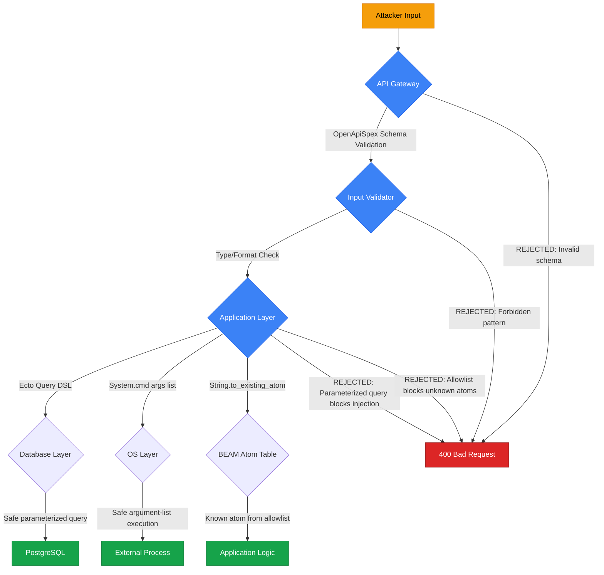
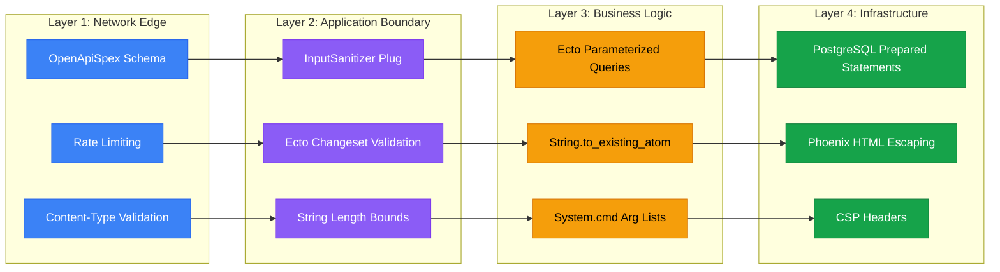

+++
title = "Injection"
description = "Injection is a critical vulnerability class where untrusted data is sent to an interpreter as part of a command or query, enabling unauthorized code execution, data exfiltration, or complete system compromise. The Prismatic Platform enforces comprehensive injection prevention through the SEAL doctrine pillar, parameterized queries, and multi-layer input validation."
weight = 50

[extra]
category = "security"
subcategory = "application-security"
tags = ["glossary", "injection", "security", "OWASP", "SQL-injection", "command-injection", "code-injection", "atom-injection", "BEAM", "SEAL", "input-validation", "parameterized-queries", "Ecto", "sanitization"]
related_terms = ["sql-injection", "xss", "owasp", "input-validation", "authentication", "authorization", "encryption", "penetration-testing", "threat-modeling", "code-review", "static-analysis", "ecto", "parameterized-query", "content-security-policy"]
difficulty = "intermediate"
importance = "critical"
technology_type = "security-pattern"
platform_component = "SEAL doctrine enforcement"
date_created = "2026-02-23"
date_modified = "2026-04-08"
version = "3.0.0"
platforms = ["prismatic", "elixir", "postgresql", "phoenix"]
domain = "application-security"
audience = ["developers", "security-engineers", "architects", "penetration-testers"]
prerequisite_concepts = ["web-application-fundamentals", "sql-basics", "elixir-ecto-basics", "owasp-top-10", "http-request-lifecycle"]
use_cases = ["SQL injection prevention in Ecto queries", "Command injection prevention in system calls", "Atom table exhaustion prevention in BEAM/OTP", "API boundary input validation", "OSINT adapter input sanitization", "Template injection prevention in Phoenix"]
benefits = ["Complete elimination of SQL injection through parameterized queries", "BEAM-specific atom injection prevention via SEAL enforcement", "Automated detection through pre-commit hooks and CI gates", "Defense-in-depth with multi-layer validation architecture", "Compliance with OWASP Top 10 and CWE-89/CWE-78/CWE-94"]
implementation_patterns = ["Ecto parameterized queries", "String.to_existing_atom/1 allowlists", "OpenApiSpex schema validation", "Phoenix automatic HTML escaping", "Tesla URL-safe query encoding", "Input length bounding", "Fragment parameterization"]
quality_metrics = ["zero-sql-injection-vectors", "zero-atom-injection-vectors", "seal-pre-commit-blocking", "credo-custom-check-coverage"]
integration_points = ["prismatic_web API gateway", "prismatic_api REST endpoints", "prismatic_osint_sources adapter inputs", "prismatic_dd entity queries", "prismatic_auth session handling"]
related_disciplines = ["application-security", "penetration-testing", "secure-coding", "threat-modeling", "static-analysis", "OWASP-compliance"]
learning_outcomes = ["Identify the four major injection vector categories relevant to Elixir/Phoenix", "Implement parameterized Ecto queries that eliminate SQL injection", "Apply SEAL doctrine patterns to prevent atom table exhaustion", "Design multi-layer input validation at API boundaries", "Recognize and remediate injection anti-patterns in BEAM applications"]
quality_score = 92
word_count = 3800
cross_references = 18
section_count = 10
has_code_examples = true
has_diagrams = true
review_status = "comprehensive"
status = "active"
author = "Tomas Korcak (korczis)"
reading_time = "19 min"
technical_level = "intermediate-to-advanced"
domain_category = "application-security"
implementation_status = "production"
authority_level = "L3-strategic"
code_examples = true
version_introduced = "0.1.0"
stability_level = "stable"
keywords = ["injection", "security", "OWASP", "SQL injection", "command injection", "code injection", "atom injection", "BEAM", "SEAL", "parameterized queries", "Ecto", "Phoenix", "input validation", "glossary", "Prismatic Platform"]
see_also = ["capabilities", "architecture", "agents"]
image = "/images/sections/glossary.png"
image_alt = "Injection - Prismatic Platform"
+++

## Definition

Injection is a class of security vulnerabilities where an attacker supplies untrusted data that is interpreted as part of a command or query by an interpreter. Rather than being treated as inert data, the malicious input alters the semantic structure of the target language -- whether SQL, OS shell commands, programming language expressions, or even the BEAM virtual machine's atom table. Injection consistently ranks among the most dangerous vulnerability classes in the [OWASP](@/glossary/owasp.md) Top 10 and is catalogued under multiple Common Weakness Enumeration (CWE) entries including CWE-89 (SQL Injection), CWE-78 (OS Command Injection), CWE-94 (Code Injection), and CWE-917 (Expression Language Injection).

The fundamental root cause of all injection vulnerabilities is the same: mixing code and data in a single channel without structural separation. When an application constructs commands by concatenating user input without proper parameterization or sanitization, attackers can break out of the data context and inject arbitrary commands into the interpreter.

---

## Overview

Injection attacks have been responsible for some of the largest data breaches in computing history, exposing hundreds of millions of records from organizations including government agencies, financial institutions, and technology companies. SQL injection alone accounts for a significant portion of all reported web application vulnerabilities. The 2017 Equifax breach, which exposed 147 million records, was traced to a single injection vulnerability in the Apache Struts framework.

In [OSINT](@/glossary/osint.md) and intelligence platforms like Prismatic, injection vulnerabilities carry amplified risk because they can compromise the integrity of intelligence data, expose sensitive investigation details, reveal surveillance targets, or grant attackers access to the platform's reconnaissance capabilities. A single SQL injection in a [due diligence](@/glossary/due-diligence.md) query could expose the entire entity graph of an active investigation.

The Prismatic Platform addresses injection through the **SEAL (Security Enforcement Absolute Lock)** doctrine pillar -- one of the 18 mandatory enforcement pillars that govern all platform development. SEAL enforcement operates at three levels: pre-commit hooks that block known injection patterns, CI/CD pipeline validation through `mix check.doctrines`, and runtime defense through [Ecto](@/glossary/ecto.md) parameterized queries, Phoenix template escaping, and API boundary validation.

The defense philosophy follows a defense-in-depth model: no single layer is trusted to catch every attack. Multiple overlapping controls ensure that even if one layer fails, subsequent layers prevent exploitation.

---

## Technical Deep Dive

### SQL Injection

SQL injection occurs when user-controlled input is interpolated directly into SQL query strings, allowing the attacker to alter the query's structure. The classic example involves authentication bypass:

```sql
-- Intended query structure
SELECT * FROM users WHERE email = 'user@example.com' AND password_hash = 'abc123'

-- Attacker supplies email: ' OR '1'='1' --
-- Resulting query:
SELECT * FROM users WHERE email = '' OR '1'='1' --' AND password_hash = 'abc123'
-- The OR '1'='1' always evaluates to true, bypassing authentication
-- The -- comments out the remaining password check
```

Beyond authentication bypass, SQL injection enables data exfiltration via UNION-based attacks, blind inference through boolean or time-based techniques, and in severe cases, operating system command execution through database-specific features like `xp_cmdshell` (SQL Server) or `COPY TO PROGRAM` ([PostgreSQL](@/glossary/postgresql.md)).

**Second-order SQL injection** is particularly insidious: the malicious payload is first stored safely in the database, then later retrieved and concatenated into a new query without parameterization. This makes it harder to detect because the injection point and the exploitation point are separated in time and code location.

### Command Injection (OS Injection)

Command injection occurs when user input is passed to operating system shell commands without proper escaping. In Elixir, this risk arises with `System.cmd/3`, `:os.cmd/1`, or `Port.open/2` when arguments contain user-controlled data:

```elixir
# VULNERABLE - shell metacharacters can escape the intended command
System.cmd("whois", [user_input])
# If user_input contains "; rm -rf /" the shell will execute both commands

# The risk is amplified with :os.cmd which runs through the shell directly
:os.cmd(~c"nslookup #{domain}")
# Attacker supplies: example.com; cat /etc/passwd
```

The Prismatic Platform's [OSINT toolbox](@/glossary/osint.md) faces this risk because many intelligence-gathering operations involve external tool execution. Every OSINT adapter that calls external processes must use the argument-list form of `System.cmd/3` (which bypasses shell interpretation) and validate inputs against allowlists of acceptable characters.

### Code Injection

Code injection occurs when an application dynamically evaluates code constructed from user input. In the BEAM ecosystem, the primary vectors are:

- **`Code.eval_string/3`** -- Evaluates arbitrary Elixir code at runtime
- **`:erlang.binary_to_term/1`** -- Deserializes Erlang terms, which can include function references and atoms
- **`Code.compile_string/2`** -- Compiles and loads arbitrary Elixir code

These functions are powerful development tools but become critical vulnerabilities when their inputs include any user-controlled data. The SEAL doctrine absolutely prohibits their use with untrusted input.

### Atom Injection (BEAM-Specific)

Atom injection is a vulnerability class unique to the BEAM virtual machine (Erlang/Elixir runtime). The BEAM stores atoms in a fixed-size table that is never garbage collected. The default atom table limit is 1,048,576 atoms. Once exhausted, the entire BEAM node crashes with a `system_limit` error, taking down all applications running on that node.

The attack vector is straightforward: if an application calls `String.to_atom/1` on user-controlled input, an attacker can send millions of unique strings to exhaust the atom table. This is a denial-of-service attack that requires no authentication and cannot be recovered from without restarting the BEAM node.

```elixir
# CRITICAL VULNERABILITY - atom table exhaustion
# Each unique string creates a permanent atom
def handle_request(%{"action" => action_string}) do
  action = String.to_atom(action_string)  # BANNED by SEAL
  apply(__MODULE__, action, [])
end
# Attacker sends: action=aaaa, action=aaab, action=aaac, ...
# After ~1M unique values, the BEAM node crashes permanently
```

This vulnerability is particularly dangerous in the Prismatic Platform because the 94-app umbrella runs on a shared BEAM node -- an atom table exhaustion in any single application would crash the entire platform.

### Expression Language / Template Injection

Server-side template injection (SSTI) occurs when user input is embedded into template engines that support code execution. While Phoenix's [HEEx](/glossary/heex/) templates are compiled at build time and do not evaluate runtime expressions from user input, the risk exists in any system that constructs templates dynamically.

Phoenix's automatic HTML escaping prevents most [XSS](@/glossary/xss.md) (client-side injection) by default, but developers must remain vigilant when using `raw/1` or `Phoenix.HTML.raw/1` which explicitly bypasses escaping.

---

## Injection Attack Flow

The following diagram illustrates how injection attacks traverse the application layers and where defensive controls intercept them:



**Layer 1 -- API Gateway**: OpenApiSpex validates request structure, types, and formats before any business logic executes. Requests with unexpected parameters or types are rejected immediately.

**Layer 2 -- Input Validator**: Application-level validation checks parameter lengths, character allowlists, and pattern-based detection of common injection signatures.

**Layer 3 -- Application Layer**: Ecto's query DSL enforces parameterized queries. `String.to_existing_atom/1` restricts atom creation to compile-time known values. `System.cmd/3` with argument lists bypasses shell interpretation.

**Layer 4 -- Database/OS Layer**: Even if all application-layer defenses fail, PostgreSQL's prepared statement protocol structurally prevents SQL injection by transmitting query structure and data values through separate channels.

---

## Usage in Prismatic Platform

### SEAL Doctrine Enforcement

The SEAL (Security Enforcement Absolute Lock) doctrine pillar enforces injection prevention at every stage of the development lifecycle:

**Pre-commit blocking** (runs on every `git commit`):
- Scans staged files for `String.to_atom(` in lib/ code -- blocks commit
- Scans for hardcoded secret patterns (API keys, tokens) -- blocks commit
- Scans for `fragment("...#{` string interpolation in Ecto fragments -- blocks commit

**CI pipeline validation** (runs on every push):
- `mix check.doctrines` validates all 17 enforceable pillars including SEAL
- Credo custom checks flag raw SQL construction patterns
- Static analysis detects `Code.eval_string/3` usage with non-literal arguments

**Runtime defense**:
- [Ecto](@/glossary/ecto.md) parameterized queries are the only sanctioned database interaction method
- Phoenix template engine automatically escapes all output by default
- API gateway validates all incoming parameters against [OpenApiSpex](@/glossary/api.md) schemas

### Multi-Layer Input Validation Architecture

The Prismatic Platform implements defense-in-depth through four distinct validation layers:

```elixir
defmodule PrismaticWeb.Plugs.InputSanitizer do
  @moduledoc """
  Plug that validates and sanitizes incoming request parameters
  to prevent injection attacks at the API boundary.

  This plug operates as Layer 2 in the platform's four-layer
  injection defense architecture, after OpenApiSpex schema
  validation (Layer 1) and before Ecto parameterized queries
  (Layer 3) and PostgreSQL prepared statements (Layer 4).
  """

  import Plug.Conn
  require Logger

  @max_param_length 10_000
  @forbidden_patterns [
    ~r/;\s*(DROP|DELETE|UPDATE|INSERT|ALTER|EXEC)/i,
    ~r/<script[\s>]/i,
    ~r/\$\{.*\}/
  ]

  @spec init(keyword()) :: keyword()
  def init(opts), do: opts

  @spec call(Plug.Conn.t(), keyword()) :: Plug.Conn.t()
  def call(conn, _opts) do
    case validate_params(conn.params) do
      :ok ->
        conn

      {:error, reason} ->
        Logger.warning("Input validation rejected request",
          reason: reason,
          path: conn.request_path,
          remote_ip: conn.remote_ip |> :inet.ntoa() |> to_string()
        )

        conn
        |> put_status(400)
        |> Phoenix.Controller.json(%{error: "Invalid input", detail: reason})
        |> halt()
    end
  end

  @spec validate_params(map()) :: :ok | {:error, String.t()}
  defp validate_params(params) when is_map(params) do
    Enum.reduce_while(params, :ok, fn {_key, value}, :ok ->
      case validate_value(value) do
        :ok -> {:cont, :ok}
        error -> {:halt, error}
      end
    end)
  end

  @spec validate_value(any()) :: :ok | {:error, String.t()}
  defp validate_value(value) when is_binary(value) do
    cond do
      String.length(value) > @max_param_length ->
        {:error, "Parameter exceeds maximum length"}

      Enum.any?(@forbidden_patterns, &Regex.match?(&1, value)) ->
        {:error, "Potentially malicious input detected"}

      true ->
        :ok
    end
  end

  defp validate_value(value) when is_map(value), do: validate_params(value)

  defp validate_value(value) when is_list(value) do
    Enum.reduce_while(value, :ok, fn item, :ok ->
      case validate_value(item) do
        :ok -> {:cont, :ok}
        error -> {:halt, error}
      end
    end)
  end

  defp validate_value(_value), do: :ok
end
```

### OSINT Adapter Input Handling

The [OSINT toolbox](@/glossary/osint.md) presents a unique injection challenge because its 157 adapters accept user-provided search queries that are forwarded to external APIs. Each adapter must sanitize inputs at the boundary and use structured HTTP clients:

```elixir
defmodule PrismaticOsintSources.Adapters.CzechAres do
  @moduledoc """
  Czech ARES business registry adapter with injection-safe
  query construction using Tesla's structured URL encoding.
  """

  @spec search(String.t(), keyword()) :: {:ok, list()} | {:error, term()}
  def search(query, opts \\ []) when is_binary(query) do
    # Input validation at adapter boundary
    sanitized_query = sanitize_ico(query)

    # Tesla handles URL encoding - no string concatenation
    Tesla.get(client(), "/ares/rest/ekonomicke-subjekty/#{sanitized_query}",
      query: [
        czlestyp: Keyword.get(opts, :type, "ico")
      ]
    )
  end

  defp sanitize_ico(input) do
    input
    |> String.replace(~r/[^0-9]/, "")
    |> String.slice(0, 8)
  end
end
```

---

## Code Examples

### BANNED Patterns vs SAFE Patterns

The following examples demonstrate the specific patterns that the SEAL doctrine blocks, alongside their safe alternatives:

#### SQL Injection Prevention

```elixir
# ====================================
# BANNED: String interpolation in Ecto fragments
# SEAL pre-commit hook BLOCKS this pattern
# ====================================
def search_entities_unsafe(user_input) do
  # NEVER DO THIS - SQL injection via fragment interpolation
  from(e in Entity,
    where: fragment("name ILIKE '#{user_input}'"),
    limit: 100
  )
end

# ====================================
# SAFE: Parameterized Ecto fragment
# ====================================
@spec search_entities(String.t()) :: Ecto.Query.t()
def search_entities(user_input) when is_binary(user_input) do
  sanitized = sanitize_like_input(user_input)

  from(e in Entity,
    where: fragment("name ILIKE ?", ^"%#{sanitized}%"),
    limit: 100,
    select: [:id, :name, :entity_type]
  )
end

@spec sanitize_like_input(String.t()) :: String.t()
defp sanitize_like_input(term) do
  term
  |> String.replace("\\", "\\\\")
  |> String.replace("%", "\\%")
  |> String.replace("_", "\\_")
  |> String.slice(0, 200)
end
```

#### Atom Injection Prevention

```elixir
# ====================================
# BANNED: String.to_atom/1 with user input
# SEAL + ZERO pre-commit hooks BLOCK this pattern
# Causes atom table exhaustion (BEAM node crash)
# ====================================
def handle_action_unsafe(%{"action" => action_string}) do
  action = String.to_atom(action_string)  # BANNED
  apply(__MODULE__, action, [])
end

# ====================================
# SAFE: String.to_existing_atom/1 with rescue
# Only converts to atoms that already exist at compile time
# ====================================
@allowed_actions ~w(search filter export view)a

@spec handle_action(map()) :: {:ok, term()} | {:error, :invalid_action}
def handle_action(%{"action" => action_string}) when is_binary(action_string) do
  case safe_to_action(action_string) do
    {:ok, action} when action in @allowed_actions ->
      apply(__MODULE__, action, [])

    _ ->
      {:error, :invalid_action}
  end
end

@spec safe_to_action(String.t()) :: {:ok, atom()} | :error
defp safe_to_action(string) do
  {:ok, String.to_existing_atom(string)}
rescue
  ArgumentError -> :error
end
```

#### Command Injection Prevention

```elixir
# ====================================
# BANNED: Shell string interpolation
# ====================================
def whois_unsafe(domain) do
  # NEVER DO THIS - command injection via shell metacharacters
  :os.cmd(~c"whois #{domain}")
end

# ====================================
# SAFE: Argument-list form bypasses shell interpretation
# ====================================
@domain_pattern ~r/\A[a-zA-Z0-9][a-zA-Z0-9\-\.]{0,252}[a-zA-Z0-9]\z/

@spec whois_safe(String.t()) :: {:ok, String.t()} | {:error, :invalid_domain}
def whois_safe(domain) when is_binary(domain) do
  if Regex.match?(@domain_pattern, domain) do
    case System.cmd("whois", [domain], stderr_to_stdout: true) do
      {output, 0} -> {:ok, output}
      {error, _} -> {:error, {:whois_failed, error}}
    end
  else
    {:error, :invalid_domain}
  end
end
```

#### Unsafe Deserialization Prevention

```elixir
# ====================================
# BANNED: Unguarded binary_to_term
# Can create atoms, execute functions, load modules
# ====================================
def decode_unsafe(binary_data) do
  :erlang.binary_to_term(binary_data)  # BANNED
end

# ====================================
# SAFE: binary_to_term with :safe option
# Prevents creation of new atoms and function references
# ====================================
@spec decode_safe(binary()) :: {:ok, term()} | {:error, :unsafe_term}
def decode_safe(binary_data) when is_binary(binary_data) do
  {:ok, :erlang.binary_to_term(binary_data, [:safe])}
rescue
  ArgumentError -> {:error, :unsafe_term}
end
```

#### Code Evaluation Prevention

```elixir
# ====================================
# BANNED: Code.eval_string with any user input
# Enables arbitrary code execution on the server
# ====================================
def evaluate_unsafe(user_expression) do
  {result, _bindings} = Code.eval_string(user_expression)  # BANNED
  result
end

# ====================================
# SAFE: Allowlisted operations with structured input
# ====================================
@allowed_operations %{
  "sum" => &Enum.sum/1,
  "count" => &length/1,
  "average" => fn list -> Enum.sum(list) / max(length(list), 1) end
}

@spec evaluate_safe(String.t(), list(number())) ::
        {:ok, number()} | {:error, :unknown_operation}
def evaluate_safe(operation, data)
    when is_binary(operation) and is_list(data) do
  case Map.fetch(@allowed_operations, operation) do
    {:ok, func} -> {:ok, func.(data)}
    :error -> {:error, :unknown_operation}
  end
end
```

---

## Best Practices

### 1. Use Parameterized Queries Exclusively

Never construct SQL through string concatenation or interpolation. Ecto's query DSL and `fragment/1` with `?` placeholders structurally prevent SQL injection by transmitting query structure and parameter values through separate protocol channels.

### 2. Validate at System Boundaries

Input validation belongs at the edges of the system -- API controllers, LiveView event handlers, and adapter entry points. Internal function calls between trusted modules do not need redundant validation. Use [OpenApiSpex](@/glossary/api.md) schemas for API endpoints and Ecto changesets for form submissions.

### 3. Prefer Allowlists Over Denylists

Denylist-based validation (blocking known-bad patterns) is inherently incomplete because attackers constantly discover new bypass techniques. Allowlist-based validation (permitting only known-good patterns) is structurally secure because unknown input is rejected by default.

### 4. Never Use String.to_atom/1 with External Input

In the BEAM ecosystem, atom table exhaustion is a denial-of-service vulnerability that crashes the entire node. Always use `String.to_existing_atom/1` wrapped in a rescue block, or maintain an explicit allowlist of permitted atom values.

### 5. Use Argument Lists for System Commands

When calling `System.cmd/3`, always pass arguments as a list rather than constructing a shell command string. The list form sends arguments directly to the executable without shell interpretation, preventing command injection through metacharacters like `;`, `|`, `&&`, and backticks.

### 6. Apply the :safe Option to binary_to_term

Erlang term deserialization with `:erlang.binary_to_term/1` can create new atoms, construct function references, and instantiate arbitrary data structures. Always use `:erlang.binary_to_term(data, [:safe])` to restrict deserialization to existing atoms and safe term types.

### 7. Never Use Code.eval_string with User Input

Dynamic code evaluation functions (`Code.eval_string/3`, `Code.compile_string/2`) must never receive user-controlled input. Use structured alternatives like operation allowlists, pattern matching on known values, or purpose-built DSLs.

### 8. Escape Output in All Contexts

Phoenix templates automatically escape HTML output, but be cautious with `raw/1`, JavaScript contexts, URL parameters, and CSS values. Each output context has its own escaping requirements. Use Content Security Policy headers as an additional defense layer.

### 9. Log and Monitor Injection Attempts

Rejected requests should be logged with sufficient context (request path, sanitized parameter values, rejection reason) to enable the [Blue Team](@/glossary/blue-team.md) to detect active attack campaigns. The platform's Error Intelligence pipeline aggregates these signals for pattern analysis.

### 10. Test Injection Resistance

Include injection test cases in your test suite. The [Red Team](@/glossary/red-team.md) models injection attack scenarios during security exercises. Property-based testing with StreamData can generate random injection payloads to validate sanitization logic.

---

## Common Mistakes

| Mistake | Risk Level | Description | Remediation |
|---------|-----------|-------------|-------------|
| `fragment("col = '#{val}'"` | **Critical** | SQL injection via Ecto fragment string interpolation | Use `fragment("col = ?", ^val)` |
| `String.to_atom(input)` | **Critical** | Atom table exhaustion crashes the entire BEAM node | Use `String.to_existing_atom/1` with rescue |
| `:os.cmd(~c"cmd #{arg}")` | **Critical** | OS command injection through shell metacharacters | Use `System.cmd("cmd", [arg])` argument list |
| `Code.eval_string(user_input)` | **Critical** | Arbitrary code execution on the server | Use allowlisted operations map |
| `:erlang.binary_to_term(data)` | **High** | Atom creation, function references in deserialized data | Add `[:safe]` option |
| `raw(user_content)` in HEEx | **High** | Bypasses Phoenix automatic HTML escaping, enables XSS | Remove `raw/1`, let Phoenix escape |
| `Repo.query!("SELECT... #{x}")` | **Critical** | Raw SQL with string interpolation bypasses Ecto safety | Use Ecto query DSL or `Repo.query!` with `$1` params |
| Missing Content-Type validation | **Medium** | Allows submission of unexpected content types | Validate Content-Type in plug pipeline |
| Regex-only SQL sanitization | **Medium** | Regex denylists are bypassable with encoding tricks | Use parameterized queries instead of regex |
| User input in redirect URLs | **Medium** | Open redirect enables phishing via trusted domain | Validate redirect targets against allowlist |
| Unbounded string parameters | **Low** | Memory exhaustion through extremely large inputs | Enforce `@max_param_length` limits |
| Logging raw injection payloads | **Low** | Log injection can corrupt log analysis pipelines | Sanitize values before logging |

---

## Defense Layer Architecture

The following diagram shows how the platform's four defense layers map to specific technologies and enforcement mechanisms:



---

## Related Terms

- [OWASP](@/glossary/owasp.md) -- Security standards body maintaining the Top 10 vulnerability list that consistently ranks injection as a critical risk
- [XSS (Cross-Site Scripting)](@/glossary/xss.md) -- Client-side injection variant where malicious scripts execute in the victim's browser
- [Input Validation](/glossary/input-validation/) -- First line of defense against injection, enforcing data format and type constraints at system boundaries
- [Authentication](@/glossary/authentication.md) -- Identity verification that injection attacks frequently attempt to bypass
- [Authorization](@/glossary/authorization.md) -- Access control that injection attacks escalate past when authentication is compromised
- [Ecto](@/glossary/ecto.md) -- Elixir database library providing parameterized queries as the primary SQL injection defense
- [PostgreSQL](@/glossary/postgresql.md) -- Database engine supporting prepared statements that structurally prevent SQL injection
- [Penetration Testing](@/glossary/penetration-testing.md) -- Authorized security testing that specifically targets injection vulnerabilities
- [Threat Modeling](/glossary/threat-modeling/) -- Systematic identification of injection attack surfaces during application design
- [Content Security Policy](/glossary/content-security-policy/) -- HTTP header that mitigates the impact of successful injection by restricting browser behavior
- [Static Analysis](@/glossary/static-analysis.md) -- Automated code scanning (Credo) that detects injection-prone patterns before deployment
- [Red Team](@/glossary/red-team.md) -- Offensive security team that models injection attack scenarios against platform defenses
- [Blue Team](@/glossary/blue-team.md) -- Defensive security team that monitors for injection attempt patterns in request logs
- [API](@/glossary/api.md) -- REST API gateway where OpenApiSpex schema validation provides the first injection defense layer

---

## See Also

- **SEAL Doctrine Pillar** -- The platform's security enforcement standard that mandates injection prevention patterns
- **ZERO Doctrine Pillar** -- Runtime safety enforcement that blocks `String.to_atom/1` and unsafe `binary_to_term`
- **CWE-89** -- Common Weakness Enumeration entry for SQL Injection
- **CWE-78** -- Common Weakness Enumeration entry for OS Command Injection
- **CWE-94** -- Common Weakness Enumeration entry for Code Injection
- **OWASP Testing Guide v4** -- Comprehensive methodology for testing injection vulnerabilities
- **Ecto Security Guide** -- Official documentation on parameterized query safety guarantees

---

## Connect & Contribute

**Created by [Tomas Korcak (korczis)](https://github.com/korczis)** | Open Source under [GHL](https://github.com/korczis/prismatic-platform/blob/main/LICENSE)

- [GitHub](https://github.com/korczis/prismatic-platform) | [GitLab](https://gitlab.com/korczis/prismatic-platform) | [LinkedIn](https://linkedin.com/in/korczis) | [Contact](mailto:korczis@gmail.com)
- [Developer Portal](@/developers/_index.md) | [Architecture](@/architecture/_index.md) | [Meet the Creator](@/about/author.md)
