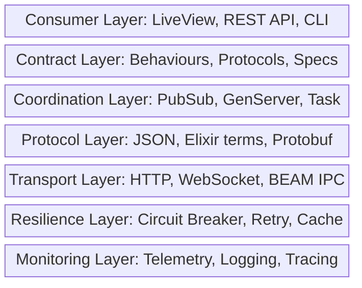

+++
title = "Integration"
weight = 50
[extra]
description = "The process of connecting separate software systems, services, or components to function as a coordinated whole, encompassing API communication, event-driven messaging, and internal module coordination"
category = "architecture"
subcategory = "system_design"
difficulty = "beginner"
technology_type = "architectural_pattern"
platform_component = "core_architecture"
paradigm = "system_interconnection"
prerequisite_concepts = ["api_design", "message_passing", "error_handling", "distributed_systems"]
use_cases = ["osint_api_consumption", "umbrella_app_coordination", "dd_pipeline_orchestration", "external_registry_access", "real_time_ui_updates"]
benefits = ["system_composability", "reusability", "separation_of_concerns", "incremental_capability"]
implementation_patterns = ["adapter_pattern", "facade_pattern", "circuit_breaker", "event_driven", "self_registration"]
quality_metrics = ["integration_latency", "error_rate", "availability", "coupling_score"]
integration_points = ["tesla", "phoenix_pubsub", "behaviours", "protocols", "ets_registry", "telemetry"]
related_disciplines = ["enterprise_integration", "distributed_computing", "api_design", "event_driven_architecture"]
related_terms = ["api", "integration-test", "microservices", "adapter-pattern", "behaviour", "protocol", "pubsub", "telemetry", "circuit-breaker", "message-passing", "pipeline", "genserver", "supervision-tree", "bounded-context", "gateway", "endpoint"]
complexity_level = "beginner"
platform_integration = "core"
author = "Tomas Korcak (korczis)"
reading_time = "15 min"
date_created = "2026-02-23"
date_modified = "2026-04-08"
keywords = ["integration", "system integration", "API integration", "architecture", "glossary", "Prismatic Platform", "enterprise integration patterns", "adapter pattern", "circuit breaker", "event-driven"]
tags = ["glossary", "architecture", "integration", "system-design"]
quality_score = 92
word_count = 3800
see_also = ["capabilities", "architecture", "agents"]
image = "/images/sections/glossary.png"
image_alt = "Integration - Prismatic Platform"
+++

## Definition

Integration in software engineering refers to the process of connecting separate systems, services, or components so they can exchange data and coordinate behavior as a unified whole. It encompasses everything from simple function calls between modules to complex distributed system orchestration across network boundaries. Integration is both a design challenge (how to define clean interfaces) and an operational challenge (how to handle failures, latency, and data format mismatches in production).

Modern platforms rarely operate in isolation. They consume external [APIs](@/glossary/api.md), publish events to message brokers, synchronize data with third-party systems, and coordinate workflows across service boundaries. The quality of these integration points largely determines the reliability, performance, and maintainability of the overall system. Poorly designed integrations create brittle coupling, cascading failures, and debugging nightmares. Well-designed integrations enable systems to compose capabilities from independent components, each evolving at its own pace.

## Overview

The field of system integration has evolved through several paradigms, each addressing different scale and complexity requirements:

| Era | Pattern | Example | Trade-off |
|-----|---------|---------|-----------|
| **1970s-80s** | File transfer | EDI batch files | Simple but high latency |
| **1990s** | Shared database | Multiple apps reading same tables | Easy but tight coupling |
| **2000s** | RPC / SOAP | XML web services | Typed but verbose |
| **2010s** | REST APIs | [JSON](@/glossary/json.md) over HTTP | Simple but synchronous |
| **2010s** | Message queues | RabbitMQ, Kafka | Decoupled but complex |
| **2020s** | Event-driven | Phoenix [PubSub](@/glossary/pubsub.md), EventBridge | Reactive but eventually consistent |
| **BEAM** | Process messaging | GenServer calls/casts | Zero-overhead but single-node |

The Prismatic Platform is fundamentally an integration platform. Its 94+ umbrella applications communicate through well-defined [Elixir](@/glossary/elixir.md) [behaviours](@/glossary/behaviour.md) and [protocols](@/glossary/protocol.md). The 157 OSINT tools integrate with external intelligence APIs. The DD [pipeline](@/glossary/pipeline.md) integrates with Czech government registries. The Perimeter module integrates with security scanning infrastructure. Each integration point follows consistent patterns for error handling, retry logic, [telemetry](@/glossary/telemetry.md), and testing.

### Integration vs. Coupling

A critical distinction in integration design is between integration (systems can communicate) and coupling (systems depend on each other's internals). The goal is high integration with low coupling:

| Aspect | Tight Coupling | Loose Coupling |
|--------|---------------|----------------|
| **Contract** | Shared internal types | Public behaviour/protocol |
| **Communication** | Direct function call | Message passing / events |
| **Failure handling** | Cascading crashes | Circuit breaker / fallback |
| **Deployment** | Deploy together | Deploy independently |
| **Schema evolution** | Breaking changes propagate | Additive changes only |
| **Testing** | Requires all dependencies | [Mock](@/glossary/mock.md) at boundaries |

The Prismatic Platform achieves loose coupling through the [adapter pattern](@/glossary/adapter-pattern.md): each external system is accessed through a module that implements a common behaviour. Business logic depends on the behaviour, not the implementation. Swapping providers, adding fallbacks, or [mocking](@/glossary/mock.md) for testing requires only configuration changes.

## Technical Deep Dive

### Integration Pattern Taxonomy

Integration patterns fall into several categories from the "Enterprise Integration Patterns" canon (Hohpe & Woolf, 2003), each with distinct trade-offs:

#### 1. Synchronous Request-Response

The caller sends a request and blocks (or awaits) until the response arrives. This is the simplest integration model and dominates HTTP-based integrations.

```elixir
# Synchronous integration via HTTP (Tesla client)
defmodule PrismaticOsintCore.Integration.SyncHttp do
  @moduledoc """
  Synchronous HTTP integration with standard middleware stack.
  """

  @spec get(String.t(), keyword()) :: {:ok, map()} | {:error, term()}
  def get(url, opts \\ []) do
    client()
    |> Tesla.get(url, opts)
    |> handle_response()
  end

  defp client do
    Tesla.client([
      {Tesla.Middleware.BaseUrl, Application.get_env(:prismatic_osint_core, :api_base_url)},
      {Tesla.Middleware.Headers, [{"accept", "application/json"}]},
      {Tesla.Middleware.JSON, engine: Jason},
      {Tesla.Middleware.Retry, delay: 500, max_retries: 3},
      {Tesla.Middleware.Timeout, timeout: 15_000},
      {Tesla.Middleware.Logger, log_level: :debug}
    ])
  end

  defp handle_response({:ok, %Tesla.Env{status: status, body: body}})
       when status in 200..299 do
    {:ok, body}
  end

  defp handle_response({:ok, %Tesla.Env{status: 429}}) do
    {:error, :rate_limited}
  end

  defp handle_response({:ok, %Tesla.Env{status: status}}) do
    {:error, {:http_error, status}}
  end

  defp handle_response({:error, reason}) do
    {:error, {:connection_error, reason}}
  end
end
```

**Trade-offs**: Immediate feedback, simple error handling. But creates temporal coupling -- if the callee is slow or down, the caller blocks or fails.

#### 2. Asynchronous Event-Driven

The producer publishes events without knowing (or caring) who consumes them. Consumers subscribe to event streams and process independently.

```elixir
# Event-driven integration via Phoenix PubSub
defmodule PrismaticDd.Pipeline.EventPublisher do
  @moduledoc """
  Publishes DD pipeline events for async consumption by
  UI, analytics, and audit subsystems.
  """

  @topic "dd:pipeline"

  @spec publish_entity_discovered(map()) :: :ok
  def publish_entity_discovered(entity) do
    Phoenix.PubSub.broadcast(
      Prismatic.PubSub,
      @topic,
      {:entity_discovered, entity, DateTime.utc_now()}
    )
  end

  @spec publish_pipeline_stage_complete(atom(), map()) :: :ok
  def publish_pipeline_stage_complete(stage, metadata) do
    Phoenix.PubSub.broadcast(
      Prismatic.PubSub,
      @topic,
      {:stage_complete, stage, metadata}
    )
  end
end

# Consumer: LiveView subscribes for real-time UI updates
defmodule PrismaticWeb.DdPipelineLive do
  use PrismaticWeb, :live_view

  @impl true
  def mount(_params, _session, socket) do
    if connected?(socket) do
      Phoenix.PubSub.subscribe(Prismatic.PubSub, "dd:pipeline")
    end

    {:ok, assign(socket, events: [])}
  end

  @impl true
  def handle_info({:entity_discovered, entity, timestamp}, socket) do
    event = %{type: :entity, data: entity, at: timestamp}
    {:noreply, update(socket, :events, &[event | Enum.take(&1, 99)])}
  end

  @impl true
  def handle_info({:stage_complete, stage, metadata}, socket) do
    event = %{type: :stage, data: %{stage: stage, meta: metadata}, at: DateTime.utc_now()}
    {:noreply, update(socket, :events, &[event | Enum.take(&1, 99)])}
  end
end
```

**Trade-offs**: Full decoupling, natural scalability. But eventual consistency, harder debugging, and no immediate feedback for request-reply patterns.

#### 3. BEAM-Native Process Integration

The [BEAM](@/glossary/beam.md)'s lightweight processes enable a unique integration model: separate components run as independent [GenServers](@/glossary/genserver.md) within the same VM, communicating via message passing with zero serialization overhead.

```elixir
# BEAM-native integration: GenServer-to-GenServer
defmodule PrismaticAgents.AgentCoordinator do
  @moduledoc """
  Coordinates agent execution across multiple subsystems
  using BEAM-native process messaging.
  """
  use GenServer

  @spec execute_mission(pid(), map()) :: {:ok, map()} | {:error, term()}
  def execute_mission(coordinator, mission) do
    GenServer.call(coordinator, {:execute, mission}, 30_000)
  end

  @impl true
  def handle_call({:execute, mission}, _from, state) do
    # Coordinate across subsystems via direct process messaging
    with {:ok, intel} <- PrismaticOsintCore.gather_intelligence(mission.target),
         {:ok, analysis} <- PrismaticNabla.analyze_confidence(intel),
         {:ok, report} <- PrismaticDd.generate_report(mission.target, analysis) do
      {:reply, {:ok, report}, state}
    else
      {:error, reason} -> {:reply, {:error, reason}, state}
    end
  end
end
```

**Trade-offs**: Zero serialization overhead, compile-time type safety, natural supervision. But limited to same-node (unless using [distribution](@/glossary/distribution.md)).

### Circuit Breaker Pattern

Circuit breakers prevent cascading failures when external integrations become unavailable. When an external API starts returning errors, the circuit breaker opens after a configurable threshold, short-circuiting subsequent calls and allowing the external system to recover.

```elixir
defmodule PrismaticOsintCore.Integration.CircuitBreaker do
  @moduledoc """
  Circuit breaker for external API integration.

  States:
  - :closed  - Normal operation, requests pass through
  - :open    - Failures exceeded threshold, requests short-circuit
  - :half_open - Testing if service recovered
  """
  use GenServer

  require Logger

  @failure_threshold 5
  @reset_timeout_ms 30_000

  defstruct state: :closed, failure_count: 0, last_failure: nil

  @spec call(atom(), (-> term())) :: {:ok, term()} | {:error, :circuit_open} | {:error, term()}
  def call(breaker_name, fun) do
    GenServer.call(breaker_name, {:call, fun})
  end

  @impl true
  def handle_call({:call, fun}, _from, %{state: :open} = state) do
    if System.monotonic_time(:millisecond) - state.last_failure > @reset_timeout_ms do
      # Transition to half-open: try one request
      try_call(fun, %{state | state: :half_open})
    else
      {:reply, {:error, :circuit_open}, state}
    end
  end

  def handle_call({:call, fun}, _from, state) do
    try_call(fun, state)
  end

  defp try_call(fun, state) do
    case fun.() do
      {:ok, result} ->
        {:reply, {:ok, result}, %{state | state: :closed, failure_count: 0}}

      {:error, reason} ->
        new_count = state.failure_count + 1
        new_state = if new_count >= @failure_threshold do
          Logger.warning("Circuit breaker opened after #{new_count} failures")
          %{state | state: :open, failure_count: new_count, last_failure: System.monotonic_time(:millisecond)}
        else
          %{state | failure_count: new_count}
        end
        {:reply, {:error, reason}, new_state}
    end
  end
end
```

### Rate Limiting

External APIs impose rate limits that integrations must respect. The platform implements token bucket rate limiting per-source:

```elixir
defmodule PrismaticOsintCore.Integration.RateLimiter do
  @moduledoc """
  Token bucket rate limiter for external API integrations.
  Uses ETS for lock-free concurrent access.
  """

  @spec check_rate(atom(), pos_integer(), pos_integer()) :: :ok | {:error, :rate_limited}
  def check_rate(source, max_requests, window_seconds) do
    now = System.system_time(:second)
    window_start = now - window_seconds

    # Atomic check-and-increment in ETS
    case :ets.update_counter(:rate_limits, source, {2, 1}, {source, 0, now}) do
      count when count <= max_requests -> :ok
      _over_limit -> {:error, :rate_limited}
    end
  end
end
```

## Architecture in Prismatic Platform

### Layered Integration Architecture

The Prismatic Platform's integration architecture follows a layered approach:



### Self-Registration Pattern

The self-registering pattern exemplifies the platform's approach to zero-configuration internal integration:

```elixir
defmodule PrismaticOsintCore.Tool do
  @moduledoc """
  Behaviour and macro for self-registering OSINT tool integration.
  Tools register via metaprogramming, creating a zero-configuration
  integration point between adapter modules and the UI/API layers.
  """

  @callback search(map()) :: {:ok, map()} | {:error, term()}
  @callback run(map()) :: {:ok, map()} | {:error, term()}

  defmacro __using__(_opts) do
    quote do
      @behaviour PrismaticOsintCore.Tool
      import PrismaticOsintCore.Tool, only: [register_tool: 1]

      @before_compile PrismaticOsintCore.Tool
    end
  end

  defmacro register_tool(config) do
    quote do
      @tool_config unquote(config)
      @after_compile {PrismaticOsintCore.ToolRegistry, :register_from_compile}
    end
  end
end
```

This pattern is replicated across three subsystems:

| Registry | Domain | Items | Interface |
|----------|--------|-------|-----------|
| `ToolRegistry` | OSINT | 157 adapters | `all/0`, `get/1`, `by_category/1` |
| `TopicRegistry` | Academy | 4+ topics | `all/0`, `get/1`, `by_level/1` |
| `SourceRegistry` | DD | 10 sources | `all/0`, `get/1`, `by_group/1` |

Each registry provides the same interface, enabling uniform consumption by LiveView, REST API, and CLI consumers.

### Umbrella App Integration Boundaries

Each umbrella app exposes a public API through its top-level module (the facade pattern). Internal integrations between apps call these facade functions directly:

```elixir
# prismatic_osint_core exposes a clean facade
defmodule PrismaticOsintCore do
  @moduledoc "OSINT subsystem facade."

  defdelegate search(tool_slug, params), to: PrismaticOsintCore.Dispatcher
  defdelegate list_tools(), to: PrismaticOsintCore.ToolRegistry, as: :all
  defdelegate tool_health(slug), to: PrismaticOsintCore.HealthChecker
end

# prismatic_dd consumes it without knowing internals
defmodule PrismaticDd.IntelligenceGatherer do
  @moduledoc "Gathers intelligence for DD cases via OSINT integration."

  @spec gather_for_entity(String.t(), list(atom())) :: {:ok, list(map())} | {:error, term()}
  def gather_for_entity(entity_name, tool_slugs) do
    tool_slugs
    |> Task.async_stream(fn slug ->
      PrismaticOsintCore.search(slug, %{query: entity_name})
    end, max_concurrency: 5, timeout: 30_000)
    |> Enum.reduce({:ok, []}, fn
      {:ok, {:ok, results}}, {:ok, acc} -> {:ok, acc ++ results}
      {:ok, {:error, _}}, acc -> acc  # Skip failed tools
      {:exit, _reason}, acc -> acc     # Skip timed-out tools
    end)
  end
end
```

### External Integration Health Monitoring

The platform maintains a registry of all connected external services with health monitoring:

```elixir
defmodule PrismaticOsintCore.Integration.HealthMonitor do
  @moduledoc """
  Monitors health of all external integration endpoints.
  Publishes health status via telemetry and PubSub.
  """
  use GenServer

  @check_interval_ms 60_000

  @impl true
  def init(integrations) do
    schedule_check()
    {:ok, %{integrations: integrations, health: %{}}}
  end

  @impl true
  def handle_info(:check_health, state) do
    health_results =
      state.integrations
      |> Task.async_stream(&check_one/1, max_concurrency: 10, timeout: 10_000)
      |> Enum.into(%{}, fn
        {:ok, {name, status}} -> {name, status}
        {:exit, _} -> {:unknown, :timeout}
      end)

    :telemetry.execute(
      [:prismatic, :integration, :health_check],
      %{healthy: Enum.count(health_results, fn {_, s} -> s == :healthy end)},
      %{total: map_size(health_results)}
    )

    schedule_check()
    {:noreply, %{state | health: health_results}}
  end

  defp check_one({name, url}) do
    case Tesla.get(url, opts: [timeout: 5_000]) do
      {:ok, %{status: status}} when status in 200..299 -> {name, :healthy}
      _ -> {name, :unhealthy}
    end
  end

  defp schedule_check, do: Process.send_after(self(), :check_health, @check_interval_ms)
end
```

## Integration Testing Strategy

Integration tests verify that connected components work together correctly. The Prismatic Platform uses a tiered approach:

| Level | Scope | Speed | When |
|-------|-------|-------|------|
| **Contract test** | Behaviour spec compliance | Fast | Every commit |
| **Component integration** | Two apps via real calls | Medium | Every commit |
| **System integration** | Full pipeline end-to-end | Slow | Nightly / pre-deploy |
| **External integration** | Real third-party APIs | Very slow | Weekly / manual |

```elixir
# Component integration test: OSINT -> DD pipeline
defmodule PrismaticDd.IntelligenceGathererIntegrationTest do
  use ExUnit.Case
  @tag :integration

  test "gathers intelligence from multiple OSINT tools" do
    # Uses real OSINT tool registry + sandbox HTTP client
    assert {:ok, results} =
      PrismaticDd.IntelligenceGatherer.gather_for_entity(
        "Test Company",
        [:czech_ares, :czech_justice]
      )

    assert is_list(results)
  end
end
```

## Best Practices

### Design Principles

1. **Define contracts first**: Every integration boundary must have a [behaviour](@/glossary/behaviour.md) or [protocol](@/glossary/protocol.md) before implementation
2. **Fail fast, recover gracefully**: Use circuit breakers and fallbacks for external integrations
3. **Instrument everything**: Every integration call must emit [telemetry](@/glossary/telemetry.md) events
4. **Respect rate limits**: Token bucket or sliding window rate limiting for all external APIs
5. **Version contracts**: Additive changes only for published integration contracts

### Error Handling at Integration Boundaries

```elixir
# Standard error handling pattern for integration points
case external_call(params) do
  {:ok, result} ->
    {:ok, transform(result)}

  {:error, :rate_limited} ->
    # Backoff and retry with exponential delay
    {:retry, calculate_backoff(attempt)}

  {:error, :circuit_open} ->
    # Return cached data or graceful degradation
    {:ok, cached_or_default(params)}

  {:error, {:http_error, status}} when status in 500..599 ->
    # Server error: log, retry with backoff
    Logger.warning("Integration server error: #{status}")
    {:retry, calculate_backoff(attempt)}

  {:error, {:http_error, status}} when status in 400..499 ->
    # Client error: don't retry, fix the request
    {:error, {:client_error, status}}

  {:error, {:connection_error, reason}} ->
    # Network issue: retry with longer backoff
    {:retry, calculate_backoff(attempt) * 2}
end
```

### Anti-Patterns to Avoid

| Anti-Pattern | Problem | Solution |
|-------------|---------|----------|
| Shared database integration | Tight schema coupling | Use API/event integration |
| Synchronous cascade | Latency multiplication | Use async where possible |
| Missing circuit breaker | Cascading failures | Implement at every external boundary |
| No timeout | Blocked processes | Always set explicit timeouts |
| String-based integration | Runtime errors | Use typed behaviours |
| Fire-and-forget without logging | Silent failures | Always log + telemetry |

## Related Terms

- [API](@/glossary/api.md) -- primary external integration mechanism for the platform
- [Integration Test](@/glossary/integration-test.md) -- verifying that integrations work correctly
- [Adapter Pattern](@/glossary/adapter-pattern.md) -- encapsulating external integrations behind uniform interfaces
- [Behaviour](@/glossary/behaviour.md) -- Elixir contract system for defining integration boundaries
- [Protocol](@/glossary/protocol.md) -- Elixir polymorphic dispatch for data-driven integration
- [PubSub](@/glossary/pubsub.md) -- event-driven integration within the BEAM
- [Telemetry](@/glossary/telemetry.md) -- monitoring integration health and performance
- [GenServer](@/glossary/genserver.md) -- BEAM-native process integration pattern
- [Pipeline](@/glossary/pipeline.md) -- sequential processing integration (DD pipeline)
- [Message Passing](@/glossary/message-passing.md) -- BEAM's fundamental integration mechanism
- [Bounded Context](@/glossary/bounded-context.md) -- DDD pattern for defining integration boundaries
- [Gateway](@/glossary/gateway.md) -- entry point for external system integration
- [Endpoint](@/glossary/endpoint.md) -- specific API URLs that integration targets
- [Microservices](@/glossary/microservices.md) -- distributed architecture requiring extensive integration
- [Supervision Tree](@/glossary/supervision-tree.md) -- fault tolerance for integration processes
- [Circuit Breaker](@/glossary/circuit-breaker.md) -- resilience pattern for external integrations

## See Also

- [Architecture](@/architecture/_index.md) -- platform integration architecture overview
- [Capabilities](@/capabilities/_index.md) -- platform capabilities enabled by integration
- [OSINT Toolbox](/osint/toolbox/) -- 157 integrated intelligence tools
- [DD Pipeline](/hub/dd/pipeline/) -- integrated entity processing pipeline

---

## Connect & Contribute

**Created by [Tomas Korcak (korczis)](https://github.com/korczis)** | Open Source under [GHL](https://github.com/korczis/prismatic-platform/blob/main/LICENSE)

- [GitHub](https://github.com/korczis/prismatic-platform) | [GitLab](https://gitlab.com/korczis/prismatic-platform) | [LinkedIn](https://linkedin.com/in/korczis) | [Contact](mailto:korczis@gmail.com)
- [Developer Portal](@/developers/_index.md) | [Architecture](@/architecture/_index.md) | [Meet the Creator](@/about/author.md)
