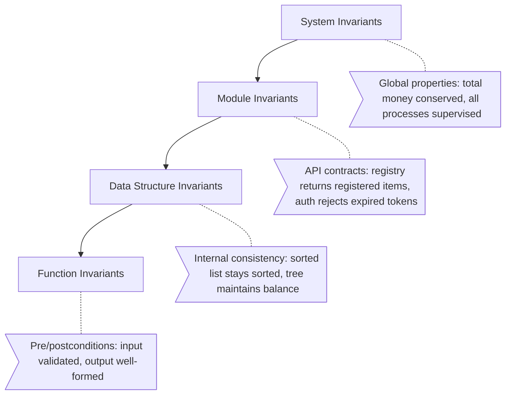
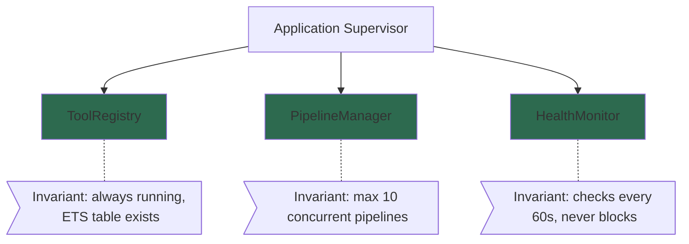

+++
title = "Invariant"
weight = 50
[extra]
description = "A property or condition that must always hold true throughout the execution of a program, regardless of the system's state transitions"
category = "testing"
subcategory = "correctness"
difficulty = "advanced"
technology_type = "verification_concept"
platform_component = "quality_enforcement"
paradigm = "formal_methods"
prerequisite_concepts = ["assertions", "state_machines", "type_systems", "testing"]
use_cases = ["data_integrity", "process_state_safety", "api_contract_verification", "security_enforcement", "financial_correctness"]
benefits = ["bug_prevention", "system_predictability", "regression_detection", "documentation_through_code", "confident_refactoring"]
implementation_patterns = ["property_testing", "state_assertions", "changeset_validation", "supervision_invariants", "type_specifications"]
quality_metrics = ["invariant_coverage", "violation_rate", "property_test_coverage", "assertion_density"]
integration_points = ["stream_data", "exunit", "dialyzer", "ecto_changeset", "genserver", "nabla"]
related_disciplines = ["formal_methods", "type_theory", "contract_programming", "property_based_testing"]
related_terms = ["property-based-testing", "formal-verification", "assertion", "contract", "type-spec", "changeset", "genserver", "supervision-tree", "pattern-matching", "behaviour", "dialyzer", "ecto", "mutation-testing"]
complexity_level = "advanced"
platform_integration = "core"
author = "Tomas Korcak (korczis)"
reading_time = "15 min"
date_created = "2026-02-23"
date_modified = "2026-04-08"
keywords = ["invariant", "property", "formal verification", "correctness", "testing", "glossary", "Prismatic Platform", "property-based testing", "StreamData", "state machine", "Dialyzer"]
tags = ["glossary", "testing", "invariant", "correctness", "formal-methods"]
quality_score = 92
word_count = 3800
see_also = ["capabilities", "architecture", "quality-floor"]
image = "/images/sections/glossary.png"
image_alt = "Invariant - Prismatic Platform"
+++

## Definition

An invariant is a property or condition that must remain true throughout the execution of a program, across all possible state transitions. Invariants define the fundamental correctness constraints of a system: a bank account balance must never go negative (unless overdraft is enabled), a sorted list must remain sorted after insertion, a [supervision tree](@/glossary/supervision-tree.md) must always have a running root supervisor. When an invariant is violated, it indicates a bug, and the system should fail loudly rather than continue in an inconsistent state.

Invariants are the strongest form of correctness specification: while a test verifies a specific scenario, an invariant must hold for all possible inputs, states, and execution paths. This universality makes invariants powerful but also demanding -- verifying them requires techniques beyond traditional example-based testing, including [property-based testing](@/glossary/property-based-testing.md), static type analysis ([Dialyzer](@/glossary/dialyzer.md)), and in critical cases, formal mathematical proofs.

## Overview

### Invariant Hierarchy

Invariants operate at multiple levels of abstraction:



| Level | Scope | Verification Method | Example |
|-------|-------|-------------------|---------|
| **System** | Entire platform | Integration tests, monitoring | All critical GenServers are supervised |
| **Module** | Public API contract | Property-based tests | Registry.get(key) returns what was put |
| **Data Structure** | Internal consistency | Unit tests, assertions | ETS size matches counter |
| **Function** | Pre/postconditions | Guards, pattern matching | Input is non-empty list, output is sorted |
| **Type** | Value constraints | Dialyzer, @spec | Quality score is 0.0..100.0 |

### Invariants vs Related Concepts

| Concept | Scope | When Checked | Example |
|---------|-------|-------------|---------|
| **Invariant** | Must ALWAYS hold | Every state transition | Balance >= 0 |
| **Precondition** | Must hold BEFORE call | At function entry | List is non-empty |
| **Postcondition** | Must hold AFTER call | At function exit | Result is sorted |
| **[Assertion](@/glossary/assertion.md)** | Must hold AT THIS POINT | Specific code location | count == expected |
| **Type spec** | Must hold FOR ALL VALUES | Compile-time (Dialyzer) | @spec f(integer()) :: string() |

### The "Let It Crash" Connection

[Elixir](@/glossary/elixir.md)'s "let it crash" philosophy is fundamentally about invariants. When a [GenServer](@/glossary/genserver.md) receives unexpected input that would violate its state invariants, the correct response is to crash (raising an exception) rather than attempting to handle the inconsistent state. The [supervision tree](@/glossary/supervision-tree.md) restarts the process with a known-good initial state, restoring invariants automatically.

```elixir
# Let it crash: pattern match enforces invariant
def handle_call({:withdraw, amount}, _from, %{balance: balance} = state)
    when amount > 0 and amount <= balance do
  # Invariant: balance >= 0 is guaranteed by the guard
  {:reply, :ok, %{state | balance: balance - amount}}
end

# Any call that doesn't match crashes the process
# Supervisor restarts with valid initial state
```

## Technical Deep Dive

### Property-Based Testing for Invariants

[Property-based testing](@/glossary/property-based-testing.md) is the most powerful tool for invariant verification because it explores the input space systematically. Rather than writing individual test cases, you describe the property that must always hold, and the testing framework generates inputs to try to falsify it. When it finds a failing case, it shrinks the input to the minimal reproduction.

```elixir
defmodule PrismaticDd.Invariants.EntityInvariantTest do
  @moduledoc """
  Property-based tests verifying DD entity invariants.
  """
  use ExUnit.Case, async: true
  use ExUnitProperties

  alias PrismaticDd.Schemas.EntityRecord

  # Invariant: Every entity has a non-empty name
  property "all entities have non-empty names" do
    check all name <- string(:alphanumeric, min_length: 1),
              type <- member_of(["person", "company", "organization"]),
              source <- string(:alphanumeric, min_length: 1) do
      entity = %EntityRecord{
        name: name,
        entity_type: type,
        source_slug: source
      }

      assert String.length(entity.name) > 0
      assert entity.entity_type in ["person", "company", "organization"]
    end
  end

  # Invariant: Content hash is deterministic (idempotent)
  property "same content always produces same hash" do
    check all attrs <- map_of(string(:alphanumeric), string(:alphanumeric)) do
      hash1 = EntityRecord.compute_content_hash(attrs)
      hash2 = EntityRecord.compute_content_hash(attrs)

      assert hash1 == hash2
      assert is_binary(hash1)
      assert byte_size(hash1) == 32
    end
  end

  # Invariant: Sorting is stable (round-trip)
  property "sorting entities by name is idempotent" do
    check all entities <- list_of(
      fixed_map(%{name: string(:alphanumeric, min_length: 1), score: float()})
    ) do
      sorted_once = Enum.sort_by(entities, & &1.name)
      sorted_twice = Enum.sort_by(sorted_once, & &1.name)

      assert sorted_once == sorted_twice
    end
  end
end
```

### Compile-Time Invariants with Dialyzer

[Dialyzer](@/glossary/dialyzer.md) enforces type-level invariants at [compile-time](@/glossary/compile-time.md):

```elixir
defmodule PrismaticSafety.QualityScore do
  @moduledoc """
  Type-enforced quality score with compile-time invariant checking.
  """

  @type t :: %__MODULE__{
    value: float(),
    domain: atom(),
    computed_at: DateTime.t()
  }

  @enforce_keys [:value, :domain, :computed_at]
  defstruct [:value, :domain, :computed_at]

  # Dialyzer catches calls where value is not 0.0..100.0
  @spec new(float(), atom()) :: t() | {:error, :invalid_score}
  def new(value, domain) when is_float(value) and value >= 0.0 and value <= 100.0 do
    %__MODULE__{
      value: value,
      domain: domain,
      computed_at: DateTime.utc_now()
    }
  end

  def new(_value, _domain), do: {:error, :invalid_score}
end
```

### Runtime Invariant Assertions in GenServer

```elixir
defmodule PrismaticOsintCore.ToolRegistry do
  @moduledoc """
  ETS-backed registry with enforced state invariants.
  State invariant: tool_count always matches ETS table size.
  """
  use GenServer

  require Logger

  @type state :: %{
    table: :ets.tid(),
    tool_count: non_neg_integer(),
    categories: MapSet.t(atom())
  }

  # State invariant check -- called after every state mutation
  @spec assert_state_invariant!(state()) :: state()
  defp assert_state_invariant!(state) do
    ets_size = :ets.info(state.table, :size)

    unless state.tool_count == ets_size do
      Logger.error("""
      ToolRegistry state invariant violated!
      Expected tool_count=#{state.tool_count}, but ETS has #{ets_size} entries.
      """)

      :telemetry.execute(
        [:prismatic, :invariant, :violation],
        %{expected: state.tool_count, actual: ets_size},
        %{module: __MODULE__, invariant: :tool_count_matches_ets}
      )

      raise "ToolRegistry state invariant violated: count mismatch"
    end

    state
  end

  @impl GenServer
  def handle_call({:register, tool_config}, _from, state) do
    true = :ets.insert(state.table, {tool_config.slug, tool_config})

    new_state =
      %{state |
        tool_count: state.tool_count + 1,
        categories: MapSet.put(state.categories, tool_config.category)
      }
      |> assert_state_invariant!()

    {:reply, :ok, new_state}
  end

  @impl GenServer
  def handle_call(:all, _from, state) do
    tools =
      state.table
      |> :ets.tab2list()
      |> Enum.map(&elem(&1, 1))

    # Verify invariant on read path too
    _verified = assert_state_invariant!(state)

    {:reply, {:ok, tools}, state}
  end
end
```

### Ecto Changeset Invariants

[Ecto](@/glossary/ecto.md) changesets enforce data invariants at the persistence boundary:

```elixir
defmodule PrismaticDd.Schemas.DdCase do
  use Ecto.Schema
  import Ecto.Changeset

  @moduledoc """
  DD Case schema with invariant enforcement via changesets.
  """

  schema "dd_cases" do
    field :name, :string
    field :status, Ecto.Enum, values: [:draft, :active, :completed, :archived]
    field :entity_count, :integer, default: 0
    field :confidence_score, :float

    timestamps()
  end

  @doc """
  Changeset with invariant validations.
  Invariant: name is non-empty, status transitions are valid,
  confidence is bounded [0, 1].
  """
  @spec changeset(t(), map()) :: Ecto.Changeset.t()
  def changeset(case_struct, attrs) do
    case_struct
    |> cast(attrs, [:name, :status, :entity_count, :confidence_score])
    |> validate_required([:name, :status])
    |> validate_length(:name, min: 1, max: 255)
    |> validate_number(:entity_count, greater_than_or_equal_to: 0)
    |> validate_number(:confidence_score, greater_than_or_equal_to: 0.0, less_than_or_equal_to: 1.0)
    |> validate_status_transition()
  end

  # Invariant: status can only move forward (draft→active→completed→archived)
  defp validate_status_transition(changeset) do
    case {get_field(changeset, :status), get_change(changeset, :status)} do
      {_, nil} -> changeset  # No status change
      {:draft, :active} -> changeset
      {:active, :completed} -> changeset
      {:completed, :archived} -> changeset
      {current, requested} ->
        add_error(changeset, :status,
          "invalid transition from #{current} to #{requested}")
    end
  end
end
```

### Supervision Tree Invariants



## Invariant Enforcement Architecture

The Prismatic Platform enforces invariants at four architectural layers:

| Layer | Mechanism | Example | Enforcement |
|-------|-----------|---------|-------------|
| **Data** | [Ecto](@/glossary/ecto.md) changesets | Required fields, format constraints | Database rejects invalid data |
| **Process** | GenServer state assertions | Count matches ETS size | Process crashes on violation |
| **System** | [Supervision tree](@/glossary/supervision-tree.md) + health checks | Critical processes running | Auto-restart on failure |
| **Epistemic** | NABLA axioms | Knowledge claims are evidence-backed | Trinity Gate validation |

Runtime invariant checks are strategically placed on state-modifying operations and periodically on read paths. The overhead is negligible (a single ETS info call) compared to the safety they provide. In production, invariant violations trigger immediate [telemetry](@/glossary/telemetry.md) alerts and are treated as P0 incidents under the NMND doctrine.

## Invariant Testing Patterns

### Stateful Property Testing

For complex systems with multiple state transitions, stateful property testing models the system as a state machine and verifies invariants across randomly generated sequences of operations:

```elixir
defmodule PrismaticDd.StatefulInvariantTest do
  @moduledoc """
  Stateful property test for DD case lifecycle.
  Generates random sequences of operations and verifies
  invariants hold after every step.
  """
  use ExUnit.Case
  use ExUnitProperties

  property "DD case invariants hold across all operation sequences" do
    check all operations <- list_of(
      one_of([
        {:create, string(:alphanumeric, min_length: 1)},
        {:add_entity, string(:alphanumeric, min_length: 1)},
        {:update_status, member_of([:draft, :active, :completed])},
        {:compute_score}
      ]),
      min_length: 1,
      max_length: 20
    ) do
      state = %{cases: %{}, entity_counts: %{}}

      final_state = Enum.reduce(operations, state, fn op, acc ->
        new_state = apply_operation(acc, op)

        # Invariant 1: entity counts are never negative
        assert Enum.all?(new_state.entity_counts, fn {_, count} -> count >= 0 end)

        # Invariant 2: completed cases have at least 1 entity
        Enum.each(new_state.cases, fn {id, case_data} ->
          if case_data.status == :completed do
            assert Map.get(new_state.entity_counts, id, 0) > 0,
              "Completed case #{id} has no entities"
          end
        end)

        new_state
      end)

      # Final invariant: total entities >= number of cases with entities
      cases_with_entities = Enum.count(final_state.entity_counts, fn {_, c} -> c > 0 end)
      total_entities = final_state.entity_counts |> Map.values() |> Enum.sum()
      assert total_entities >= cases_with_entities
    end
  end

  defp apply_operation(state, {:create, name}) do
    id = :erlang.unique_integer([:positive])
    put_in(state, [:cases, id], %{name: name, status: :draft})
  end

  defp apply_operation(state, {:add_entity, _name}) do
    case Map.keys(state.cases) do
      [] -> state
      ids ->
        id = Enum.random(ids)
        update_in(state, [:entity_counts, id], &((&1 || 0) + 1))
    end
  end

  defp apply_operation(state, {:update_status, new_status}) do
    case Map.keys(state.cases) do
      [] -> state
      ids ->
        id = Enum.random(ids)
        put_in(state, [:cases, id, :status], new_status)
    end
  end

  defp apply_operation(state, {:compute_score}), do: state
end
```

## Best Practices

1. **Make invariants explicit** -- document them in `@moduledoc` and enforce them in code, not just in comments
2. **Verify invariants on every state mutation** -- the cost is negligible compared to debugging corrupted state
3. **Use property-based testing** -- [StreamData](@/glossary/property-based-testing.md) generators find edge cases humans miss
4. **Crash on violation** -- never silently recover from an invariant violation; let the [supervisor](@/glossary/supervision-tree.md) restart with known-good state
5. **Layer enforcement** -- compile-time (Dialyzer) + test-time (property tests) + runtime (assertions)
6. **Monitor violations in production** -- emit [telemetry](@/glossary/telemetry.md) events on invariant checks for observability
7. **Start with the strongest invariants** -- focus on data corruption prevention before optimization invariants
8. **Test invariant violations** -- verify that your system correctly rejects invalid states

## Common Mistakes

| Mistake | Impact | Solution |
|---------|--------|----------|
| Logging instead of crashing on violation | Corrupted state propagates | Raise exception, let supervisor restart |
| Only checking invariants in tests | Production violations go undetected | Add runtime assertions on hot paths |
| Checking invariants only on writes | Read paths return inconsistent data | Periodic read-path verification |
| Overly broad invariants | Can't pinpoint what failed | Specific, named invariant checks |
| Missing invariants on state transitions | Invalid transitions allowed | Validate state machine transitions explicitly |
| Trusting external input to maintain invariants | Injection, corruption | Validate at system boundaries ([Ecto](@/glossary/ecto.md) changesets) |

## Related Terms

- [Property-Based Testing](@/glossary/property-based-testing.md) -- primary invariant verification technique using random generation
- [Assertion](@/glossary/assertion.md) -- runtime invariant checking at specific code points
- [Formal Verification](@/glossary/formal-verification.md) -- mathematical proof that invariants hold
- [Dialyzer](@/glossary/dialyzer.md) -- compile-time type invariant checker
- [Ecto](@/glossary/ecto.md) -- database layer enforcing data invariants via changesets
- [GenServer](@/glossary/genserver.md) -- OTP pattern where state invariants protect process integrity
- [Supervision Tree](@/glossary/supervision-tree.md) -- fault tolerance restoring invariants after crashes
- [Pattern Matching](@/glossary/pattern-matching.md) -- Elixir feature that enforces structural invariants
- [Behaviour](@/glossary/behaviour.md) -- callback specifications as module-level invariants
- [Type Spec](/glossary/type-spec/) -- type-level invariants checked by Dialyzer
- [Changeset](/glossary/changeset/) -- Ecto data validation enforcing persistence invariants
- [Mutation Testing](@/glossary/mutation-testing.md) -- verifying that tests catch invariant violations
- [Contract](@/glossary/contract.md) -- interface-level invariant specifications

## See Also

- [Architecture](@/architecture/_index.md) -- platform invariant enforcement architecture
- [Capabilities](@/capabilities/_index.md) -- quality verification capabilities
- [Quality Gates](/quality/) -- quality enforcement through invariant checking

---

## Connect & Contribute

**Created by [Tomas Korcak (korczis)](https://github.com/korczis)** | Open Source under [GHL](https://github.com/korczis/prismatic-platform/blob/main/LICENSE)

- [GitHub](https://github.com/korczis/prismatic-platform) | [GitLab](https://gitlab.com/korczis/prismatic-platform) | [LinkedIn](https://linkedin.com/in/korczis) | [Contact](mailto:korczis@gmail.com)
- [Developer Portal](@/developers/_index.md) | [Architecture](@/architecture/_index.md) | [Meet the Creator](@/about/author.md)
