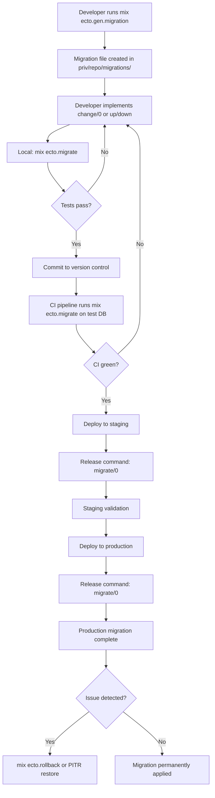

+++
title = "Schema Migration"
weight = 50
[extra]
description = "Version-controlled database schema evolution using Ecto migrations for reproducible, reversible structural changes across umbrella applications"
category = "database"
subcategory = "database_operations"
related_terms = ["ecto", "postgresql", "deployment", "rollback", "point-in-time-recovery", "genserver", "otp", "supervision-tree", "runtime", "semver", "process", "ci-cd", "release", "telemetry", "mix-task"]
complexity_level = "intermediate"
platform_integration = "core"
author = "Tomas Korcak (korczis)"
reading_time = "12 min"
date_created = "2026-02-23"
date_modified = "2026-04-08"
keywords = ["schema migration", "database", "Ecto", "DDL", "version control", "evolution", "glossary", "Prismatic Platform", "umbrella", "concurrent index", "data migration", "release command"]
tags = ["glossary", "database", "ecto", "infrastructure", "deployment", "postgresql"]
quality_score = 92
see_also = ["capabilities", "architecture", "deployment"]
image = "/images/sections/glossary.png"
image_alt = "Schema Migration - Prismatic Platform"
+++

## Definition

A **schema migration** is a version-controlled, timestamped transformation of a database schema that modifies its structure -- adding tables, altering columns, creating indexes, or changing constraints. Migrations are sequential scripts that capture the evolution of the database schema alongside application code. This ensures that every structural database change is reproducible, reversible, and synchronized with the code that depends on it.

In the Elixir ecosystem, **Ecto** provides the migration framework. Each migration is an Elixir module with `up/0` and `down/0` (or the preferred `change/0`) callbacks that define forward and reverse transformations. Migrations are identified by UTC timestamps embedded in the filename (e.g., `20260408110000_create_dd_decision_envelopes.exs`) and executed in chronological order. The `schema_migrations` table in the target database tracks which migrations have been applied, preventing re-execution and enabling incremental deployment.

Schema migrations are a fundamental building block of any production Elixir/Phoenix application. They bridge the gap between application code evolution and database structure, ensuring that both advance in lockstep through version control, CI/CD pipelines, and release automation.

## Overview

### Why Migrations Matter

Databases are stateful. Unlike application code, which can be recompiled and redeployed from source at any time, a database accumulates data over months and years. Migrations provide the mechanism to evolve the database structure without losing or corrupting that accumulated data. They serve several critical purposes:

- **Reproducibility** -- Any developer or CI server can recreate the exact database structure by running all migrations from scratch.
- **Reversibility** -- Most migrations can be rolled back, enabling safe experimentation and recovery from mistakes.
- **Collaboration** -- Multiple developers can create independent migrations without conflict, since timestamp-based naming makes collisions effectively impossible.
- **Auditability** -- The migration history serves as a changelog of every structural database decision, reviewable via version control.
- **Automation** -- Migrations integrate with deployment pipelines, running automatically as part of releases.

### Migration Types

Migrations fall into several categories based on what they change:

| Type | Description | Examples | Reversibility |
|------|-------------|----------|---------------|
| **Structural** | Create or drop tables and columns | `create table`, `alter table`, `drop table` | Fully reversible with `change/0` |
| **Index** | Add or remove indexes for query performance | `create index`, `create unique_index` | Fully reversible |
| **Constraint** | Add or modify database constraints | `create constraint`, foreign keys, check constraints | Reversible with explicit `up/down` |
| **Data** | Transform existing data in-place | `UPDATE` statements, backfills, data normalization | Requires explicit `up/down` |
| **Extension** | Enable PostgreSQL extensions | `execute "CREATE EXTENSION ..."` | Requires explicit `up/down` |

### Ecto Migration Framework

Ecto provides a DSL (Domain-Specific Language) that maps Elixir function calls to SQL DDL (Data Definition Language) statements. The framework handles:

- **Timestamp ordering** -- Migrations run in filename order, ensuring dependencies are satisfied.
- **Idempotent tracking** -- The `schema_migrations` table prevents double-execution.
- **Transaction wrapping** -- Each migration runs inside a database transaction by default (can be disabled for operations like concurrent index creation).
- **Reversibility inference** -- The `change/0` callback allows Ecto to automatically derive the reverse operation for most DDL statements.

## Technical Deep Dive

### Migration Lifecycle

The lifecycle of a migration from creation to production execution follows a well-defined path:



### Table Locking and Concurrent Operations

PostgreSQL acquires locks during DDL operations. Understanding lock behavior is critical for zero-downtime deployments:

**Operations that acquire ACCESS EXCLUSIVE locks** (block all reads and writes):
- `ALTER TABLE ... ADD COLUMN ... DEFAULT value` (PostgreSQL < 11)
- `ALTER TABLE ... ALTER COLUMN ... SET NOT NULL`
- `ALTER TABLE ... DROP COLUMN`
- `CREATE INDEX` (non-concurrent)

**Operations that are safe for concurrent access**:
- `ALTER TABLE ... ADD COLUMN` (nullable, no default) -- acquires only ACCESS EXCLUSIVE briefly
- `CREATE INDEX CONCURRENTLY` -- allows reads and writes during index build
- `ALTER TABLE ... ADD COLUMN ... DEFAULT value` (PostgreSQL >= 11) -- fast, no rewrite

For production databases with high traffic, always prefer operations that minimize lock duration. The Prismatic Platform enforces this through migration safety checks.

### Concurrent Index Creation

Creating indexes on large tables can lock the table for minutes or hours. PostgreSQL provides `CREATE INDEX CONCURRENTLY` to avoid this, but it cannot run inside a transaction. Ecto supports this via `@disable_ddl_transaction` and `@disable_migration_lock`:

```elixir
defmodule Prismatic.Repo.Migrations.AddSearchIndexToEntities do
  use Ecto.Migration

  # Required for CREATE INDEX CONCURRENTLY
  @disable_ddl_transaction true
  @disable_migration_lock true

  def change do
    create index(:dd_entities, [:name, :entity_type],
      concurrently: true,
      name: :dd_entities_name_type_search_idx
    )
  end
end
```

Key considerations for concurrent indexes:

- The migration must disable DDL transactions (`@disable_ddl_transaction true`).
- The migration lock must also be disabled (`@disable_migration_lock true`).
- If the index build fails (e.g., due to a uniqueness violation), PostgreSQL leaves behind an **invalid index** that must be dropped manually before retrying.
- Concurrent index creation takes longer than regular index creation because it performs two table scans instead of one.

### Data Migrations

Data migrations transform existing data rather than changing table structure. They are inherently more dangerous because they modify live data and cannot always be reversed. Best practices include:

1. **Batch processing** -- Never update millions of rows in a single statement. Use batched updates to avoid long-running transactions and excessive WAL generation.
2. **Explicit up/down** -- Data migrations cannot use `change/0` because Ecto cannot infer the reverse of an `UPDATE` statement.
3. **flush() before data operations** -- Call `flush()` after structural changes to ensure DDL is committed before DML runs.
4. **Idempotency** -- Write data migrations so they can be safely re-run (use `WHERE column IS NULL` guards).

```elixir
defmodule Prismatic.Repo.Migrations.BackfillEntityRiskScores do
  use Ecto.Migration

  import Ecto.Query

  @batch_size 1000

  def up do
    # Backfill in batches to avoid long transactions
    backfill_batch(0)
  end

  def down do
    # Reset backfilled values
    execute("""
    UPDATE dd_entities
    SET risk_score = NULL
    WHERE risk_score IS NOT NULL
      AND risk_score_source = 'backfill'
    """)
  end

  defp backfill_batch(offset) do
    result = repo().query!("""
    UPDATE dd_entities
    SET risk_score = 0.5,
        risk_score_source = 'backfill'
    WHERE id IN (
      SELECT id FROM dd_entities
      WHERE risk_score IS NULL
      ORDER BY id
      LIMIT #{@batch_size}
      OFFSET #{offset}
    )
    """)

    if result.num_rows > 0 do
      backfill_batch(offset + @batch_size)
    end
  end
end
```

### Migration Locking in Multi-Node Deployments

When multiple application nodes start simultaneously (common in Kubernetes or fly.io deployments), they may all attempt to run pending migrations at once. Ecto prevents this through **advisory locks** -- the first node to acquire the lock runs migrations while other nodes wait.

The `schema_migrations` table uses a database-level advisory lock keyed on the Ecto repository module name. This ensures:

- Only one node runs migrations at a time.
- Other nodes block until migrations complete, then proceed with startup.
- If the migrating node crashes mid-migration, the advisory lock is released and another node can retry.

## Usage in Prismatic Platform

### Umbrella Application Structure

The Prismatic Platform is an Elixir umbrella application with 90+ child apps. Database migrations live in apps that own their respective Ecto repositories. The primary migration directory is:

| App | Repo | Migration Path | Tables |
|-----|------|---------------|--------|
| `prismatic` | `Prismatic.Repo` | `apps/prismatic/priv/repo/migrations/` | Core tables (users, investigations, agents, OSINT, crawlers, DD, etc.) |

Each umbrella app that needs database access defines its own Ecto.Repo and maintains its own migration timeline. The deployment pipeline runs migrations for all repositories in dependency order.

### DD (Due Diligence) Tables

The Decision Infrastructure is one of the most actively evolving domains. Recent migrations include:

```
20260218000001_create_dd_entities_and_relationships.exs
20260328140000_create_dd_dataroom_tables.exs
20260329100000_create_dd_decision_engine_tables.exs
20260402100000_add_decision_core_extensions.exs
20260408100000_create_decision_core_tables.exs
20260408110000_create_dd_decision_envelopes.exs
20260408110001_create_dd_reconciliation_reports.exs
```

These migrations build the complete DD pipeline: entity storage, dataroom management, decision engine tables, sealed decision envelopes with audit trails, and reconciliation reports for outcome tracking.

### Production Deployment with release_command

In production (fly.io), migrations run via the Elixir release command mechanism. The release module provides a `migrate/0` function that runs all pending migrations without starting the full application:

```elixir
defmodule Prismatic.Release do
  @moduledoc """
  Production release tasks including database migrations.
  Called via release_command in fly.toml before the app starts.
  """

  @app :prismatic

  @doc """
  Run all pending migrations for all repositories.

  ## Examples

      iex> Prismatic.Release.migrate()
      :ok
  """
  @spec migrate() :: :ok
  def migrate do
    load_app()

    for repo <- repos() do
      {:ok, _, _} = Ecto.Migrator.with_repo(
        repo,
        &Ecto.Migrator.run(&1, :up, all: true)
      )
    end

    :ok
  end

  @doc """
  Rollback the last migration for a given repository.
  """
  @spec rollback(module(), integer()) :: :ok
  def rollback(repo, version) do
    load_app()

    {:ok, _, _} = Ecto.Migrator.with_repo(
      repo,
      &Ecto.Migrator.run(&1, :down, to: version)
    )

    :ok
  end

  defp repos do
    Application.fetch_env!(@app, :ecto_repos)
  end

  defp load_app do
    Application.ensure_all_started(:ssl)
    Application.load(@app)
  end
end
```

In `fly.toml`, this is configured as:

```toml
[deploy]
  release_command = "/app/bin/prismatic eval 'Prismatic.Release.migrate()'"
```

This ensures migrations run **before** the application starts serving traffic, preventing errors from code that expects new tables or columns to exist.

### CLI Commands

Migrations are managed through standard Mix tasks during development:

```elixir
# Generate a new migration
# mix ecto.gen.migration create_dd_relationships

# Run pending migrations
# mix ecto.migrate

# Rollback last migration
# mix ecto.rollback

# Rollback to a specific version
# mix ecto.rollback --to 20260408100000

# Check migration status
# mix ecto.migrations

# Production release migration
Prismatic.Release.migrate()
```

## Code Examples

### Creating a Table

The most common migration type creates a new table with typed columns, constraints, and indexes:

```elixir
defmodule Prismatic.Repo.Migrations.CreateDdDecisionEnvelopes do
  @moduledoc """
  Creates dd_decision_envelopes table for persisting sealed
  decision envelopes with full audit trail and uncertainty metadata.
  """

  use Ecto.Migration

  def change do
    create table(:dd_decision_envelopes, primary_key: false) do
      add :id, :binary_id, primary_key: true

      add :case_id,
          references(:dd_decision_cases, type: :binary_id, on_delete: :restrict),
          null: false

      add :trace_id, :string, null: false
      add :subject_id, :string, null: false
      add :subject_type, :string, null: false
      add :verdict, :string, null: false
      add :risk_score, :float, null: false
      add :confidence, :float, null: false
      add :risk_level, :string, null: false
      add :reasons, :jsonb, default: "[]"
      add :counter_evidence, :jsonb, default: "[]"
      add :evidence_refs, {:array, :binary_id}, default: []
      add :uncertainty, :jsonb, default: "{}"
      add :hypotheses, :jsonb, default: "[]"
      add :explanation, :jsonb
      add :policy_version, :string, null: false
      add :pipeline_telemetry, :jsonb, default: "{}"

      timestamps(type: :utc_datetime_usec)
    end

    create index(:dd_decision_envelopes, [:case_id])
    create unique_index(:dd_decision_envelopes, [:trace_id])
    create index(:dd_decision_envelopes, [:verdict])
    create index(:dd_decision_envelopes, [:inserted_at])
  end
end
```

Key patterns demonstrated:
- **UUID primary keys** (`primary_key: false` + `add :id, :binary_id`) for distributed systems.
- **Foreign key with `:restrict`** prevents orphaned envelopes if a case is deleted.
- **JSONB columns** for flexible nested data (reasons, evidence, telemetry).
- **Unique index on trace_id** enforces one envelope per trace.
- **`timestamps(type: :utc_datetime_usec)`** for microsecond-precision audit trails.

### Altering a Table

Adding columns to an existing table, with a data backfill:

```elixir
defmodule Prismatic.Repo.Migrations.AddSecurityRatingToEntities do
  use Ecto.Migration

  def up do
    alter table(:dd_entities) do
      add :security_rating, :map
      add :last_screened_at, :utc_datetime_usec
    end

    create index(:dd_entities, [:last_screened_at])

    # Ensure DDL is committed before running DML
    flush()

    # Data migration: backfill security ratings
    execute("""
    UPDATE dd_entities
    SET security_rating = '{"grade": "unrated", "score": null}'::jsonb
    WHERE security_rating IS NULL
    """)
  end

  def down do
    drop index(:dd_entities, [:last_screened_at])

    alter table(:dd_entities) do
      remove :security_rating
      remove :last_screened_at
    end
  end
end
```

### Creating a Concurrent Index

Safe index creation for high-traffic production tables:

```elixir
defmodule Prismatic.Repo.Migrations.AddPerformanceIndexes do
  use Ecto.Migration

  @disable_ddl_transaction true
  @disable_migration_lock true

  def change do
    # GIN index for JSONB full-text search on metadata
    create index(:dd_entities, [:attributes],
      concurrently: true,
      using: :gin,
      name: :dd_entities_attributes_gin_idx
    )

    # Composite index for common query pattern
    create index(:dd_entities, [:entity_type, :source, :inserted_at],
      concurrently: true,
      name: :dd_entities_type_source_date_idx
    )
  end
end
```

### Enabling a PostgreSQL Extension

```elixir
defmodule Prismatic.Repo.Migrations.EnableTimescaleDB do
  use Ecto.Migration

  def up do
    execute("CREATE EXTENSION IF NOT EXISTS timescaledb")
  end

  def down do
    execute("DROP EXTENSION IF EXISTS timescaledb")
  end
end
```

## Best Practices

### Write Reversible Migrations

Always prefer `change/0` over separate `up/0` and `down/0` when possible. Ecto can automatically reverse most DDL operations in `change/0`:

- `create table` reverses to `drop table`
- `add :column` reverses to `remove :column`
- `create index` reverses to `drop index`
- `rename table` reverses to `rename table` (original name)

Use explicit `up/0` and `down/0` only when:
- The migration includes data transformations (`UPDATE`, `INSERT`, `DELETE`).
- The migration uses raw SQL via `execute/1`.
- The reverse operation is not the obvious inverse (e.g., splitting a column into two).

### Backwards-Compatible Deployments

In a rolling deployment, old code and new code run simultaneously. Migrations must not break the old code still running on other nodes:

1. **Add columns as nullable** -- Never add a `NOT NULL` column without a default in the same deployment that uses it. Old code does not know about the column and cannot supply a value.
2. **Two-phase column removal** -- Phase 1: Deploy code that stops reading/writing the column. Phase 2: Deploy the migration that drops the column.
3. **Two-phase column rename** -- Phase 1: Add the new column, copy data, update code to use new column. Phase 2: Drop the old column.
4. **Index creation is safe** -- Adding indexes does not affect existing code behavior, only performance.

### Migration Safety Enforcement

The Prismatic Platform includes automated migration safety validation:

```elixir
defmodule PrismaticQuality.MigrationSafety do
  @moduledoc """
  Validates migration safety rules to prevent dangerous
  operations on production databases.
  """

  @dangerous_patterns [
    {~r/remove\s+:/, :column_removal,
     "Column removal requires two-phase deployment"},
    {~r/drop\s+table/, :table_drop,
     "Table drops require explicit approval"},
    {~r/modify\s+:.*null:\s*false/, :null_constraint,
     "Adding NOT NULL requires default value"},
    {~r/rename\s+table/, :table_rename,
     "Table renames require migration coordination"}
  ]

  @spec check(String.t()) :: {:ok, []} | {:error, [map()]}
  def check(migration_file) do
    content = File.read!(migration_file)

    warnings =
      @dangerous_patterns
      |> Enum.filter(fn {pattern, _, _} ->
        Regex.match?(pattern, content)
      end)
      |> Enum.map(fn {_, type, message} ->
        %{type: type, message: message, file: migration_file}
      end)

    case warnings do
      [] -> {:ok, []}
      warnings -> {:error, warnings}
    end
  end
end
```

### Keep Migrations Small and Focused

Each migration should do one logical thing. Avoid combining unrelated schema changes in a single migration file. Small migrations are:

- Easier to review in code review.
- Easier to roll back if something goes wrong.
- Less likely to cause long-running locks.
- Clearer in the migration history.

### Never Edit Committed Migrations

Once a migration has been committed to version control and run by any environment (including another developer's local database), it must never be modified. If a migration needs to be corrected, create a new migration that fixes the issue. Editing an already-applied migration creates a divergence between the `schema_migrations` tracking table and the actual database state.

## Common Mistakes

### Mistake 1: Forgetting flush() Before Data Operations

When a migration adds a column and then tries to update it, the column may not exist yet because Ecto batches DDL operations:

```elixir
# WRONG -- column may not exist when UPDATE runs
def up do
  alter table(:users) do
    add :role, :string
  end

  execute("UPDATE users SET role = 'member'")
end

# CORRECT -- flush() ensures DDL is committed first
def up do
  alter table(:users) do
    add :role, :string
  end

  flush()

  execute("UPDATE users SET role = 'member'")
end
```

### Mistake 2: Non-Concurrent Index on Large Tables

Creating a regular index on a table with millions of rows locks the table for the duration of the index build:

```elixir
# WRONG -- locks table, potentially for minutes
create index(:events, [:timestamp])

# CORRECT -- allows concurrent reads and writes
# (requires @disable_ddl_transaction true)
create index(:events, [:timestamp], concurrently: true)
```

### Mistake 3: Adding NOT NULL Without a Default

Adding a `NOT NULL` constraint to a column on a table with existing rows fails if those rows have `NULL` for the new column:

```elixir
# WRONG -- fails if table has existing rows
alter table(:users) do
  add :email_verified, :boolean, null: false
end

# CORRECT -- provide a default for existing rows
alter table(:users) do
  add :email_verified, :boolean, null: false, default: false
end
```

### Mistake 4: Using Repo or Schema Modules in Migrations

Migrations should use raw SQL or Ecto.Migration DSL, never application Repo or Schema modules. Schema modules change over time, but migrations are frozen snapshots. A schema module that adds a new required field will break old migrations that do not supply it:

```elixir
# WRONG -- Schema may change in the future, breaking this migration
alias Prismatic.Accounts.User
Repo.update_all(User, set: [role: "member"])

# CORRECT -- Use raw SQL, which is frozen in time
execute("UPDATE users SET role = 'member'")
```

### Mistake 5: Irreversible change/0

Some operations cannot be reversed automatically by Ecto. Using them inside `change/0` causes rollback failures:

```elixir
# WRONG -- execute/1 inside change/0 cannot be reversed
def change do
  execute("CREATE EXTENSION IF NOT EXISTS pg_trgm")
end

# CORRECT -- use up/down for non-reversible operations
def up do
  execute("CREATE EXTENSION IF NOT EXISTS pg_trgm")
end

def down do
  execute("DROP EXTENSION IF EXISTS pg_trgm")
end
```

## Related Terms

- [Ecto](@/glossary/ecto.md) -- The database wrapper and query generator that provides the migration framework
- [PostgreSQL](@/glossary/postgresql.md) -- The relational database system targeted by Prismatic migrations
- [Deployment](@/glossary/deployment.md) -- The process that triggers migration execution via release commands
- [Rollback](@/glossary/rollback.md) -- Reversing a migration to restore previous database state
- [Point-in-Time Recovery](@/glossary/point-in-time-recovery.md) -- WAL-based restore protecting against migration failures
- [GenServer](@/glossary/genserver.md) -- OTP pattern used by Ecto's migration runner process
- [OTP](@/glossary/otp.md) -- The framework providing supervision and process management for migration execution
- [Supervision Tree](@/glossary/supervision-tree.md) -- Hierarchical process structure that manages Ecto repository connections
- [Runtime](@/glossary/runtime.md) -- The execution phase where migrations run during deployment startup
- [Semver](@/glossary/semver.md) -- Versioning standard coordinated with migration releases
- [Process](@/glossary/process.md) -- BEAM process that executes each migration module
- [CI/CD](@/glossary/ci-cd.md) -- Pipeline that validates migrations in test environments before production
- [Release](@/glossary/release.md) -- Elixir release packaging that includes migration commands
- [Telemetry](@/glossary/telemetry.md) -- Observability events emitted during migration execution
- [Mix Task](@/glossary/mix-task.md) -- CLI interface for generating, running, and rolling back migrations

---

**Created by [Tomas Korcak (korczis)](https://github.com/korczis)** | [GitHub](https://github.com/korczis/prismatic-platform)
