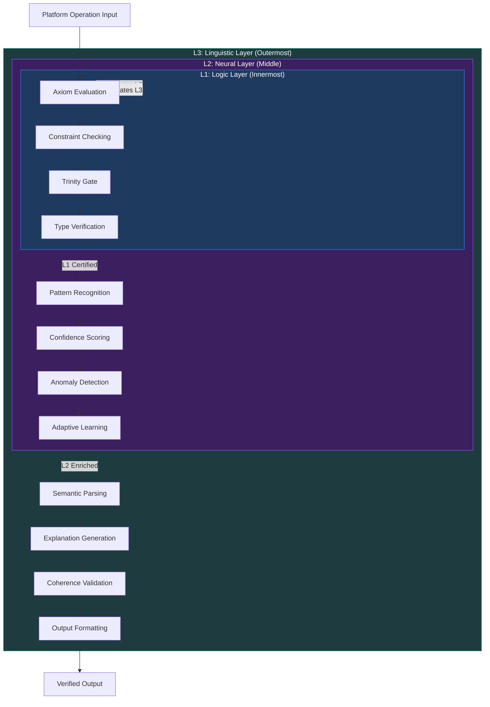

+++
title = "3NL Framework"
weight = 36
date = 2026-02-14
[extra]
description = "Three Nested Loops: a hierarchical architecture framework that bridges epistemic axioms to agent operations across three simultaneous processing layers -- Logic (L1), Neural (L2), and Linguistic (L3) -- enabling cross-layer validation and emergent platform intelligence"
category = "epistemic"
subcategory = "platform_doctrine"
abbreviation = "3NL"
related_terms = ["nm-nd", "nwb", "fllm", "doctrine", "architecture", "quality-floor-guardian", "agent", "aiad", "nabla-infinity", "seadf", "quality-gates", "trinity-gate", "epistemic-pipeline", "consciousness-traits", "confidence-threshold"]
domain = "governance"
complexity = "advanced"
platform_adoption = "universal"
enforcement_level = "architectural"
clearance = "sig-nihl-l3"
version = "3.0.0"
compliance = "mandatory"
author = "Tomas Korcak (korczis)"
reading_time = "22 min"
word_count = 7200
date_created = "2026-02-23"
date_modified = "2026-04-08"
keywords = ["3NL", "Framework", "Three", "Nested", "Loops", "Logic", "Neural", "Linguistic", "NABLA", "Infinity", "AIAD", "glossary", "epistemic", "doctrine", "cross-layer"]
tags = ["glossary", "epistemic", "3nl-framework", "prismatic", "doctrine", "architecture"]
quality_score = 92
see_also = ["capabilities", "architecture", "agents"]
image = "/images/sections/glossary.png"
image_alt = "3NL Framework - Prismatic Platform"
+++

## Definition

The **3NL (Three Nested Loops) Framework** is a hierarchical processing architecture that governs how the Prismatic Platform simultaneously operates across three distinct but interdependent layers: **Logic (L1)**, **Neural (L2)**, and **Linguistic (L3)**. Each loop represents a qualitatively different mode of information processing. L1 handles deterministic rule evaluation and formal verification. L2 manages pattern recognition, confidence estimation, and adaptive learning. L3 governs natural language understanding, generation, and semantic reasoning. The "nested" relationship means each outer loop contains and depends upon the inner loops -- L3 cannot produce meaningful output without L2 pattern context, which itself requires L1 logical grounding.

Unlike flat governance models where all processing rules apply uniformly, 3NL recognizes that epistemic rigor manifests differently across processing modalities. A logic check (L1) operates with binary pass/fail semantics. A neural assessment (L2) operates with probabilistic confidence scores. A linguistic evaluation (L3) operates with semantic coherence and contextual appropriateness. The framework ensures all three modes run simultaneously on every platform operation, with cross-layer validation catching failures that any single layer would miss.

3NL is one of the 18 pillars of the Prismatic Platform [doctrine](@/glossary/doctrine.md), alongside [NM/ND](@/glossary/nm-nd.md), [NWB](/glossary/nwb/), [FLLM](/glossary/fllm/), and others. It is the only pillar without a dedicated enforcement module in CI, because its requirements are architectural rather than scannable -- 3NL compliance is verified through the structural presence of all three processing layers in platform operations rather than through pattern matching on source code.

## Overview: The Three Nested Loops

The 3NL architecture operates three concurrent processing loops. Each loop has distinct responsibilities, failure modes, and verification strategies. All three must be active simultaneously for a platform operation to be considered 3NL-compliant.

### L1: Logic Layer

The Logic Layer is the innermost loop. It handles deterministic computation: formal rule evaluation, constraint checking, type verification, and logical inference. L1 produces binary outputs -- a rule either passes or fails, a constraint is either satisfied or violated. There is no ambiguity at this layer.

**Responsibilities:**
- Axiom compliance verification (all [NABLA Infinity](@/glossary/nabla-infinity.md) axioms)
- Type safety and structural validation
- Pre-condition and post-condition checking
- Formal proof verification via [QEVE](@/glossary/qeve.md) engine
- [Trinity Gate](@/glossary/trinity-gate.md) structural consistency checks
- Database constraint enforcement
- Input boundary validation

**Output characteristics:** Boolean (pass/fail), deterministic, reproducible. Given identical inputs, L1 always produces identical outputs.

**Failure mode:** Hard failure. When L1 detects a violation, the operation is blocked. There is no "partial pass" at the logic layer. This maps directly to the [NM/ND](@/glossary/nm-nd.md) doctrine's zero-tolerance principle.

### L2: Neural Layer

The Neural Layer is the middle loop. It handles probabilistic computation: pattern recognition, confidence estimation, anomaly detection, and adaptive learning from historical data. L2 produces continuous-valued outputs -- confidence scores, risk assessments, similarity measures.

**Responsibilities:**
- [Confidence scoring](@/glossary/confidence-scoring.md) and calibration
- Pattern recognition across agent outputs
- Anomaly detection in platform behavior
- Historical trend analysis and prediction
- [Fitness score](@/glossary/fitness-score.md) computation
- Cross-domain signal correlation
- Adaptive threshold adjustment

**Output characteristics:** Probabilistic (0.0 to 1.0 confidence), non-deterministic (may vary with training data), requires calibration against ground truth.

**Failure mode:** Soft degradation. When L2 confidence drops below the [confidence threshold](@/glossary/confidence-threshold.md) (typically 0.80 for standard operations, 0.95 for critical cross-domain claims), the operation is flagged for review but not necessarily blocked. L2 failures trigger downward pressure on L1 verification intensity.

### L3: Linguistic Layer

The Linguistic Layer is the outermost loop. It handles semantic computation: natural language understanding, explanation generation, contextual reasoning, and human-readable output production. L3 produces structured text, explanations, and semantic assessments.

**Responsibilities:**
- Natural language query understanding
- Investigation report generation
- Explanation and reasoning trace production
- Semantic coherence validation
- [Agent](@/glossary/agent.md) instruction interpretation
- Documentation and glossary content processing
- User-facing output formatting and clarity

**Output characteristics:** Semantic (meaning-bearing text), context-dependent, requires human-interpretable justification for all claims.

**Failure mode:** Quality degradation. When L3 produces semantically incoherent or contextually inappropriate output, the platform's user-facing quality degrades. L3 failures are detected through coherence scoring and user feedback loops.

### The Nesting Relationship

The loops are nested, not stacked. Each outer loop contains and depends upon the inner loops:

```
L3 (Linguistic) contains L2 (Neural) contains L1 (Logic)
```

This means:
- L1 can operate independently (pure logic checks need no neural or linguistic context)
- L2 requires L1 (pattern recognition must operate on logically validated data)
- L3 requires both L1 and L2 (linguistic output must be logically sound and probabilistically calibrated)

A failure at L1 cascades outward: if the logic layer rejects an input, neither the neural layer nor the linguistic layer processes it. A failure at L3 does not cascade inward: a poorly worded explanation does not invalidate the underlying logic or confidence scores.

## Technical Deep Dive

### How Each Loop Operates

#### L1: Logic Loop Execution Cycle

The L1 loop executes a strict evaluation pipeline on every operation:

1. **Input validation** -- Verify structural correctness of incoming data against schema
2. **Axiom evaluation** -- Check all applicable NABLA axioms ([Signal Plurality](@/glossary/signal-plurality.md), [Contradiction Preservation](@/glossary/contradiction-preservation.md), [Time Decay](@/glossary/time-decay.md), [Provenance Mandatory](@/glossary/provenance-mandatory.md), Absence Informative, Unknown Valid, Source Independence)
3. **Constraint satisfaction** -- Evaluate domain-specific business rules
4. **Trinity Gate passage** -- Three-layer consistency check (structural, logical, formal)
5. **Output certification** -- Stamp result with L1 verification status

The entire L1 cycle must complete in under 10ms for inline operations. For batch operations, L1 can operate asynchronously but must complete before L2 aggregation begins.

#### L2: Neural Loop Execution Cycle

The L2 loop operates on L1-certified data:

1. **Feature extraction** -- Transform L1-validated data into feature vectors
2. **Pattern matching** -- Compare against historical patterns in [ETS](@/glossary/ets.md)-backed registries
3. **Confidence computation** -- Calculate belief confidence using Bayesian updating
4. **Anomaly scoring** -- Flag deviations from expected patterns
5. **Threshold evaluation** -- Compare scores against configurable [confidence thresholds](@/glossary/confidence-threshold.md)
6. **Adaptive feedback** -- Update internal models based on outcome data

L2 maintains state across operations through the [Quality DNA](@/glossary/quality-dna.md) system. Each agent's L2 state includes a running confidence calibration that improves as more ground-truth data becomes available.

#### L3: Linguistic Loop Execution Cycle

The L3 loop operates on L1+L2 enriched data:

1. **Context assembly** -- Gather L1 verification status and L2 confidence scores
2. **Semantic parsing** -- Interpret the operation's meaning in domain context
3. **Explanation generation** -- Produce human-readable reasoning traces
4. **Coherence validation** -- Verify that generated output is semantically consistent
5. **Output formatting** -- Structure results for the target audience (API, UI, report)

L3 is the most computationally expensive loop and may operate asynchronously for non-interactive operations. For real-time LiveView responses, L3 uses cached explanation templates with dynamic slot filling.

### Cross-Layer Validation

The defining feature of 3NL is cross-layer validation: each loop validates the outputs of the other loops, creating a mesh of mutual verification that catches errors invisible to any single layer.

**L1 validates L2:** Logic checks verify that neural confidence scores are mathematically valid (within [0.0, 1.0], properly normalized, consistent with evidence counts). If L2 produces a confidence of 0.99 based on a single data point, L1 flags this as a Signal Plurality violation.

**L1 validates L3:** Logic checks verify that linguistic output does not contradict the verified facts. If L3 generates an explanation claiming "no risk factors detected" when L1 has flagged a constraint violation, the cross-layer validator catches the inconsistency.

**L2 validates L1:** Neural pattern analysis detects L1 rule drift -- cases where logic rules have become outdated relative to observed data patterns. If L1 consistently passes inputs that L2 scores as highly anomalous, the neural layer flags the logic rules for review.

**L2 validates L3:** Confidence scoring evaluates linguistic output quality. If L3-generated explanations show declining coherence scores over time, L2 detects the degradation trend and triggers remediation.

**L3 validates L1:** Semantic analysis verifies that logic rules match their documented intent. If an L1 rule produces results that are technically correct but semantically nonsensical (e.g., flagging a legitimate entity name as a sanctions match due to a substring collision), L3's semantic reasoning catches the false positive.

**L3 validates L2:** Linguistic analysis evaluates whether confidence scores are interpretable and actionable. A confidence of 0.73 with no explanation of what drives the uncertainty is flagged by L3 as insufficient for decision support.

## Mermaid Architecture Diagram



## Usage in Prismatic Platform

### Integration with the 18-Pillar Doctrine

3NL is the architectural foundation upon which the other 17 doctrine pillars operate. Each pillar maps to specific 3NL layers:

| Pillar | Primary Layer | Secondary Layer | Integration Pattern |
|--------|--------------|-----------------|---------------------|
| [NM/ND](@/glossary/nm-nd.md) | L1 (zero tolerance) | L2 (evidence validation) | L1 blocks violations, L2 validates evidence claims |
| [NWB](/glossary/nwb/) | L1 (permanent constraints) | L3 (documentation) | L1 enforces irreversibility, L3 documents rationale |
| [FLLM](/glossary/fllm/) | L1 (pattern scanning) | L3 (semantic CSS review) | L1 scans for violations, L3 suggests Tailwind alternatives |
| TACH | L1 (test file existence) | L2 (coverage analysis) | L1 checks file exists, L2 assesses coverage quality |
| ZERO | L1 (banned pattern scan) | L2 (risk scoring) | L1 blocks unsafe code, L2 scores crash probability |
| PERF | L1 (anti-pattern detection) | L2 (performance profiling) | L1 flags N+1 queries, L2 predicts runtime impact |
| SEAL | L1 (security scanning) | L2 (threat scoring) | L1 blocks injection patterns, L2 assesses exploit risk |
| DOCS | L1 (presence check) | L3 (quality assessment) | L1 verifies @moduledoc exists, L3 evaluates clarity |
| OTEL | L1 (instrumentation check) | L2 (telemetry analysis) | L1 verifies hooks exist, L2 monitors telemetry health |
| GITL | L1 (format validation) | L3 (message quality) | L1 checks conventional format, L3 evaluates clarity |

### How 3NL Integrates with NM/ND

The [NM/ND](@/glossary/nm-nd.md) doctrine ("No Mercy, No Doubts") and 3NL have a synergistic relationship:

- **No Mercy (enforcement)** maps to L1: Zero-tolerance rule evaluation. When L1 detects a violation, NM/ND requires immediate blocking with no exceptions.
- **No Doubts (evidence)** maps to L2: Every claim must be backed by quantifiable evidence. L2's confidence scoring provides the numerical backing that NM/ND demands.
- **Communication** maps to L3: NM/ND violations must be clearly explained to the developer. L3 generates actionable error messages that describe what went wrong and how to fix it.

### How 3NL Integrates with NWB

The [NWB](/glossary/nwb/) doctrine ("No Way Back") relies on 3NL for permanence verification:

- L1 verifies that new code does not introduce rollback paths or backwards-compatibility shims
- L2 analyzes historical patterns to detect "temporary fix" signatures that violate NWB
- L3 reviews documentation to ensure no language suggests reversibility ("can be reverted", "temporary workaround")

## Code Examples

### Elixir: Three-Layer Validation Pipeline

```elixir
defmodule Prismatic.ThreeNL.ValidationPipeline do
  @moduledoc """
  Demonstrates the 3NL three-layer validation pipeline.
  Each layer processes sequentially, with cross-layer validation
  occurring at layer boundaries.
  """

  require Logger

  @type validation_result :: %{
          l1: :pass | :fail,
          l2: float(),
          l3: String.t(),
          cross_layer: [String.t()]
        }

  @spec validate(map()) :: {:ok, validation_result()} | {:error, String.t()}
  def validate(input) do
    with {:ok, l1_result} <- run_logic_layer(input),
         {:ok, l2_result} <- run_neural_layer(l1_result),
         {:ok, l3_result} <- run_linguistic_layer(l2_result),
         {:ok, cross} <- cross_layer_validate(l1_result, l2_result, l3_result) do
      {:ok,
       %{
         l1: l1_result.status,
         l2: l2_result.confidence,
         l3: l3_result.explanation,
         cross_layer: cross
       }}
    end
  end

  # L1: Logic Layer -- deterministic rule evaluation
  defp run_logic_layer(input) do
    checks = [
      &check_axiom_compliance/1,
      &check_type_safety/1,
      &check_constraints/1,
      &check_trinity_gate/1
    ]

    case Enum.reduce_while(checks, {:ok, input}, fn check, {:ok, acc} ->
           case check.(acc) do
             {:ok, result} -> {:cont, {:ok, result}}
             {:error, reason} -> {:halt, {:error, reason}}
           end
         end) do
      {:ok, result} ->
        Logger.debug("[3NL:L1] Logic layer passed",
          module: __MODULE__,
          layer: :l1
        )

        {:ok, %{data: result, status: :pass, timestamp: DateTime.utc_now()}}

      {:error, reason} ->
        Logger.warning("[3NL:L1] Logic layer blocked: #{reason}",
          module: __MODULE__,
          layer: :l1
        )

        {:error, "L1 violation: #{reason}"}
    end
  end

  # L2: Neural Layer -- probabilistic confidence assessment
  defp run_neural_layer(%{data: data, status: :pass} = l1_result) do
    confidence =
      data
      |> extract_features()
      |> compute_pattern_score()
      |> apply_bayesian_update()
      |> calibrate_confidence()

    anomaly_score = detect_anomalies(data)

    Logger.debug("[3NL:L2] Neural layer computed confidence=#{confidence}",
      module: __MODULE__,
      layer: :l2,
      confidence: confidence,
      anomaly: anomaly_score
    )

    {:ok,
     %{
       l1: l1_result,
       confidence: confidence,
       anomaly_score: anomaly_score,
       patterns: extract_patterns(data)
     }}
  end

  # L3: Linguistic Layer -- semantic reasoning and explanation
  defp run_linguistic_layer(%{l1: l1, confidence: conf} = l2_result) do
    explanation = generate_explanation(l2_result)
    coherence = assess_coherence(explanation, l2_result)

    Logger.debug("[3NL:L3] Linguistic layer generated explanation",
      module: __MODULE__,
      layer: :l3,
      coherence: coherence
    )

    {:ok,
     %{
       l2: l2_result,
       explanation: explanation,
       coherence: coherence,
       formatted: format_for_output(explanation, conf)
     }}
  end

  # Cross-layer validation -- the mesh of mutual verification
  defp cross_layer_validate(l1, l2, l3) do
    validations =
      [
        l1_validates_l2(l1, l2),
        l1_validates_l3(l1, l3),
        l2_validates_l1(l2, l1),
        l2_validates_l3(l2, l3),
        l3_validates_l1(l3, l1),
        l3_validates_l2(l3, l2)
      ]
      |> Enum.filter(&match?({:warning, _}, &1))
      |> Enum.map(fn {:warning, msg} -> msg end)

    {:ok, validations}
  end

  # L1 validates L2: confidence must be mathematically valid
  defp l1_validates_l2(_l1, %{confidence: conf}) when conf < 0.0 or conf > 1.0 do
    {:warning, "L1->L2: confidence #{conf} outside valid range [0.0, 1.0]"}
  end

  defp l1_validates_l2(_l1, _l2), do: :ok

  # L3 validates L1: semantic check on logic outputs
  defp l3_validates_l1(%{coherence: coherence}, _l1) when coherence < 0.5 do
    {:warning, "L3->L1: low coherence suggests logic rules may not match intent"}
  end

  defp l3_validates_l1(_l3, _l1), do: :ok

  # Remaining cross-validations follow the same pattern...
  defp l1_validates_l3(_l1, _l3), do: :ok
  defp l2_validates_l1(_l2, _l1), do: :ok
  defp l2_validates_l3(_l2, _l3), do: :ok
  defp l3_validates_l2(_l3, _l2), do: :ok

  # Private helpers (implementations vary by domain)
  defp check_axiom_compliance(input), do: {:ok, input}
  defp check_type_safety(input), do: {:ok, input}
  defp check_constraints(input), do: {:ok, input}
  defp check_trinity_gate(input), do: {:ok, input}
  defp extract_features(data), do: data
  defp compute_pattern_score(features), do: features
  defp apply_bayesian_update(score), do: score
  defp calibrate_confidence(_score), do: 0.87
  defp detect_anomalies(_data), do: 0.12
  defp extract_patterns(_data), do: []
  defp generate_explanation(_result), do: "Assessment based on multi-layer analysis"
  defp assess_coherence(_explanation, _result), do: 0.91
  defp format_for_output(explanation, conf), do: "#{explanation} (confidence: #{conf})"
end
```

### Elixir: GenServer with 3NL Telemetry

```elixir
defmodule Prismatic.ThreeNL.LayerMonitor do
  @moduledoc """
  GenServer that monitors 3NL layer health across the platform.
  Emits telemetry events for each layer and cross-layer validation.
  """

  use GenServer
  require Logger

  @spec start_link(keyword()) :: GenServer.on_start()
  def start_link(opts \\ []) do
    GenServer.start_link(__MODULE__, opts, name: __MODULE__)
  end

  @spec layer_status() :: %{l1: map(), l2: map(), l3: map()}
  def layer_status do
    GenServer.call(__MODULE__, :layer_status)
  end

  @impl true
  def init(opts) do
    interval = Keyword.get(opts, :check_interval, :timer.seconds(30))
    schedule_check(interval)

    {:ok,
     %{
       l1: %{status: :healthy, last_check: nil, violations: 0},
       l2: %{status: :healthy, last_check: nil, avg_confidence: 0.0},
       l3: %{status: :healthy, last_check: nil, avg_coherence: 0.0},
       check_interval: interval
     }}
  end

  @impl true
  def handle_call(:layer_status, _from, state) do
    {:reply, Map.take(state, [:l1, :l2, :l3]), state}
  end

  @impl true
  def handle_info(:check_layers, state) do
    new_state =
      state
      |> check_l1_health()
      |> check_l2_health()
      |> check_l3_health()
      |> emit_telemetry()

    schedule_check(state.check_interval)
    {:noreply, new_state}
  end

  defp check_l1_health(state) do
    :telemetry.execute(
      [:prismatic, :three_nl, :l1, :check],
      %{violations: state.l1.violations},
      %{layer: :logic}
    )

    state
  end

  defp check_l2_health(state) do
    :telemetry.execute(
      [:prismatic, :three_nl, :l2, :check],
      %{avg_confidence: state.l2.avg_confidence},
      %{layer: :neural}
    )

    state
  end

  defp check_l3_health(state) do
    :telemetry.execute(
      [:prismatic, :three_nl, :l3, :check],
      %{avg_coherence: state.l3.avg_coherence},
      %{layer: :linguistic}
    )

    state
  end

  defp emit_telemetry(state) do
    :telemetry.execute(
      [:prismatic, :three_nl, :cross_layer, :validation],
      %{
        l1_status: state.l1.status,
        l2_status: state.l2.status,
        l3_status: state.l3.status
      },
      %{timestamp: DateTime.utc_now()}
    )

    state
  end

  defp schedule_check(interval) do
    Process.send_after(self(), :check_layers, interval)
  end
end
```

## Best Practices

### Do: Operate All Three Loops Simultaneously

Every platform operation should engage all three layers. Even a simple database query should:
- **L1:** Validate query parameters against schema constraints
- **L2:** Score the query's expected performance based on historical patterns
- **L3:** Produce a human-readable audit log entry explaining what was queried and why

### Do: Respect the Nesting Order

Always process L1 before L2 before L3. Do not skip layers. If L1 rejects an input, do not attempt L2 confidence scoring or L3 explanation generation on rejected data. The nesting order exists to prevent garbage-in propagation.

### Do: Implement Cross-Layer Validation

The mesh of mutual validation between layers is what distinguishes 3NL from a simple pipeline. Every layer should validate the outputs of every other layer. Missing cross-validations create blind spots.

### Do: Use Layer-Appropriate Metrics

Measure each layer with metrics appropriate to its processing mode:
- L1: Binary pass/fail rates, violation counts, latency
- L2: Confidence calibration curves, anomaly detection precision/recall
- L3: Coherence scores, user satisfaction ratings, explanation quality

### Do: Emit Telemetry Per Layer

Each layer should emit its own telemetry events under the `[:prismatic, :three_nl, :lN]` namespace. This enables independent monitoring and debugging of each processing mode.

### Don't: Collapse Layers

Do not merge L1 and L2 processing into a single step, even if it seems more efficient. The separation exists to isolate failure modes. A logic error (L1) and a confidence miscalibration (L2) are fundamentally different problems requiring different remediation.

### Don't: Skip L3 for "Internal" Operations

Even operations that never produce user-facing output should engage L3. The linguistic layer's semantic reasoning catches errors that pure logic and statistics miss. An internal data migration still benefits from L3 coherence checking on the migration plan.

## Common Mistakes

| Mistake | Layer | Impact | Correction |
|---------|-------|--------|------------|
| Running L2 on L1-rejected data | L2 | Confidence scores on invalid data are meaningless | Always gate L2 on L1 pass |
| Treating L2 confidence as L1 truth | L1/L2 | 0.99 confidence is not the same as logical proof | Keep probabilistic and deterministic results separate |
| Skipping L3 for batch operations | L3 | No audit trail, no explanation of batch decisions | Always generate at minimum a summary explanation |
| Using L1 rules for L2 decisions | L1/L2 | Deterministic thresholds applied to probabilistic data | Use confidence intervals, not hard cutoffs, in L2 |
| Missing cross-layer validation | All | Single-layer blind spots become system failures | Implement all 6 cross-validation pairs |
| Hardcoding L2 confidence thresholds | L2 | Thresholds become stale as data distribution shifts | Use adaptive thresholds from Quality DNA |
| Generating L3 output before L2 completes | L3 | Explanations lack confidence context | Enforce strict L1->L2->L3 ordering |
| Logging only L1 failures | All | Neural and linguistic degradation goes undetected | Emit telemetry at all three layers |
| Treating 3NL as sequential-only | All | Misses the concurrent monitoring aspect | Loops run simultaneously with cross-validation |
| Ignoring downward causation | All | System cannot self-correct | L3 observations must feed back to L1/L2 parameters |

## Historical Context

The 3NL Framework emerged from practical necessity during the Prismatic Platform's evolution through successive [generations](@/glossary/generation.md). Early platform generations (Gen 1 through Gen 5) operated with a flat epistemic model: NABLA axioms were specified once and applied uniformly. This approach worked adequately when the platform consisted of fewer than fifty agents operating within a handful of domains, but began to exhibit serious scaling failures as the agent population grew.

Three categories of failure motivated the transition to a nested architecture:

1. **Axiom enforcement at scale** produced an exponential verification burden. When every agent must independently verify every axiom for every decision, the computational cost grows multiplicatively with agent count and axiom count.

2. **Cross-domain interactions** introduced axiom conflicts that flat models could not resolve. Two agents operating in different domains might both comply with [Signal Plurality](@/glossary/signal-plurality.md) locally while producing contradictory platform-level beliefs due to incompatible signal weighting across domain boundaries.

3. **Emergent platform properties** -- such as coherent risk assessment across OSINT, EASM, and compliance domains -- proved to be genuinely emergent, requiring explicit architectural support rather than simply more rigorous local enforcement.

The intellectual antecedents of 3NL include hierarchical control theory (Mesarovic, Macko, and Takahara's multilevel systems theory), Simon's "nearly decomposable systems" from _The Sciences of the Artificial_, and the stratified ontology tradition in critical realism (Bhaskar). The framework reached its current mature form during Gen 14, coinciding with the introduction of [consciousness traits](@/glossary/consciousness-traits.md).

## NABLA-AIAD Bridge

The 3NL Framework bridges [NABLA Infinity](@/glossary/nabla-infinity.md) epistemic axioms to [AIAD](@/glossary/aiad.md) agent operations:

- **At L1:** Each NABLA axiom translates into AIAD behavioral requirements encoded in the agent's `.agent.md` specification. The axiom "Signal Plurality requires minimum two independent signals" becomes a testable L1 constraint.

- **At L2:** The bridge manifests as inter-agent protocols in AIAD pipeline specifications. Cross-domain coordination requirements (provenance chaining, source deduplication) operate at the neural layer with confidence-weighted aggregation.

- **At L3:** The bridge becomes architectural. AIAD supervision tree requirements, health monitoring protocols, and autonomous evolution mechanisms are designed to support L3 semantic reasoning about system health and agent behavior.

## Practical Examples

### OSINT Investigation

An OSINT investigation targeting a corporate entity involves dozens of specialized agents:

- **L1:** Each agent independently verifies signal plurality (multiple sources for each finding), preserves contradictions (conflicting ownership records both retained), and tracks provenance (every finding traces to its source API).
- **L2:** The investigation coordinator merges findings across agents. When the DNS agent and the certificate agent both report the same IP address, L2 counts this as one signal (source deduplication) rather than two (preventing false plurality). Confidence scores reflect evidence strength.
- **L3:** The platform generates a coherent investigation report, assessing overall quality: is the [belief graph](@/glossary/belief-graph.md) sufficiently complete? Are there systematic blind spots? Is the language clear enough for the target audience?

### Due Diligence

Due diligence workflows illustrate all three layers simultaneously:

- **L1:** Agents perform sanctions screening, beneficial ownership lookup, and adverse media scanning with strict axiom compliance.
- **L2:** [Entity resolution](@/glossary/entity-resolution.md) operates at L2 -- is "Acme Corp" in the sanctions list the same entity as "ACME Corporation" in the company registry? L2 produces a similarity confidence rather than a binary match.
- **L3:** The holistic risk assessment combines L1 verification and L2 confidence into a human-readable recommendation that accounts for known unknowns and explicitly flags areas of insufficient evidence.

## Measurement and Metrics

**Level 1 Metrics:** Per-agent axiom compliance rate (target: 1.0), Trinity Gate pass rate, provenance chain completeness, latency percentiles. Tracked in [Quality DNA](@/glossary/quality-dna.md).

**Level 2 Metrics:** Source deduplication effectiveness, cross-domain confidence calibration, contradiction propagation fidelity, anomaly detection precision. Assessed via [audit trail](@/glossary/audit-trail.md) analysis.

**Level 3 Metrics:** Explanation coherence scores, report quality ratings, semantic consistency checks. Evaluated through coherence scoring and cross-referencing with L1/L2 outputs.

The [epistemic pipeline](@/glossary/epistemic-pipeline.md) provides the measurement infrastructure. Lower pipeline levels (L0-L5) feed L1 metrics. Middle levels (L6-L10) contribute to L2 assessment. Upper levels (L11-L13, Meta, Consciousness) provide L3 measurements.

## Related Terms

- [NM/ND](@/glossary/nm-nd.md) -- No Mercy, No Doubts doctrine enforced at all 3NL layers
- [NWB](/glossary/nwb/) -- No Way Back permanent solution doctrine verified across L1/L2/L3
- [FLLM](/glossary/fllm/) -- Flowbite LLM CSS hygiene enforced at L1 with L3 semantic review
- [NABLA Infinity](@/glossary/nabla-infinity.md) -- Seven epistemic axioms integrated across all layers
- [AIAD](@/glossary/aiad.md) -- Agent standard that 3NL bridges to NABLA axioms
- [Agent](@/glossary/agent.md) -- Autonomous unit governed by L1 compliance
- [Trinity Gate](@/glossary/trinity-gate.md) -- Three-layer verification gate applied at L1
- [Quality Gates](@/glossary/quality-gates.md) -- Enforcement mechanism blocking non-compliant code
- [Quality Floor Guardian](@/glossary/quality-floor-guardian.md) -- Autonomous monitor bridging L2/L3 properties
- [SEADF](@/glossary/seadf.md) -- Seven-subsystem framework producing L3 emergent properties
- [Confidence Threshold](@/glossary/confidence-threshold.md) -- L2 mechanism controlling cross-domain propagation
- [Epistemic Pipeline](@/glossary/epistemic-pipeline.md) -- 16-level processing mapped to 3NL measurement tiers
- [Consciousness Traits](@/glossary/consciousness-traits.md) -- Emergent L3 properties characterizing platform self-awareness
- [Quality DNA](@/glossary/quality-dna.md) -- Persistent quality tracking providing L1/L2 compliance data
- [Fitness Score](@/glossary/fitness-score.md) -- Quantitative platform health metric computed across all layers

## See Also

- [Architecture](@/architecture/_index.md) -- Platform architecture overview showing 3NL's structural role
- [Technologies](@/technologies/_index.md) -- Technology stack supporting 3NL implementation
- [Agents](@/agents/_index.md) -- Agent catalog operating under 3NL Level 1 governance

---

## Connect & Contribute

**Created by [Tomas Korcak (korczis)](https://github.com/korczis)** | Open Source under [GHL](https://github.com/korczis/prismatic-platform/blob/main/LICENSE)

- [GitHub](https://github.com/korczis/prismatic-platform) | [GitLab](https://gitlab.com/korczis/prismatic-platform) | [LinkedIn](https://linkedin.com/in/korczis) | [Contact](mailto:korczis@gmail.com)
- [Developer Portal](@/developers/_index.md) | [Architecture](@/architecture/_index.md) | [Meet the Creator](@/about/author.md)
