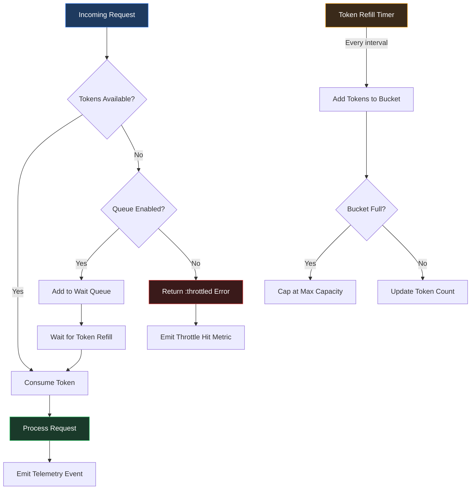

+++
title = "Throttling"
weight = 50
[extra]
description = "Rate limiting enforcement mechanism that controls request frequency to protect system resources and ensure fair usage across distributed intelligence systems"
category = "performance"
subcategory = "flow-control"
difficulty = "intermediate"
technology_type = "pattern"
platform_component = "prismatic_osint_core, prismatic_api, prismatic_web"
prerequisite_concepts = ["concurrency", "genserver", "ets", "otp"]
use_cases = ["api-protection", "osint-rate-compliance", "resource-fairness", "burst-smoothing", "external-provider-limits"]
benefits = ["system-stability", "fair-resource-allocation", "api-compliance", "graceful-degradation", "cost-control"]
implementation_patterns = ["token-bucket", "sliding-window", "leaky-bucket", "genserver-throttler", "ets-counter"]
quality_metrics = ["requests-per-second", "throttle-hit-ratio", "queue-depth", "p99-latency-under-throttle"]
integration_points = ["phoenix-plug", "genserver-mailbox", "osint-tool-registry", "api-gateway", "telemetry-events"]
related_disciplines = ["distributed-systems", "queueing-theory", "control-theory", "traffic-engineering"]
related_terms = ["rate-limiting", "backpressure", "genserver", "ets", "telemetry", "circuit-breaker", "api", "gateway", "ttl", "plug", "otp", "pubsub", "demand-driven", "concurrency", "supervision"]
complexity_level = "intermediate"
platform_integration = "core"
author = "Tomas Korcak (korczis)"
reading_time = "15 min"
date_created = "2026-02-23"
date_modified = "2026-04-08"
keywords = ["throttling", "rate limiting", "request control", "API protection", "token bucket", "leaky bucket", "sliding window", "GenServer throttling", "ETS counters", "OSINT rate limits", "glossary", "Prismatic Platform"]
tags = ["glossary", "performance", "flow-control", "resilience"]
word_count = 3800
quality_score = 92
see_also = ["capabilities", "architecture", "resilience", "observability"]
image = "/images/sections/glossary.png"
image_alt = "Throttling - Prismatic Platform"
+++

## Definition

Throttling is a flow-control mechanism that regulates the rate at which requests, operations, or events are processed within a system. Unlike simple [Rate Limiting](@/glossary/rate-limiting.md), which outright rejects excess requests with an immediate error response, throttling introduces deliberate delays, queuing, or token-based admission to smooth out traffic spikes while still eventually processing all legitimate requests. This distinction makes throttling a more graceful degradation strategy that preserves system stability without discarding valid work.

In the context of the Prismatic Platform, throttling is a foundational concern. The platform coordinates 157+ self-registering [OSINT](@/glossary/osint.md) adapters, each communicating with external intelligence providers that impose their own rate constraints. Without coordinated throttling, concurrent user sessions running parallel investigations could exhaust API quotas within seconds, degrade response times across the entire platform, and trigger provider-side blocks that affect all users.

Throttling operates across multiple system layers: at the edge (HTTP request admission), at the service layer (inter-process message flow), and at the external boundary (third-party API compliance). Each layer employs different algorithms and enforcement strategies suited to its specific constraints.

## Overview: Throttling vs Rate Limiting vs Backpressure

Three closely related flow-control mechanisms are often confused. Understanding their distinctions is critical for choosing the right strategy at each system boundary.

### Throttling

Throttling **delays or queues** excess requests rather than rejecting them. The caller may experience increased latency but eventually receives a response. Throttling is appropriate when all requests are legitimate and the goal is to smooth bursts rather than shed load. In the Prismatic Platform, throttling is used primarily for external API compliance, where every request carries intelligence value and should be processed eventually.

### Rate Limiting

[Rate Limiting](@/glossary/rate-limiting.md) **rejects** excess requests immediately, returning an error (typically HTTP 429) when a threshold is exceeded. This is appropriate at trust boundaries where some requests may be abusive or where the system must protect itself from unbounded demand. The Prismatic [API](@/glossary/api.md) [Gateway](@/glossary/gateway.md) applies rate limiting at the edge to prevent external abuse before requests reach business logic.

### Backpressure

[Backpressure](@/glossary/backpressure.md) is a **demand-driven** flow control mechanism where downstream consumers signal upstream producers to slow down. Rather than the throttle layer making unilateral decisions, the system self-regulates based on actual processing capacity. In [OTP](@/glossary/otp.md) systems, [GenServer](@/glossary/genserver.md) mailbox depth is a natural backpressure signal, and GenStage/Flow provide explicit demand-based protocols.

| Mechanism | Excess Behavior | Caller Experience | Best For |
|-----------|----------------|-------------------|----------|
| **Throttling** | Queued/delayed | Increased latency | API compliance, burst smoothing |
| **Rate Limiting** | Rejected (429) | Immediate error | Abuse prevention, trust boundaries |
| **Backpressure** | Producer slows | Reduced throughput | Pipeline processing, stream ingestion |

In practice, a well-designed system like the Prismatic Platform combines all three: rate limiting at the edge, throttling for external API calls, and backpressure for internal data pipelines.

## Technical Deep Dive

### Token Bucket Algorithm

The token bucket is the most widely used throttling algorithm. A bucket holds tokens up to a maximum capacity. Each request consumes one or more tokens. Tokens are replenished at a fixed rate. If the bucket is empty, the request is either queued or rejected.

The token bucket naturally allows **controlled bursts**: if no requests arrive for a period, tokens accumulate up to the capacity, allowing a burst of requests when traffic resumes. This matches real-world OSINT investigation patterns, where a user may submit a batch of queries after reviewing initial results.



### Sliding Window Algorithm

The sliding window algorithm divides time into fixed windows and tracks request counts per window. Unlike fixed windows, the sliding variant interpolates between the current and previous window to avoid burst-at-boundary problems.

For example, with a 60-second window allowing 100 requests: if the previous window had 80 requests and the current window (40 seconds in) has 50 requests, the effective count is `80 * (20/60) + 50 = 76.7`, which is under the limit. This provides smoother throttling than fixed windows and is used in the Prismatic Platform for per-endpoint HTTP throttling.

### Leaky Bucket Algorithm

The leaky bucket enforces a strict constant output rate regardless of input patterns. Requests enter the bucket and drain at a fixed rate. If the bucket overflows, excess requests are dropped. This algorithm is ideal for situations requiring a perfectly smooth output rate, such as interfacing with APIs that have strict per-second limits.

The leaky bucket trades burst tolerance for predictability. In the Prismatic Platform, it is used for providers like Shodan that enforce strict per-second rate limits where any burst would trigger a block.

### GenServer-Based Throttling

In [OTP](@/glossary/otp.md) systems, a [GenServer](@/glossary/genserver.md) can serve as a centralized throttle coordinator. The GenServer maintains state (token counts, window timestamps) and serializes access decisions. For high-throughput scenarios, [ETS](@/glossary/ets.md) provides concurrent read access while the GenServer handles periodic refill operations.

The key design decision is whether to use the GenServer as a gatekeeper (all requests pass through it) or as a state manager (ETS serves reads, GenServer handles writes). The latter pattern avoids making the GenServer a bottleneck and is the approach used in the Prismatic Platform.

## Code Examples

### Token Bucket with ETS and GenServer

The following implementation demonstrates a production-grade token bucket throttler using [ETS](@/glossary/ets.md) for sub-millisecond lookups and a [GenServer](@/glossary/genserver.md) for periodic refill. This pattern avoids the GenServer becoming a bottleneck under high concurrency.

```elixir
defmodule Prismatic.Throttle.TokenBucket do
  @moduledoc """
  Token bucket throttling implementation using ETS for concurrent
  read access and GenServer-managed periodic refill.

  Each throttle key (e.g., an OSINT provider slug) maintains an
  independent bucket with configurable capacity and refill rate.
  ETS provides sub-millisecond state lookups while the GenServer
  handles periodic token replenishment without blocking request
  processing.

  ## Architecture

  - **ETS table**: `:public` with `write_concurrency: true` for
    concurrent atomic updates via `:ets.update_counter/3`
  - **GenServer**: Periodic refill via `Process.send_after/3`,
    never called synchronously by request path
  - **Telemetry**: Emits `[:prismatic, :throttle, :acquire]` and
    `[:prismatic, :throttle, :rejected]` events

  ## Usage

      # Acquire a token for the shodan provider
      case Prismatic.Throttle.TokenBucket.acquire("shodan-search") do
        {:ok, remaining} -> execute_request()
        {:error, :throttled} -> schedule_retry()
      end
  """

  use GenServer

  require Logger

  @refill_interval_ms 1_000
  @default_capacity 100
  @default_refill_rate 10
  @table_name :prismatic_throttle_buckets

  defstruct [:table, :capacity, :refill_rate, :provider_configs]

  # --- Public API ---

  @doc """
  Starts the token bucket throttler with the given options.

  ## Options

    * `:capacity` - Maximum tokens per bucket (default: #{@default_capacity})
    * `:refill_rate` - Tokens added per refill interval (default: #{@default_refill_rate})
    * `:provider_configs` - Map of provider slug to `%{capacity: n, refill_rate: n}`

  ## Examples

      iex> {:ok, _pid} = Prismatic.Throttle.TokenBucket.start_link(capacity: 50)
      iex> is_pid(Process.whereis(Prismatic.Throttle.TokenBucket))
      true
  """
  @spec start_link(keyword()) :: GenServer.on_start()
  def start_link(opts \\ []) do
    GenServer.start_link(__MODULE__, opts, name: __MODULE__)
  end

  @doc """
  Attempts to acquire `cost` tokens from the bucket identified by `key`.

  Returns `{:ok, remaining_tokens}` on success or `{:error, :throttled}`
  when insufficient tokens are available. This function reads and updates
  ETS directly without passing through the GenServer, enabling concurrent
  access under high load.

  ## Parameters

    * `key` - Bucket identifier (typically a provider slug like `"shodan-search"`)
    * `cost` - Number of tokens to consume (default: 1)

  ## Examples

      iex> Prismatic.Throttle.TokenBucket.acquire("test-provider")
      {:ok, 99}

      iex> Prismatic.Throttle.TokenBucket.acquire("test-provider", 5)
      {:ok, 94}
  """
  @spec acquire(String.t(), pos_integer()) :: {:ok, non_neg_integer()} | {:error, :throttled}
  def acquire(key, cost \\ 1) when is_binary(key) and is_integer(cost) and cost > 0 do
    now = System.monotonic_time(:millisecond)

    case :ets.lookup(@table_name, key) do
      [{^key, tokens, _last_refill, _capacity}] when tokens >= cost ->
        remaining = :ets.update_counter(@table_name, key, {2, -cost})

        :telemetry.execute(
          [:prismatic, :throttle, :acquire],
          %{remaining: remaining, cost: cost},
          %{key: key}
        )

        {:ok, remaining}

      [{^key, _tokens, _last_refill, _capacity}] ->
        :telemetry.execute(
          [:prismatic, :throttle, :rejected],
          %{cost: cost},
          %{key: key}
        )

        {:error, :throttled}

      [] ->
        capacity = get_capacity_for_key(key)
        :ets.insert(@table_name, {key, capacity - cost, now, capacity})

        :telemetry.execute(
          [:prismatic, :throttle, :acquire],
          %{remaining: capacity - cost, cost: cost},
          %{key: key, new_bucket: true}
        )

        {:ok, capacity - cost}
    end
  end

  @doc """
  Returns the current token count for the given key, or `nil` if no
  bucket exists.

  ## Examples

      iex> Prismatic.Throttle.TokenBucket.remaining("unknown-key")
      nil
  """
  @spec remaining(String.t()) :: non_neg_integer() | nil
  def remaining(key) when is_binary(key) do
    case :ets.lookup(@table_name, key) do
      [{^key, tokens, _last_refill, _capacity}] -> tokens
      [] -> nil
    end
  end

  # --- GenServer Callbacks ---

  @impl true
  def init(opts) do
    table =
      :ets.new(@table_name, [
        :set,
        :public,
        :named_table,
        write_concurrency: true,
        read_concurrency: true
      ])

    capacity = Keyword.get(opts, :capacity, @default_capacity)
    refill_rate = Keyword.get(opts, :refill_rate, @default_refill_rate)
    provider_configs = Keyword.get(opts, :provider_configs, %{})

    schedule_refill()

    {:ok,
     %__MODULE__{
       table: table,
       capacity: capacity,
       refill_rate: refill_rate,
       provider_configs: provider_configs
     }}
  end

  @impl true
  def handle_info(:refill, state) do
    %{capacity: default_capacity, refill_rate: default_rate, provider_configs: configs} = state

    :ets.foldl(
      fn {key, tokens, last_refill, bucket_capacity}, _acc ->
        rate = get_in(configs, [key, :refill_rate]) || default_rate
        cap = get_in(configs, [key, :capacity]) || bucket_capacity || default_capacity
        new_tokens = min(tokens + rate, cap)
        :ets.insert(@table_name, {key, new_tokens, last_refill, cap})
      end,
      nil,
      @table_name
    )

    schedule_refill()
    {:noreply, state}
  end

  # --- Private Helpers ---

  defp schedule_refill do
    Process.send_after(self(), :refill, @refill_interval_ms)
  end

  defp get_capacity_for_key(_key), do: @default_capacity
end
```

### Plug-Based HTTP Throttling

For edge-layer throttling in [Phoenix](@/glossary/phoenix.md), a [Plug](@/glossary/plug.md)-based approach integrates directly into the request pipeline:

```elixir
defmodule PrismaticWeb.Plugs.Throttle do
  @moduledoc """
  Phoenix Plug that enforces per-client throttling using the
  platform's token bucket implementation.

  Identifies clients by API key (from the `x-api-key` header)
  or by IP address as a fallback. Returns HTTP 429 with a
  `Retry-After` header when the throttle limit is reached.

  ## Usage in Router

      pipeline :throttled_api do
        plug PrismaticWeb.Plugs.Throttle, cost: 1
      end
  """

  import Plug.Conn

  require Logger

  @behaviour Plug

  @doc """
  Initializes the plug with the given options.

  ## Options

    * `:cost` - Token cost per request (default: 1)
    * `:retry_after` - Seconds to suggest in Retry-After header (default: 5)
  """
  @spec init(keyword()) :: keyword()
  def init(opts), do: opts

  @doc """
  Checks the token bucket for the identified client. Passes the
  request through if tokens are available, or halts with 429 if
  the client is throttled.
  """
  @spec call(Plug.Conn.t(), keyword()) :: Plug.Conn.t()
  def call(conn, opts) do
    cost = Keyword.get(opts, :cost, 1)
    retry_after = Keyword.get(opts, :retry_after, 5)
    key = extract_client_key(conn)

    case Prismatic.Throttle.TokenBucket.acquire(key, cost) do
      {:ok, remaining} ->
        conn
        |> put_resp_header("x-ratelimit-remaining", Integer.to_string(remaining))

      {:error, :throttled} ->
        Logger.warning("Throttled client #{key}", client_key: key)

        conn
        |> put_resp_header("retry-after", Integer.to_string(retry_after))
        |> put_resp_content_type("application/json")
        |> send_resp(429, Jason.encode!(%{error: "rate_limited", retry_after: retry_after}))
        |> halt()
    end
  end

  defp extract_client_key(conn) do
    case get_req_header(conn, "x-api-key") do
      [api_key | _] -> "api:#{api_key}"
      [] -> "ip:#{to_string(:inet_parse.ntoa(conn.remote_ip))}"
    end
  end
end
```

### Telemetry Integration

Throttling decisions produce valuable operational data. The Prismatic Platform emits [Telemetry](@/glossary/telemetry.md) events for every throttle acquisition and rejection, enabling real-time dashboards and alerting:

```elixir
defmodule Prismatic.Throttle.Telemetry do
  @moduledoc """
  Telemetry event handlers for throttle metrics.

  Attaches to `[:prismatic, :throttle, :acquire]` and
  `[:prismatic, :throttle, :rejected]` events to track
  throttle utilization across all providers.
  """

  require Logger

  @doc """
  Attaches all throttle telemetry handlers.
  """
  @spec attach() :: :ok
  def attach do
    :telemetry.attach_many(
      "prismatic-throttle-metrics",
      [
        [:prismatic, :throttle, :acquire],
        [:prismatic, :throttle, :rejected]
      ],
      &handle_event/4,
      nil
    )
  end

  @doc false
  @spec handle_event(list(atom()), map(), map(), any()) :: :ok
  def handle_event([:prismatic, :throttle, :acquire], measurements, metadata, _config) do
    Logger.debug(
      "Throttle acquired for #{metadata.key}: #{measurements.remaining} remaining",
      throttle_key: metadata.key,
      remaining: measurements.remaining
    )

    :ok
  end

  def handle_event([:prismatic, :throttle, :rejected], _measurements, metadata, _config) do
    Logger.info(
      "Throttle rejected request for #{metadata.key}",
      throttle_key: metadata.key
    )

    :ok
  end
end
```

## Usage in Prismatic Platform

### OSINT API Throttling

The Prismatic OSINT toolbox coordinates 157+ self-registering intelligence adapters, each communicating with external providers that impose their own rate constraints. The throttle system reads provider-specific limits from each adapter's `register_tool/1` metadata and enforces them globally across all concurrent users.

```elixir
# Tool registration with throttle metadata
register_tool(%{
  slug: "shodan-search",
  name: "Shodan Internet Search",
  category: :global,
  throttle: %{
    max_requests_per_second: 1,
    max_requests_per_minute: 30,
    burst_allowance: 3,
    algorithm: :leaky_bucket
  }
})
```

The `ThrottleCoordinator` wraps every OSINT tool execution with throttle enforcement:

```elixir
defmodule PrismaticOsintCore.ThrottleCoordinator do
  @moduledoc """
  Coordinates throttle enforcement across all OSINT tool adapters,
  respecting per-provider rate limits declared in tool metadata.

  When a tool execution is throttled, the coordinator returns a
  structured error with retry guidance rather than silently dropping
  the request. This enables the calling LiveView or API handler to
  display appropriate feedback to the user.
  """

  require Logger

  @doc """
  Executes an OSINT tool with throttle enforcement.

  Checks the tool's throttle budget before execution. If the
  provider is currently throttled, returns an error with the
  estimated wait time.
  """
  @spec execute_with_throttle(String.t(), map()) ::
          {:ok, map()} | {:error, atom()} | {:error, atom(), String.t()}
  def execute_with_throttle(tool_slug, params) when is_binary(tool_slug) do
    with {:ok, tool} <- PrismaticOsintCore.ToolRegistry.get_tool(tool_slug),
         {:ok, _remaining} <- Prismatic.Throttle.TokenBucket.acquire(tool_slug) do
      tool.module.run(params)
    else
      {:error, :throttled} ->
        Logger.info("OSINT tool #{tool_slug} throttled, advising retry",
          tool_slug: tool_slug
        )

        {:error, :rate_limited, "Provider rate limit reached. Retry after cooldown."}

      {:error, :not_found} ->
        {:error, :tool_not_found, "Unknown tool slug: #{tool_slug}"}

      {:error, reason} ->
        {:error, reason}
    end
  end
end
```

### Gateway Rate Limiting

The PrismaticAPI [Gateway](@/glossary/gateway.md) on port 4004 applies per-endpoint throttling that scales with the underlying operation's computational cost. Lightweight lookups receive generous limits while expensive operations like full attack surface discovery via Prismatic Perimeter receive stricter throttling:

| Endpoint Group | Requests/Minute | Burst | Algorithm |
|---------------|----------------|-------|-----------|
| Health checks | 600 | 50 | Token bucket |
| OSINT lookups | 60 | 10 | Sliding window |
| DD case creation | 30 | 5 | Token bucket |
| Perimeter scans | 5 | 1 | Leaky bucket |
| Bulk exports | 2 | 1 | Leaky bucket |

### DD Pipeline Temporal Throttling

The Due Diligence pipeline's Scheduler uses a form of temporal throttling when performing periodic fetches from Czech registry sources (ARES, Justice, Commercial Register). Each source group has configurable fetch intervals (1h to 168h), and the scheduler enforces these intervals to prevent overwhelming government data sources. This is throttling at the scheduling layer rather than the request layer.

### GenServer Mailbox Monitoring

[Backpressure](@/glossary/backpressure.md)-based throttling integrates with [OTP](@/glossary/otp.md)'s GenServer mailbox monitoring. When a process mailbox exceeds a configurable threshold, the [Supervision](@/glossary/supervision.md) layer signals upstream producers to slow down via [PubSub](@/glossary/pubsub.md) rather than continuing to enqueue messages that will only increase latency and risk an out-of-memory crash.

## Architecture Layers

The Prismatic Platform implements throttling at three distinct layers, each serving a different architectural purpose:

**Edge Layer**: The [Phoenix](@/glossary/phoenix.md) endpoint applies per-IP and per-API-key throttling using [Plug](@/glossary/plug.md)-based middleware. This protects the entire application from external abuse before requests reach business logic. The throttle state is stored in [ETS](@/glossary/ets.md) for sub-millisecond lookups, with configurable windows per route group.

**Service Layer**: Internal [GenServer](@/glossary/genserver.md)-to-GenServer communication uses demand-driven throttling inspired by GenStage. When the OSINT ToolRegistry dispatches concurrent tool executions, it maintains a bounded [Concurrency](@/glossary/concurrency.md) pool that prevents any single category from monopolizing system resources.

**External Layer**: Each OSINT adapter that communicates with third-party APIs (Shodan, VirusTotal, Censys) has provider-specific throttle configuration baked into its `register_tool/1` metadata. The throttle coordinator reads these declarations and enforces per-provider limits globally, even when multiple users trigger the same adapter simultaneously.

## Best Practices

1. **Choose the right algorithm for the boundary**: Use token bucket for APIs that allow bursts, leaky bucket for strict per-second limits, sliding window for HTTP endpoint protection.

2. **Store state in ETS, manage with GenServer**: Never route every request through a GenServer `call/3`. Use ETS for concurrent reads and atomic counter updates. Let the GenServer handle periodic refill only.

3. **Emit telemetry on every decision**: Both acquisitions and rejections should emit [Telemetry](@/glossary/telemetry.md) events. This enables real-time dashboards showing throttle utilization per provider and alerting when providers are consistently saturated.

4. **Return structured errors**: Never silently drop throttled requests. Return `{:error, :throttled}` with retry guidance so callers can make informed decisions about queuing, retrying, or displaying feedback.

5. **Configure per-provider limits declaratively**: Embed throttle configuration in tool registration metadata rather than hardcoding limits in application logic. This makes limits discoverable and auditable.

6. **Combine with circuit breakers**: When a provider is consistently returning errors, a [Circuit Breaker](@/glossary/circuit-breaker.md) should trip before the throttle layer wastes tokens on requests that will fail anyway.

7. **Test under realistic concurrency**: Throttling bugs often only manifest under concurrent access. Use `Task.async_stream/3` in tests to simulate realistic multi-user load patterns.

8. **Monitor queue depth**: If using queuing-based throttling, track queue depth as a key metric. Growing queues indicate the system is accepting work faster than it can process, which eventually leads to memory pressure.

## Common Mistakes

| Mistake | Impact | Correct Approach |
|---------|--------|-----------------|
| Routing all requests through GenServer `call/3` | GenServer becomes bottleneck at ~50k msg/s | Use ETS for reads, GenServer only for periodic refill |
| Using `Process.sleep/1` to throttle | Blocks the entire process, wastes scheduler time | Use token bucket with `{:error, :throttled}` return |
| Fixed-window counters without interpolation | Allows 2x burst at window boundaries | Use sliding window or token bucket instead |
| Hardcoding provider rate limits | Limits become stale, not discoverable | Declare in tool registration metadata |
| Ignoring throttle metrics | Cannot detect saturation or misconfiguration | Emit [Telemetry](@/glossary/telemetry.md) events for every decision |
| Single global bucket for all providers | Fast providers starved by slow provider limits | Per-provider buckets with independent configuration |
| No retry guidance in error responses | Clients retry immediately, worsening congestion | Include `Retry-After` header or estimated wait time |
| Throttling without [Circuit Breaker](@/glossary/circuit-breaker.md) | Tokens wasted on requests to failing providers | Combine throttle with circuit breaker pattern |
| Using `String.to_atom/1` for throttle keys | Atom table exhaustion under high cardinality | Use string keys or `String.to_existing_atom/1` |
| Unbounded retry queues | Memory grows without limit during sustained overload | Cap queue depth, apply [Backpressure](@/glossary/backpressure.md) to upstream |

## Related Terms

- [Rate Limiting](@/glossary/rate-limiting.md) - Request rejection mechanism that denies excess traffic at trust boundaries
- [Backpressure](@/glossary/backpressure.md) - Demand-driven flow control where consumers signal producers to slow down
- [GenServer](@/glossary/genserver.md) - OTP generic server used as throttle state manager and refill coordinator
- [ETS](@/glossary/ets.md) - Erlang Term Storage providing sub-millisecond concurrent access for throttle state
- [Telemetry](@/glossary/telemetry.md) - Instrumentation library used to emit throttle acquisition and rejection metrics
- [Circuit Breaker](@/glossary/circuit-breaker.md) - Failure-based traffic control that complements throttling by stopping requests to failing providers
- [API](@/glossary/api.md) - Application Programming Interface where throttling enforces rate compliance
- [Gateway](@/glossary/gateway.md) - API gateway layer where per-endpoint throttling policies are enforced
- [TTL](@/glossary/ttl.md) - Time-to-live used in throttle window expiration and bucket cleanup
- [Plug](@/glossary/plug.md) - Phoenix middleware composable pipeline where HTTP throttling is applied
- [OTP](@/glossary/otp.md) - Open Telecom Platform providing supervision and process primitives for throttle infrastructure
- [PubSub](@/glossary/pubsub.md) - Publish-subscribe system used to broadcast throttle state changes and backpressure signals
- [Concurrency](@/glossary/concurrency.md) - Parallel execution model that throttling regulates to prevent resource exhaustion
- [Supervision](@/glossary/supervision.md) - OTP supervision trees ensuring throttle GenServers restart on failure

## See Also

- **Prismatic OSINT Toolbox** - 157+ self-registering adapters with per-provider throttle configuration
- **PrismaticAPI Gateway** - Edge-layer throttling with per-endpoint rate policies (port 4004)
- **DD Pipeline Scheduler** - Temporal throttling for Czech registry source fetch intervals
- **Phoenix Rate Limiting** - Plug-based HTTP request throttling in the web layer
- **GenStage** - Elixir library for demand-driven data processing pipelines
- **Erlang `:counters` module** - Alternative to ETS for atomic counter operations in OTP 21.2+
- [Resilience](/glossary/resilience/) - System property that throttling directly supports
- [Observability](@/glossary/observability.md) - Monitoring discipline for tracking throttle health and utilization

---

## Connect & Contribute

**Created by [Tomas Korcak (korczis)](https://github.com/korczis)** | Open Source under [GHL](https://github.com/korczis/prismatic-platform/blob/main/LICENSE)

- [GitHub](https://github.com/korczis/prismatic-platform) | [GitLab](https://gitlab.com/korczis/prismatic-platform) | [LinkedIn](https://linkedin.com/in/korczis) | [Contact](mailto:korczis@gmail.com)
- [Developer Portal](@/developers/_index.md) | [Architecture](@/architecture/_index.md) | [Meet the Creator](@/about/author.md)
